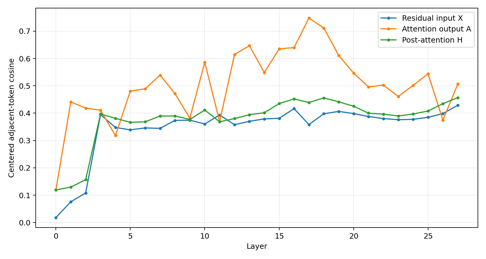
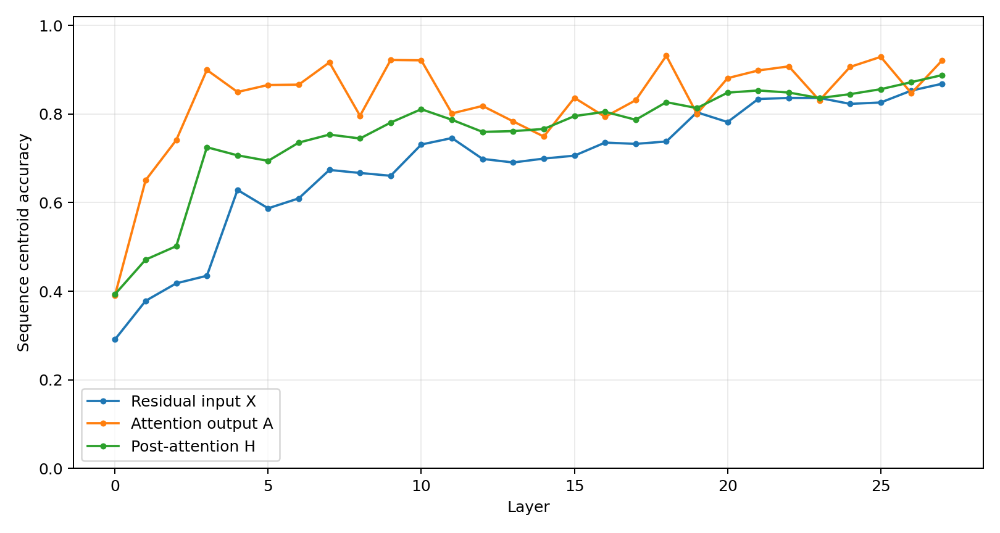
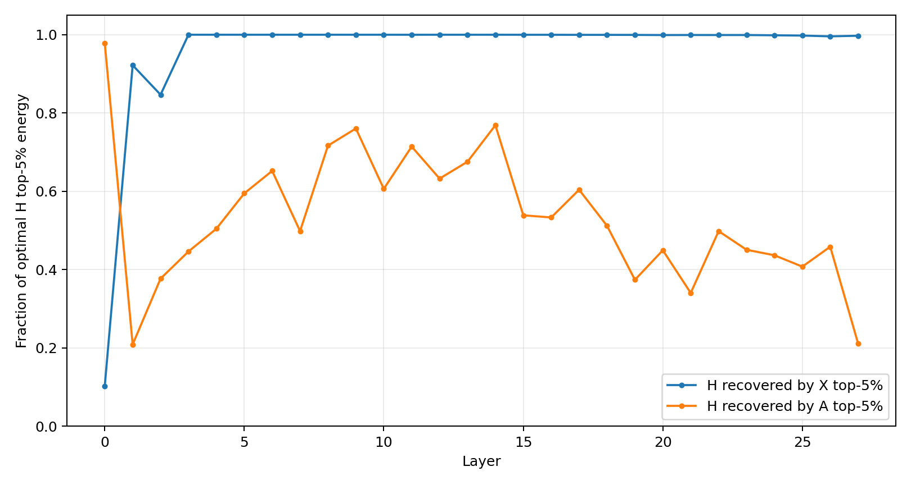
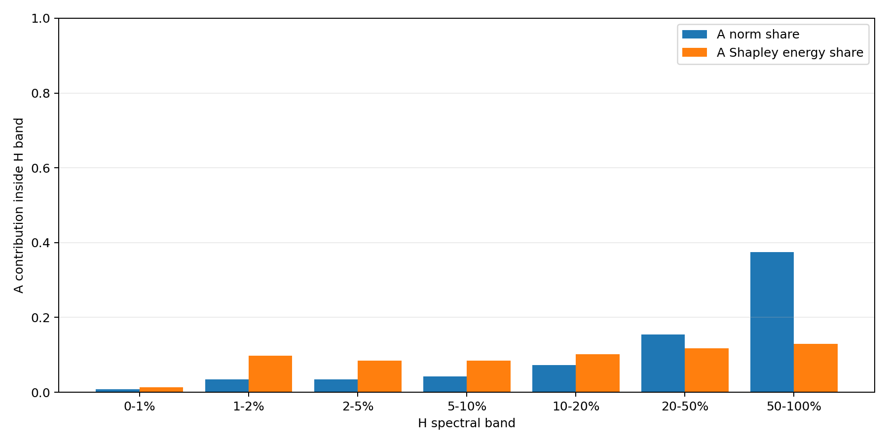
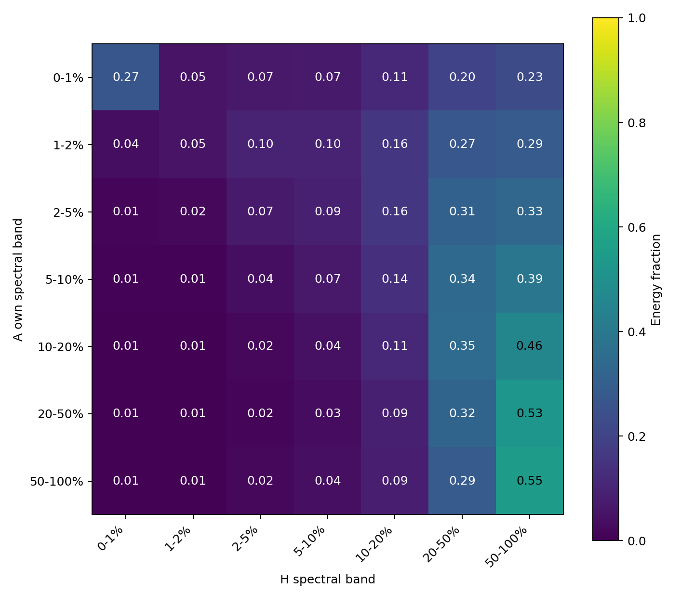
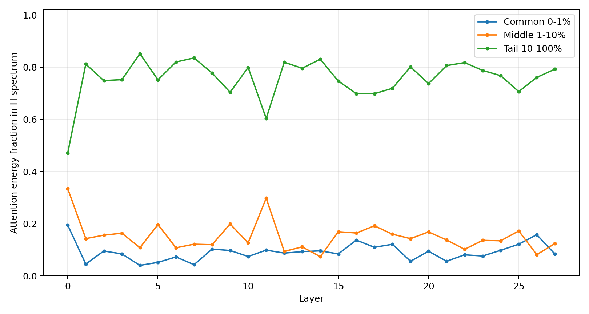
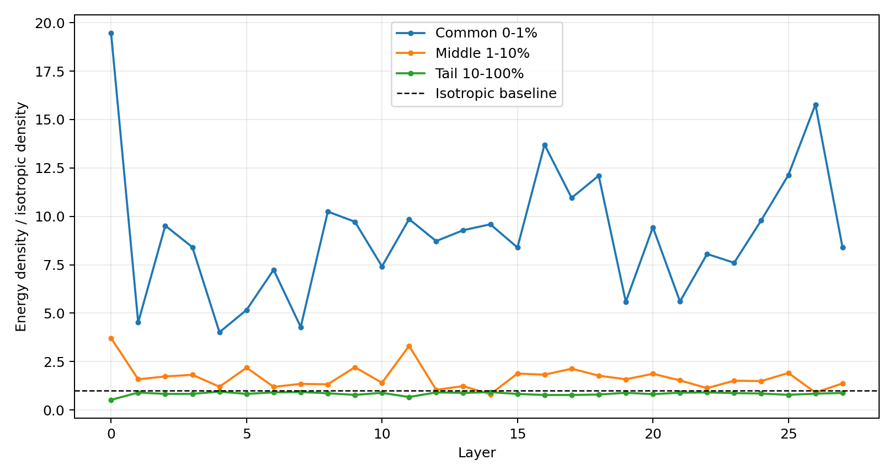
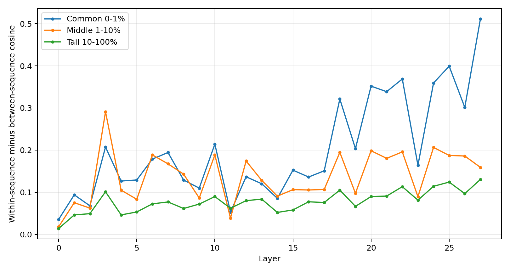

# 结果与图表说明

## 结论

Qwen3-0.6B 在 8 条独立 DCLM 文档、512/1024 token、全部 28 层上的结果一致：

1. 不含 residual 的 attention output (A_l) 比 residual input (X_l) 具有更强的句内连续性和 sequence-level 区分性。
2. 除第 0 层外，相加后 (H_l=X_l+A_l) 的强谱方向仍由已累积的 (X_l) 主导；从第 3 层起，(X_l) top-5% basis 几乎完整恢复 (H_l) 的最优 top-5% 能量。
3. Attention context 并非只写入谱尾，但在所有 (H_l) band 中，当前层 (A_l) 都没有超过累计 residual (X_l) 的贡献。Layer 1--27 的 (H_l) top 1% 中，(A_l) 的 norm share 只有 0.85%，Shapley energy attribution 只有 1.32%。

因此，attention context 没有主导 post-attention residual 的原因不是“它完全位于谱尾”，而是：

> 它分布在整个 (H_l) 谱空间中，但从第 1 层开始，累积 residual 在每个 (H_l) band 中都占主导。普通 gate 读取 (H_l) 时，无法从任何一个固定 spectral band 中直接获得由当前 attention update 主导的 context representation。

## 1. Attention Output 的句内连续性与句间区分性

1024-token 实验的 28 层均值：

| centered metric | residual input (X) | attention output (A) | post-attention (H) |
|---|---:|---:|---:|
| adjacent-token cosine | 0.3455 | **0.5040** | 0.3772 |
| within-sequence minus between-sequence cosine | 0.0472 | **0.0969** | 0.0566 |
| sequence-centroid accuracy（8 类，随机 0.125） | 0.6889 | **0.8318** | 0.7596 |

512-token 对照中，attention output 的三项结果分别为 `0.5036 / 0.0947 / 0.7881`，方向完全一致。



图中橙线在绝大多数层高于 residual input，说明 attention update 的确携带变化更慢的句内上下文信息。Centered 口径已经移除了所有 token 共享均值方向，因此该结果不是 raw common mean 造成的假相似。



Attention output 在不同文档间仍具有清晰区分性，说明“句内连续”不是所有 sequence 都收敛到同一个向量。

## 2. Post-Attention 强方向仍由 Residual Input 主导

为避免第 0 层 embedding residual 的特殊尺度影响，主汇总使用 layer 1--27：

| 1024-token metric | (H) vs (X) | (H) vs (A) |
|---|---:|---:|
| top-5% principal-subspace overlap | **0.8699** | 0.1607 |
| 对 (H) 最优 top-5% 能量的恢复比例 | **0.9909** | 0.5173 |

512-token 对照分别为 `0.8753 vs 0.1534` 和 `0.9912 vs 0.5257`。



第 0 层是明确例外：此时 residual 只是初始 embedding，attention update 的范数更大，因此 (H_0) 的 top subspace 更接近 (A_0)。经过前几层累积后，(X_l) 的范数平均约为单层 (A_l) 的 17.14 倍；从第 3 层开始，(X_l) top-5% basis 对 (H_l) top-5% 能量的恢复比例接近 1。

这直接回答了第二个问题：新 attention context 被加入了 residual，但单层 update 不足以改变 residual 已经形成的强谱骨架。

## 3. X 与 A 对 H 各频段的贡献

仅看 (A_l) 自身有多少能量落入 (H_l) band，无法判断最终 band 由谁主导。对每个 band (B)，需要同时计算：

\[
X_B=P_BX,\qquad A_B=P_BA,\qquad H_B=X_B+A_B.
\]

由于：

\[
\|H_B\|^2=\|X_B\|^2+\|A_B\|^2+2\langle X_B,A_B\rangle,
\]

下面同时报告 source energy fraction、band 内 norm share，以及将交叉项对称分配后的 Shapley energy attribution。主结果使用 layer 1--27，排除尺度特殊的第 0 层。

| H band | X 自身能量落入该 band | A 自身能量落入该 band | H 总能量位于该 band | band 内 A norm share | H band 中 A Shapley 贡献 |
|---|---:|---:|---:|---:|---:|
| 0--1% | **90.78%** | 9.94% | **90.81%** | 0.85% | 1.32% |
| 1--2% | 1.07% | 2.93% | 1.15% | 3.40% | 9.78% |
| 2--5% | 1.98% | 5.78% | 2.11% | 3.40% | 8.51% |
| 5--10% | 1.83% | 7.06% | 1.94% | 4.20% | 8.43% |
| 10--20% | 1.88% | 12.69% | 1.96% | 7.27% | 10.12% |
| 20--50% | 1.86% | 28.01% | 1.78% | 15.40% | 11.69% |
| 50--100% | 0.60% | 33.59% | 0.26% | **37.46%** | **13.00%** |

结果回答了前两个归因问题：

- (X_l) 自身有 90.78% 能量集中在 (H_l) top 1%，远高于 (A_l) 的 9.94%；
- 更关键的是，在最终 (H_l) top 1% 内，当前 (A_l) 的实际 norm share 只有 0.85%，约 98.7% 的对称能量归因来自累计 residual；
- 随着频段向后，(A_l) 相对贡献增加，但没有任何一个 (H_l) band 在 layer 1--27 的平均意义上由当前 (A_l) 主导；贡献最高的 50--100% band 中，A norm share 也只有 37.46%。



因此，目前不存在一个可以直接从 (H_l) 中截取、同时满足“由当前 attention update 占绝对主力”的固定 spectral band。

## 4. A 的连续性由哪个谱段提供，并最终落到 H 的哪里

首先在 (A_l) 自己的 PCA basis 中分段。Layer 1--27 的结果为：

| A 自身 band | adjacent-token cosine | sequence gap |
|---|---:|---:|
| 0--1% | **0.645** | 0.545 |
| 1--2% | 0.577 | **0.563** |
| 2--5% | 0.528 | 0.522 |
| 5--10% | 0.465 | 0.458 |
| 10--20% | 0.387 | 0.379 |
| 20--50% | 0.219 | 0.211 |
| 50--100% | -0.119 | -0.125 |

Attention output 的连续性主要由它自己的 top 0--5% 谱方向提供，而不是由 A 的 spectral tail 提供。

但 A top 1% 并没有全部落入 H top 1%。其能量去向为：

| H band | A top 1% 能量占比 |
|---|---:|
| 0--1% | 26.9% |
| 1--2% | 5.2% |
| 2--5% | 7.0% |
| 5--10% | 7.1% |
| 10--20% | 10.9% |
| 20--50% | 20.0% |
| 50--100% | 22.8% |



这排除了“所有连续性都进入 H top 1% 后彻底不可恢复”的最坏情况。A 的高连续性方向被分散映射到 H 的多个频段；真正的问题是，在这些 H band 中，累计 residual 的幅度仍然更大，使当前层 A 无法成为主导成分。

## 5. 早期三频段结果及其正确读法

将 centered (A_l) 投影到 centered (H_l) 的三个宽频段，1024-token 的跨层均值为：

| (H_l) spectral band | 维度占比 | (A_l) 总能量占比 | 相对各向同性的单位维度能量密度 | sequence gap |
|---|---:|---:|---:|---:|
| common top 0--1% | 1% | 9.11% | **9.11x** | **0.2015** |
| middle 1--10% | 9% | 15.13% | 1.68x | 0.1377 |
| tail 10--100% | 90% | **75.77%** | 0.84x | 0.0781 |

512-token 对照为 `9.61% / 14.77% / 75.62%`，单位维度密度为 `9.61x / 1.64x / 0.84x`。



这张表只描述 A 自身能量在 H basis 中的分布，不能单独用于判断 H band 由 X 还是 A 主导。完整 attribution 已在第 3 节给出。





Sequence gap 呈 `common > middle > tail`，与第 4 节“A 自身连续性主要来自头部方向”的结果一致。

## 对 MoE 结构的含义

实验支持以下机制链：

```text
Attention output A:
  句内连续，且能区分不同 sequence

A 加入 residual 后:
  第 1 层以后，H 的强谱骨架仍由累计 residual X 决定

普通 gate 读取 H:
  新 context signal 存在，但被累计 residual 的强方向压住
  因而不能自然主导 routing
```

因此，若希望 expert activation 具有跨 token 持续性，router 需要显式提高当前层 attention update 的相对可见度，例如单独读取归一化后的 (A_l)，或从 (H_l) 中分离当前层新增量后再做 routing。该结论不要求把 attention output 等同于谱尾，也不要求删除 residual 中有用的 common computation。

## 结论边界

- 当前使用 8 条 DCLM 文档，512/1024 两种长度方向一致，但仍应在更多文档上确认方差。
- Sequence-centroid accuracy 会受 band 维度影响，因此频段比较主要依据 energy density 与 cosine sequence gap。
- 实验定位了 attention context 在 residual 谱中的位置，但尚未直接对 MoE gate 做 band-wise causal ablation。
- 下一项最小实验是固定已有 gate，分别输入 (X_l)、(A_l)、(H_l) 及其 spectral bands，直接测 routing agreement 与跨 token expert persistence。
