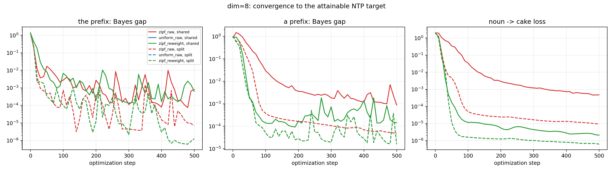
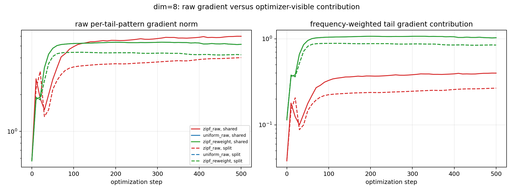
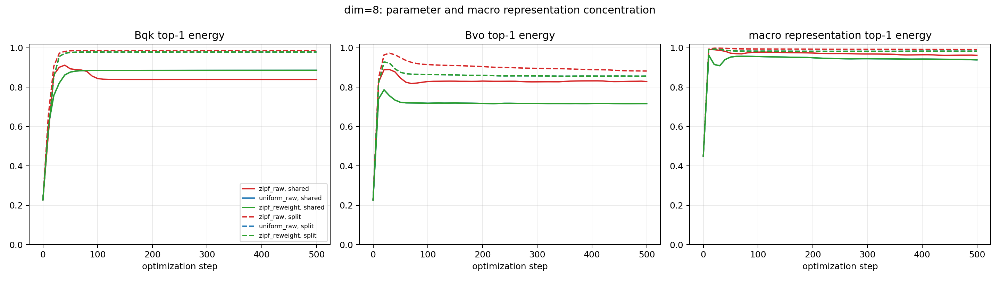
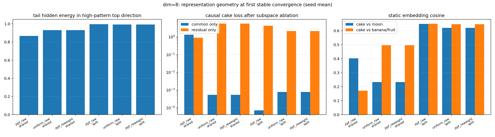

# Nested Structure Is Not the Bottleneck; Frequency Is

## 0. 一句话结论

当前 toy experiment 支持以下机制故事：

> 语言中的 nested / shared structure 会让多个 token 和 pattern 复用同一个 common representation direction；这种 common reuse 本身不是学习低效的根因。真正拖慢 long-tail pattern 的，是它们在 Zipf 分布下获得的有效梯度权重太小，因而无法快速在已有 common 方向中收敛到适合自己的位置。

在频率均匀或对 Zipf loss 做精确 reweight 后，模型学习 `a moon cake` 明显更快，而且收敛后的 cake prediction 仍然几乎完全依赖 high-frequency pattern 形成的 common direction，并没有主动迁移到新的 residual direction。

因此，当前证据不支持：

\[
\text{common-direction reuse 本身导致 long-tail 学习低效。}
\]

当前证据更支持：

\[
\text{Zipf frequency}
\Rightarrow
\text{tail gradient share 不足}
\Rightarrow
\text{tail 无法快速调整 common channel}
\Rightarrow
\text{学习延迟。}
\]

---

## 1. 我们要回答的问题

大语言模型训练完成后，参数矩阵和 contextual representation 往往具有显著的谱不均匀性：

- 少数奇异值很大；
- 大量谱能量集中在少数方向；
- embedding、attention 和 hidden states 都可能表现出较低的 effective rank。

这产生两个相关但不同的问题。

### 问题一：为什么模型会形成 common 大方向？

语言数据具有大量 nested 和 shared structure。例如：

```text
the sun
the moon
a moon cake
```

`moon` 同时参与：

- `the moon` 这一高频结构；
- `a moon cake` 这一较低频组合结构。

模型可能会复用已经形成的 `the` / high-frequency common direction，而不是为每个新组合重新开辟完全正交的新方向。

### 问题二：这种 common reuse 是否拖累学习效率？

一种假设是：

> long-tail feature 被迫与 high-frequency feature 共用低秩空间，因此无法使用尾部的新奇异方向，导致学习缓慢。

另一种假设是：

> common reuse 本身是高效的组合表示；long-tail 学得慢，只是因为它在训练分布中的频率太低，进入优化器的有效梯度不足。

本实验的目标就是区分这两个机制。

---

## 2. 待验证的两个机制

### 2.1 Nested/common-reuse 假设

同一个 token 出现在多个组合中，会使这些组合共享 representation direction：

\[
h_{\text{tail}}=h_{\text{common}}+h_{\text{specific}}.
\]

在本实验中，`moon` 同时出现在：

```text
the moon
a moon cake
```

我们预期：

- `moon`、`cake` 等 tail-related states 会在 high-pattern common direction 上具有大量投影；
- 即使训练非常快，cake prediction 仍可能主要使用 common direction。

### 2.2 Frequency-gradient 假设

设第 \(i\) 个 pattern 的单样本梯度为：

\[
g_i=\nabla_\theta L_i.
\]

真正进入 population objective 的贡献是：

\[
\widetilde g_i=p_i g_i,
\]

其中 \(p_i\) 是 pattern frequency。

即使 raw tail gradient \(\|g_i\|\) 并不小，只要 \(p_i\) 很小，优化器实际看到的：

\[
\|\widetilde g_i\|
\]

仍然会显著小于 common pattern。

这种抑制可能同时发生在：

- common-gradient direction；
- common direction 的正交补；
- 整个参数梯度空间。

如果 frequency 是主要瓶颈，那么 uniform weighting 或精确 inverse-frequency reweight 应恢复 tail 学习速度，而不需要强迫 tail 使用新方向。

---

## 3. 实验数据

### 3.1 五种 pattern

实验使用五条序列：

```text
the sun <pad>
the moon <pad>
a moon cake
a banana cake
a fruit cake
```

`<pad>` 同时从 attention 和 loss 中屏蔽。

每条 sequence 先对自己的有效 next-token losses 取平均，再参与 population objective。这样：

- `the sun` 只有一个有效 NTP target；
- `a moon cake` 有两个有效 NTP targets；

但三 token sequence 不会仅仅因为更长就获得两倍的 per-example 权重。

### 3.2 Zipf 条件

每个 global batch 等价于：

| Pattern | Count |
|---|---:|
| `the sun` | 6 |
| `the moon` | 6 |
| `a moon cake` | 1 |
| `a banana cake` | 1 |
| `a fruit cake` | 1 |

即：

\[
(6,6,1,1,1).
\]

### 3.3 Uniform 条件

五种 pattern 各出现三次：

\[
(3,3,3,3,3).
\]

### 3.4 Zipf + exact reweight

数据 count 仍然是：

\[
(6,6,1,1,1),
\]

但 loss coefficient 使用 inverse-frequency correction，使五个 pattern 的有效目标权重严格变成：

\[
(0.2,0.2,0.2,0.2,0.2).
\]

在所有 hidden dimensions、seeds 和 sharing modes 上，`uniform_raw` 与 `zipf_reweight` 的所有记录训练轨迹完全一致：

\[
\max_t|m_t^{\text{uniform}}-m_t^{\text{reweight}}|=0.
\]

这说明 reweight control 的实现没有引入额外差异。

### 3.5 Shared moon 与 split moon

主实验使用 shared token：

```text
the moon
a moon cake
```

辅助 oracle control 使用：

```text
the moon_H
a moon_T cake
```

`moon_H` 和 `moon_T` 初始化完全相同，但后续参数独立。

这个 split setting 相当于提前向模型提供 word-sense ID，使模型不需要自己解决 `moon` 的多义性。因此：

> split 比 shared 更快是合理的 oracle ceiling，不能被解释成 nested structure 是病态或多余的。

真正用于判断 frequency effect 的主要对比是：

\[
\text{shared Zipf}
\quad\text{vs}\quad
\text{shared uniform / shared reweight}.
\]

---

## 4. 模型结构

模型是一个极小的 causal Transformer：

- one layer；
- one attention head；
- attention only，无 MLP；
- tied input/output embedding；
- 保留 residual connection；
- 无 LayerNorm；
- hidden dimensions 为 8 和 16；
- 使用 exact population Adam optimization。

实验使用 5 个 seeds：

\[
0,1,2,3,4.
\]

每个 condition 训练 500 steps，每 10 steps 记录一次完整诊断。

### 4.1 Tied embedding

设词表大小为 \(|\mathcal V|\)，hidden dimension 为 \(d\)：

\[
E\in\mathbb R^{|\mathcal V|\times d}.
\]

token \(w_t\) 的表示是：

\[
x_t=E[w_t]^\top\in\mathbb R^d.
\]

输出层共享同一个 embedding：

\[
\operatorname{logits}_t=Eh_t.
\]

### 4.2 Query、Key、Value 和 Output

\[
q_t=W_Qx_t,
\]

\[
k_j=W_Kx_j,
\]

\[
v_j=W_Vx_j.
\]

attention score 为：

\[
s_{tj}
=
\frac{q_t^\top k_j}{\sqrt d}
=
\frac{x_t^\top W_Q^\top W_Kx_j}{\sqrt d}.
\]

定义有效 QK 矩阵：

\[
\boxed{B_{qk}=W_Q^\top W_K}.
\]

它决定不同 query/key hidden directions 如何影响 attention score：

\[
s_{tj}=\frac{x_t^\top B_{qk}x_j}{\sqrt d}.
\]

attention weight 为：

\[
\alpha_{tj}=\operatorname{softmax}_j(s_{tj}).
\]

Value-output path 为：

\[
o_t
=
W_O\sum_{j\le t}\alpha_{tj}W_Vx_j
=
\sum_{j\le t}\alpha_{tj}W_OW_Vx_j.
\]

定义有效 VO 矩阵：

\[
\boxed{B_{vo}=W_OW_V}.
\]

因此：

\[
o_t=\sum_{j\le t}\alpha_{tj}B_{vo}x_j.
\]

最终 hidden state：

\[
\boxed{h_t=x_t+o_t}.
\]

其中：

- \(B_{qk}\) 控制“从谁那里读取”；
- \(B_{vo}\) 控制“被读取的信息如何写入 residual stream”。

---

## 5. 训练与测试指标

### 5.1 为什么不能直接使用五个 pattern 的 100% accuracy

prefix 本身具有不可消除的条件不确定性：

\[
p(\text{sun}\mid\text{the})
=
p(\text{moon}\mid\text{the})
=1/2,
\]

\[
p(\text{moon}\mid\text{a})
=
p(\text{banana}\mid\text{a})
=
p(\text{fruit}\mid\text{a})
=1/3.
\]

所以模型不可能对这些 ambiguous prefixes 实现逐样本 100% top-1 accuracy。

我们测量模型距离 Bayes-optimal conditional distribution 的 gap：

\[
G_{the}
=
\operatorname{CE}(q_{the},p_\theta)-\log2,
\]

\[
G_a
=
\operatorname{CE}(q_a,p_\theta)-\log3.
\]

同时测量 deterministic cake transition：

\[
L_{cake}
=
\frac13
\sum_{n\in\{moon,banana,fruit\}}
-\log p_\theta(\text{cake}\mid a,n).
\]

### 5.2 Stable convergence

要求以下条件连续五次 evaluation 成立：

\[
G_{the}\le0.03,
\]

\[
G_a\le0.03,
\]

\[
L_{cake}\le0.03.
\]

记录第一次满足该条件的 step：

\[
T_{stable}.
\]

### 5.3 梯度指标

分别计算每个 unique pattern 的 raw gradient：

\[
g_i=\nabla_\theta L_i.
\]

high-pattern macro gradient：

\[
g_H=\frac12(g_{the\ sun}+g_{the\ moon}).
\]

其单位方向：

\[
c_g=\frac{g_H}{\|g_H\|}.
\]

对每个 pattern 测量：

1. raw total gradient：

\[
\|g_i\|;
\]

2. high/common-gradient component：

\[
|g_i^\top c_g|;
\]

3. residual-gradient component：

\[
\|g_i-(g_i^\top c_g)c_g\|;
\]

4. 乘以 frequency 后真正进入 population objective 的 weighted contribution。

### 5.4 参数谱指标

对以下矩阵计算 SVD：

- tied embedding \(E\)；
- \(B_{qk}=W_Q^\top W_K\)；
- \(B_{vo}=W_OW_V\)。

核心指标：

\[
\operatorname{Top1Energy}
=
\frac{\sigma_1^2}{\sum_i\sigma_i^2},
\]

以及 entropy effective rank：

\[
r_{eff}
=
\exp\left(-\sum_i p_i\log p_i\right),
\quad
p_i=\frac{\sigma_i^2}{\sum_j\sigma_j^2}.
\]

Top1 energy 越高，表示谱能量越集中于第一奇异方向。

### 5.5 表征谱指标

从模型提取 contextual hidden states，构造 representation matrix \(H\)。

同时计算：

- macro representation spectrum：每个 unique context 等权；
- training-weighted spectrum：按照训练 objective 权重计算。

这样可以区分：

- 数据重复本身造成的 covariance concentration；
- 模型学出的 macro geometry。

### 5.6 Common-direction causal ablation

使用两个 high patterns 的 contextual states 定义 top common direction \(c\)：

\[
P_C=cc^\top,
\]

\[
P_R=I-P_C.
\]

对 tail noun hidden state：

\[
h=h_C+h_R,
\]

其中：

\[
h_C=P_Ch,
\]

\[
h_R=P_Rh.
\]

分别只使用 \(h_C\) 和 \(h_R\) 重新预测 cake，得到：

- common-only cake loss；
- residual-only cake loss。

这比单纯 cosine 或 SVD 更接近“模型功能上实际使用哪个方向”。

---

## 6. 详细实验结果

### 6.1 Frequency 显著决定学习速度

主实验只看真实 shared-moon task：

| Hidden dimension | Shared Zipf | Shared uniform | Shared Zipf + reweight |
|---:|---:|---:|---:|
| 8 | 98 steps | 40 steps | 40 steps |
| 16 | 110 steps | 46 steps | 46 steps |

`uniform_raw` 和 `zipf_reweight` 不只是最终 step 接近，而是全部训练轨迹逐点完全一致。

这说明：

\[
\text{改变有效频率权重}
\]

已经足以恢复 uniform learning dynamics，不需要先改变模型结构或强迫 tail 使用新方向。

### 6.2 Zipf 同时压低 common 和 residual 梯度

训练初始化时，shared condition 的 tail/high gradient 比值为：

| Dim | Objective | Raw total | Weighted total | Weighted common | Weighted residual |
|---:|---|---:|---:|---:|---:|
| 8 | Zipf | 0.584 | 0.097 | 0.010 | 0.137 |
| 8 | Uniform | 0.584 | 0.584 | 0.059 | 0.825 |
| 16 | Zipf | 0.596 | 0.099 | 0.013 | 0.130 |
| 16 | Uniform | 0.596 | 0.596 | 0.077 | 0.782 |

raw per-pattern tail gradient 并没有消失：

\[
\frac{\|g_{tail}\|}{\|g_{high}\|}\approx0.58\text{--}0.60.
\]

但乘以 frequency 后：

\[
\frac{\|\widetilde g_{tail}\|}{\|\widetilde g_{high}\|}
\approx0.10.
\]

也就是说，Zipf 又额外带来大约六倍的抑制。

更重要的是，这种抑制同时出现在：

- common-gradient component；
- residual-gradient component；
- total parameter-gradient norm。

所以实验不支持：

\[
\text{tail 只是无法获得 residual direction 的梯度。}
\]

它支持：

\[
\text{tail 在所有方向上的 optimizer-visible gradient 都不足。}
\]

### 6.3 快速学习的 uniform 模型仍然使用 common direction

在 shared uniform 的 first-stable checkpoint：

| Dim | Tail common energy | Common-only cake loss | Residual-only cake loss |
|---:|---:|---:|---:|
| 8 | 0.931 | 0.0005 | 5.661 |
| 16 | 0.971 | 0.0000 | 6.104 |

结果非常明确：

1. tail hidden state 的 93%--97% 能量位于 high-pattern top direction；
2. 只保留 common direction，cake prediction 几乎完全正确；
3. 只保留 residual direction，cake prediction 基本失败。

所以最快的模型并没有选择：

\[
\text{把 cake/new information 写入新的正交方向。}
\]

它选择的是：

\[
\text{继续使用已有 common direction，并在其中快速找到正确位置。}
\]

这说明：

> common-direction reuse 本身可以是非常高效的表示和计算方式。

### 6.4 Zipf 下 tail 无法快速进入 common channel

在 shared Zipf 的 first-stable checkpoint：

| Dim | Tail common energy | Common-only cake loss | Residual-only cake loss |
|---:|---:|---:|---:|
| 8 | 0.866 | 1.335 | 0.896 |
| 16 | 0.878 | 6.017 | 0.209 |

虽然 tail hidden state 仍含有大量 common energy，但 common-only 表征不再足以预测 cake。

尤其在 dimension 16：

\[
L_{cake}^{common}=6.017,
\]

而：

\[
L_{cake}^{residual}=0.209.
\]

这与 frequency-gradient hypothesis 一致：

> 因为 tail 在 common channel 上的有效梯度太小，它不能快速把 `a moon cake` 安装到已有 high-frequency direction 中，只能依赖更弱、更慢的 mixed/residual route。

### 6.5 参数与表征谱

first-stable checkpoint 的 shared results：

| Dim | Distribution | \(B_{qk}\) top1 | \(B_{vo}\) top1 | Centered \(E\) top1 | Macro representation top1 |
|---:|---|---:|---:|---:|---:|
| 8 | Zipf | 0.855 | 0.826 | 0.673 | 0.975 |
| 8 | Uniform | 0.848 | 0.737 | 0.653 | 0.948 |
| 16 | Zipf | 0.984 | 0.865 | 0.718 | 0.962 |
| 16 | Uniform | 0.832 | 0.813 | 0.632 | 0.980 |

这些结果说明：

1. 参数和表征确实表现出明显 top-direction concentration；
2. Zipf 往往让 \(B_{qk}\)、\(B_{vo}\) 和 embedding 更尖；
3. 但不是每个 representation metric、dimension 都严格单调；
4. 即使 uniform 模型学习很快，它仍具有很高的 common-direction energy。

因此：

\[
\text{谱尖锐}
\not\Rightarrow
\text{学习必然低效}.
\]

真正更接近因果的量是：

\[
\text{tail 获得多少有效梯度，以及 prediction 是否能使用该方向}.
\]

### 6.6 Split moon 的正确解释

split moon 通常比 shared moon 更快，但这不能作为 nested 有害的证据。

split 实际上把：

```text
moon as celestial body
moon as part of moon cake
```

提前编码成不同 token，相当于向模型提供 oracle word-sense disambiguation。

因此它回答的是：

> 如果我们提前替模型解决 moon 的多义性，学习速度上界是多少？

它不回答：

> 自然语言中的 nested/shared token 是否是可以被删除的低效结构？

多义词本身就是模型必须学习的语言结构。

---

## 7. 当前形成的机制故事

实验结果可以串成以下因果链。

### 7.1 Nested structure 形成 common reuse

语言中的共享 token 和组合结构使多个 pattern 反复使用相同 representation channel：

\[
\text{the moon},\ \text{a moon cake}
\Rightarrow
\text{shared/common representation direction}.
\]

这种复用并不是 bug。它是组合语言的一种低计算复杂度实现。

### 7.2 有足够梯度时，tail 能高效进入 common direction

在 uniform/reweight 条件下：

\[
\text{tail gradient sufficient}
\Rightarrow
\text{rapid convergence in common channel}.
\]

模型没有必要开辟新正交方向，仍然可以很快学会 cake prediction。

### 7.3 Zipf 让 tail 无法调整 common channel

在 Zipf 条件下：

\[
p_{tail}\ll p_{common},
\]

所以：

\[
\|p_{tail}g_{tail}\|
\ll
\|p_{common}g_{common}\|.
\]

tail 在 common 和 residual 两部分的更新都不足。

最终表现为：

- tail 无法快速在 common direction 中找到合适位置；
- 模型可能依赖更慢的 mixed/residual route；
- stable convergence 显著延迟。

### 7.4 主结论

因此当前最合理的结论是：

\[
\boxed{
\text{Nested/common reuse is not the bottleneck; insufficient frequency-weighted tail gradient is.}
}
\]

中文可以表述为：

> Nested 结构不是罪魁祸首。它让语言中的多个组合共享 common direction，但这种复用本身可以非常高效。真正的瓶颈是 Zipf 分布让 long-tail pattern 在所有方向上的有效梯度都太小，无法快速收敛到 common 空间中的正确位置。

---

## 8. 对谱空间研究方向的含义

这个结果对“强迫谱变平”提出了一个重要警告。

如果 fastest uniform model 仍然：

- 具有明显大奇异方向；
- 让 tail hidden state 大量投影到 common direction；
- 依赖 common-only representation 完成 tail prediction；

那么：

\[
\text{消灭大奇异方向}
\]

不一定等于：

\[
\text{提高 tail learning efficiency}.
\]

大方向中可能包含 useful shared computation。

更合理的目标可能是：

1. 保留 useful common direction；
2. 提高 long-tail pattern 在该方向及其他方向上的有效梯度份额；
3. 防止 frequency imbalance 让少数 pattern 长期无法调整共享空间；
4. 区分“有用的谱集中”和“由优化失衡造成的病态谱放大”。

这也解释了为什么 Muon 或其他 spectral optimizer 不能只用“最终谱更平”来评价。需要同时测量：

- learning speed；
- per-pattern weighted gradient；
- functional common/residual usage；
- parameter 和 representation spectra；
- common-feature retention。

---

## 9. Claim boundary

当前实验支持的是一个 controlled toy 中的机制证据，不是对真实 LLM 的最终证明。

具体边界如下。

1. 数据只有五种短序列，不能代表完整自然语言。
2. 使用 exact population batch，没有 minibatch omission noise。
3. common subspace 只由 high-pattern contextual states 的 top direction 定义。
4. 当前参数谱记录了 tied embedding、\(B_{qk}\) 和 \(B_{vo}\)，尚未分别记录 \(W_Q,W_K,W_V,W_O\) 的所有独立谱。
5. uniform condition 学习很快，但仍不是严格意义上的“完全平谱 ceiling”。
6. 当前尚未加入 matched forced-residual model，因此还不能证明“强迫新方向一定更差”。

下一步最关键的 ceiling experiment 是在 shared uniform task 上比较：

1. Adam natural representation；
2. Muon update flattening；
3. forced common-to-residual mapping；
4. matched-capacity unconstrained mapping。

如果 fastest natural/Muon models 都继续依赖 common-only prediction，而 forced-residual 明显更慢，才能进一步支持：

\[
\text{强迫 long-tail 使用新正交方向不是正确目标。}
\]

---

## 10. 实验文件

实验脚本：

```text
fdong_embedding_dim/nested_frequency_ceiling_experiment/run_experiment.py
```

实验设计：

```text
fdong_embedding_dim/nested_frequency_ceiling_experiment/docs/design.md
fdong_embedding_dim/nested_frequency_ceiling_experiment/docs/experiment_design.md
```

详细结果说明：

```text
fdong_embedding_dim/nested_frequency_ceiling_experiment/docs/visualization_results.md
```

结构化结果：

```text
fdong_embedding_dim/nested_frequency_ceiling_experiment/results/history.csv
fdong_embedding_dim/nested_frequency_ceiling_experiment/results/gradient_history.csv
fdong_embedding_dim/nested_frequency_ceiling_experiment/results/summary.csv
fdong_embedding_dim/nested_frequency_ceiling_experiment/results/aggregate_summary.csv
```

主要可视化：









