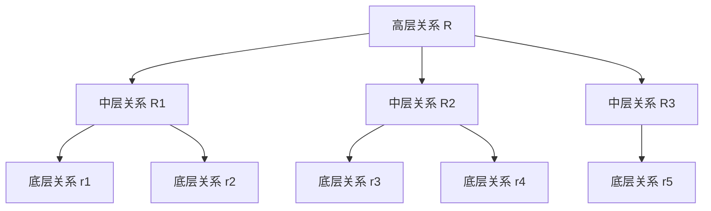

# 语言如何塑造模型的谱空间

# 问题

大语言模型具有很高的名义维度，但训练后不同参数方向和 hidden-state 方向的作用并不均匀。少数方向可能具有很大的奇异值，很多预测共同依赖这些方向；另一些方向增益较小，可能承载更局部、更稀有或更具区分性的内容。

我们希望回答：

1. **人类自然语言具备怎样的物理特征？**
2. **这些物理特征如何在当前训练范式下，塑造了LLM的谱空间？**
3. 基于上述特性，如何解决 MoE routing、遗忘、优化器等各类问题？

# 物理先验与表征空间

## 结论

> 在 NTP 训练下，一个 token 或 relation 在不同样本中出现的频率越高，它越容易形成较早稳定、奇异值更大、被更多预测共同依赖的参数方向；越低频、越局部或越缺乏共享性的内容，越需要更多剩余方向表达。

## Token level：长尾频率、顺序训练与共享计算

### 物理先验

**长尾频率分布**：语言 token 和局部 pattern 的频率具有明显长尾性，可以用 Zipf-like 分布近似：

$$
p_i\propto i^{-\alpha}.
$$

NTP 又具有序列化监督：同一段序列的不同 prefix 会在不同位置产生预测目标，简单和常见的局部结构会被更早、更频繁地训练；更具体、更长尾的组合通常需要复用已经学到的前序结构。

### 谱空间形成规律

1. 高频 token 会占据谱空间主方向，且收敛时的位置位于其初始化位置附近；
2. long-tail token 在高频 token 的 residual subspace 中学习并可分；
3. long-tail token 的表示仍需依赖 shared top channel，这来自 NTP + causal mask 的时序依赖特性；


## 高层次语义

### 物理先验

我们把自然语言视为具有图状或层级化组合结构：

- 底层节点可以是 token、短片段、局部事实或简单关系；
- 更高层关系由少量直接下层关系组合而成；
- 每个下层关系又可以被多个更高层关系复用；



“复杂关系通常只直接调用少量下层关系”目前是物理先验。它来自语言组合、程序调用和数学推理中的稀疏依赖直觉，尚未被当前合成实验直接证明。

### 谱空间形成规律

1. 一个关系在谱空间中的位置，主要由该关系在训练数据中的频率决定，与其层次无关。
2. 越高频的关系，越倾向于出现在谱空间的头部；反之则位于谱空间的尾部。


```text
例如，A 和 C 都可以非常高频，但某个具体的 A→C 配对仍然可以是低频关系。
```

## 进一步假设：多尺度 common feature 对应分层谱空间

### 物理性质假设

除了“common 与 long-tail”两级划分，我们进一步假设语言中存在多尺度的 shared features。

在一个理想化的层级数据模型中：

```text
1 种覆盖约 100% 数据的全局 common feature
        ↓
10种 覆盖约 10% 数据的 group-level features
        ↓
100 种覆盖约 1% 数据的 subgroup-level features
        ↓
1000 种覆盖约 0.1% 数据的更局部 features
        ↓
个别数据独有的 data-specific features，不具泛化能力，没有学习价值
```

### 谱空间预测

我们预测，这些不同覆盖率的 feature 会形成多层次谱组织：

```text
最大奇异值附近：
    几乎所有数据共同调用的全局 operation / common feature

次一级主要谱带：
    10种 大约 10% 数据共同调用的 group-level operations

更后面的谱带：
    100 种大约 1% 数据共同调用的 subgroup-level operations

谱尾和正交补空间：
    若能完全学到数据，则过拟合到 data-specific information
```

### 形式化工作模型

设语义或预测 feature 为 $r$，其出现概率为 $f_r$，每次出现对某个参数矩阵产生的主要更新方向为 $u_rv_r^\top$。局部近似下：

$$
\mathbb E[\Delta W]
\approx
\sum_r f_r c_r u_rv_r^\top+\varepsilon,
$$

其中：

- $f_r$：feature 或完整关系的出现概率；
- $c_r$：不同上下文中该 feature 更新的一致性与当前残差强度；
- $u_rv_r^\top$：该 feature 反复推动的主要参数方向；
- $\varepsilon$：其他 token、上下文变化和优化噪声。

当 $f_r c_r$ 较大时，相同方向会被大量重复更新，更可能形成较大的奇异值。当 $f_r$ 较小、$c_r$ 较低，或不同上下文要求彼此冲突的操作时，更新会分散到更多方向。

对于 attention routing，更直接的对象是：

$$
B_{qk}=W_Q^\top W_K,
$$

并可以写出工作近似：

$$
\mathbb E[\Delta B_{qk}]
\approx
\sum_r f_r c_r u_rv_r^\top+\varepsilon.
$$

这个模型给出关于 Transformer 训练动力学的可检验预测。

## 结论边界

当前仍有以下假设

- 自然语言可以被稳定地分解成 100% / 10% / 1% 等多尺度 common features；
- 这些 feature 会在真实 LLM 中形成清楚分离的连续谱带；
- 语义覆盖率能够单独决定奇异值顺序；
- 所有 layer、head 和参数矩阵都遵循相同规律；
- hidden representation space 与 parameter spectral space 具有一一对应的分层结构。

---

# 理论与实验验证

本部分整理支撑前述结论的理论与实验，说明结论的操作化方式和证据。

## 理论线索：重复梯度形成高增益方向

对于线性映射 $z=Wh$，令：

$$
W=U\Sigma V^\top.
$$

hidden feature 沿 $v_i$ 的系数为 $c_i$ 时，对输出的影响为：

$$
Wh=\sum_i\sigma_i c_i u_i.
$$

在当前 prediction error 与 $u_i$ 对齐时，较大的 $\sigma_i$ 能用更小的 hidden-state 变化产生更大的 logit 改变。因此已经形成的高增益方向可能成为后续样本更有效的局部下降方向。

对 cross-entropy，正确分类后有限 margin 仍有非零梯度，因此：

```text
方向可以先稳定，
但奇异值仍可以为了增大置信度继续增长。
```

当前 rank-one 理论严格支持“direction alignment 与 gain amplification 可以分成两个阶段”。完整 Transformer 中的对应动力学由实验测量。

对应文档：

- [two_phase_singular_mode_learning_proof_and_test.md](./two_phase_singular_mode_learning_proof_and_test.md)
- [spectral_rich_get_richer_mechanism.md](./spectral_rich_get_richer_mechanism.md)
- [c3s_adamw_merged_rigorous_proof_with_negative_results.md](./c3s_adamw_merged_rigorous_proof_with_negative_results.md)

## 实验：频率偏斜与 shared QK top channel

### 被测问题

频率偏斜和 shared routing operator 如何形成参数矩阵的大奇异方向？

### 操作化

实验使用 K-token trigram task，四个 group 共享同一套 transition/routing pattern。改变 group frequency：

```text
uniform: 0.25 / 0.25 / 0.25 / 0.25
mild:    0.40 / 0.20 / 0.20 / 0.20
current: 0.70 / 0.10 / 0.10 / 0.10
extreme: 0.90 / 0.0333 / 0.0333 / 0.0334
```

### 结果

从 uniform 到 extreme 的总体趋势是：

```text
频率越偏斜
→ Bqk 谱总体越尖
→ tail prediction 对 top channel 的功能依赖越强
```

同时，strict orthogonal IO 表明 tail identity 可以在 residual subspace 中更可分，但 prediction 仍可能依赖 $B_{qk}$ 的 top singular channel。

### 支持的结论

实验结果支持：

```text
frequency imbalance + shared routing
→ top singular parameter channel
```

参数奇异性主要由 frequency imbalance 与 shared routing 共同驱动。

对应文档：

- [0629_orthogonal_separability_and_usage_summary.md](./0629_orthogonal_separability_and_usage_summary.md)

## 实验：固定节点频率，只改变完整关系复用

### 被测问题

完整关系的复用频率如何影响其学习速度和谱空间位置？

### 操作化

构造：

```text
A | B | C | D
```

核心关系为跨过 B 的 A→C。保持：

- A/B/C/D token 集合相同；
- 节点边际频率相同；
- 句长与样本数相同；
- A→C 距离相同；
- B→D 对照关系相同。

只改变同一套 A→C 映射能跨多少种 B 上下文复用：

| Setting | A→C 共享方式 | 单个系统配对频率 |
|---|---|---:|
| `share16` | 16 种 B 共享同一套映射 | 16 |
| `share4` | 每 4 种 B 共享一套映射 | 4 |
| `share2` | 每 2 种 B 共享一套映射 | 2 |
| `random_unshared` | `(A,B)→C` 随机且不能跨 B 复用 | 无系统共享 |

模型是单层、单头 causal attention，宽度为 64 或 128。

### 学习速度

64 维模型达到稳定 matched-fit 的中位 step：

| Setting | 中位 step |
|---|---:|
| `share16` | 350 |
| `share4` | 750 |
| `share2` | 1100 |
| `random_unshared` | 1200 |

因此，在 A/C 节点频率相同的情况下，完整关系复用越多，NTP 越早学会它。128 维中 `share16` 存在明显 seed/优化异常，因此最干净的学习速度证据来自 64 维。

### WQ/WK 尾删

64 维 $W_Q$ 只保留 4 个头部方向时：

```text
share16 的 A→C ΔCE ≈ 0.001
```

但低频和 random-unshared 关系在保留 32 或 16 维时已经明显损坏。

$W_K$ 也显示 `share16` 明显比其他 setting 更稳定；中低频档位在不同 rank 上存在波动。

### 矩阵特异性

只保留 16/64 维时，明显差异主要出现在：

- $W_Q$；
- $W_K$。

$W_V$、$W_O$ 和 H1 的差异很小。

### 支持的结论

```text
完整关系复用越多
→ 学得越快
→ 对较小 QK 头部子空间的功能依赖越集中
```

这个实验支持“关系频率和共享性影响 QK 谱组织”。多层 hierarchy 将在后续实验中直接测量。

对应文档：

- [NTP_HIERARCHY_FREQUENCY_TALK.md](./NTP_HIERARCHY_FREQUENCY_TALK.md)

## 当前证据与核心命题的对应关系

| 核心命题 | 当前证据 | 证据状态 |
|---|---|---|
| 高频 shared operation 形成主要参数通道 | K-token frequency ablation 与 $B_{qk}$ top-channel damage | 已支持于 toy setting |
| long-tail 的可分位置与实际使用通路不同 | strict orthogonal IO 与 top-channel ablation | 已支持于 toy setting |
| 节点频率不同于关系频率 | ABCD 保持 A/C 边际频率不变 | 已支持 |
| 关系复用越多越依赖较小 QK 子空间 | ABCD `share16/share4/share2/random` 尾删 | 已支持于单层单头模型 |
| direction discovery 早于 gain amplification | rank-one gradient-flow 推导 | 线性模型内已证明，Transformer 中待测 |
| 100%/10%/1% feature 对应多尺度谱带 | 尚无直接实验 | 进一步假设 |
| 自然语言真实语义遵循同样结构 | 尚无真实语料证据 | 开放问题 |

## 多尺度 common-feature 假设的直接验证

### 合成数据

构造一棵已知层级树，使每个样本同时具有：

```text
1 个 100% 全局 feature
1 个来自 10 个候选的 10% group feature
1 个来自 100 个候选的 1% subgroup feature
1 个样本级 residual feature
```

控制：

- 每一级 feature 的预测难度；
- feature 的向量范数和标签规模；
- 序列距离；
- 每一级的直接组合数；
- 总训练 token 数；
- 初始化、optimizer 和训练步数。

### 需要测量

1. 每一级 feature 的学习时间；
2. feature-conditioned gradient covariance rank；
3. feature 与 $W_Q/W_K/B_{qk}$ 奇异子空间的投影质量；
4. 删除不同谱带后，每一级 feature 的条件 CE/accuracy 损害；
5. top singular subspace 在训练中的漂移；
6. hidden representation 中每一级 feature 的可分性。

### 通过条件

在多个 seed 和 matched-fit checkpoint 上，同时观察到：

```text
覆盖率越高的 feature 学得越早；
覆盖率越高的 feature 梯度越一致；
覆盖率越高的 feature 功能依赖越集中在头部参数子空间；
删除对应头部谱带优先损害高覆盖率 feature；
删除尾部谱带优先损害低覆盖率或 residual feature。
```

### 失败条件

以下结果会否定或修改“覆盖率决定谱层级”的强版本：

- 相同复杂度下，feature 覆盖率与谱位置没有稳定关系；
- 谱位置主要由标签几何、序列距离或任务难度决定；
- 高覆盖率 feature 的梯度在不同上下文中相互抵消；
- 不同层级 feature 全部依赖相同 top channel，无法形成可分谱带；
- hidden representation 与 parameter spectrum 呈现完全不同的组织规律。

## 当前核心问题

现阶段最优先回答的问题是：

> 在控制 feature 复杂度和序列距离后，数据覆盖率与跨上下文梯度一致性，是否足以产生可预测的多尺度谱分层？

实验将检验 100% / 10% / 1% 假设能否形成可测量的表征空间组织规律，并区分以下变量对谱位置的作用：

```text
频率
规则数量
关系的代数秩
上下文不变性
序列距离
梯度冲突
```

究竟哪一个变量真正决定谱位置。

---

# 会议口头总结

> 我们现在首先想理解，语言中的语义和预测关系在 NTP 训练下如何形成模型的表征与参数谱结构。语言一方面具有 Zipf 式长尾频率，另一方面具有可以递归复用的组合层级。我们目前的实验表明，高频共享计算形成高增益的大奇异方向；long-tail identity 可以在 residual subspace 中可分，同时通过 shared top channel 完成预测。
>
> 新的关系频率实验进一步固定了 token 边际频率和关系距离，只改变完整 A→C 关系跨上下文的复用次数。结果是关系复用越多，学习越快，也越能承受 $W_Q/W_K$ 尾部方向删除。层级提供可复用的关系，实际调用频率和梯度一致性决定这些关系在谱空间中的位置。
>
> 在此基础上，我们进一步提出一个待验证的多尺度假设：覆盖全体数据的 global common feature 位于最主要谱空间，覆盖约 10% 数据的 group feature 位于次一级谱带，覆盖约 1% 数据的 subgroup feature 位于更后的谱带，低频和样本特异信息进入 residual space。下一步直接验证这种 100% / 10% / 1% 的谱分层；MoE、遗忘、优化器和量化作为这一理解可能通向的下游方向。
