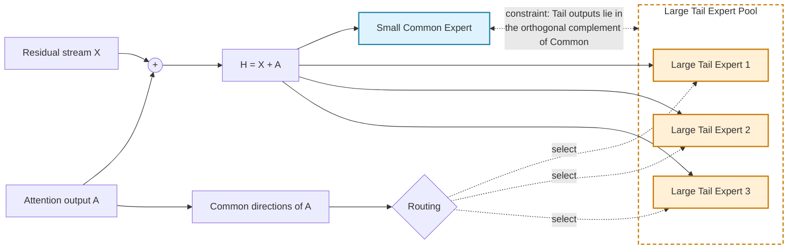

# 面向端侧部署的谱空间 MoE：从可预测性与传输瓶颈到模型结构

## 1. 当前 MoE 面向端侧部署的核心困难

### 1.1 目标：只在设备内保留当前推理所需的计算

MoE 通过条件激活扩大模型总容量，但端侧设备无法将全部 expert 常驻在有限的 HBM / unified memory 中。一个自然的部署方式是：

```text
当前 token 开始计算
    -> 预测后续层或后续 token 将激活的 expert
    -> 提前从主存 / SSD 将 expert swap in
    -> 计算完成后，将暂时不用的 expert swap out
```

这一方案成立需要同时满足两个条件：

1. **Expert activation 可预测。** 系统必须在目标 expert 被调用之前获得足够准确的预测，并留出传输窗口。
2. **动态搬运对象足够小。** Expert 的传输时间必须短于预测发出后可用于隐藏传输的计算时间。

设 expert 参数量为 $S_e$，传输带宽为 $B_{mathrm{io}}$，预测到实际调用之间的可用计算窗口为 $T_{mathrm{lookahead}}$，则隐藏传输时延的必要条件是：

$$
T_{mathrm{swap}}(e)
=
\frac{S_e}{B_{mathrm{io}}}
\leq
T_{mathrm{lookahead}}.
$$

预测准确率决定“是否提前搬对”，expert 大小决定“即使搬对，能否按时搬完”。二者缺一不可。

### 1.2 现有 MoE 的 Expert Activation 预测结构

普通 MoE 通常直接使用进入 FFN 的完整 residual representation 进行 routing。它表现出两种稳定现象：

- **同 token 跨层预测性高。** 同一个 token 在不同层保留较强的 token identity 成分，因此不同层的 router 容易给出相关的 expert activation。
- **同层跨 token 预测性差。** 相邻 token 的 identity 不同，完整 residual representation 中主导 routing 的强方向随 token 快速变化，因此 expert ID 容易跳变。

这意味着现有 MoE 的高跨层可预测性主要来自 token identity 的持续存在，而不是 expert 已经形成了理想的上下文级或语义 feature specialization。

从部署角度看，这种可预测性只能提供有限帮助：同 token 的浅层可以预测深层 expert，但相邻 token 很难复用上一 token 的 routing 结果，系统必须频繁准备新的 expert。

### 1.3 Expert 过大形成不可突破的传输下界

普通 MoE 中，每个 routed expert 都是一个完整 FFN。以门控 FFN 为例，一个 expert 通常包含 up、gate 和 down 等多个大矩阵，其参数规模为：

$$
S_{mathrm{expert}}
\approx
3dd_{mathrm{ff}}.
$$

不同 expert 虽然承担不同 token 的计算，但每个 expert 内部仍混合了三类功能：

```text
几乎所有数据都会使用的 common computation；
在局部上下文中反复出现的 context computation；
只服务少量 pattern 的 long-tail computation。
```

由于这些功能没有在参数结构中显式拆分，切换一个细粒度 feature，系统仍然必须搬运整个 expert。二阶段分析表明，即使 expert 预测达到 $100\%$，在当前 PCIe / HBM / 计算速度比下，完整 expert 的传输仍难以被计算覆盖，额外时延可达到约 $200\%$。因此，单独提高 predictor accuracy 无法解决问题。

### 1.4 本文档的研究动机

上次会议讨论的方案曾尝试直接按 feature 频率组织 expert：高频 feature 不参与动态分发，而是统一进入一个较大的 common expert；中频 feature 被分发到略小的 experts；低频 feature 被分发到更小的 experts。实验表明，这种 frequency-aware routing 的可预测性确实高于 baseline，但模型性能反而下降了约 $1\%$。这说明“按频率分桶能够提高 routing 可预测性”并不等价于“按频率缩小 expert 就符合语言模型所需的计算结构”。尤其是，低频 feature 出现得少，并不意味着所有低频 feature 合起来只依赖一个小表征空间，也不意味着它们所需的 expert 容量应随频率单调减小。

因此，本轮不再把频率本身直接当作 expert 大小的设计依据，而是进一步追问三个机制问题：语言数据中的高频与低频 pattern 分别依赖表征空间的哪些部分；跨 token 的 routing 可预测性究竟来自哪一种表征；以及上一版方案为何在提高可预测性的同时损失性能。第 2 章对 common 与 long-tail 表征空间、以及 $A$ 的连续性的分析，正是为回答这三个问题，并据此重新组织第 3 章的模型结构。

## 2. 谱空间解释：为什么现有 MoE 呈现这种预测性与参数结构

本章的目标是解释现有 MoE 的两个直接现象：

1. 为什么同一个 token 的 expert activation 可以由浅层较好地预测深层，而相邻 token 的 activation 明显更难预测；
2. 为什么普通 MoE 以完整 FFN 作为 expert 并非最优，进而导致每次 routing 都对应一个很大的动态参数对象。

我们形成的统一解释是：

> 自然语言的嵌套结构在表征和参数空间中形成少数高增益方向；普通 gate 直接读取完整 token embedding，因此其决策主要由这些强方向如 token identity 主导。与此同时，expert 没有把可被复用的 commonn 计算与条件化增量拆开，只能将二者共同封装在完整 FFN 中。

### 2.1 Gate 决策由谱空间大奇异值方向贡献

对一层输入表征的统计空间作谱分解，记 feature basis 为 $U=[u_1,\ldots,u_d]$：

$$
h=\sum_{i=1}^{d}a_i(h)u_i,
\qquad
a_i(h)=h^\top u_i.
$$

普通线性 gate 的第 $e$ 个 logit 为：

$$
g_e(h)=w_e^\top h
=
\sum_{i=1}^{d}a_i(h)\,w_e^\top u_i.
$$

因此可以直接测量某一段谱方向对 routing 的解释能力。对谱方向集合 $B$，只保留该子空间：

$$
h_B=P_Bh
=
\sum_{i\in B}a_i(h)u_i,
$$

再比较：

$$
\operatorname{argmax}_e g_e(h_B)
\quad\text{与}\quad
\operatorname{argmax}_e g_e(h)
$$

的一致率。若很小的 $B$ 已能恢复大部分 full-representation routing，说明 gate 的决策由该谱子空间主导。

现有真实语料训练的 baseline MoE 中，约 $90\%$ 的 routing 可以由表征 top $5\%$ 头部子空间解释。其中包含显著的 token identity / surface component；普通 gate 优先利用这些强信号完成分发。

### 2.2 谱空间强方向的自然语言根源

对模型中的线性参数矩阵作奇异值分解：

$$
W=U\Sigma V^\top.
$$

对输入 $h$：

$$
hW
=
\sum_i \underbrace{(h^\top u_i)\sigma_i}_{z_i(h)}v_i^\top.
$$

$u_i$ 给出输入侧 feature direction，$\sigma_i$ 是训练形成的 feature gain，$z_i(h)$ 是该方向对当前 token 的有效激活强度。

参数更新的基本形式是输入 activation 与输出误差信号的外积：

$$
\frac{\partial L}{\partial W}
=
\delta h^\top.
$$

在 Zipf 分布的自然语言数据中，高频 token、短语和共享 pattern 会反复出现，相关 activation direction 因而被对齐梯度重复写入参数矩阵：

$$
\text{high-frequency shared pattern}
\Rightarrow
\text{repeated aligned gradients}
\Rightarrow
\text{high-gain common subspace}.
$$

自然语言中的 nested structure 会进一步复用和传播这些方向，即预测一个新 token 时需利用到所有前序 token，导致新 token 不得不基于前序 token 的 common 方向调整其表征。例如：

```text
the moon
a moon cake
```

`the` 作为高频 token 首先占据了表征空间的强奇异方向，其后 `moon` 与 `the` 形成高频固定搭配的词组 `the moon`，导致 `moon` 的表征在 `the` 所在的强奇异方向上具有大投影。其后，模型再学习 `a moon cake` 等冷门搭配时，该低频词组中的低频 token `cake` 由于要利用前序所有 token 预测，不得不基于一个强 commonn 方向的分量调整 `cake` 的表征在空间中的位置。

真实模型的 feature activation 统计也验证了这种 head/tail 结构。在 Qwen3-0.6B 的 28 层 attention projection 中，少量 feature 接近全局激活，同时大量 feature 只在部分 token 上激活：

| matrix | top-1 feature activation frequency | mean activation frequency |
|---|---:|---:|
| q_proj | 99.97% | 14.72% |
| k_proj | 99.91% | 12.90% |
| v_proj | 85.67% | 28.69% |
| o_proj | 96.57% | 31.09% |


### 2.3 强方向主导对专家激活可预测性的影响

设第 $l$ 层的输入 residual 为 $X_t^{(l)}$，当前层不含 residual 的 attention output 为 $A_t^{(l)}$，进入 MoE 的完整表征为：

$$
H_t^{(l)}=X_t^{(l)}+A_t^{(l)}.
$$

再按 $H^{(l)}$ 的谱空间分解：

$$
H_t^{(l)}
=
\sum_B\left(P_BX_t^{(l)}+P_BA_t^{(l)}\right).
$$

前期 Oracle-MoE 工作已经指出，受 self-attention 加权聚合特性的影响，$A$ 在同一 sequence 的相邻 token 间具有较强连续性，因而能够产生稳定、可预测的 expert activation。现有 MoE 未能利用这一性质，根本原因在于该上下文增量加入 residual 后不再主导 gate 输入。

实测显示，在 layer 1--27 中，$A$ 的跨-token连续性高于 $X$，但 $X$ 自身绝大部分能量集中于 $H$ 的 top $1\%$，最终该头部子空间中约 $98.68\%$ 的能量贡献来自 $X$。因此，标准 MoE gate 无法直接利用 $A$ 中更连续的上下文信息，且在不同层利用的分发信息几乎一致。


这些强方向由高频 token 和 common pattern 在训练早期率先形成，对高频数据具有较好的区分能力。Long-tail token 受 nested structure 影响，同样会在 common 方向上形成较大投影，但这些方向不足以区分不同 long-tail pattern；其差异主要由后续谱方向表达。由此，现有 routing 呈现两种特征：

1. 同一高频 token 倾向于稳定进入同一 expert，因为 gate 能够从头部子空间中稳定读取其 identity；
2. Long-tail token 在头部子空间中缺乏足够区分性，gate 的分发难以与其真实差异形成稳定对应，区分这些 token 的后续谱方向又未能主导 routing。

这进一步解释了现有 MoE 的两类预测性：

- **同 token 跨层预测性高**：
  - 累计 residual 的 dominant directions 跨层持续传递，
  - 同一 token 在不同层保留稳定的头部谱特征，因而浅层表征能够较好预测深层 expert activation。

- **相邻 token 预测性差**：
  - 对高频 token，头部子空间具有较强区分性，不同 token 的 dominant coordinates 变化显著；准确预测其 expert activation 的难度，接近于直接预测下一 token 的 identity。
  - 对 long-tail token，头部子空间区分性不足，routing 又未利用真正承载差异的后续谱方向，因而无法形成稳定、可由上下文预测的 expert mapping。

因此，现有 MoE 的同-token跨层可预测性主要来自 dominant residual signal 的持续性；较弱的跨-token可预测性则同时来自高频 token 在头部子空间中的显著差异，以及 long-tail token 的有效区分方向未被 gate 充分利用。

### 2.4 完整大 Expert 为什么造成参数浪费

我们通过受控实验分析了不同频率的 token 和 pattern 向输出空间写入信息的方式。结果表明，高频 token 与 common pattern 收敛较快，仅依靠参数空间和表征空间中的强奇异方向即可有效区分；long-tail token 则必须进一步利用后续谱方向表达差异，否则学习速度会显著降低，部分模式甚至无法稳定收敛。

| Pattern | 写入行为 | Rank 特征 | 完整大 FFN 造成的浪费 |
|---|---|---|---|
| 高频 token 与 common pattern | 主要写入被反复复用的头部强方向 | 大量高频数据共享少量方向，联合写入的有效 rank 较低 | 每次仍激活能够覆盖完整谱空间的 expert，面向长尾方向的大量容量未被有效使用 |
| 单个 long-tail token / pattern | 复用 common 方向，并向中后部写入少量用于区分当前模式的专属信息 | 单个 token 的专属增量呈现局部低 rank | 重复保存 common mapping，同时激活大量属于其他长尾模式的参数 |

不同 long-tail patterns 写入的中后部方向并不相同：单个模式的增量是局部低 rank 的，但全部专属方向的并集可以接近满 rank。因此，模型总体上确实需要丰富的长尾容量，却不需要让每个 token 都激活这份完整容量。普通 MoE 的问题，正是将全局所需的高 rank 容量复制并绑定到每一条局部 expert 路径。

因此，现有大 expert 的浪费不在于模型总体拥有高 rank 容量，而在于它让**每个 token 都为全局高 rank 容量付费**。更合理的参数组织方式是：所有计算路径均读取完整表征；common 写入仅保留一份共享参数；非 common 的长尾容量由多个可复用 expert 共同覆盖，使单个上下文只激活其中一部分，而全部 experts 的并集仍保留足够高的 rank。

## 3. 面向端侧部署的模型结构

第 2 章给出了两个彼此独立但必须同时满足的结构结论。

第一，频率结构决定输出空间组织，进而影响模型性能。高频 token 与 common pattern 主要写入少数高复用 common 方向；单个 long-tail token / pattern 的专属写入很窄，但所有 long-tail pattern 的专属方向并集可以很大。因此，common 计算可被一份较小的共享参数承载，而 long-tail 容量不应被压成一个很小的全局模块。

第二，Attention output $A$ 能提供高可预测性表征，且其连续、可预测的特性主要来自于 $A$ 的大奇异向量子空间。因此，动态 expert 的选择应由 $A$ 的连续成分决定。

基于这两个结论，模型采用一个统一结构：**小 common 常驻，大 long-tail expert 由 $A$ 的局部均值分发，并限制 long-tail 输出不重复写入 common 空间**。

### 3.1 模型结构

设第 $l$ 层 attention 的 residual 输入为 $X_t^{(l)}$，不含 residual 的 attention output 为 $A_t^{(l)}$，进入 MoE 的完整表征为：

$$
H_t^{(l)}=X_t^{(l)}+A_t^{(l)}.
$$

该层 MoE 由两类并行写入路径组成：

| 路径 | Routing 信息 | Expert 读入 | 输出职责 | 部署方式 |
|---|---|---|---|---|
| Small common expert | 无 routing，所有 token 激活 | 完整 $H_t^{(l)}$ | 写入高频 token / common pattern 所需的低维 common 空间 | 始终常驻，参数量小 |
| Long-tail experts | $A_t^{(l)}$ 的局部均值 / 强连续成分 | 完整 $H_t^{(l)}$ | 写入当前上下文下可能需要的大容量非 common 空间 | 由连续 routing 预取并跨 token 复用 |

#### 3.1.1 结构总览

下图只展示模型的核心结构：完整表征 $H$ 进入小 common expert 和被选中的大 long-tail expert；$A$ 的 common 方向负责分发 long-tail experts；两类 experts 的输出空间之间施加约束。



因此，$A$ 决定“使用哪个 tail expert”，完整 $H$ 决定“expert 实际计算什么”；小 common 与多个大 tail 之间的约束，则避免 tail experts 重复学习 common 输出空间。

该层输出为：

$$
Y_t^{(l)}
=
C^{(l)}\!\left(H_t^{(l)}\right)
+
P_{\perp c}^{(l)}
E_{r_t^{(l)}}^{(l)}\!\left(H_t^{(l)}\right).
$$

其中 $C^{(l)}$ 是小 common expert，$E_j^{(l)}$ 是第 $j$ 个 long-tail expert，$r_t^{(l)}$ 是由 $A$ 的连续成分产生的 expert index，$P_{\perp c}^{(l)}$ 是 common 输出空间的正交补投影。这里的拆分发生在**输出职责**与**routing signal**上，而不是发生在 expert 的输入空间上。Common 与 long-tail experts 都读取完整 $H$。

#### 3.1.2 小 Common Expert：用低秩参数承载高复用写入

第 2.2 与 2.4 节说明，高频 token 与 common pattern 会通过重复、对齐的梯度写入形成少数高增益 common 方向。这部分计算被几乎所有 token 复用，但有效维度较低。因此，common expert 不应被复制到每个动态 expert 中，而应只保留一份并始终常驻。

若原始 FFN 的 intermediate size 为 $d_{\mathrm{ff}}$，common expert 可以采用更窄的 GLU / FFN：

$$
C(H)
=
W_{c,\mathrm{down}}
\left[
\phi(W_{c,\mathrm{up}}H)
\odot
W_{c,\mathrm{gate}}H
\right],
$$

其中：

$$
W_{c,\mathrm{up}},W_{c,\mathrm{gate}}\in\mathbb{R}^{r_c\times d},
\qquad
W_{c,\mathrm{down}}\in\mathbb{R}^{d\times r_c},
\qquad
r_c\ll d_{\mathrm{ff}}.
$$

Common expert 做小的原因不是为了动态搬运，而是因为 common 输出空间本身低维。它常驻在设备内，覆盖高频和共享 pattern 的主要写入，避免每个 long-tail expert 重复保存 common mapping。

#### 3.1.3 由 $A$ 的局部均值分发较大的 Long-tail Experts

第 2.4 节说明，单个 long-tail pattern 的专属增量可能是局部低 rank，但所有 long-tail pattern 的专属方向并集可以接近高 rank。因此，long-tail 容量不应被压成很小的 micro expert。每个 long-tail expert 应当有足够容量覆盖一个上下文区域内可能出现的多种 long-tail 写入。

与此独立的是，第 2.3 节说明 $A$ 具有更强的跨-token连续性。为利用这个性质，动态 expert 不由完整 $H$ 或 token identity 直接分发，而由 $A$ 的局部慢变成分分发。可以使用最近窗口均值：

$$
\mu_t^{(l)}
=
\frac{1}{W}
\sum_{s=\max(1,t-W+1)}^{t}
A_s^{(l)},
$$

也可以使用指数滑动均值：

$$
\mu_t^{(l)}
=
(1-\beta)\mu_{t-1}^{(l)}
+
\beta A_t^{(l)}.
$$

由于 $A$ 的句内连续性主要集中在其强连续方向上，$\mu_t^{(l)}$ 可以作为这些方向的低成本在线近似。Context routing code 为：

$$
c_t^{(l)}
=
P_A^{(l)}\mu_t^{(l)},
\qquad
r_t^{(l)}
=
\operatorname{TopK}
\left(
G_E^{(l)}(c_t^{(l)})
\right).
$$

其中 $P_A^{(l)}$ 可以是离线统计得到的 $A$ top continuous basis，也可以是训练得到的低维 projector。重要的是：$c_t$ 只负责选择 expert，真正进入 expert 的仍然是完整 $H_t$。

因此，对 long-tail token 而言，模型并没有把它限制到一个很小的 token-level expert。它进入由局部上下文选择的 long-tail expert 后，仍可依据完整 $H_t$ 写入该 expert 覆盖的非 common 输出空间。也就是说，$A$ 提供稳定分发，$H$ 提供完整计算信息。

单个 long-tail expert 可以采用接近普通 MoE expert 的 GLU / FFN 形状：

$$
\widetilde{E}_j(H)
=
W_{j,\mathrm{down}}
\left[
\phi(W_{j,\mathrm{up}}H)
\odot
W_{j,\mathrm{gate}}H
\right],
$$

其中：

$$
W_{j,\mathrm{up}},W_{j,\mathrm{gate}}\in\mathbb{R}^{r_E\times d},
\qquad
W_{j,\mathrm{down}}\in\mathbb{R}^{d\times r_E}.
$$

这里 $r_E$ 可以显著大于 $r_c$，甚至接近普通 MoE expert 的 intermediate size。部署上允许它较大，是因为 $r_t$ 由 $\mu_t$ 决定，切换频率应显著低于 token-identity routing；一个 expert 被加载后可以在多个相邻 token 上复用。

#### 3.1.4 限制 Long-tail 输出位于 Common 正交补空间

仅有小 common expert 与大 long-tail expert 还不够。如果 long-tail experts 仍然大量输出到 common 空间，它们会重新学习 common mapping，导致两个问题：

1. 参数上重复保存 common 计算；
2. 优化上挤占 long-tail 专属方向的学习信号。

因此，需要显式限制 long-tail expert 的输出空间。设 common 输出空间为：

$$
\mathcal{S}_c^{(l)}
=
\operatorname{span}(U_c^{(l)}),
\qquad
U_c^{(l)}\in\mathbb{R}^{d\times k_c}.
$$

其中 $U_c^{(l)}$ 可以来自 common expert 输出的 top basis，也可以来自离线统计得到的高频 / common 输出方向。对应投影为：

$$
P_c^{(l)}
=
U_c^{(l)}U_c^{(l)\top},
\qquad
P_{\perp c}^{(l)}
=
I-P_c^{(l)}.
$$

Long-tail expert 的最终输出定义为：

$$
E_j^{(l)}(H)
=
P_{\perp c}^{(l)}
\widetilde{E}_j^{(l)}(H).
$$

于是整层输出为：

$$
Y_t^{(l)}
=
C^{(l)}(H_t^{(l)})
+
P_{\perp c}^{(l)}
\widetilde{E}_{r_t^{(l)}}^{(l)}(H_t^{(l)}).
$$

这个约束表达的是：long-tail expert 可以读取完整 $H$，因此可以利用 common 信息进行计算；但它不应重复向 common 输出空间写入，common 输出由 $C$ 统一承担。这样既保留了 long-tail token 对完整上下文的使用能力，又迫使动态 expert 学习 common 之外的大容量差异空间。

实际实现时，$k_c$ 应保持较小。若 common space 定义过宽，硬投影会误伤 long-tail pattern 需要使用的共享方向。因此首版应只投掉非常可信的 common 输出方向，例如 common expert 输出的 top $0.5\%$--$2\%$ basis，并通过 ablation 选择维度。

### 3.2 为什么该结构能保持 MoE 能力

该结构不是把普通 MoE 的能力删掉，而是把普通 expert 内部混合的功能重新组织：

$$
F_e(H)
\approx
F_{\mathrm{common}}(H)
+
F_{\mathrm{longtail}}(H).
$$

普通 MoE 的问题在于，每个大 expert 都可能重复保存 common mapping，同时又携带一部分 long-tail 容量。新结构将 common mapping 合并为一份小的常驻 $C$，再把大容量非 common 写入交给多个由 $A$ 均值稳定分发的 $E_j$。

对高频 token / common pattern：

$$
C(H_t)
$$

已经覆盖其主要写入需求；如果存在上下文相关的额外计算，它仍然可以通过当前激活的 $E_{r_t}$ 获得。

对 long-tail token / pattern，模型能力来自三点：

1. long-tail expert 读完整 $H_t$，没有丢失 token identity 与完整上下文；
2. 单个 $E_j$ 的容量可以较大，能够覆盖一个上下文区域内多种 long-tail 方向；
3. 全部 $E_j$ 的输出空间并集提供总体高 rank long-tail 容量。

因此，该结构保留了现有 MoE 所需的全局容量，同时通过 common / non-common 输出分工减少重复参数，并通过 $A$ 的连续性降低动态 expert 切换频率。

### 3.3 面向预测预取的部署策略

普通 MoE 每次 cache miss 需要搬运一个完整 FFN，且 routing 容易随 token identity 快速跳变：

$$
S_{\mathrm{swap}}^{(\mathrm{baseline})}
\approx
3dd_{\mathrm{ff}}.
$$

新结构中，common expert 始终常驻；动态搬运对象是由 $\mu_t$ 分发的 long-tail expert。由于 $\mu_t$ 是局部均值或 EMA，它随上下文片段缓慢变化，系统可以在片段开始或上一 token 处预取对应 expert，并在后续多个 token 上复用。

若 long-tail expert 的大小为 $S_E$，一次加载后的平均驻留长度为 $L_{\mathrm{res}}$，则摊销到每个 token 的动态传输近似为：

$$
\frac{S_E}{L_{\mathrm{res}}}.
$$

即使 $S_E$ 接近普通 MoE expert，只要 $L_{\mathrm{res}}$ 足够大，平均 swap latency 仍可显著低于 token-level 跳变的 flat MoE。Common expert 做小则进一步降低设备端常驻参数量。

### 3.4 结构验证指标

该结构需要同时验证模型能力、输出空间分工与端侧收益：

| 验证目标 | 核心指标 | 判定含义 |
|---|---|---|
| 保持模型能力 | Validation loss、核心下游任务、active FLOPs | 小 common + 大 long-tail experts 没有牺牲基本建模能力 |
| Common 空间低维 | Common 输出解释率、common output effective rank、$k_c$ ablation | 高频 / common 写入确实由小 common expert 覆盖 |
| Long-tail 非 common 写入 | 投影前 $P_c\widetilde{E}_j(H)$ 能量、投影后 $P_cE_j(H)$ 残留、long-tail output effective rank、expert 间输出重叠 | Long-tail experts 没有重新复制 common mapping，而是在正交补中形成互补容量 |
| Routing 连续性 | Expert switch rate、平均驻留长度、跨-token recall@$K$ | $A$ 的局部均值被转化为稳定、可复用的 expert activation |
| 降低动态传输 | 常驻参数量、每 token 摊销搬运字节、cache miss、端到端 latency | 大 expert 的切换频率足够低，传输可被上下文级复用摊销 |

本结构将第 2 章的两个机制分开使用：

> 频率结构决定参数和输出空间：小 common expert 承载低维共享写入，大 long-tail experts 承载 common 正交补中的高容量差异写入。Attention output 的连续性决定 routing：用 $A$ 的局部均值稳定选择 long-tail expert，使大 expert 可以跨 token 复用，从而适配端侧部署。
