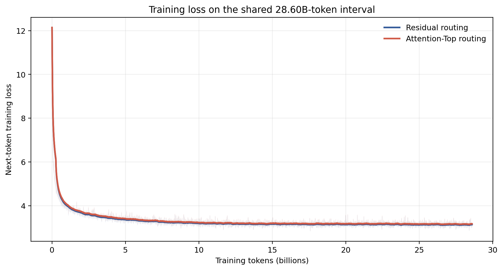

# 面向端侧部署的谱空间 MoE：NTP 表征物理意义与连续 Routing

本阶段建立了 NTP 模型表征与参数空间的统一谱解释：residual 头部方向主要承载高频 token 与 common pattern，跨层稳定但跨 token 变化快；attention output 头部方向承载当前上下文的共享语义，具有更强的句内连续性。基于这一认识，我们使用 attention 头部连续成分进行 routing，在保持模型训练与下游能力基本稳定的同时，将专家切换率降低了 $93.3\%$。

## 1. 当前 MoE 面向端侧部署的核心困难

### 1.1 目标：只在设备内保留当前推理所需的计算

MoE 通过条件激活扩大模型总容量，但端侧设备无法将全部 expert 常驻在有限的 HBM / unified memory 中。一个自然的部署方式是：

```text
当前 token 开始计算
    -> 预测后续层或后续 token 将激活的 expert
    -> 提前从主存 / SSD 将 expert swap in
    -> 计算完成后，将暂时不用的 expert swap out
```

这一方案成立需要同时满足两个条件：

1. **Expert activation 可预测。** 系统必须在目标 expert 被调用之前获得足够准确的预测，并留出传输窗口。
2. **动态搬运对象足够小。** Expert 的传输时间必须短于预测发出后可用于隐藏传输的计算时间。

设 expert 参数量为 $S_e$，传输带宽为 $B_{\mathrm{io}}$，预测到实际调用之间的可用计算窗口为 $T_{\mathrm{lookahead}}$，则隐藏传输时延的必要条件是：

$$
T_{\mathrm{swap}}(e)
=
\frac{S_e}{B_{\mathrm{io}}}
\leq
T_{\mathrm{lookahead}}.
$$

预测准确率决定“是否提前搬对”，expert 大小决定“即使搬对，能否按时搬完”。二者缺一不可。

### 1.2 现有 MoE 的 Expert Activation 预测结构

普通 MoE 通常直接使用进入 FFN 的完整 residual representation 进行 routing。它表现出两种稳定现象：

- **同 token 跨层预测性高。** 同一个 token 在不同层保留较强的 token identity 成分，因此不同层的 router 容易给出相关的 expert activation。
- **同层跨 token 预测性差。** 相邻 token 的 identity 不同，完整 residual representation 中主导 routing 的强方向随 token 快速变化，因此 expert ID 容易跳变。

这意味着现有 MoE 的高跨层可预测性主要来自 token identity 的持续存在，而不是上下文信息在相邻 token 之间的连续传递。从部署角度看，同 token 的浅层可以预测深层 expert，但相邻 token 难以复用上一 token 的 routing 结果，系统仍需频繁准备新的 expert。

### 1.3 Expert 过大形成不可突破的传输下界

普通 MoE 中，每个 routed expert 都是一个完整 FFN。以门控 FFN 为例，一个 expert 通常包含 up、gate 和 down 等多个大矩阵，其参数规模为：

$$
S_{\mathrm{expert}}
\approx
3dd_{\mathrm{ff}}.
$$

不同 expert 虽然承担不同 token 的计算，但每个 expert 内部仍混合了可被广泛复用的 common computation 与只服务特定 pattern 的条件计算。由于这些功能没有在参数结构中显式拆分，切换一个细粒度 feature，系统仍然必须搬运整个 expert。二阶段分析表明，即使 expert 预测达到 $100\%$，在当前 PCIe / HBM / 计算速度比下，完整 expert 的传输仍难以被计算覆盖，额外时延可达到约 $200\%$。因此，仅提高 predictor accuracy 仍不足以完成端侧部署闭环。

## 2. NTP 范式 LLM 的表征与参数空间的谱结构

Next-Token Prediction（NTP）训练形成了具有明确功能分工的谱空间。本章回答两个问题：

1. 为什么同一个 token 的 expert activation 可以由浅层较好地预测深层，而相邻 token 的 activation 明显更难预测；
2. 什么样的 routing 信息能够产生具有良好跨-token连续性的 expert activation。

分析方法是将每层计算拆成三部分：进入 attention 的累计 residual $X$、当前层不含 residual 的 attention output $A$，以及进入 MoE 的完整表征 $H=X+A$；随后分别测量其头部与长尾谱方向的物理意义、区分性和连续性。

### 2.1 结论总览：不同谱成分承载什么信息

| 表征与谱成分 | 物理意义 | 区分性 | 跨 Token 连续性 | 同 Token 跨层稳定性 | 形成机制 |
|---|---|---|---|---|---|
| Residual $X$ 的头部方向 | 高频 token 与 common pattern，例如冠词、助词、标点及高频搭配 | 对高频 token / pattern 区分性强；对 long-tail token 区分性弱 | 较弱，随高频 token identity 快速变化 | 强，dominant residual directions 沿深度持续继承 | 高频 token 反复贡献同向梯度；语言嵌套结构使后续 token 持续复用这些方向 |
| Residual $X$ 的长尾方向 | 具体、低频的 token identity 与 long-tail semantic difference | 对高频 token 贡献较小；对 long-tail token 区分性强 | 整体较弱且稀疏 | 层间不同 | 低频 token 的剩余信号写入尚未被头部方向占据的参数与表征方向 |
| Attention $A$ 的头部方向 | 当前句子或上下文片段中反复聚合的主导语义 | 对 sequence、domain、topic 具有较强区分性 | 最强，同一 sequence 内缓慢变化 | 相邻层显著连续，跨远层逐步演化 | Attention 的加权聚合使多个 token 共享的 value 成分被反复保留并形成局部主方向 |
| Attention $A$ 的长尾方向 | 经 QK 矩阵长尾谱空间选择后的信息 | - | 随谱位置后移而明显降低 | 层间不同 | QK 权重长尾谱空间选择并保留 |
| 完整表征 $H=X+A$ 的头部方向 | 以累计 residual 中的高频 token / pattern 信息为主 | 延续 $X$ 头部的区分结构 | 仍然较弱 | 强 | $X$ 在 $H$ 头部子空间中占绝对主导，$A$ 的连续主成分被分散并淹没 |

这一谱结构直接给出两个答案：标准 gate 读取完整 $H$ 时，会获得较强的同-token跨层可预测性，却难以形成跨-token连续性；若 routing 直接读取 $A$ 的头部连续成分，则可以绕开 residual 中快速变化的 token identity 信号。

### 2.2 分析定义：如何定位表征与参数的谱方向

对同一层采样到的 token 表征进行中心化并堆叠为矩阵 $Z\in\mathbb{R}^{N\times d}$，作奇异值分解：

$$
Z=U_Z\Sigma_ZV_Z^\top.
$$

$V_Z=[v_1,\ldots,v_d]$ 给出 hidden space 中按数据方差排序的谱方向。Token $z_t$ 在第 $i$ 个方向上的坐标为：

$$
a_i(z_t)=(z_t-\bar z)^\top v_i.
$$

对任意谱区间 $B$，定义投影 $P_B=V_BV_B^\top$，即可分别测量该区间的能量、token 区分性和相邻 token 连续性。参数矩阵同样可以分解为：

$$
W=U_W\Sigma_WV_W^\top,
$$

其中较大的奇异值对应训练中被反复强化的高增益映射，后续方向则承载更低频、更专属的映射。

普通线性 gate 的第 $e$ 个 logit 为：

$$
g_e(h)=w_e^\top h
=
\sum_i a_i(h)\,w_e^\top v_i.
$$

因此，只保留某一段谱方向后比较 expert ID 是否保持不变，可以直接判断 gate 实际使用了哪部分信息。真实语料训练的普通 MoE 中，表征 top $5\%$ 的头部子空间可以解释约 $90\%$ 的 routing，说明现有 gate 主要由 residual 的 dominant directions 驱动。

### 2.3 Residual 谱空间：高频结构形成头部，长尾语义占据后续方向

参数更新的基本形式是输出误差信号与输入 activation 的外积：

$$
\frac{\partial L}{\partial W}=\delta h^\top.
$$

在 Zipf 分布的自然语言中，高频 token、短语和 common pattern 被反复采样，相关方向会持续收到对齐更新，并优先形成大的奇异值：

$$
\text{high-frequency pattern}
\Rightarrow
\text{repeated aligned gradients}
\Rightarrow
\text{dominant spectral directions}.
$$

语言的 nested structure 进一步传播这些方向。NTP 在预测当前 token 时需要复用前序 token 的信息，因此后续 token 即使属于 long-tail pattern，也会在既有 common directions 上形成较大投影。这里的“大投影”不等于“区分性强”：头部方向的总体方差主要由高频 token 拉开，而不同 long-tail token 在该子群内部的投影方差仍然较小；区分它们的有效信息主要位于后续谱方向。

二维 packed-Zipf 受控实验直接展示了这一竞争过程：不同 groups 从同一局部区域初始化后，高频 group 优先沿初始主方向形成稳定表示，其余低频 groups 转向剩余方向以获得可分性。频率决定谁优先占据主方向，初始化几何决定该方向的具体朝向。


真实模型也呈现相同的 head/tail 结构：少量 feature 接近全局激活，而大量 feature 只在部分 token 上激活。下图展示 Qwen3-0.6B 各 attention projection 中分布最集中的代表层。


长尾方向的区分作用也得到受控干预验证。在 hidden size $16$、45 个 held-out seeds 的实验中，只允许新增 pattern 写入 top-2 common directions 时，稳定学会 long-tail pattern 的中位步数为 $80$；写入 bottom-2 spectral-tail directions 时降至 $65$，与 unrestricted full output 的 $65$ 步持平，同时所需可训练参数从 $112$ 降至 $14$。这说明 common directions 可以被所有 token 复用，但仅依靠 common directions 无法高效区分 long-tail pattern；后续谱方向能够以更紧凑的参数承载这些差异。

模型最终形成的 residual mean direction 与 `the`、`and`、逗号等最高频 token 的表征具有显著对齐关系；这正是“高频数据优先占据强方向”在真实语言模型中的直接表现。

<!-- 可补充实验：逐层报告 residual mean direction 与最高频 token embedding 的 cosine 排名，并与 token frequency 做相关性分析。 -->

### 2.4 Attention 谱空间：头部方向聚合句内共享语义

不含 residual 的 attention output 可以写为：

$$
A_t
=
W_O\left(\sum_{s\le t}\alpha_{t,s}V_s\right),
\qquad
\sum_{s\le t}\alpha_{t,s}=1,
\quad
\alpha_{t,s}\ge 0.
$$

Attention 先通过 QK 选择相关 token，再对 value 作加权聚合。由于同一 sequence 内相邻 token 共享大量历史上下文，反复被聚合的语义成分会集中到 $A$ 的头部谱空间；QK 选择出的细粒度差异则分布在后续方向。

Qwen3-0.6B、1024-token DCLM 序列、layer 1--27 的测量结果显示，$A$ 的跨-token连续性随谱位置后移而单调下降。图中的虚线表示完整 $A$ 的 centered adjacent-token cosine；只有 $A$ 自身 top $5\%$ 的谱成分高于这一完整表征基准。


完整 $A$ 的 centered adjacent-token cosine 为 $0.518$，投影到自身 top $1\%$ 后提升至 $0.645$。同时，$A$ top $1\%$ 的同序列与跨序列 cosine gap 达到 $0.545$，sequence discrimination accuracy 为 $62.7\%$。因此，attention 头部方向同时具备句内连续性和句间区分性，是适合产生稳定 routing 的信息源。

Attention 头部方向在层间也具有显著连续性，但会随层深逐步演化。在相同数据上，$A$ 第一主方向的相邻层绝对 cosine 为 $0.399$；top $1\%$ 子空间的相邻层 overlap 为 $0.072$，达到随机子空间基线的 $6.72$ 倍。这说明相邻层持续使用相关的上下文主方向，同时保留了当前层检索结果带来的更新。

<!-- 可补充实验：使用 domain/topic/sequence 标签训练线性 probe，分别量化 A 的 top 与 tail bands 所承载的语义层级。 -->

### 2.5 相加后的变化：Attention 连续信号被 Residual 头部淹没

设第 $l$ 层输入 residual 为 $X_t^{(l)}$，当前层 attention output 为 $A_t^{(l)}$，进入 MoE 的完整表征为：

$$
H_t^{(l)}=X_t^{(l)}+A_t^{(l)}.
$$

将 $A$ 自身 top $1\%$ 投影到 $H$ 的谱空间后，只有 $26.94\%$ 的能量仍落在 $H$ top $1\%$，其余 $73.06\%$ 被分散到 $H$ 的后续频段。反过来看，在最终 $H$ top $1\%$ 内，累计 residual $X$ 的能量贡献为 $98.68\%$，当前层 $A$ 仅占 $1.32\%$。

这说明相加并未把 $A$ 的连续主方向保留为 $H$ 的主方向。标准 gate 读取完整 $H$ 时，首先响应的仍是累计 residual 中的高频 token / pattern 与 token identity；attention 中最适合跨-token routing 的连续信号虽然存在，却没有获得足够权重主导 expert activation。


### 2.6 统一解释：现有可预测性从何而来，连续 Routing 应如何设计

同 token 跨层与跨 token 的预测性差异，现在可以由同一套谱结构解释：

1. **同 token 跨层预测性高。** Residual stream 持续传递同一 token 的 dominant coordinates；不同层的头部方向高度对齐，因此浅层和深层 gate 反复读取相似的 token identity signal。
2. **相邻 token 预测性差。** 高频 token 的 identity 在 residual 头部方向中区分清晰，相邻 token 变化时 gate 输入随之跳变；long-tail token 的区分信息位于未主导 gate 的后续方向，因此也无法形成稳定、可解释的跨-token routing。

Qwen3-0.6B 各层 raw residual 的第一主方向热力图显示，layer 3--27 形成了接近 $1$ 的高相似区域，验证了 dominant residual direction 的跨层继承。


因此，设计连续 MoE routing 的关键不是继续从完整 $H$ 中寻找另一个频段，而是**将 routing 与 expert computation 的输入解耦**：router 直接读取 $A$ 的头部连续成分，expert 仍读取信息完整的 $H$。前者决定“上下文当前属于哪条计算路径”，后者保证 expert 不丢失 token identity 和长尾语义。

## 3. Attention-Top Routing 方法与结果

### 3.1 方法：用局部均值近似 Attention 表征主方向分发

显式逐 token 计算 attention output 的 SVD 不适合在线推理。由于 $A$ 的 top $1\%$ 表示同一上下文窗口内反复出现的共享成分，可以使用最近 $W$ 个 token 的因果均值进行低成本近似：

$$
\mu_t^{(l)}
=
\frac{1}{W}
\sum_{s=\max(1,t-W+1)}^t A_s^{(l)}.
$$

连续出现的主导成分会在均值中保留，快速变化的 token-specific tail components 则被削弱。本次实验使用 $W=16$，router 直接由 $\mu_t^{(l)}$ 产生 top-1 expert：

$$
r_t^{(l)}
=
\operatorname*{argmax}_e
\left(W_r^{(l)}\mu_t^{(l)}\right)_e.
$$

进入 expert 计算的表征保持不变，仍然是完整的 post-attention residual：

$$
H_t^{(l)}=X_t^{(l)}+A_t^{(l)}.
$$

因此，该方法只改变“用什么信息选择 expert”，不改变“expert 处理什么信息”。实验中的模型层数、hidden size、expert 数量、每个 expert 的形状、总参数量和单 token 激活参数量均保持一致，确保结果只反映 routing signal 的变化。

### 3.2 训练 Loss：Attention-Top Routing 保持稳定收敛

在同数据顺序、同初始化种子和同优化配置下，两种 routing 的训练 Loss 全程稳定下降。模型与训练设置如下：

| 设置 | Residual routing | Attention-Top routing |
|---|---:|---:|
| Transformer 层数 | 28 | 28 |
| Hidden size | 1024 | 1024 |
| 每层 Expert | 1 common + 4 routed | 1 common + 4 routed |
| 单 Token 激活 | 1 common + 1 routed | 1 common + 1 routed |
| 总参数量 | 1.653B | 1.653B |
| 单 Token 激活参数量 | 0.860B | 0.860B |
| 共同训练数据量 | 28.60B tokens | 28.60B tokens |

单 Token 激活参数量包含共享的 embedding / LM head、全部 attention、common expert、router 以及每层一个 routed expert。训练序列长度为 1024，global batch size 为 256，每个 optimizer step 处理 262,144 tokens；学习率经过 200-step warmup 达到 $1\times10^{-4}$，随后 cosine decay，并在 step 50000 后保持 $5\times10^{-6}$。

下图由两份训练日志重建，统一截取到共同的 step 109090，即 $28.60$B tokens；粗线为 100 个日志记录点的滑动平均。



在共同区间末端，最近 500 个日志记录点的平均训练 loss 分别为 $3.1254$ 和 $3.1613$，两种 routing 保持在相同收敛区间。

### 3.3 Expert Activation 连续性：切换率降低 93.3%

实验使用 16 条自然语言序列，每条包含 100 个连续 token。对于 28 层模型，每条序列共有 $28\times(100-1)=2772$ 个相邻 token-layer 边界；当同一层相邻 token 的 routed expert 不同时，记为一次切换。结果对 16 条序列取平均：

| Routing | 平均切换次数 / 理论上限 | Expert 切换率 | 相邻 Token 保持同一 Expert | 相对 Baseline 降幅 |
|---|---:|---:|---:|---:|
| Residual routing | 1672.13 / 2772 | 60.32% | 39.68% | - |
| Attention-Top routing | **111.69 / 2772** | **4.03%** | **95.97%** | **93.32%** |

Attention-Top routing 将 expert 切换率从 $60.32\%$ 降至 $4.03\%$，相对降低 $93.32\%$；stay probability 从 $39.68\%$ 提升至 $95.97\%$。这说明 attention 局部主方向不仅在表征空间中连续，而且能够被 router 转化为稳定的 expert activation；一次加载的 expert 可以跨多个相邻 token 复用，为 cache residency、预测预取和传输摊销提供了直接条件。

### 3.4 下游任务：总体能力基本持平

在共同 step 108000 的 checkpoint 上进行 0-shot 评估；此时每个模型累计训练约 $28.31$B tokens。结果如下：

| Task | Metric | Residual routing | Attention-Top routing | 差值 |
|---|---|---:|---:|---:|
| ARC-Challenge | acc_norm | 0.2645 | **0.2833** | +0.0188 |
| ARC-Easy | acc | **0.5593** | 0.5581 | -0.0013 |
| HellaSwag | acc_norm | **0.4288** | 0.4112 | -0.0176 |
| LAMBADA OpenAI | acc | **0.4442** | 0.4347 | -0.0095 |
| PIQA | acc | 0.6910 | **0.6980** | +0.0071 |
| RACE | acc | 0.4978 | **0.4996** | +0.0018 |
| SIQA | acc | **0.4002** | 0.3910 | -0.0092 |
| WinoGrande | acc | 0.5114 | **0.5146** | +0.0032 |
| **Average** | mean of listed metrics | **0.4747** | 0.4738 | **-0.0008** |

八项任务平均分仅相差 $0.0008$，即 $0.08$ 个百分点。结合 expert 切换率降低 $93.3\%$ 的结果，本次实验验证了一个清晰结论：**以 attention 头部连续成分替代完整 residual 进行 routing，可以在保持语言模型能力的同时，将 token-level expert activation 转化为 context-level 稳定激活。**

### 3.5 阶段结论

NTP 训练使 residual 与 attention 形成了功能明确的谱分工：residual 头部方向保存高频 token / pattern 并沿层传播，attention 头部方向聚合当前上下文并在句内连续。标准 MoE gate 读取完整 residual，因而呈现“同 token 跨层易预测、相邻 token 难预测”的激活结构；Attention-Top routing 则直接利用模型内部已经存在的连续上下文信号，将 expert 切换降低一个数量级，同时保持训练收敛和下游任务能力。下一阶段将在该 routing 基础上进一步优化负载约束、expert cache 策略与端到端预取时延。
