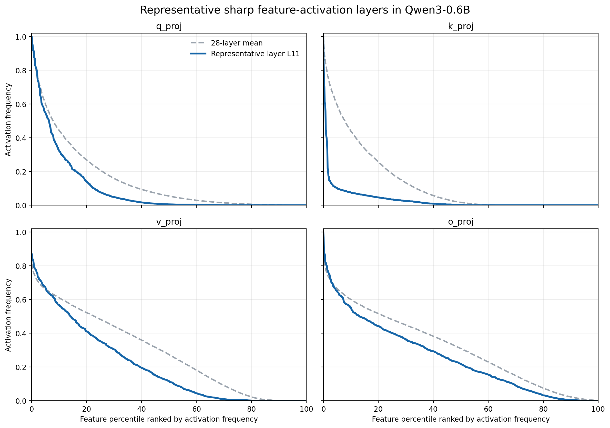
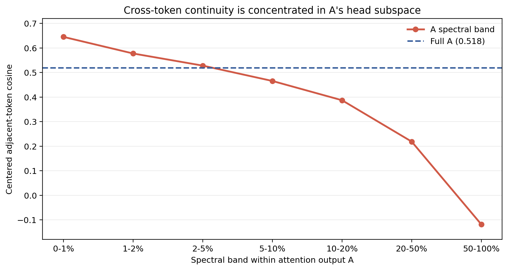
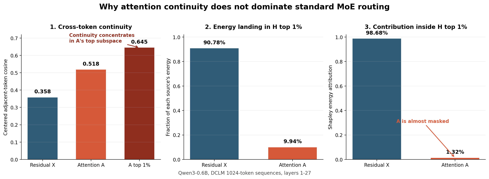
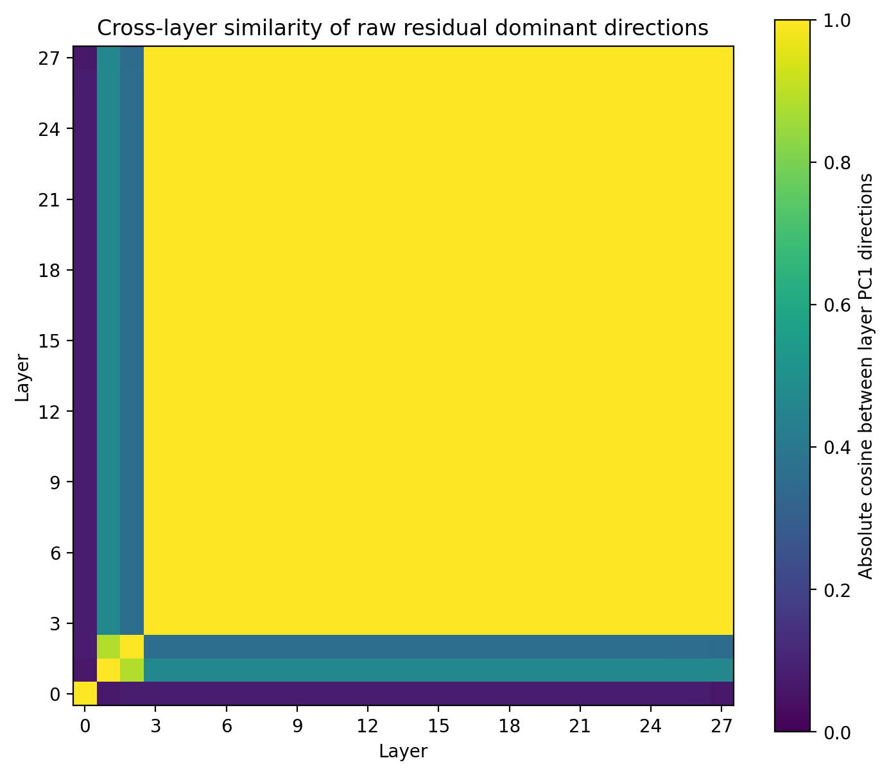
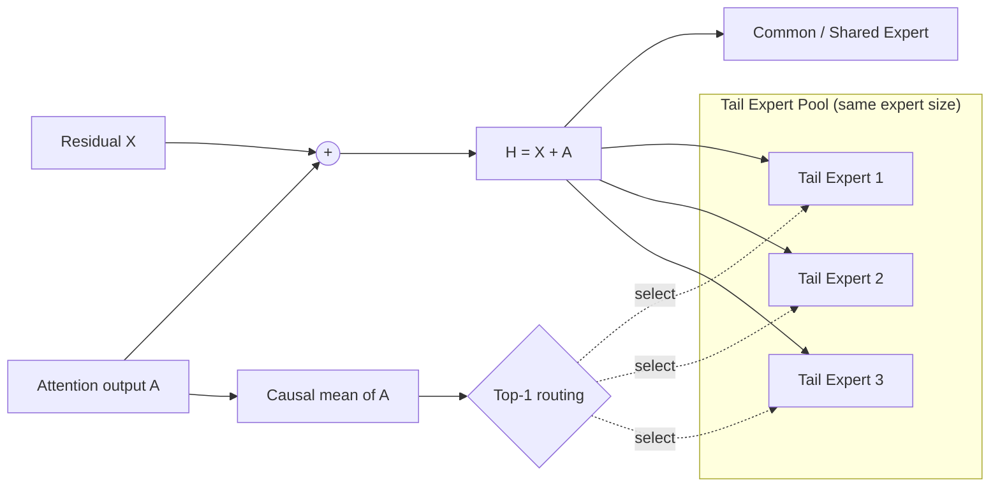
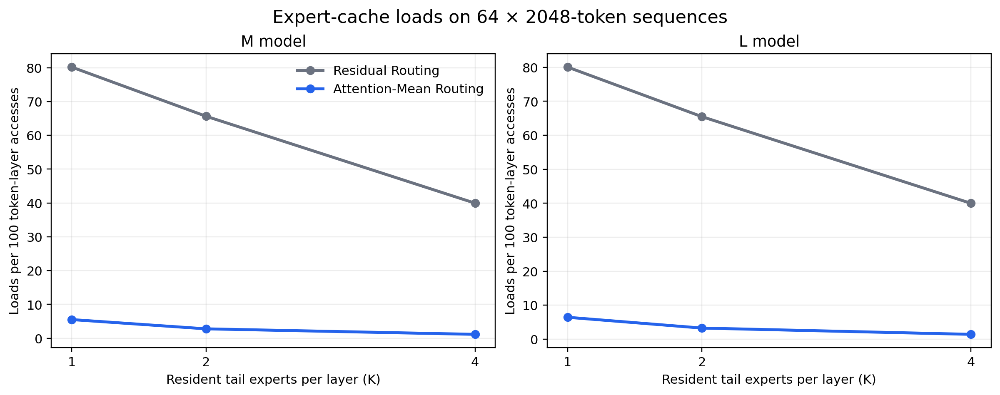
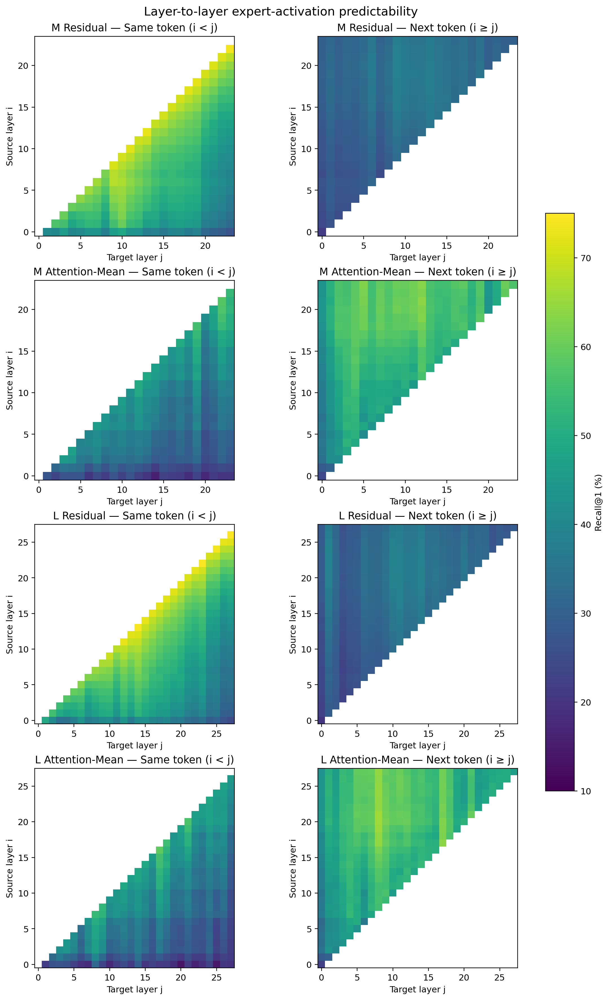

# 面向端侧部署的连续激活 MoE：多尺度能力与真实设备验证

## 摘要

本阶段完成了 Attention-Mean Routing 在两个模型尺度、长序列专家轨迹及 PPU-ZW810 真实按需加载环境下的系统验证。结果表明，本方法在基本保持下游任务能力的同时，将相邻 token 的 expert switch probability 从约 $80\%$ 降至 $5\%$--$6\%$；当每层只允许 1 个 tail expert 常驻时，每 100 次 token-layer 访问的 expert loads 相对 baseline 降低 $91.9\%$--$93.1\%$。

能力验证覆盖 M、L 两种模型尺度。M 模型训练至约 $45.09$B tokens 后，八项下游任务宏平均为 $44.64\%$，baseline 为 $44.93\%$；L 模型训练至约 $92.27$B tokens 后，宏平均为 $48.03\%$，baseline 为 $48.42\%$。两个尺度的差距分别为 $0.30$ 和 $0.38$ 个百分点，下游平均能力基本保持。

真实设备实验进一步验证了连续 routing 的部署价值。在 PPU-ZW810 上进行 batch-size-one、2048-token 自回归生成时，L 模型在每层只常驻 1 个 tail expert 的条件下达到 $21.31$ ms/token，较同预算 baseline 的 $28.02$ ms/token 降低 $23.9\%$。专家负载统计显示所有 layer-expert 均被激活，连续性并非由 routing collapse 产生；预测实验还表明，本方法将“当前 token 预测下一 token expert”的 Recall@1 从约 $32\%$ 提升至约 $52\%$。

本轮也明确了不同推理阶段的适用边界：连续 routing 对逐 token decode 的收益最直接；长序列 prefill 会在一条序列内部覆盖更多 experts，首字时延仍受动态加载总量影响。因此，当前证据已经完成“模型能力—路由健康—专家连续性—预测性—真实 decode 时延”的闭环验证，并将下一阶段的系统优化目标收敛到长序列 prefill 调度和结构算子融合。

## 1. 当前 MoE 面向端侧部署的核心问题

### 1.1 目标：以有限设备内存承载大容量 MoE

Mixture-of-Experts（MoE）通过条件激活扩大模型总容量，但端侧设备通常无法让全部 routed experts 常驻设备内存。面向 batch size $=1$ 的在线生成，一个直接的执行方式是：每层只保留当前需要的少量 experts；router 选中的 expert 若已在设备中则直接复用，否则从主存同步加载到预留显存槽位。

在不依赖预测、预取或计算—传输重叠的条件下，总推理时间可写为：

$$
T_{\mathrm{total}}
=
T_{\mathrm{compute}}
+
T_{\mathrm{load}}.
$$

设单个 expert 的参数字节数为 $S_e$、有效传输带宽为 $B_{\mathrm{io}}$，一次加载所需时间为：

$$
T_{\mathrm{load}}(e)
=
\frac{S_e}{B_{\mathrm{io}}}.
$$

端侧额外时延不仅取决于单次加载时间，还取决于单位 token 数内触发多少次加载。若相邻 token 能持续复用同一 expert，即使动态 expert 较大，平均到每个 token 上的传输开销仍可显著降低。因此，本项目将问题归纳为三个彼此关联的目标：

1. 模型能力保持：改变 routing 后，下游任务能力仍需与标准 MoE 保持在同一水平；
2. Expert activation 连续：已加载 expert 能跨多个 token 复用；
3. 路由健康：连续性来自有效的上下文分发，而非少数 experts 垄断全部 token。

### 1.2 标准 Residual Routing 的激活结构

标准 MoE 通常使用进入 FFN 的完整 post-attention residual representation 进行 routing。这一输入包含强 token identity，因此呈现两类稳定现象：

- 同一 token 的 identity 沿 residual stream 跨层继承，使同 token 的浅层表征可以较好预测深层 expert；
- 相邻 token 的 identity 快速变化，使同一层的 expert ID 频繁切换。

这种 routing 对模型训练有效，却不利于低内存部署。即使浅层能够预测同一个 token 在深层使用的 expert，下一 token 到来时仍可能需要重新加载。标准模型在本轮长序列测试中的相邻 token switch probability 稳定在约 $80\%$，说明每层只保留 1 个 expert 时，大多数 token-layer 访问都会触发新的加载。

### 1.3 Expert 大小与切换频率共同决定部署成本

门控 FFN expert 包含 gate、up 和 down projection。忽略 bias 后，单个 expert 的参数量近似为：

$$
P_{\mathrm{expert}}
\approx
3d d_{\mathrm{ff}}.
$$

当权重采用 $b_w$ bytes/parameter 时，传输大小为：

$$
S_{\mathrm{expert}}
\approx
3d d_{\mathrm{ff}}b_w.
$$

因此，部署成本由 expert size、cache budget 和 activation trace 共同决定。扩大 cache 可以减少 miss，改善 routing continuity 也可以减少 miss；二者应在真实序列和真实设备上联合验证。本轮实验报告 $K=1,2,4$ 个常驻 experts 的 trace-based cache loads 与端到端 PPU 时延。

## 2. NTP 模型表征空间的语义结构

### 2.1 分析对象：$X$、$A$ 与 $H$

将第 $l$ 层 attention 之前的累计 residual 记为 $X_t^{(l)}$，当前层不含 residual 的 attention output 记为 $A_t^{(l)}$，进入 MoE 的完整 post-attention representation 为：

$$
H_t^{(l)}
=
X_t^{(l)}
+
A_t^{(l)}.
$$

谱分析显示，三者承担不同功能：

| 表征与谱成分 | 主要语义 | 跨 token 连续性 | 同 token 跨层稳定性 |
|---|---|---:|---:|
| Residual $X$ 头部方向 | 高频 token、common pattern、持续继承的 token identity | 较弱 | 强 |
| Residual $X$ 长尾方向 | 低频 token identity 与细粒度语义差异 | 稀疏 | 随层变化 |
| Attention $A$ 头部方向 | 当前上下文中反复聚合的共享语义 | 强 | 相邻层连续 |
| Attention $A$ 长尾方向 | 经 QK 选择的细粒度信息 | 随谱位置后移而降低 | 随层变化 |
| 完整表征 $H$ 头部方向 | 以累计 residual 的高频信息为主 | 较弱 | 强 |

这一分工解释了标准 MoE 的 routing pattern：gate 读取完整 $H$ 时，优先响应 residual 中的 token identity，得到较强的同-token跨层预测性，却难以形成跨-token连续性。若 router 独立读取 $A$ 的头部连续成分，则可以使用上下文级共享语义选择 expert，同时仍让 expert 读取完整 $H$。

### 2.2 高频数据形成 common 方向，低频差异写入长尾空间

参数更新的基本形式是输出误差信号与输入 activation 的外积：

$$
\frac{\partial L}{\partial W}
=
\delta h^\top.
$$

自然语言具有 Zipf 分布。高频 token、短语和 common pattern 被反复采样，对齐梯度持续写入相似方向，优先形成大的奇异值：

$$
\text{high-frequency pattern}
\Rightarrow
\text{repeated aligned gradients}
\Rightarrow
\text{dominant spectral directions}.
$$

低频 token 同样需要复用已有 common information，因此会在头部方向上保留投影；但区分不同 long-tail patterns 的专属信息主要写入后续谱空间。二维 packed-Zipf 实验直观展示了这一竞争过程：高频 group 优先占据共享主方向，低频 groups 转向其余方向获得可分性。

真实模型也呈现相同的 head/tail activation structure：少量 feature 接近全局激活，大量 feature 只服务部分 token。

这一结构给出两个互补结论：common computation 可以由较紧凑的共享参数承载；单个 long-tail pattern 的专属写入虽然较窄，但全部 long-tail directions 的并集仍需要较大的条件参数空间。

### 2.3 Attention 头部方向产生上下文连续性

Attention output 可写为：

$$
A_t
=
W_O
\left(
\sum_{s\le t}\alpha_{t,s}V_s
\right),
\qquad
\sum_{s\le t}\alpha_{t,s}=1,
\quad
\alpha_{t,s}\ge 0.
$$

同一 sequence 内的相邻 token 共享大量历史上下文，反复聚合的语义成分集中到 $A$ 的头部谱空间；快速变化的 token-specific information 更多位于后续方向。此前在 Qwen3-0.6B、1024-token DCLM 序列上的测量显示：完整 $A$ 的 centered adjacent-token cosine 为 $0.518$，投影到 $A$ 自身 top $1\%$ 后提升至 $0.645$；该头部空间同时保持显著的句间区分性。

因此，$A$ 的头部方向是 context-level stable routing 的自然信息源。在线推理无需显式执行逐 token SVD；局部因果均值即可近似保留窗口内反复出现的主导成分。

### 2.4 连续信号在完整 $H$ 中被 Residual 头部方向掩盖

将 $A$ 自身 top $1\%$ 投影到 $H$ 的谱空间后，只有 $26.94\%$ 的能量仍落在 $H$ top $1\%$；其余 $73.06\%$ 分散到后续频段。在 $H$ top $1\%$ 内，来自 $X$ 与 $A$ 的能量占比分别为：

$$
\text{energy from }X=98.68\%,
\qquad
\text{energy from }A=1.32\%.
$$

这说明直接把 $A$ 加回 residual，并不会让其连续方向主导 $H$。标准 gate 读取完整 $H$ 时，首先响应的仍是 residual-dominated token identity。连续 routing 因而需要显式解耦：router 使用 $A$ 的连续信息，expert computation 继续读取完整 $H$。

Residual dominant direction 的跨层继承也可在真实模型中观察到。Layer 3--27 的第一主方向形成接近 $1$ 的高相似区域，解释了 baseline 的同-token跨层预测优势。

## 3. Attention-Mean Routing 方法

### 3.1 用因果局部均值近似 Attention 的连续方向

对第 $l$ 层最近 $W$ 个 token 的 attention output 计算因果均值：

$$
\mu_t^{(l)}
=
\frac{1}{n_t}
\sum_{s=\max(1,t-W+1)}^t
A_s^{(l)},
\qquad
n_t=\min(t,W).
$$

本轮使用 $W=16$。Router 根据 $\mu_t^{(l)}$ 选择一个 Top-1 tail expert：

$$
r_t^{(l)}
=
\operatorname*{argmax}_e
\left(W_r^{(l)}\mu_t^{(l)}\right)_e.
$$

被 common expert 和 tail expert 处理的输入仍是完整 post-attention representation：

$$
H_t^{(l)}=X_t^{(l)}+A_t^{(l)}.
$$

因此，$A$ 决定“使用哪个 tail expert”，完整 $H$ 决定“expert 实际计算什么”。Long-tail token 仍能读取 token identity、上下文和全部 residual information，并能够向完整输出空间写入信息。

### 3.2 本轮受控结构与最终目标结构

本轮模型每层包含一个 always-on common expert 和 8 个 routed tail experts：

$$
Y_t^{(l)}
=
C^{(l)}\!\left(H_t^{(l)}\right)
+
E_{r_t^{(l)}}^{(l)}\!\left(H_t^{(l)}\right).
$$

Baseline 与 Attention-Mean Routing 使用相同的 common/tail intermediate size、总参数量和每 token 激活容量，唯一核心变量是 router input。该设计使本轮实验能够直接回答：将 routing signal 从完整 residual 改为 attention causal mean，是否能够在保持模型能力的同时产生稳定 expert activation。

本轮采用受控的等尺寸 expert 结构：common expert 与 8 个 tail experts 具有相同 intermediate size。Common expert 对所有 token 激活，tail expert 由 Attention-Mean Router 进行 Top-1 选择；二者均读取完整表征 $H$。该结构只改变 routing signal，不改变 expert 容量或输出空间。

因此，本轮 Baseline 与 Attention-Mean Routing 的 common/tail expert 形状、总参数量和单 token 激活容量完全对齐，实验差异仅来自 router 读取的表征不同。

## 4. 多尺度与真实设备实验结果

### 4.1 实验设置与证据范围

本轮同时测试 M、L 两种模型尺度。每个尺度均包含 residual-routing baseline 和 Attention-Mean Routing，二者在同尺度内使用相同训练配置与共同 checkpoint。

| 设置 | M | L |
|---|---:|---:|
| 总参数量 | 约 0.966B | 约 1.917B |
| Transformer 层数 | 24 | 28 |
| Hidden size | 768 | 1024 |
| Query heads / KV heads | 12 / 6 | 16 / 8 |
| Head dimension | 128 | 128 |
| 每层 tail experts | 8 | 8 |
| 每 token 激活 tail experts | 1 | 1 |
| Common / tail intermediate size | 1536 / 1536 | 2048 / 2048 |
| 单 token 激活的 Transformer-body 参数 | 约 0.255B | 约 0.55B（计算主体口径） |
| Sequence length | 1024 | 1024 |
| Global batch | 256 sequences | 256 sequences |
| Tokens / optimizer step | 262,144 | 262,144 |
| 最新共同 checkpoint | 172k | 352k |
| 最新 checkpoint 训练 tokens | 约 45.09B | 约 92.27B |
| Router window | 16 | 16 |
| Precision | BF16 | BF16 |

实验按以下问题组织：

1. 八项下游任务：最新模型的具体能力差异；
2. Expert load：连续性是否来自 routing collapse；
3. 长序列 continuity：不同 memory budget 下需要加载多少次；
4. Expert predictability：连续 routing 是否产生可用于预取的信号；
5. PPU 实测：连续性是否转化为 decode 与首字时延收益。

### 4.3 最新 checkpoint 的下游任务能力

最新 checkpoint 在 ARC-Challenge、ARC-Easy、HellaSwag、LAMBADA OpenAI、PIQA、SIQA、RACE 和 WinoGrande 八项任务上进行统一 0-shot evaluation。

| Task | M Baseline | M Ours | M 差值 | L Baseline | L Ours | L 差值 |
|---|---:|---:|---:|---:|---:|---:|
| ARC-Challenge | 25.68% | 24.83% | -0.85 pp | 26.96% | **28.92%** | +1.96 pp |
| ARC-Easy | 46.30% | **48.27%** | +1.98 pp | 53.20% | **55.22%** | +2.02 pp |
| HellaSwag | 38.77% | 37.07% | -1.69 pp | 45.88% | 44.42% | -1.45 pp |
| LAMBADA OpenAI | 42.32% | 39.67% | -2.66 pp | 48.96% | 45.92% | -3.05 pp |
| PIQA | 67.03% | **67.52%** | +0.49 pp | 69.53% | **69.64%** | +0.11 pp |
| SIQA | 39.41% | 38.43% | -0.97 pp | 40.53% | 39.97% | -0.56 pp |
| RACE | 50.06% | 50.06% | +0.00 pp | 50.57% | 50.12% | -0.45 pp |
| WinoGrande | 49.88% | **51.22%** | +1.34 pp | **51.70%** | 50.04% | -1.66 pp |
| **Macro average** | **44.93%** | 44.64% | **-0.30 pp** | **48.42%** | 48.03% | **-0.38 pp** |

M 与 L 最新模型的宏平均差分别为 $0.30$ 和 $0.38$ 个百分点。不同任务上存在正负波动，但总体差距稳定处于亚百分点范围，下游平均能力基本保持。

### 4.4 Expert 负载健康：连续性并非 Routing Collapse

Expert load 使用 64 条、每条 2048 tokens 的固定自然语言序列统计，共覆盖 M 的 24 层和 L 的 28 层。下表对每个 expert 在全部层上的 activation share 取平均；每一行之和为 $100\%$。

| Size | Method | Expert 0 | Expert 1 | Expert 2 | Expert 3 | Expert 4 | Expert 5 | Expert 6 | Expert 7 |
|---|---|---:|---:|---:|---:|---:|---:|---:|---:|
| M | Baseline | 13.18% | 12.73% | 12.90% | 11.70% | 11.78% | 13.15% | 12.11% | 12.45% |
| M | Attention-Mean Routing | 14.05% | 11.41% | 13.62% | 12.10% | 12.46% | 12.73% | 11.97% | 11.66% |
| L | Baseline | 12.08% | 12.92% | 11.94% | 12.44% | 12.72% | 12.92% | 13.11% | 11.88% |
| L | Attention-Mean Routing | 12.92% | 11.19% | 14.50% | 11.26% | 12.12% | 11.57% | 13.51% | 12.92% |

Attention-Mean Routing 的跨层平均 expert share 位于 $11.19\%$--$14.50\%$，与理想均匀负载 $12.5\%$ 接近；四个模型均不存在 zero-load layer-expert。该结果表明，本方法的高连续性来自上下文相关 routing，而非少数 experts 垄断全部 token。

### 4.5 长序列连续性：不同 Memory Budget 下均显著减少加载

对同一批 64×2048-token 路由轨迹，分别模拟每层允许 $K=1,2,4$ 个 tail experts 常驻，并采用 LRU replacement。指标为每 100 次 token-layer expert access 触发的加载次数，其中包含每条序列开始时从空 cache 首次装入 expert 的 cold-start loads。

| Size | Method | Switch probability | K=1 loads/100 | K=2 | K=4 |
|---|---|---:|---:|---:|---:|
| M | Baseline | 80.16% | 80.17 | 65.63 | 39.94 |
| M | Attention-Mean Routing | **5.48%** | **5.53** | **2.79** | **1.16** |
| L | Baseline | 80.07% | 80.08 | 65.48 | 39.98 |
| L | Attention-Mean Routing | **6.40%** | **6.45** | **3.27** | **1.42** |

当 $K=1$ 时，M 与 L 的 loads 分别降低 $93.1\%$ 和 $91.9\%$；当 $K=2$ 时降低 $95.8\%$ 和 $95.0\%$；当 $K=4$ 时降低 $97.1\%$ 和 $96.4\%$。这说明本方法不只产生较长的相同-expert run，还使有限工作集能够被 2--4 个显存槽位有效覆盖。端侧设备若能为每层增加少量 expert cache，动态加载次数将进一步降至每 100 token-layer 约 1--3 次。

### 4.6 Expert Activation 可预测性

使用线性 predictor 测试两类任务：

1. 同一 token 的第 $i$ 层表征预测第 $j$ 层 expert，$i<j$；
2. 当前 token 第 $i$ 层表征预测下一 token 第 $j$ 层 expert，$i\ge j$。

由于当前模型为 Top-1 routing，Recall@$K$ 表示真实 expert 是否位于 predictor 给出的前 $K$ 个候选中。

下图给出 Recall@1 的逐层热力图。横轴为目标层 $j$，纵轴为 predictor 所读取的源层 $i$；左列对应同一 token 的 $i<j$，右列对应当前 token 预测下一 token 的 $i\ge j$。空白区域表示不属于对应任务定义的层对。

| Size | Method | Same-token R@1 | R@2 | R@4 | Next-token R@1 | R@2 | R@4 |
|---|---|---:|---:|---:|---:|---:|---:|
| M | Baseline | **53.73%** | **67.50%** | **82.81%** | 32.10% | 49.65% | 72.90% |
| M | Attention-Mean Routing | 36.47% | 54.17% | 75.54% | **52.30%** | **70.42%** | **87.06%** |
| L | Baseline | **52.02%** | **66.16%** | **82.10%** | 31.93% | 49.24% | 72.41% |
| L | Attention-Mean Routing | 36.19% | 53.00% | 74.23% | **52.25%** | **69.61%** | **86.04%** |

结果与第 2 章的语义解释一致：baseline 的 residual identity 跨层继承，因此同-token跨层预测更强；Attention-Mean Routing 使用上下文连续信号，使“当前 token 预测下一 token”显著更强。两种尺度下，Next-token Recall@1 均从约 $32\%$ 提升至约 $52\%$，Recall@4 达到 $86\%$--$87\%$。这一性质为后续在计算当前 token 时预取下一 token 候选 experts 提供了直接基础。

### 4.7 PPU-ZW810 真实按需加载时延

时延实验将 tail expert 权重固定在 pinned host memory，并在 GPU/PPU 上为每层建立 $K$ 个物理 expert slots。发生 cache miss 时，同步执行真实 host-to-device 权重复制并更新逻辑—物理 expert 映射；没有 expert predictor、prefetch 或计算—传输 overlap。

#### 4.7.1 2048-token 自回归 Decode

32-token prompt 完成后，使用 KV cache 自回归生成 2048 tokens，报告稳态 ms/token。作为基准对比，两类 M 模型的运行时延为 16.99ms/token，L 模型为 20.35ms/token。

| Size | Method | K=1 | K=2 | K=4 |
|---|---|---:|---:|---:|
| M | Baseline | 19.30 | 19.86 | 18.40 |
| M | Attention-Mean Routing | **18.44** | **18.36** | **18.21** |
| L | Baseline | 28.02 | 26.96 | 24.22 |
| L | Attention-Mean Routing | **21.31** | **20.82** | **21.37** |

在相同 $K=1$ 预算下，M 的 decode latency 降低 $4.5\%$，L 降低 $23.9\%$。在 $K=2$ 和 $K=4$ 下，L 模型仍分别降低 $22.8\%$ 和 $11.8\%$。这表明在动态 expert 较大的 L 模型上，routing continuity 能够在不同有限内存预算下稳定转化为真实设备收益。

#### 4.7.2 2048-token Prefill 与首字时延

TTFT 从 prompt 开始传入设备计时，覆盖完整 causal prefill 和首个输出 logits。下表报告 runtime 与 expert cache 已经过同一 prompt 预热后的结果；tokenization 和 checkpoint 初始化不计入时延。

| Size | Method | K=1 | K=2 | K=4 |
|---|---|---:|---:|---:|
| M | Baseline | 111.8 ms | 102.3 ms | 110.2 ms |
| M | Attention-Mean Routing | **100.1 ms** | **98.0 ms** | **97.6 ms** |
| L | Baseline | 152.7 ms | 155.7 ms | 162.9 ms |
| L | Attention-Mean Routing | **150.5 ms** | **150.4 ms** | **145.5 ms** |

在相同有限预算下，本方法仍具有优势：M 在 $K=1$ 和 $K=4$ 时分别降低 $10.4\%$ 和 $11.4\%$，L 分别降低 $1.4\%$ 和 $10.7\%$。但 prefill 会同时处理整段序列，序列内不同 token 合起来会覆盖更多 experts。2048-token prompt 中，baseline 在 M/L 上分别覆盖约 192/224 个 layer-expert；本方法在 $K=1$ 下仍覆盖约 159/188 个。因此，prefill 仍需进一步结合 expert grouping、异步加载和算子融合优化。

这一结果明确区分了两个系统阶段：逐 token decode 直接受相邻 token continuity 支配，是本方法最显著的收益场景；prefill 的关键变量是整段 prompt 在每层覆盖的 expert working set，需要进一步结合 expert grouping、异步搬运和算子融合优化。首个 32-token cold-cache 测量包含一次性 kernel warm-up，不纳入正式结论。

### 4.8 本轮结论

本轮实验形成了从模型能力到设备收益的完整证据链：

1. **下游任务能力基本保持。** M、L 最新 checkpoint 的八项任务宏平均分别仅相差 $0.30$ 和 $0.38$ 个百分点。
2. **路由健康。** M、L 的全部 layer-expert 均被激活，连续性不依赖 expert collapse。
3. **连续性跨尺度成立。** Switch probability 从约 $80\%$ 降至 $5\%$--$6\%$；$K=1$ 时真实 trace loads 降低 $91.9\%$--$93.1\%$。
4. **下一 token 更可预测。** Next-token Recall@1 从约 $32\%$ 提升至约 $52\%$，Recall@4 达到 $86\%$--$87\%$。
5. **真实 decode 收益成立。** PPU-ZW810 上，L 模型 $K=1$ decode latency 较同预算 baseline 降低 $23.9\%$。
6. **Prefill 边界已明确。** 长 prompt 内会覆盖更多 experts；后续系统优化应针对 prefill working set、异步加载及 routing/constraint 算子融合。

这些结果表明，Attention-Mean Routing 在两个模型尺度、约 $45$B--$92$B 训练 tokens、多个 memory budgets 和真实按需加载系统上均保持一致效果，已经具备作为端侧 MoE 动态参数管理基础机制的实验依据。
