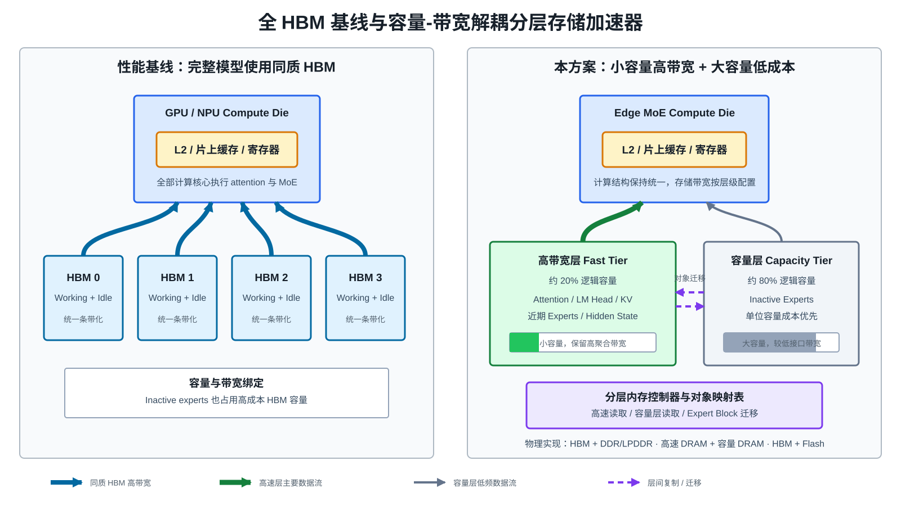
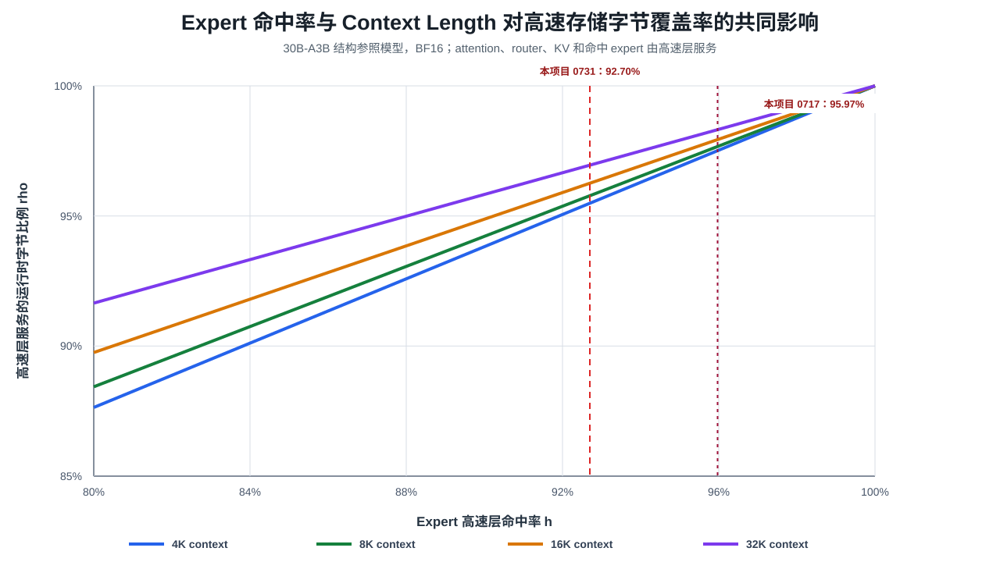

# 面向端侧 MoE 解码的小容量高速与大容量低速分层存储加速器架构、执行方法及芯片

> 文档性质：三阶段专利初步 proposal / 技术交底前置材料
>
> 版本日期：2026-08-18
>
> 状态：供项目组、甲方芯片团队和专利代理人讨论，尚非正式权利要求书
>
> 建议英文标题：**A Hierarchical-Memory Accelerator Architecture, Execution Method, and Chip with Small High-Bandwidth and Large Capacity-Oriented Memory for Edge MoE Decoding**

## 摘要

本 proposal 面向手机、车机、个人电脑和嵌入式设备上的大规模 MoE 模型 batch size = 1 自回归推理。受成本、封装和功耗约束，现有主流端侧神经网络计算单元通常采用片上 SRAM/TCM 与大容量 DDR/LPDDR 组合；近期也出现了配置数 GB 高带宽堆叠 DRAM 的端侧大模型协处理器，但其高速容量难以独立承载更大的 MoE 模型。

标准 MoE 虽然每个 token 只激活少量 experts，但相邻 token 的 expert 身份频繁切换，瞬时稀疏访问不等于可由小容量高速存储长期承载。本项目的连续性增强路由算法改变了参数访问序列的时间局部性，使近期激活 experts 能够跨 token 持续复用。由此，端侧 MoE decode 形成如下容量与流量不对称：

1. **Working set**：约占运行容量的 $20\%$，包括持续访问的 attention/dense 权重、输出头、历史 KV Cache 和近期激活 experts；
2. **Idle set**：约占运行容量的 $80\%$，主要包括当前不活跃的 experts；
3. 在本项目测得的 $92.70\%$ expert 驻留命中率代理工作点下，working set 可服务约 $95.49\%$--$96.95\%$ 的当前读取字节。

基于该算法创造的 workload 特性，本方案在同一端侧神经网络计算系统中配置：

1. **小容量高带宽层（fast tier）**：承载 working set 和绝大部分运行时读取流量；
2. **大容量低带宽层（capacity tier）**：以较低单位容量成本承载其余 inactive parameters；
3. **分层控制与迁移路径**：根据 expert 驻留状态选择高速读取、容量层读取或层间迁移。

该架构不是为完整模型配置昂贵高速内存，而是只为高流量 working set 支付高带宽成本。以 Qwen3-30B-A3B 为例，在 BF16、每层为 top-8 激活预留 16 个高速 expert slots 的配置下，4K 和 32K context 对应的高速层容量比例约为 $16.4\%$ 和 $20.1\%$。在本文的一阶峰值带宽与端到端时延模型中，采用约 $20\%$ 高速容量、3.6 TB/s 高速层和 546 GB/s 容量层，相对于全容量均使用 546 GB/s 内存的端侧基线，预计可获得约 $3.4$--$3.5$ 倍端到端加速；相对于全容量高速存储的性能上限，时延仅增加约 $8.5\%$--$12.6\%$。当高速与容量型内存单位容量价格比为 2--4 时，分层方案的存储介质成本相对全容量低速内存增加约 $20\%$--$60\%$，但显著低于全容量高速内存；该增量只作用于内存子系统，并不等同于计算芯片、模组或整机成本同比增加。

---

## 1. 问题动机

### 1.1 目标场景与 workload 分类

本方案面向大规模 MoE 模型在手机、车机和个人电脑等边缘设备上的 batch-1 自回归解码。一次 token 前向中，数据具有如下分化：

| Workload 集合 | 典型内容 | 当前访问特征 | 容量特征 |
|---|---|---|---|
| Working set | attention/dense 权重、输出头、历史 KV Cache、近期激活 experts | 当前 token 必须读取或持续复用 | 远小于完整模型，但明显大于片上 SRAM/L2 |
| Idle set | 当前未激活 experts | 当前 token 不产生读取流量 | 占据完整模型的大部分容量 |
| 小状态 | 当前 token、hidden state、query、新增 KV、路由结果、中间向量 | 当前必须处理 | 字节数很小，存放在高速层 |

标准 MoE 已具有“每个 token 只激活少量 experts”的瞬时稀疏性，但标准 residual routing 下相邻 token 的 expert 身份频繁变化，瞬时 active set 不一定能够驻留在有限高速容量中。本项目的算法创新进一步把瞬时稀疏性转化为跨 token 的时间局部性：近期 active experts 在连续 token 间保持较高复用概率，由此形成可由高速层持续承载的 working set。

因此，系统设计应分别考虑两个比例：

$$
f
=
\frac{C_{\text{fast}}}{C_{\text{model}}+C_{\text{KV}}},
$$

$$
\rho
=
\frac{D_{\text{fast}}}{D_{\text{req}}}.
$$

其中 $f$ 是高速层容量比例，$\rho$ 是当前前向请求中由高速层服务的字节比例。端侧 MoE 的有利区域是：

$$
f \ll 1,
\qquad
\rho \approx 1.
$$

这意味着少量高速容量可以覆盖绝大部分运行时流量。本文所称“约 $20\%$ 容量承担约 $96\%$ 流量”是动态 working set 的容量—字节覆盖关系，不表示长期固定的少数 experts 永久热门；高速层内的具体 expert 身份可以随上下文变化。

### 1.2 现有端侧存储选择与成本约束

现有主流手机、车载和嵌入式神经网络计算单元通常采用片上寄存器、SRAM/TCM、L2/System Cache 与大容量 DDR/LPDDR 的组合。DDR/LPDDR 具有成熟的供应链、较低的单位容量成本和适合端侧的功耗及封装形态，因此能够以可接受的整机成本提供较大模型容量；但 batch-1 LLM decode 需要为每个 token 流式读取大量权重，外部内存带宽会直接限制解码速度。

近期也出现了内置数 GB 高带宽堆叠 DRAM 的端侧大模型协处理器。这类产品证明了 GB 级高速存储可以在端侧功耗和形态下实现，但其高速容量通常只能完整承载较小模型；当模型容量超过该高速存储时，仍需要大容量后备存储及有效的分层访问机制。

因此，现有端侧产品面临两种典型选择：

1. **大容量低带宽内存**：模型容量充足、单位容量成本低，但大模型 decode 容易受带宽限制；
2. **小容量高带宽内存**：可显著提高能装入其中的模型或参数块的供数速度，但难以单独承载更大的 MoE 总参数。

为完整模型配置同一等级的高带宽存储在技术上可以实现，但会使大量当前不活跃的 experts 也占用昂贵高速容量，并增加存储介质、控制器和封装成本。端侧整机对成本和功耗更敏感，过去的 CNN 等 workload 又可通过片上缓存、切块和数据复用降低外部带宽压力，因此缺少为完整模型配置高速存储的经济动机。

本项目的连续性增强路由改变了这一设计条件。由此得到本方案的硬件问题：

> 如何利用算法形成的“小容量、高流量覆盖率”working set，只为少量高频访问容量配置高带宽存储，同时以低成本大容量存储承载其余 inactive parameters，从而以有限的内存子系统和整机成本增量，获得显著高于全低速内存端侧基线的解码速度。

本文后续以“完整模型全部位于容量型 DDR/LPDDR”作为端侧产品性能基线，以“完整模型全部位于同质高带宽存储”作为性能上限，并将本方案置于两者之间比较。

### 1.3 连续激活提高高速层命中率

设 $h$ 为当前 token 激活的 expert 权重已经位于高速层的字节比例：

$$
D_{\text{expert,fast}}
=
hD_{\text{expert,active}},
\qquad
D_{\text{expert,capacity}}
=
(1-h)D_{\text{expert,active}}.
$$

连续性增强路由使相邻 token 更可能复用同一组 experts。active expert 进入高速层后可以连续服务多个 token，inactive expert 可以持续留在容量层。该性质降低高速层所需的 expert slot 数量、容量层服务的运行时字节以及两层之间的平均迁移字节。

本项目实验中，连续性增强路由将相邻 token 的 expert stay probability 提高至 $92.70\%$。编译期 profile、频率统计和替换策略可以辅助决定初始放置与具体替换顺序，但对于长期负载较均衡的 MoE，静态频率本身不能替代跨 token 连续性。算法产生时间局部性，硬件则通过两类存储资源、对象映射和数据通路把该局部性转化为速度收益。

---

## 2. 现有方案及其痛点

### 2.1 主流端侧 NPU：片上局部存储与大容量 DDR/LPDDR

手机、车载和嵌入式 NPU 的计算阵列内部通常配置寄存器、L1/TCM、局部 SRAM，并通过 L2/System Cache 访问共享 DDR/LPDDR。片上局部存储带宽高，但容量通常为 MB 级，远小于跨全部 Transformer 层的 expert working set 和长上下文 KV Cache；大容量 DDR/LPDDR 能够承载模型，但 batch-1 LLM decode 的权重流式读取容易受到外部带宽限制。

典型公开实现包括：

- Qualcomm Snapdragon Ride：处理器和 NPU 具有局部 L1/TCM、L2 SRAM 与共享 system cache，全部处理单元最终访问共享 LPDDR5；
- NVIDIA Jetson AGX Orin：32/64 GB LPDDR5，公开带宽 204.8 GB/s；
- NVIDIA Jetson Thor：64/128 GB LPDDR5X，公开带宽 273 GB/s；
- Apple M4 Max：最高 128 GB 统一内存，公开带宽最高 546 GB/s；
- 地平线征程 6：多通道 LPDDR5，并使用 L2M 缓解多核并发下的 DDR 带宽争用。

这些系统说明端侧 DDR/LPDDR 带宽存在较大跨度，不应简单等同于“低性能内存”；本方案中的“低带宽层”是相对于另设的高速层而言，其主要目标是以较低单位容量成本保存完整模型。

参考：

- [Qualcomm Snapdragon Ride Memory Architecture](https://www.qualcomm.com/content/dam/qcomm-martech/dm-assets/documents/Efficient-Heterogeneous-Compute-Architecture-for-ADAS-ECUs.pdf)
- [NVIDIA Jetson AGX Orin](https://www.nvidia.com/en-us/autonomous-machines/embedded-systems/jetson-orin/)
- [NVIDIA Embedded Systems](https://www.nvidia.com/en-us/autonomous-machines/embedded-systems/)
- [Apple M4 Pro and M4 Max](https://www.apple.com/newsroom/2024/10/apple-introduces-m4-pro-and-m4-max/)

### 2.2 新兴端侧方案：小容量高带宽堆叠 DRAM

瑞芯微 RK182X 等端侧大模型协处理器已经采用 3D 堆叠方式，将 2.5 GB 或 5 GB 高带宽 DRAM 与计算芯片集成，官方公开带宽为数百 GB/s，并面向 3B/7B 模型。这证明小容量高带宽存储能够在端侧形态下实现，同时也暴露了容量边界：当目标模型大于本地高速 DRAM 时，需要经过外部接口访问主存，单一小容量高速存储无法独立承载更大的 MoE 模型。

本方案与其差异在于：高速层不是完整模型唯一的权重存储，而是与大容量低成本层共同组成同一 MoE 执行系统；算法产生的稳定 working set 决定高速层的容量需求和流量覆盖率。

参考：[瑞芯微 RK182X 系列](https://www.rock-chips.com/a/cn/product/RK18xilie/2025/1114/2113.html)。

### 2.3 全容量高带宽存储

NVIDIA GPU、Google TPU 及部分高性能推理加速器采用 HBM 等高带宽存储，为完整模型容量配置相同等级的接口带宽。该结构适合训练、大 batch 和多请求并发，也构成 batch-1 decode 的性能上限。但用于成本敏感的端侧专用芯片时，大量 inactive experts 会占用同等级高速容量，存储介质、控制器和封装成本随完整模型容量增长。

本方案不限定高速层必须采用 HBM。HBM、定制高带宽堆叠 DRAM、宽接口 DRAM 或其他可提供目标带宽的存储均可作为实施方式；核心是只为动态 working set 配置高速容量。

### 2.4 异构存储与权重流式执行基础

现有系统已经证明多级存储可以共同承载大型模型：

- Cerebras WSE-3 在晶圆上分布 44 GB SRAM 和计算核心，MemoryX 使用外部 DRAM 与 Flash 保存大规模参数并按层流入计算晶圆；
- GPU/CPU 系统已经支持 HBM、DDR/LPDDR、CXL memory 和 SSD 等多层容量；
- JEDEC 已于 2026 年发布 SPHBM4 标准，使用与 HBM4 相同的 DRAM stacks 和不同的接口 base die，使其能够连接标准有机基板，说明 DRAM stack、主机接口和封装形态可以分别设计；
- 现有 hot expert buffer、模型 offload 和 tiered memory 方案说明了参数放置与迁移的可实现性。

参考：

- [Cerebras WSE-3](https://www.cerebras.ai/press-release/cerebras-announces-third-generation-wafer-scale-engine)
- [Cerebras MemoryX](https://www.cerebras.ai/blog/cerebras-cs-3-vs-nvidia-b200-2024-ai-accelerators-compared)
- [JEDEC SPHBM4 JESD330-4](https://www.jedec.org/standards-documents/docs/jesd330-4)

因此，多级存储本身不是本方案的唯一创新点。本方案进一步把连续性增强路由产生的时间局部性、working set 容量比例、运行时字节覆盖率和端侧内存成本联系起来，使小容量高速层能够以有限容量稳定服务绝大部分 MoE decode 流量。

---

## 3. 方案详情

### 3.1 总体架构

本方案至少包含：

1. **计算核心阵列**：执行 attention、router、expert GEMV、逐元素算子和输出头；
2. **高带宽层（fast tier）**：较小容量、较高聚合带宽，保存 working set；
3. **容量层（capacity tier）**：较大容量、较低单位容量成本和较低聚合带宽，保存 idle set；
4. **层间复制/迁移引擎**：按 expert block、权重页或 KV page 在两类存储之间传输数据。

高带宽层与容量层均位于同一端侧推理设备的可访问存储系统中。两类存储可以处于同一封装，也可以由封装内存与板级/设备内存组合实现。

### 3.2 高带宽层

高带宽层保存每个 token 持续产生主要读取流量的数据，例如：

- 全部 attention/dense 权重和 router；
- 输出 LM head；
- 历史 KV Cache；
- 每层近期激活的 expert slots；
- 当前 token、hidden state、query、路由结果和中间向量；
- 必要的量化 scale、索引和元数据。

高带宽层的设计目标是**只为 working set 配置显著高于容量层的供数带宽**。一种实现方式是使用低容量高带宽堆叠 DRAM；另一种实现方式是保持多个宽接口或 memory channels，同时减少每个高速 stack 背后的 DRAM 层数或容量密度。这样，高速层容量下降时，聚合带宽不必按容量同比下降。高速层不限定采用 HBM 标准，目标带宽、容量和封装形式可根据手机、车机、个人电脑或嵌入式模组的成本及功耗约束选择。

高速层中的 expert 可以跨全部高速 channels 条带化，使单个 batch-1 expert GEMV 仍能使用聚合存储带宽和全部计算核心。

### 3.3 容量层

容量层保存：

- 当前未激活 experts；
- 可选的高速层对象后备副本或可恢复镜像；
- 尚未进入当前上下文 working set 的模型块。

在以最低介质容量和成本为目标的实施例中，同一 expert 的主副本在高速层和容量层之间迁移，不要求容量层同时保存高速层对象的完整重复副本；在以可靠性、快速恢复或只读映射为目标的实施例中，容量层可以保留后备副本。后续成本模型默认两层容量互补、不重复计算后备副本。

容量层优先优化每 GB 成本、容量密度和静态功耗。其接口带宽低于高速层。容量层中的对象发生访问时，可以：

1. 经容量层控制器直接送入计算阵列；
2. 先进入高速层或 staging buffer，再送入计算阵列；
3. 在后续 token 需要持续复用时迁入高速层。

容量层采用 Flash 时，数据需要经过 DRAM/SRAM staging buffer，迁移粒度按 Flash page、压缩 expert block或连续权重块组织。

### 3.4 软件可见接口

硬件可以向软件暴露：

- `FAST_TIER_MEMORY`：高带宽、小容量地址空间；
- `CAPACITY_TIER_MEMORY`：低成本、大容量地址空间；
- 统一虚拟地址与页属性：由页表或对象描述符标记当前物理层级；
- 复制命令：以 expert、权重页或 KV page 为单位执行层间复制；
- 查询命令：返回对象驻留层级、命中状态和迁移状态。

模型加载器可在初始化时完成静态放置：attention/dense 权重、输出头和 KV 预留进入高速层，inactive experts 进入容量层，并在高速层为每层预留若干 expert slots。

### 3.5 物理实施形态

| 实施形态 | 高带宽层 | 容量层 | 主要取舍 |
|---|---|---|---|
| A | 低容量高带宽堆叠 DRAM | DDR 或 LPDDR | 面向端侧形态，只为 working set 配置高带宽 |
| B | 保留宽接口数量的浅层/低容量 HBM | DDR 或 LPDDR | 接近全容量高速存储的带宽上限，但封装与容量粒度要求较高 |
| C | HBM 或高速 DRAM | NAND Flash/UFS/NVMe | 容量成本最低，miss 时延高，要求极高字节命中率 |
| D | SRAM scratchpad + 高速 DRAM | 容量 DRAM + Flash | 三级结构，分别承载当前矩阵块、working set 和长期 idle set |

低容量高带宽堆叠 DRAM 已有端侧协处理器产品作为工程可行性参考。“浅层 HBM”表示减少高速 stack 的容量，同时保留较宽外部接口和 channel 数量；该实现需要存储厂商提供合适的 stack height、die density 或定制 base die，属于更高带宽的可选实施方式，而非本方案成立的必要条件。

### 3.6 硬件执行流程

对每个 decode token：

1. 计算核心从高速层读取 attention/dense 权重和历史 KV，生成 attention 输出并写入新增 KV；
2. 连续性增强 router 根据当前上下文状态产生 expert ids，映射表查询各 expert 所在层级；
3. 高速命中的 experts 直接由高速层向计算阵列供数；
4. 容量层命中的 experts 经容量接口直接供数或进入 staging buffer；
5. 计算核心完成 expert GEMV、聚合和残差计算；
6. 对预计继续使用的 expert，复制引擎可以将其保留或迁入高速层；
7. 层输出写回高速层中的下一层输入地址，并进入下一层。

---

## 4. 实施例：一个 Token 的四阶段前向过程

| 阶段 | 主要动作 | 大状态流向 | 小状态流向 |
|---|---|---|---|
| 1. Attention 与 KV 更新 | 计算当前 token 的 Q/K/V 和 attention 输出 | attention 权重与历史 KV 从高速层进入计算阵列；新增 K/V 写入高速层 | hidden state 从高速层进入计算核心的现有局部存储，query 等结果按正常算子数据流产生 |
| 2. MoE 路由与层级命中 | 产生 expert ids 并查询存储位置 | 命中高速层时直接进入计算；命中容量层时发起低速读取或迁移 | 路由结果和对象描述符在控制通路中传递 |
| 3. MoE Expert 计算 | 计算被选 experts 并聚合输出 | expert 权重从对应存储层进入计算阵列，高速层承担绝大部分字节 | hidden state 沿计算核心的现有数据通路参与各 expert 计算 |
| 4. 状态保持与下一层推进 | 形成下一层输入并更新驻留状态 | KV 与高频 experts 保持在高速层，inactive experts 留在容量层 | 层输出写回高速层，作为下一层 hidden state |

### 4.1 阶段一：Attention 计算与 KV 更新

当前 hidden state 保存在高速层。执行本层时，hidden state 和该层 attention 权重从高速层进入计算核心，生成 query、key 和 value。新 key/value 写入高速层中的 KV Cache；历史 KV 从高速层送入 attention 计算单元，形成当前 attention 输出。

### 4.2 阶段二：MoE 路由与层级命中

router 产生当前层的 expert ids。分层内存控制器查询 expert 描述符：

- **高速命中**：expert 权重已经位于高速层，直接向计算阵列发出读取请求；
- **容量层命中**：容量层控制器读取对应 expert block。该 block 可以直接服务当前计算，也可以进入 staging buffer，并在后续需要持续复用时迁入高速层。

连续性增强路由使多数 token 复用已有高速层 expert slots，从而使容量层承担较大的静态容量，但只承担较少的运行时字节。

### 4.3 阶段三：MoE Expert 计算

hidden state 沿计算核心已有的寄存器、L1、共享存储或其他局部数据通路参与计算。expert 权重按高速层或容量层的实际带宽顺序到达计算阵列，随后执行 gate/up/down projections 和 expert 输出聚合。计算核心、kernel launch 和算术操作与全容量低带宽基线及全容量高速性能上限相同，差异来自两类存储服务当前请求字节的时间。

### 4.4 阶段四：状态保持与下一层推进

MoE 输出经过残差连接和归一化后形成下一层 hidden state，并写回高速层中的下一层输入地址。新增 KV、attention/dense 权重和近期 expert working set 保持在高速层。其余 inactive experts 保留在容量层。

该四阶段过程逐层重复，直至输出头产生下一个 token。

---

## 5. 理论性能、容量比例与成本估算

### 5.1 时延模型

设全容量高速存储性能上限的聚合有效带宽为 $B_{\text{fast}}$，当前层实际读取字节数为 $D_{\text{req}}$：

$$
T_{\text{all-fast}}
\approx
\frac{D_{\text{req}}}{B_{\text{fast}}}
+
T_{\text{compute}}
+
T_{\text{other}}.
$$

本方案将请求字节拆成高速层字节与容量层字节：

$$
D_{\text{req}}
=
D_{\text{fast}}
+
D_{\text{capacity}},
\qquad
\rho
=
\frac{D_{\text{fast}}}{D_{\text{req}}}.
$$

当两类 DRAM 均可向计算阵列直接供数时：

$$
T_{\text{tier}}
\approx
\frac{D_{\text{fast}}}{B_{\text{fast}}}
+
\frac{D_{\text{capacity}}}{B_{\text{capacity}}}
+
T_{\text{compute}}
+
T_{\text{other}}.
$$

若容量层数据必须先进入高速层或 staging buffer，则增加：

$$
T_{\text{stage}}
\approx
\frac{D_{\text{capacity}}}{B_{\text{fast}}}
+
L_{\text{stage}}.
$$

作为当前主流端侧产品比较基线，若完整模型全部位于容量型内存，则：

$$
T_{\text{all-capacity}}
\approx
\frac{D_{\text{req}}}{B_{\text{capacity}}}
+
T_{\text{compute}}
+
T_{\text{other}}.
$$

三种架构中的 $T_{\text{compute}}$ 与 $T_{\text{other}}$ 采用相同值。性能差异由 $B_{\text{fast}}$、$B_{\text{capacity}}$ 和容量层实际服务的字节比例共同决定。

当容量层可直接供数时，分层方案相对全容量高速存储的传输时延比例为：

$$
R_{\text{tier/fast,mem}}
=
\frac{T_{\text{tier,mem}}}{T_{\text{all-fast,mem}}}
=
\rho
+
(1-\rho)
\frac{B_{\text{fast}}}{B_{\text{capacity}}}.
$$

分层方案相对全容量低速存储的传输时延比例为：

$$
R_{\text{tier/capacity,mem}}
=
\frac{T_{\text{tier,mem}}}{T_{\text{all-capacity,mem}}}
=
\rho\frac{B_{\text{capacity}}}{B_{\text{fast}}}
+
(1-\rho).
$$

容量上的 20:80 分布不等于流量上的 20:80 分布。本方案成立依赖的是容量层虽然很大，但只服务约 $4\%$ 的运行时字节；因此高速层可以显著降低相对全容量低速存储的供数时间。

### 5.2 Qwen3-30B-A3B 高速层容量比例

Qwen3-30B-A3B 的官方配置为 48 层、hidden size 2048、128 个 routed experts、每 token 激活 8 个 experts、expert intermediate size 768、4 个 KV heads，BF16 参数量约为 30.53B。

参考：[Qwen3-30B-A3B 官方 config.json](https://huggingface.co/Qwen/Qwen3-30B-A3B/blob/main/config.json)。

BF16 模型权重约为：

$$
C_{\text{weight}}
\approx
56.87\ \text{GiB}.
$$

一个 expert 的 BF16 权重约为 9 MiB。高速层为每层保留 16 个 expert slots，用于容纳 top-8 active experts 及切换余量；同时保存全部 attention/router 权重和输出 LM head。对应高速权重约为：

$$
C_{\text{fast,weight}}
\approx
9.04\ \text{GiB}.
$$

BF16 KV Cache 在全部 48 层的容量为：

$$
C_{\text{KV}}(s)
=
48\times\frac{s}{512}\ \text{MiB}.
$$

| Context | 高速权重 | KV Cache | 高速层总容量 | 模型+KV 总容量 | 高速层比例 |
|---:|---:|---:|---:|---:|---:|
| 4K | 9.04 GiB | 0.375 GiB | 9.42 GiB | 57.25 GiB | 16.4% |
| 32K | 9.04 GiB | 3.00 GiB | 12.04 GiB | 59.87 GiB | 20.1% |

因此，20% 高速容量与 80% 容量层可以作为 BF16、最高约 32K context 的首个实施例。若采用 INT4 权重而 KV 保持 BF16，32K context 下 KV 占比上升，高速层比例约为 30.6%；专利可将高速层容量范围定义为总模型运行容量的 10%--40%，优选 20%--30%。

### 5.3 Expert 命中率与 Context Length 对高速存储覆盖率的影响

每层 attention 权重约为 36 MiB，router 约为 0.5 MiB，8 个 active experts 共 72 MiB。每层历史 KV 读取量为：

$$
D_{\text{KV}}(s)
=
\frac{s}{512}\ \text{MiB}.
$$

设 active expert 的高速层字节命中率为 $h$：

$$
D_{\text{fast}}
=
36.5
+
D_{\text{KV}}(s)
+
72h,
$$

$$
D_{\text{capacity}}
=
72(1-h),
$$

$$
D_{\text{req}}
=
108.5
+
D_{\text{KV}}(s).
$$

由此得到高速存储覆盖率：

$$
\rho(h,s)
=
\frac{
36.5+s/512+72h
}{
108.5+s/512
}.
$$

图中横轴 $h$ 表示 active-expert 权重由高速层命中的字节比例，纵轴 $\rho$ 表示当前层全部运行时读取字节中由高速层服务的比例。context 越长，常驻高速层的 KV 读取量越大，因此在相同 expert 命中率下，整体高速存储覆盖率越高。

在本项目的连续 routing 实验中，相邻 token 的 expert stay probability 实测为 $92.70\%$；本文将其作为 $h=92.70\%$ 的代理工作点，得到 4K--32K context 的高速存储覆盖率为 $95.49\%$--$96.95\%$。该代理关系后续需要由目标模型的真实 expert slot 命中轨迹替换。

### 5.4 相对端侧低带宽基线的性能收益与成本增量

#### 5.4.1 公共假设

BF16 模型加 KV 需要约 60 GiB。本文选择一个高带宽目标值和两个端侧容量型内存带宽工作点：

$$
B_{\text{fast}}=3.6\ \text{TB/s},
\qquad
B_{\text{capacity}}\in\{546,\ 273\}\ \text{GB/s}.
$$

$B_{\text{fast}}=3.6$ TB/s 用于表示全容量高速存储的性能上限及高速层目标，不限定物理介质必须为 HBM；546 GB/s 和 273 GB/s 分别代表高端统一内存/高速 LPDDR 与典型高容量 LPDDR 工作点。分层方案仅为约 $20\%$ 的逻辑容量配置高速层，其余约 $80\%$ 使用容量型内存。

端到端时延由存储供数、计算和 kernel 调度等部分构成。设全容量高速存储性能上限中，存储供数时间占端到端时延的比例为：

$$
\beta
=
\frac{T_{\text{all-fast,mem}}}
{T_{\text{all-fast,e2e}}}.
$$

本轮采用 $\beta=0.5$。将全容量高速存储的端到端时延归一化为 1，则：

$$
\frac{T_{\text{tier,e2e}}}{T_{\text{all-fast,e2e}}}
\approx
(1-\beta)
+
\beta R_{\text{tier/fast,mem}},
$$

$$
\frac{T_{\text{all-capacity,e2e}}}{T_{\text{all-fast,e2e}}}
\approx
(1-\beta)
+
\beta\frac{B_{\text{fast}}}{B_{\text{capacity}}}.
$$

由此可以计算分层方案相对全容量低速端侧基线的加速比。$\beta=0.5$ 是一阶模拟值，后续应由目标计算核心和实际内存系统的 profiling 结果替换。

成本采用一般化的一阶介质模型。令容量型内存单位容量成本为 1，高速内存与容量型内存的单位容量价格比为 $r$：

$$
c_{\text{capacity}}=1,
\qquad
c_{\text{fast}}=r,
\qquad
r\in[2,4].
$$

设高速层容量比例为 $f$，且两层容量互补、不重复保存高速层对象的完整后备副本，则分层方案相对全容量低速内存的介质成本比例为：

$$
R_{\text{cost/capacity}}
=
fr+(1-f)
=
1+f(r-1).
$$

当 $f=20\%$、$r=2$--$4$ 时，分层方案的存储介质成本相对全容量低速内存增加约 $20\%$--$60\%$；相对全容量高速内存则降低约 $40\%$--$60\%$。这两个结果是同一设计点相对不同基线的观察。

上述比例只描述相关存储介质，不等同于 NPU、计算模组、手机、车载计算单元或整机成本同比增加。实际增量还取决于高速存储的具体介质、控制器、base die、封装测试、良率和采购规模。

#### 5.4.2 结果

下表采用本项目 Attention-Mean Routing 实验测得的 $h=92.70\%$ 作为代理工作点，并使用 $\beta=0.5$ 将存储供数时延换算为端到端时延。容量层按可直接向计算阵列供数计算。

| 工作点 | $B_{\text{fast}}$ | $B_{\text{capacity}}$ | 相对全容量低速基线的端到端加速 | 相对全容量高速上限的时延增加 | 相对全容量低速内存的介质成本增加 |
|---|---:|---:|---:|---:|---:|
| 小容量高速层 + 高速 LPDDR | 3.6 TB/s | 546 GB/s | **4K: 3.4×；32K: 3.5×** | **4K: +12.6%；32K: +8.5%** | 约 20%--60% |
| 小容量高速层 + 容量 LPDDR | 3.6 TB/s | 273 GB/s | **4K: 5.6×；32K: 6.0×** | 4K: +27.5%；32K: +18.6% | 约 20%--60% |

在当前代理工作点下，分层方案位于全容量低速存储和全容量高速存储之间的成本—性能拐点：只为约 $20\%$ 容量配置高速层，即可相对全容量低速端侧基线获得约 $3.4$--$6.0$ 倍的一阶端到端加速，同时距离全容量高速性能上限约 $8.5\%$--$27.5\%$。具体结果随容量层带宽、实际有效带宽和系统中存储供数占比变化。

公开依据：

- [Micron HBM3E：24/36GB，超过 1.2 TB/s](https://www.micron.com/products/memory/hbm/hbm3e)
- [Apple M4 Max：最高 546 GB/s](https://www.apple.com/newsroom/2024/10/apple-introduces-m4-pro-and-m4-max/)
- [NVIDIA DGX Spark：128GB LPDDR5X，273 GB/s](https://www.nvidia.com/en-us/products/workstations/dgx-spark/)
- [TrendForce HBM3E/DDR5 价格倍数](https://www.trendforce.com/presscenter/news/20251218-12843.html)

#### 5.4.3 从内存介质成本到计算模组与整机成本

设相关内存介质占全容量低速端侧基线整机或计算模组成本的比例为 $\alpha_{\text{memory}}$，新增控制器和封装成本占该基线总成本的比例为 $\delta$，则：

$$
\frac{C_{\text{tier,total}}}{C_{\text{all-capacity,total}}}
=
1
+
\alpha_{\text{memory}}
\left(
R_{\text{cost/capacity}}-1
\right)
+
\delta.
$$

因此，存储介质成本增加 $20\%$--$60\%$ 不表示 NPU、计算模组或整机成本增加相同比例；该增量首先由 $\alpha_{\text{memory}}$ 稀释，再叠加新增控制器和封装成本。本文不在缺少目标产品 BOM 的情况下预设 $\alpha_{\text{memory}}$ 和 $\delta$，而将其作为上会后由芯片与供应链团队标定的变量。

当前待验证的目标设计点为：

- 高速容量比例约 20%；
- expert 高速层命中率采用本项目实测代理值 $92.70\%$；
- 高速层带宽显著高于端侧容量型内存；
- 容量层有效带宽约 273--546 GB/s；
- 全容量高速性能上限中存储供数占端到端时延的比例取模拟值 $\beta=0.5$；
- 相对全容量低速内存增加的高速层、控制器和封装成本，能够由解码速度收益及整机价值覆盖。

该结果是一阶峰值带宽与介质成本估算，不是整机实测结论。有效带宽、随机访问效率、迁移延迟、功耗、高速存储容量粒度、封装良率和真实 BOM 需要在芯片 cycle model、DRAMSim/Ramulator 模型及供应链成本数据中进一步标定。

### 5.5 可实现性与工程边界

组成技术均已有实现基础：

- 端侧产品已经实现数 GB 高带宽堆叠 DRAM，说明小容量高速层不存在根本物理障碍；
- 高带宽 DRAM、DDR/LPDDR 和 Flash 可以由同一 SoC、加速器或计算模组通过不同控制器访问；
- 多种地址空间、统一虚拟地址、页迁移和 DMA copy engine 已广泛存在；
- 堆叠 DRAM 的容量、stack height、base die 和主机接口可以协同设计；
- Cerebras MemoryX 已采用 SRAM、DRAM 与 Flash 组合承载模型权重。

主要工程挑战为：

- 在减少高速 DRAM 容量时保留足够的宽接口和聚合带宽；
- 高速层容量粒度、带宽、封装成本和端侧功耗需要联合设计；
- 两类 memory controller、PHY 和封装资源会增加固定成本；
- expert miss 的随机访问、迁移和一致性需要专用描述符与复制引擎；
- Flash 作为容量层时，需要处理页粒度、读取尾延迟和 staging；
- KV Cache 随 context 增长，高速层比例需要支持不同部署配置。

这些边界决定了首选产品形态是“低容量高带宽堆叠/宽接口 DRAM + 大容量 LPDDR/DDR”，HBM 是可选的高性能实施方式而非必要限定，Flash 更适合作为可选第三级。

---

## 6. 相关专利与非专利现有技术检索

> 检索日期：2026-07-29。以下为初步技术检索；权利要求检索、同族核验和法律意见由专利代理人进一步完成。

### 6.1 高相关专利

| 文献 | 相关内容 | 与本方案的关系 |
|---|---|---|
| [Intel US20250356164A1](https://patents.google.com/patent/US20250356164A1/en) | 面向 AI PC 的 full/partial hot expert buffer | 与高速 expert working set 高度相关，需突出算法产生的跨 token 时间局部性及其对容量/流量比例的约束 |
| [AMD US11893502B2](https://patents.google.com/patent/US11893502B2/en) | 动态选择硬件执行不同 experts | 与 expert 放置和 fallback 路径有交叉 |
| [IBM US20240086682A1](https://patents.google.com/patent/US20240086682A1/en) | 在 3D compute-in-memory tiers 中保存 MoE experts | 覆盖 MoE expert 与多层存储/计算组合 |
| [IBM US20250190755A1](https://patents.google.com/patent/US20250190755A1/en) | PIM router 和近存 MoE 路由 | 覆盖 router 与存储侧执行组合 |
| [Samsung US20210398597A1](https://patents.google.com/patent/US20210398597A1/en) | PIM bank group 与 non-PIM bank group 共存 | 说明同一器件内异构 memory bank 已有较强现有技术 |
| [Micron US11983619B2](https://patents.google.com/patent/US11983619B2/en) | 在 memory device 中执行 Transformer 网络 | 覆盖通用 Transformer-in-memory |

### 6.2 相关系统与论文

| 文献 | 相关内容 | 对本方案的边界 |
|---|---|---|
| [Cerebras MemoryX](https://www.cerebras.ai/blog/cerebras-cs-3-vs-nvidia-b200-2024-ai-accelerators-compared) | 片上 SRAM 与外部 DRAM/Flash 权重存储 | 多介质模型存储本身已有系统实现 |
| [瑞芯微 RK182X](https://www.rock-chips.com/a/cn/product/RK18xilie/2025/1114/2113.html) | 端侧协处理器内置 2.5/5 GB 高带宽 DRAM | 证明小容量高速层的端侧可行性，但未形成面向更大 MoE 的高速 working set 与大容量参数层组合 |
| [MoNDE](https://arxiv.org/pdf/2405.18832) | 冷 expert 留在 CXL memory-side NDP，移动 activation | 冷 expert 与容量层组合已有研究 |
| [PIM-GPT](https://www.nature.com/articles/s44335-024-00004-2) | 自回归 Transformer 的 hybrid PIM accelerator | 通用 decode 分层/PIM 已有研究 |
| [Tiered-Latency DRAM](https://arxiv.org/abs/1805.03048) | 在 DRAM 中形成快慢 segment | 单纯的快慢内存分层已有充分先例 |

### 6.3 建议主张的组合创新

建议独立权利要求围绕以下闭环：

1. 面向 batch-1 MoE decode 的加速器芯片或封装，包含高带宽层与容量层；
2. 高带宽层的容量小于容量层，而聚合带宽高于容量层；
3. MoE 路由产生跨连续 token 具有时间局部性的 expert 访问序列，使瞬时稀疏激活形成可驻留 working set；
4. 高带宽层保存 dense/attention 权重、KV Cache 和每层有限数量的 active expert slots；
5. 容量层保存其余 inactive experts；
6. 分层内存控制器根据对象描述符选择高速读取、容量层直接读取或层间迁移；
7. 高速层容量根据算法形成的 working set 配置，使约 $10\%$--$40\%$ 的容量覆盖显著更高的请求字节比例；
8. 高速层在减少容量时仍提供显著高于容量层的聚合带宽；
9. 物理实现允许高带宽堆叠 DRAM+DDR/LPDDR、宽接口 DRAM+容量 DRAM、HBM+DDR/LPDDR 或三级组合。

方法权利要求可以覆盖：

1. 初始化时将 dense/attention 权重、输出头和 KV 空间映射至高速层；
2. 为每层分配 active expert slots，并将其余 experts 映射至容量层；
3. 使用连续性增强路由产生跨 token 可复用的 expert 选择结果；
4. 每 token 路由后查询被选 expert 的层级；
5. 根据命中结果选择高速供数、容量层供数或迁移；
6. 在连续 token 间保持可复用 expert 的高速驻留。

现有技术对 tiered memory、hot expert cache、PIM 和模型 offload 已有较强覆盖。可争取的力度来自“**通过连续性增强路由把瞬时稀疏激活转化为可驻留 working set，并由该 working set 的容量比例与请求字节覆盖率共同约束端侧小容量高速层和大容量低速层**”这一算法—硬件闭环，而不是单独主张通用两级存储。

---

## 7. 结论

本 proposal 的最简逻辑为：

1. 受成本、封装和功耗约束，主流端侧 NPU 通常采用片上小容量局部存储与大容量 DDR/LPDDR；近期小容量高带宽堆叠 DRAM 已证明端侧高速存储在物理上可行，但单独容量有限；
2. 标准 MoE 只有瞬时稀疏性，频繁变化的 expert 身份不利于小容量高速驻留；本项目的连续性增强路由进一步创造了跨 token 时间局部性；
3. 在本项目 $92.70\%$ expert 驻留命中率的代理工作点下，约 $16\%$--$20\%$ 的高速容量可覆盖约 $95.49\%$--$96.95\%$ 的当前读取字节；
4. 加速器据此设置小容量高带宽层和大容量低成本容量层，只为高流量 working set 支付高速存储成本；
5. 两层可以由高带宽堆叠 DRAM、宽接口 DRAM、DDR/LPDDR、HBM 和 Flash 的不同组合实现，具体介质不是本方案的必要限定；
6. Qwen3-30B-A3B 的一阶估算表明，在 $h=92.70\%$、$\beta=0.5$ 时，分层方案相对全容量 273--546 GB/s 内存的端侧基线可获得约 $3.4$--$6.0$ 倍端到端加速，同时距离全容量高速存储性能上限约 $8.5\%$--$27.5\%$；
7. 当高速与容量型内存单位容量价格比为 2--4 时，相关存储介质成本相对全容量低速内存增加约 $20\%$--$60\%$，但该增量只作用于内存子系统，对计算模组和整机成本的影响还要乘以其 BOM 占比并计入新增控制器与封装。

该架构的产品价值是：利用算法创造的特殊 workload，以有限的内存子系统和整机成本增量换取显著的端侧 MoE 解码速度提升。下一步需要用目标芯片的有效带宽、高速存储容量粒度、LPDDR 控制器面积、封装成本、整机 BOM 占比和目标 MoE 的真实 expert 命中轨迹替换本文的一阶假设。
