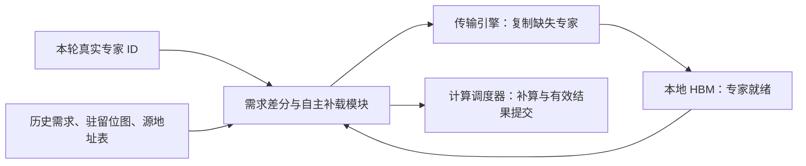

# 面向 MoE 解码的专家需求差分与自主补载模块、装置及执行方法

**专利技术方案建议稿｜2026 年 10 月 6 日**

## 摘要

**问题与成因。** 大规模混合专家模型（MoE）的专家权重分散在多个服务器节点。生成每个新 token 时，请求都要调用若干专家；所需专家位于远端，就要把 token 数据发过去，再把结果传回来。因此，decode（逐 token 生成）过程中会反复发生跨节点通信，消耗网络带宽并增加生成等待。

**核心构思与依据。** 利用同一请求、同一层的专家需求在连续 token 间集中于少量专家这一特征，在 prefill（输入预处理）结束后的交接中，将专家需求相近的请求组织到同一 decode 节点，并使该节点持续保有所需专家。这样，一次专家复制即可服务多条请求、多个生成步，减少逐 token 的跨节点往返。已有 Top-1 轨迹中，保留 4 个专家后每百次访问仅需加载 1.16–1.42 次，说明专家切换并不等于持续引入新专家。Prefill 尾部亲和性用于初始组织，decode 的真实需求用于持续校正；大专家池 Top-k 的具体覆盖率作为实施例待验证参数。

**专利方案。** 在 GPU 或其他神经网络加速器内增加一个小型的**专家需求差分与自主补载模块**，保存上一步专家需求、本地驻留位图及专家所在节点和卡的地址映射。每次前向可先用当前输入在上一步选中的本地专家上计算，同时获取本次真实路由。模块通过位图判断哪些结果有效、哪些专家需要补算；只有本地缺少所需权重时，才自主向传输引擎提交补载，并在专家就绪后触发补算。正常补载路径无需 CPU 逐次判断和下发命令，最终结果始终按本次真实路由及组合权重提交。**核心专利点是“需求差分直接驱动补载及就绪后执行”的设备侧闭环。**

**预期效果。** 以常规 MoE 的固定专家放置、逐步 token 分发作为基线，整体软硬结合方案通过工作集复用减少跨节点字节，通过设备侧自主补载减少控制等待。在四节点、Top-8、每节点 2,048 条请求、64 个生成步的条件性分析模型中，跨节点载荷减少 **88.1%**，平均生成步时延从 **72.77 ms 降至 64.74 ms**，窗口平均输出速率提升 **12.4%**。估算已计入初始专家复制、后续补载和推测误算；这是完整方案的预计收益，尚非新硬件实测，参数与公开测量依据见第五、六部分。

## 一、问题背景：decode 中反复发生的跨节点专家访问

### 1.1 通信为何反复发生

MoE 的一层通常依次执行 attention、路由选择、专家输入分发、专家计算和结果合并。Attention 完成后，当前 token 的表示已在请求所在节点，而被选中的专家可能分散在其他节点。专家并行（EP）因此需要 dispatch 将输入发往专家，并通过 combine 将结果送回。[S1]

生成下一个 token 时，上述过程再次发生。即使连续 token 反复需要同一批远程专家，固定专家放置仍会让新的 token 输入和输出重复经过网络。提前知道目的地可以帮助调度，但只有改变数据与专家的相对位置，才能实质减少这些传输。

节点内高速互连与跨节点网络具有不同的带宽和同步成本。DeepEP 的 H800 normal-kernel 实测中，节点内 dispatch/combine 瓶颈带宽为 153/158 GB/s，EP16 跨节点为 43/43 GB/s。[S2] 本方案面向跨节点通信仍有可观暴露时间的部署，以固定有效带宽建模，不额外计入拥塞。

### 1.2 部署边界与单层抽象

代表性场景采用 4 个节点、每节点 8 张加速卡。一层共有 128 个专家，初始每节点承载其中 32 个；完整专家池分布在集群 HBM 中，每个专家至少保留一个可服务副本。各节点执行本地请求的 attention 并保存 KV cache，另有有限冗余容量用于复制常用专家。

| 维度 | 本方案的抽象 |
|---|---|
| 专家并行 EP | 优化同层专家副本位置，减少跨节点 token 分发与结果返回 |
| 张量并行 TP | 节点内切分计入有效算力、容量及本地通信；目录保留专家分片映射 |
| 流水线并行 PP | 固定阶段及调度，在各阶段内部应用本模块；阶段间通信保持原核算口径 |
| 请求与 KV | P→D 交接时选择 decode 节点，随后保持归属稳定 |
| 权重来源 | 从其他 GPU 的 HBM 复制，可走节点内互连或跨节点网络 |
| 资源预算 | 基础权重、专家副本、KV 和执行缓冲共同受显存与计算能力约束 |

模块按层维护状态，不要求一个请求跨层激活相同专家。请求归属依据多层亲和性综合选择，各层独立准备相应工作集。跨节点 TP、PP 调度等成本可在完整部署中另行计入；本实施例固定这些条件，突出单层 EP 的优化。

## 二、算法先验：少量专家可以持续服务后续 token

### 2.1 连续性提供什么能力

本项目的专家亲和性使同一请求在同一层的连续 token 反复使用少量专家，为硬件提供了可持续复用的专家工作集。

例如，请求先用专家 A，再用 B，之后又回到 A。只要 A、B 都驻留本地，这些切换就不需要重新搬运权重。**决定补载量的是所需专家是否超出本地工作集，而不是相邻 token 的专家 ID 是否变化。**

现有实验覆盖约 0.966B、1.917B 两种模型，均为每层 8 个路由专家、每 token 激活 1 个。对 64 条、每条 2,048 tokens 的轨迹进行驻留分析，结果如下。[S3]

| 模型 | 相邻 token 专家切换率 | 1 个槽位：加载次数/100 次访问 | 2 个槽位 | 4 个槽位 |
|---|---:|---:|---:|---:|
| M | 5.48% | 5.53 | 2.79 | 1.16 |
| L | 6.40% | 6.45 | 3.27 | 1.42 |

加载次数包含冷启动，采用 LRU 替换。4 个槽位的命中率约为 98.58%–98.84%。这些结果支持“小工作集覆盖持续访问”的思路；无需向硬件暴露算法内部如何产生该亲和性。

### 2.2 从 prefill 亲和性建立初始局部性

Prefill 结束时，为每条请求保留各层尾部的专家使用摘要。在已有的 P→D 交接中，调度器将需求相近、容量与负载允许的请求分配到同一 decode 节点，同时准备其常用专家。[S8] 大规模并发提供更多可分组请求，分组按工作集重叠程度进行，不要求所有请求的 Top-k 完全一致。

连续性使近期使用过的专家成为下一阶段需求的预测起点。目标节点在 decode 期间继续根据真实路由更新工作集，因此初始预测可以逐步校正。在 KV 传输路径和布局相当的条件下，该组织方式利用原有交接，无需再额外迁移一遍完整 KV。

P→D 分组是本模块的应用准备环节，可由既有调度软件完成。专利重点放在后续每次前向中的自主需求判断和专家补载，不要求新增一套全局硬件调度系统。

### 2.3 Top-k 的对应关系

位图接口直接支持 Top-k：只要本次选择的全部专家包含在节点驻留集合中，即可在节点内完成本层专家计算。例如，Top-8 请求组在一个窗口内主要使用 10 个专家，节点就可用 10 个常用槽位承接不同的八专家组合。

这为大专家池提供了明确的扩展方式。Top-8/Top-16 的工作集大小、prefill 摘要对 decode 的覆盖率及持续窗口仍需由相应轨迹标定；第五部分以高覆盖率工作集作为目标实施条件。额外预算吸收集合内切换，真正出现新成员时才触发补载。

## 三、专利方案：GPU 内的专家需求差分与自主补载模块

### 3.1 一个模块完成需求到补载的闭环

该模块接收本轮路由输出，读取历史需求和驻留状态，直接产生补载描述符；传输完成事件再驱动副本发布和等待计算。CPU 在初始化时配置资源、源地址和策略，正常运行时无需参与每次缺失的判断与提交。

模块由少量状态存储和控制逻辑构成，专家权重仍存放在 HBM，矩阵乘法仍由原计算单元执行。

| 模块内部结构 | 内容与作用 |
|---|---|
| 小型状态存储 | 缓存活跃请求的上轮专家位图、本层驻留位图及在途状态；完整历史可保存在 HBM |
| 位图差分逻辑 | 求交集、并集和缺失集合，区分有效推测、新增本地计算与权重缺失 |
| 专家位置表 | 保存层号、专家 ID、源节点/卡、HBM 地址、大小及有效版本；需要时查询完整目录 |
| 补载队列与控制状态机 | 预留目标槽位、归并重复缺失、提交传输描述符，并处理就绪事件 |

128 个专家的集合只需 128 bit。集合操作可由按位逻辑及计数操作实现。[S9] 模块通过计算和传输队列衔接已有执行单元，无需增加新的矩阵计算阵列。

### 3.2 差分判断决定计算还是搬运

对一条请求的一层，记上一步选中集合为 $P$，本轮真实选中集合为 $A$，本地有效驻留集合为 $S$。当前输入就绪后，可先在 $P\cap S$ 上推测计算，并行执行本轮真实路由。随后模块产生以下动作：

| 集合 | 模块动作 |
|---|---|
| $A\cap P\cap S$ | 保留这些专家对当前输入的推测计算结果 |
| $(A\cap S)\setminus P$ | 专家已经驻留，直接发起本地补算 |
| $A\setminus S$ | 专家权重缺失，按源地址表自主提交补载 |
| $(P\cap S)\setminus A$ | 取消尚可取消的任务，丢弃本轮未选中专家的结果 |

同一节点中多个请求需要同一个缺失专家时，按专家 ID 归并为一次复制，并登记等待者。并集用于减少重复传输，逐请求选择仍分别保存，以便正确合并结果。动态 batch 使用稳定的请求 ID 索引历史，避免批次行号变化造成混用。

### 3.3 专家就绪直接触发后续执行

模块从预注册目录取得远端副本地址，在本地预算内预留槽位，将源地址、目标地址和长度等填入描述符并提交给卡间或网络传输引擎。传输完成且内存可见性确认后，模块把副本标为可用，并通知计算调度器启动等待的专家任务。[S5]

已在传输中的专家不重复搬运；仍被计算使用的槽位不覆盖。容量不足或暂不适合复制的偶发需求，可沿既有远程 token 执行路径完成。副本目录和槽位策略由系统预先配置，设备侧完成常规增量动作。

**硬件直接改善的是“发现缺失—查找位置—提交搬运—就绪后补算”的控制衔接。** 链路每秒传输的物理字节能力保持原条件；整体通信量的下降来自复制后持续复用专家。两者共同服务于 decode 的本地执行。

### 3.4 拟突出的小专利点

建议将技术方案集中描述为：**加速器内的控制模块基于当前专家需求与本地驻留状态的位图差分，结合专家地址映射自主生成补载请求，并以补载就绪事件触发关联计算。**

上轮需求缓存提供前向推测入口，结果有效标记保证本次真实路由的正确提交。Prefill 分组提供应用场景与局部性来源，其他资源管理沿用系统已有能力。这样，评审可围绕一个模块的输入、状态、输出及其技术效果理解方案。

## 四、具体实施例：一个 decode token 的四阶段前向过程

### 4.1 Attention 完成，读取本层历史需求

请求已通过 P→D 交接进入节点 A，KV 留在本节点。当前 token 完成 attention 后，得到本层专家输入 $x_t$。模块读取该请求上一生成步的专家选择，假设为专家 1–8；本地常用工作集为专家 1–10。

这里复用的是专家选择与驻留权重。每个专家都使用当前输入 $x_t$ 重新计算。

### 4.2 旧专家先行计算，本轮路由并行生成

调度器在专家 1–8 上启动当前输入的推测计算，同时按模型正常规则计算本轮 gate 和 Top-k。真实专家 ID 交给差分模块，组合权重保留给最后的结果合并。

即使专家 ID 完全相同，也使用本轮组合权重。推测结果在校验前不对后续层发布。

### 4.3 位图发现变化，按驻留状态补算或补载

若本轮选择变为专家 1–7、9，专家 9 已经驻留：模块直接安排补算，保留 1–7 的结果，丢弃 8 的结果，无需搬运权重。

若本轮选择变为专家 1–7、11，且专家 11 位于节点 B：模块查表并自主提交 B→A 的权重复制。专家 1–7 可继续计算；专家 11 就绪后，等待任务使用保留的当前输入完成补算。多条请求同时需要 11 时共享这次复制，后续 token 可继续命中新副本。

### 4.4 提交本轮有效结果，更新下一步状态

本轮真实选中的专家贡献全部齐备后，按照本轮 gate 权重合并，输出进入后续层。模块更新该请求的历史位图及本地驻留状态，供下一生成步使用。因而专家变化能够在设备侧闭环处理，同时保持真实路由的计算语义。

代表性容量配置为每节点每层 32 个基础专家、最多 10 个常用副本及 2 个更新暂存槽。按第五部分的 FP8 专家尺寸，58 层的 12 个额外槽共约 **28.55 GiB/节点**，均摊约 **3.57 GiB/卡**；片上小存储只保存控制状态，不保存这些专家权重。KV、其他权重及结果缓冲另行计入显存预算。

## 五、性能与容量估算：常规 MoE 与本方案的整体推理比较

### 5.1 对照口径与公开校准依据

基线采用常规 MoE：同层专家固定分布在多个节点，每个生成步根据真实路由，将 token 发往所需专家并接收结果。本方案采用连续专家需求、P→D 亲和分组、专家副本驻留及需求差分与自主补载模块，主要跨节点载荷转为工作集首次建立、增量更新和少量未覆盖需求。

比较保留相同的节点数、专家矩阵尺寸、Top-k、精度、目标并发和链路条件。基线保留目标节点内 token 去重及通信计算重叠；本方案计入副本空间与推测误算。模型质量在所用任务上需达到可比水平，本文已有小模型证据见第二部分，大专家池配置采用实施假设。结果表示完整软硬协同方案相对所选常规部署的效果。

性能模型使用 DeepEP 的实测带宽量级和 DeepSeek 的公开 kernel trace，不使用显卡峰值作为有效性能。以下为分析估算，尚非服务器方案或新装置实测。

### 5.2 代表性参数及其来源

| 参数 | 本节取值 | 来源或设定 |
|---|---:|---|
| 节点数 / 每节点 GPU 数 | 4 / 8 | 实施例 |
| 本层专家池 / 每 token 激活数 | 128 / 8 | 实施例；不声称与 DeepSeek 原部署相同 |
| 每节点并发请求 $B$ | 2,048 | 集群共 8,192 请求的条件场景 |
| 代表性起始上下文 | 2,048 tokens | KV 容量配置假设；与 4K 上下文校准 trace 区分 |
| 隐藏维度 / 专家中间维度 | 7,168 / 2,048 | DeepSeek-V3 公开配置 [S6] |
| MoE 层数 $L$ | 58 | 按公开配置 61 层减 3 个 dense 层 [S6] |
| FP8 单专家传输量 $S_e$ | 44,050,944 B，42.0103 MiB | $3dm$ 字节权重，加 10,752 B 缩放参数；每 128×128 块一个 FP32 scale 的实施假设 |
| 一个目标节点往返的 token 载荷 $v$ | 21,504 B，21 KiB | 7,168 维，FP8 输入＋BF16 返回；保留节点内去重及本地合并 |
| 单卡网络有效带宽 $B_{lane}$ | 43 GB/s | DeepEP 实测量级 [S2] |
| 节点级有效带宽 $B_{node}$ | 200 GB/s | 8 卡并行传输的建模取值，低于 $8\times43$；非实测节点聚合结果 |
| 基线每 token 平均远程目标节点数 $r_b$ | 2.0 | 分发布局假设，不按 Top-k 数量重复计载荷 |
| 本方案剩余远程目标节点数 $r_p$ | 0.05 | 本地工作集覆盖的实施假设；与专家预测命中率分别设置 |
| 观察及更新周期 $H$ | 64 个生成步 | 工作集复用窗口假设 |
| 首次复制专家 $K_0$ | 每节点每层最多 10 个 | 初始全部按远程复制计费；已有本地成员可减少该成本 |
| 后续增量复制 $u$ | 每节点每层每 $H$ 步 2 个 | 与切换次数区分的装载频率假设 |
| 跨节点 token 通信暴露比例 $\rho$ | 50% | 基线及本方案均隐藏另外 50%，做重叠敏感性分析 |
| 推测额外计算比例 $\epsilon$ | 正常路由专家 GEMM 的 5% | Top-8 推测执行目标参数，非由 Top-1 数据推导 |
| 初次亲和分组额外预算 $T_g$ | 1 ms/请求批 | 实施假设，完整计入观察窗口 |
| 设备侧控制预算 $\tau_c$ | 2 μs/层/生成步 | 位图及执行控制的工程预算，按暴露开销计入 |
| 共同计算及节点内执行时间 $T_0$ | 60 ms/生成步 | 含 attention、正常专家计算、本地通信及固定算子，按公开 trace 量级选取的整机假设 |

单专家量化权重的字节数为 $3\times7168\times2048=44,040,192$。缩放参数为 $3\times56\times16\times4=10,752$ B；GB 使用十进制，MiB/GiB 使用二进制。

[S7] 的公开 decode trace 中，两个 grouped FP8 GEMM 的中位数分别为 79、39 μs。按 EP128、每 GPU 128 请求、两个等分微批次与均衡 Top-8 推算，每次对应 512 次 token-expert 计算；由此派生约 382.18 TFLOP/s 的有效 GEMM 量级。本实施例每 GPU 每步平均承担 $2048/8\times8=2048$ 次 token-expert 计算，58 层正常路由专家矩阵时间估计为：

$$
T_{\mathrm{gemm}}=58\times\frac{2048}{512}\times118\ \mu s=27.376\ \mathrm{ms}.
$$

$T_0=60$ ms 包含这部分正常计算，其余用于 attention、节点内通信及其他执行。跨形状外推、专家副本负载均衡和实际矩阵效率均由部署 profile 标定；本轮不计拥塞，并假设节点内放置或 TP 划分使两侧正常专家计算时间可比。所选加速器容量应满足该上下文下的 KV、完整计算状态及副本预算，H800 公开 trace 用于时间量级校准。

### 5.3 先核算有效字节：反复 token 往返与工作集复制

在单节点、单层、$H$ 步范围内，基线载荷为

$$
V_b=HBvr_b.
$$

本方案载荷为

$$
V_p=(K_0+u)S_e+HBvr_p.
$$

前项完整计入首次建立及两次增量专家复制，后项保留未覆盖需求的 token 往返。专家复制后的本地 GPU 间分发不计为跨节点字节，但其执行成本保留在 $T_0$ 中。集群总量采用发送字节口径，各节点求和，不将同一传输在收发两侧重复计费。

| 单节点、单层、64 步载荷 | 数值 |
|---|---:|
| 基线 token 往返 | 5,376.00 MiB |
| 本方案首次及增量专家复制 | 504.12 MiB |
| 本方案剩余 token 往返 | 134.40 MiB |
| 本方案合计 | 638.52 MiB |
| 相对基线减少 | **88.12%** |

本表以 10 专家工作集具有高覆盖率为条件；实际覆盖率通过 P→D 轨迹验证。该节约不依赖提高链路物理带宽，来源于将同一批专家权重的传输摊销到大量后续访问。

### 5.4 再计入初始复制、补载及推测误算，得到推理时间

基线跨节点 token 流量的带宽时间为

$$
T_{\mathrm{token},b}=\frac{LBvr_b}{B_{node}}=25.5433\ \mathrm{ms},
$$

本方案剩余 token 流量的对应时间为 $T_{\mathrm{token},p}=0.6386$ ms。两者均乘以暴露比例 $\rho$，保留已有通信计算重叠。

专家复制还需要保留单卡链路约束。若 $k$ 个专家尽量均匀分配给 8 张目标卡，每层的复制时间模型为

$$
t_w(k)=\max\left(\frac{kS_e}{B_{node}},\frac{\lceil k/8\rceil S_e}{B_{lane}}\right).
$$

该式同时约束节点聚合带宽及最忙目标卡；假设源副本可提供匹配的发送能力。$t_w(10)=2.2025$ ms，$t_w(2)=1.0244$ ms。不同层按串行求和计费，本节不再额外扣除权重复制与 KV 交接、attention 或矩阵计算的重叠收益。

完整观察窗口的平均生成步时间为：

$$
T_b=T_0+\rho T_{\mathrm{token},b},
$$

$$
T_p=T_0+\rho T_{\mathrm{token},p}
+\frac{Lt_w(K_0)+T_g}{H}
+\frac{Lt_w(u)}{H}
+\epsilon T_{\mathrm{gemm}}
+L\tau_c.
$$

| 平均每生成步成本 | 常规 MoE | 本方案 |
|---|---:|---:|
| 共同计算及节点内执行 | 60.0000 ms | 60.0000 ms |
| 暴露的跨节点 token 通信 | 12.7717 ms | 0.3193 ms |
| 首次专家复制摊销 | — | 1.9961 ms |
| 亲和分组摊销 | — | 0.0156 ms |
| 后续专家补载 | — | 0.9284 ms |
| 推测未命中额外计算 | — | 1.3688 ms |
| 设备侧控制预算 | — | 0.1160 ms |
| **合计** | **72.7717 ms** | **64.7442 ms** |

时延降低约 **11.03%**。在 8,192 条请求持续生成、按上述 64 步窗口计入准备成本时，平均输出速率由约 **112,571 token/s** 增至 **126,529 token/s**，提升约 **12.40%**。计算采用 $Q=8192/(T/1000)$，该值为固定并发下的窗口平均速率，非线上服务实测最大吞吐。

首次专家准备单独为 127.75 ms/节点，分组预算另计 1 ms，表中按 64 步摊销；这不是首 token 时延的直接测量。若工作集已建立，保持每 64 步 2 个专家的更新强度，模型得到 62.73 ms/步，稳态输出速率相对基线提升约 16.0%。

推测额外计算按 FLOPs 比例线性外推其时间，是此处的工程近似；执行效率、无效结果缓冲、任务取消和补算排队需在装置验证中测量。模型不把 gate 重叠再单独记为收益，避免重复计算。

### 5.5 复用窗口、已有重叠和误算共同决定收益

长复用窗口使首次复制成本被更多 token 分担；基线已隐藏的通信越多，可供本方案消除的暴露时间越少。

| 参数扫描，其他参数取代表值 | 本方案平均生成步 | 相对基线平均输出速率变化 |
|---|---:|---:|
| 工作集观察/更新周期 16 步 | 73.56 ms | -1.08% |
| 工作集观察/更新周期 64 步 | 64.74 ms | +12.40% |
| 工作集观察/更新周期 256 步 | 62.54 ms | +16.36% |
| token 通信仅暴露 25% | 64.58 ms | +2.79% |
| token 通信暴露 100% | 65.06 ms | +31.48% |
| 推测额外计算为 0% | 63.38 ms | +14.83% |
| 推测额外计算为 20% | 68.85 ms | +5.70% |

观察/更新周期扫描同时保持每周期 2 个新专家的设定，分别代表不同的复用和更新强度；重叠扫描中基线时间也同步变化。短窗口场景提示控制器使用累计复用预算决定复制，必要时保留 token 远程执行。推测路径可按命中统计启停，避免持续低命中时产生额外计算。

因此，本方案的目标部署是高并发、需求聚集后具有较长工作集覆盖窗口、且跨节点 token 通信有可观暴露成本的 decode 系统。该条件直接对应前述亲和分组与连续性的应用价值。

### 5.6 装置验证与效果归因

验证以“常规 MoE token 分发”与“本方案专家驻留执行”的整体对照为主，同时记录各项成本以解释结果。

| 验证项 | 指标与用途 |
|---|---|
| Prefill 到 decode 的专家亲和性 | 多层工作集覆盖率、覆盖窗口、组内并集大小，标定 $r_p$ 与 $u$ |
| 推测执行正确性 | 与本方案真实路由的非推测执行对齐，验证选中集合、当前输入和组合权重 |
| 推测计算开销 | 错误专家任务数、额外 FLOPs、取消及补算时间，标定 $\epsilon$ |
| 跨节点传输 | 分别统计 token、专家权重及控制元数据字节，保留同目标节点去重 |
| 初始准备与更新 | P→D 分组时间、首次复制、后续补载和副本容量 |
| 生成性能 | 平均及分位生成步时延、窗口平均与稳态输出速率 |
| 模型质量 | 相同任务和精度条件下，核对两种路由模型的质量与激活计算规模 |

专利的技术效果由完整机制共同产生：亲和性分组建立本地需求，连续性维持工作集，专用模块用位图和历史需求组织推测校验、自主补载及正确提交，从而以较少的专家复制替代大量重复 token 通信。

## 六、信息来源与复算依据

以下公开资料查阅于 2026 年 10 月 5 日。公共性能数据均使用运行测量或 trace，不使用厂商宣传峰值替代有效性能。前三类依据分别承担部署背景、算法现象及硬件量级校准，数值不跨范围冒用。

- **[S1] DeepSeek-V3/R1 Inference System Overview，2025-02。** 用于 attention/专家并行部署与通信计算重叠背景。[公开原文](https://github.com/deepseek-ai/open-infra-index/blob/main/202502OpenSourceWeek/day_6_one_more_thing_deepseekV3R1_inference_system_overview.md)
- **[S2] DeepEP v1.2.1 README，Performance。** 使用固定版本的 H800 normal-kernel 实测表：节点内 153/158 GB/s、EP16 跨节点 43/43 GB/s。43 GB/s 来自 EP 通信实测，将其用于专家权重流属于本方案的建模设定，实施时以实际权重接收带宽标定。[固定版本](https://github.com/deepseek-ai/DeepEP/blob/v1.2.1/README.md#performance)
- **[S3] 本项目《面向端侧部署的连续激活 MoE：多尺度能力与真实设备验证》，2026-08-14，第 4.4 节。** 提供两种模型的切换率与 1/2/4 槽位加载数据。本文使用其工作集证据，不将其中端侧设备时延计为服务器硬件收益。[项目验证报告](../docs/moe_0814.md)
- **[S4] NVIDIA TensorRT-LLM，Optimizing MoE Communication with One-Sided AlltoAll Over NVLink。** 提供同一 rank 多专家共享一次 token 发送的实现依据；本文将节点级去重作为成本核算规则。[技术说明](https://nvidia.github.io/TensorRT-LLM/1.3.0rc14/blogs/tech_blog/blog18_Optimizing_MoE_Communication_with_One_Sided_AlltoAll_Over_NVLink.html)
- **[S5] NVIDIA GPUDirect RDMA 文档。** 提供设备直达显存及内存顺序要求的实现背景。[官方文档](https://docs.nvidia.com/cuda/gpudirect-rdma/)
- **[S6] DeepSeek-V3 config.json。** 提供专家矩阵尺寸、层数、Top-8 及 FP8 量化块配置。[模型配置](https://huggingface.co/deepseek-ai/DeepSeek-V3/blob/main/config.json)
- **[S7] DeepSeek profile-data，decode.json 与 README。** 用于校准 grouped FP8 GEMM 时间。选取 kernel 名包含 `fp8_gemm_kernel<4096u, 7168u, 128u, 112u` 和 `fp8_gemm_kernel<7168u, 2048u, 128u, 112u`，且 `GemmType` 为 2 的事件，分别取 118 次的中位数 79/39 μs。它们为 kernel 时间，未将重叠事件直接相加为整机时延。[数据及条件](https://github.com/deepseek-ai/profile-data)；[原始 trace](https://github.com/deepseek-ai/profile-data/blob/main/decode.json)。复算使用文件的 SHA-256 为 `6dd02bfb01ac2e0881f77003f8d8b20420c48d769df863e709623654e9ebfb62`。

- **[S8] NVIDIA Dynamo，Disaggregated Serving。** 提供 prefill、decode 分池、KV 交接及 decode 目的地选择的系统接入依据。专家亲和性匹配是本方案增加的调度因素。[官方架构说明](https://docs.nvidia.com/dynamo/dev/knowledge-base/concepts/system-architecture/disaggregated-serving)

- **[S9] NVIDIA CUDA Math API，Integer Intrinsics。** 提供位图所需的整数操作和 popcount 基础能力。专用处理器将集合比较、状态更新与装载控制连接为一体。[官方文档](https://docs.nvidia.com/cuda/cuda-math-api/cuda_math_api/group__CUDA__MATH__INTRINSIC__INT.html)

本节公式给出了两种方案的有效字节量、专家复制成本、误算成本及生成步时间。模型维度、流量参数、带宽和覆盖窗口均可单独替换复算；所有新增服务器亲和性与控制延迟参数均列为实施假设。
