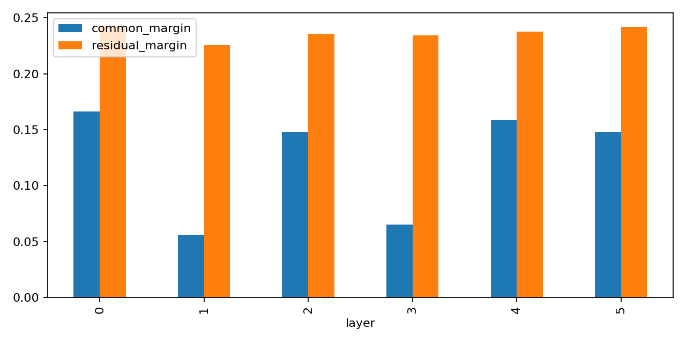
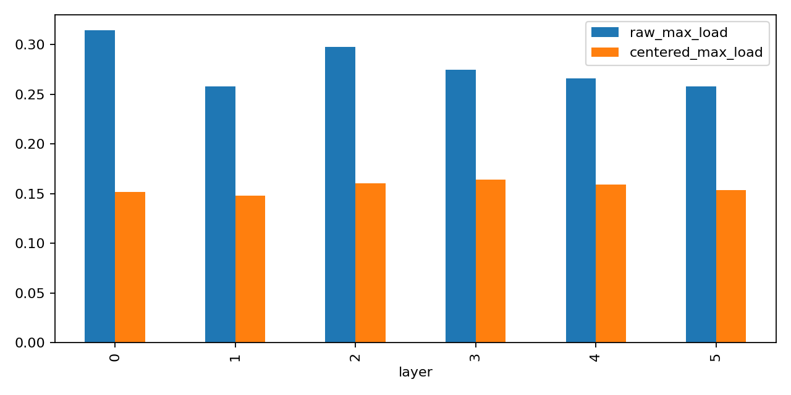
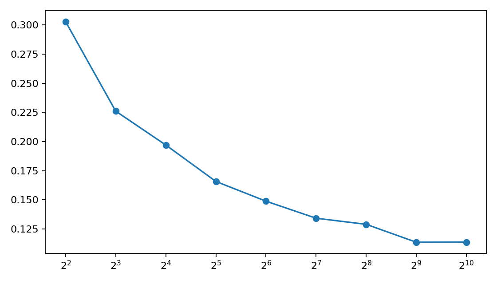
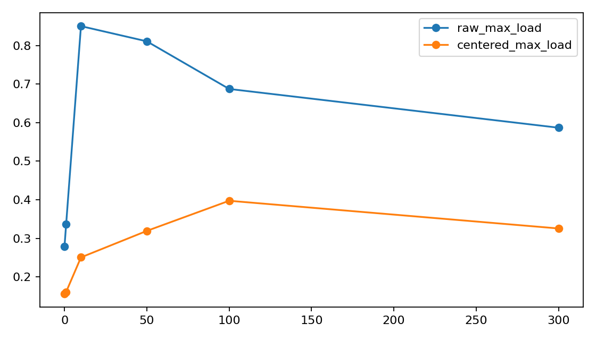
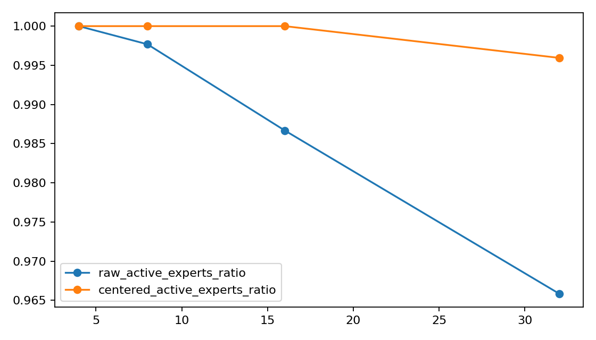

# A05_04_02 Real-Text Common-Logit Audit Detailed Record

## 1. Research Question

Primary anchor:
`Projects/from-attention-to-search/main/problem_anchors/05_04_03_real_text_common_logit_initialization_anchor.md`

Question:
On DCLM packed-token text, does random-initialized sparse top-1 linear routing concentrate because $w_e^T c$ dominates $w_e^T r_i$ in the actual router-gate input?

Decision use:
This experiment tests whether the toy common-logit mechanism remains a plausible main explanation for early route concentration in real language-modeling hidden states.

## 2. Result

Final judgment:
Mixed. The original step-0 common-dominance hypothesis is weakened, but the common component remains a meaningful load-bias source and becomes strongly amplified during early training.

Most important metric:
`dominance_ratio = common_margin / residual_margin`.

Why it decides the initialization claim:
The proposed mechanism requires the shared common projection $w_e^T c$ to dominate the token-specific residual projection $w_e^T r_i$. If `dominance_ratio < 1`, common-logit geometry alone is not the main step-0 margin explanation.

Final step-0 result:
`dominance_ratio=0.5251`, with only 1 of 18 layer/seed cases above 1.

Important secondary metric:
`delta_max_load = raw_max_load - centered_max_load`.

Why it matters:
Even when common margin is not dominant, centering the exact gate input can reveal whether the common component contributes to route concentration.

Final step-0 load result:
`raw_max_load=0.2781`, `centered_max_load=0.1561`, `delta_max_load=0.1220`.

## 3. Experimental Setup

Code workspace:
`MoE_Router workspace`

Research workspace:
`Research_System workspace`

Experiment folder:
`Projects/from-attention-to-search/main/experiments/A05/A05_04_03_real_text_common_logit_audit`

Runner:
`scripts/run_real_text_common_logit_audit.py`

Submit script:
`scripts/submit_real_text_common_logit_4gpu_acp.sh`

Final run:
`runs/real_text_common_logit_audit_v5/real_text_common_logit_audit_v5_4gpu_20260611_r3`

ACP job:
`pt-mrx0wq1v`

Status:
`SUCCEEDED`

Completed:
`2026-06-11T17:39:10.822477`

Hardware:
4 GPUs via ACP, `torchrun --standalone --nproc_per_node=4`.

## 4. Data Construction

Data source:
`/data/share/109_cache_dir/hf_data/dclm_bin`

Sample construction:
Each sample is a 257-token packed span. Positions `0..255` are model input tokens. Shifted positions `1..256` are the LM targets.

Padding rule:
DCLM packed stream has no padding in these 256 input tokens; all positions are valid routed tokens.

Audit split:
`8192` sequences.

Training split:
`32768` sequences.

Position diagnostics:
All positions `0..255` are the primary metric surface. Additional diagnostics report buckets `0..63`, `64..127`, `128..191`, and `192..255`.

## 5. Model And Router Contract

Model:
Small random-initialized Qwen-style decoder-only MoE.

Config:

| field | value |
| --- | ---: |
| hidden_size | 512 |
| num_hidden_layers | 6 |
| num_attention_heads | 8 |
| num_key_value_heads | 4 |
| expert_hidden_dim | 2048 |
| vocab_size | 151936 |
| initializer_range | 0.02 |

Router:

| field | value |
| --- | --- |
| moe_type | `moe` |
| router_type | `linear` |
| gating_reference | `hidden_states` |
| top_k | 1 |
| lambda_lb | 0.0 |
| use_shared_expert | false |
| norm_topk_prob | false |
| router_bias | false |

Important source patch:
The local MoE source was patched to support `use_shared_expert=false`, because shared experts are always-on channels and would contaminate the route-concentration interpretation.

Gradient choice:
`norm_topk_prob=false` keeps the selected softmax probability in the MoE output. This means non-selected router logits still receive the normal softmax-denominator gradient under the task loss. This is the intended standard sparse top-1 linear-router update path for this audit.

Gate initialization:
Qwen-style `nn.Linear` initialization, `Normal(0, initializer_range)` with `initializer_range=0.02`.

Virtual router scales:
Both protocol scale and matched-real-gate scale were audited. Matched scale uses the observed gate-weight scale for comparability.

## 6. Exact Object Definition

The audited router input $h_i$ is the exact tensor passed into the active linear gate.

The decomposition is:
$$
h_i = c + r_i,\qquad z_{i,e}=w_e^T h_i=w_e^T c+w_e^T r_i
$$

`c` is the mean hidden vector over audited routed tokens for a given model seed and layer. `r_i` is the centered token residual.

Gate contract check:
The runner reconstructs router logits as `h @ W.T`.

Final max reconstruction error:
`0.0`.

## 7. Run History

Final successful run:
`real_text_common_logit_audit_v5_4gpu_20260611_r3`, ACP job `pt-mrx0wq1v`.

Earlier run:
`pt-o9rd0asg` was stopped because Phase 2 virtual scaling was initially CPU-bound and too slow.

Intermediate successful run:
`real_text_common_logit_audit_v5_4gpu_20260611_r2` completed with smaller trajectory audit size and was used only as a preliminary sanity check.

Final change before r3:
`trajectory_audit_num_sequences` was set to `8192`, matching Phase 1 audit size.

## 8. Completeness Checks

`run_summary.json`:

| field | value |
| --- | ---: |
| phase1_rows | 18 |
| phase2_rows | 20736 |
| phase3_rows | 108 |
| phase4_rows | 432 |

CSV line counts include headers:

| file | lines |
| --- | ---: |
| `phase1_step0_metrics.csv` | 19 |
| `phase1_position_bucket_metrics.csv` | 73 |
| `phase1_layer_summary.csv` | 19 |
| `phase2_virtual_scaling_metrics.csv` | 20737 |
| `phase2_virtual_scaling_summary.csv` | 325 |
| `phase3_trajectory_metrics.csv` | 109 |
| `phase4_actual_E_sweep_metrics.csv` | 433 |

Source checksums are recorded in:
`runs/real_text_common_logit_audit_v5/real_text_common_logit_audit_v5_4gpu_20260611_r3/config/source_manifest.json`

## 9. Phase 1: Step-0 Audit

Question:
Does the exact gate input at random initialization show common-logit dominance?

Result:

| metric | mean |
| --- | ---: |
| common_margin | 0.1237 |
| residual_margin | 0.2364 |
| dominance_ratio | 0.5251 |
| common_winner_agreement | 0.2781 |
| raw_max_load | 0.2781 |
| centered_max_load | 0.1561 |
| delta_max_load | 0.1220 |
| raw_active_experts_ratio | 1.0000 |
| centered_active_experts_ratio | 1.0000 |

Counts:
`dominance_ratio > 1` in 1 of 18 layer/seed cases.
`delta_max_load > 0.05` in 15 of 18 layer/seed cases.

By layer:

| layer | common_margin | residual_margin | dominance_ratio | raw_max_load | centered_max_load | delta_max_load |
| ---: | ---: | ---: | ---: | ---: | ---: | ---: |
| 0 | 0.1664 | 0.2423 | 0.6892 | 0.3143 | 0.1517 | 0.1626 |
| 1 | 0.0559 | 0.2260 | 0.2492 | 0.2578 | 0.1476 | 0.1102 |
| 2 | 0.1481 | 0.2357 | 0.6478 | 0.2977 | 0.1606 | 0.1372 |
| 3 | 0.0650 | 0.2345 | 0.2774 | 0.2747 | 0.1638 | 0.1109 |
| 4 | 0.1587 | 0.2378 | 0.6686 | 0.2659 | 0.1590 | 0.1069 |
| 5 | 0.1482 | 0.2419 | 0.6184 | 0.2582 | 0.1538 | 0.1044 |

Position buckets:

| bucket | common_margin | residual_margin | dominance_ratio | raw_max_load | centered_max_load |
| ---: | ---: | ---: | ---: | ---: | ---: |
| 0 | 0.0762 | 0.2491 | 0.3083 | 0.2159 | 0.1538 |
| 1 | 0.1206 | 0.2377 | 0.5096 | 0.2712 | 0.1558 |
| 2 | 0.1415 | 0.2301 | 0.6166 | 0.3028 | 0.1562 |
| 3 | 0.1518 | 0.2243 | 0.6777 | 0.3256 | 0.1564 |

Interpretation:
The common component grows stronger in later token positions, but still does not dominate the residual margin on average. Raw routing is more concentrated than centered routing in every position bucket.

Figures:





## 10. Phase 2: Virtual Expert-Count Scaling

Question:
Does increasing random expert count amplify common-winner dominance on fixed real-text hidden states?

Protocol-scale result:

| E_virtual | common_margin | residual_margin | dominance_ratio | raw_max_load | centered_max_load | raw_active_experts_ratio | centered_active_experts_ratio |
| ---: | ---: | ---: | ---: | ---: | ---: | ---: | ---: |
| 4 | 0.3028 | 0.6702 | 0.4534 | 0.4190 | 0.2751 | 1.0000 | 1.0000 |
| 8 | 0.2261 | 0.5231 | 0.4329 | 0.2834 | 0.1570 | 1.0000 | 1.0000 |
| 16 | 0.1971 | 0.4400 | 0.4487 | 0.2043 | 0.0940 | 1.0000 | 1.0000 |
| 32 | 0.1658 | 0.3865 | 0.4298 | 0.1445 | 0.0589 | 1.0000 | 1.0000 |
| 64 | 0.1489 | 0.3483 | 0.4285 | 0.1079 | 0.0383 | 1.0000 | 1.0000 |
| 128 | 0.1343 | 0.3193 | 0.4213 | 0.0817 | 0.0260 | 1.0000 | 1.0000 |
| 256 | 0.1290 | 0.2962 | 0.4369 | 0.0630 | 0.0183 | 0.9999 | 1.0000 |
| 512 | 0.1137 | 0.2780 | 0.4101 | 0.0483 | 0.0132 | 0.9970 | 0.9995 |
| 1024 | 0.1138 | 0.2625 | 0.4350 | 0.0389 | 0.0099 | 0.9797 | 0.9937 |

Matched-real-gate result:
The same pattern holds after matching gate scale. `dominance_ratio` remains below 1 and does not increase with $E$.

Interpretation:
This weakens H3. Larger virtual $E$ does not create increasing common-margin dominance. Raw routing remains more concentrated than centered routing, but this is a load-bias effect rather than a monotone common-margin amplification.

Figure:



## 11. Phase 3: Early-Training Trajectory

Question:
Does the common-logit effect persist or amplify during the first 300 optimizer steps?

Actual $E=8$ result:

| step | lm_loss | common_margin | residual_margin | dominance_ratio | raw_max_load | centered_max_load | delta_max_load | raw_active_experts_ratio |
| ---: | ---: | ---: | ---: | ---: | ---: | ---: | ---: | ---: |
| 0 | n/a | 0.1237 | 0.2364 | 0.5251 | 0.2781 | 0.1561 | 0.1220 | 1.0000 |
| 1 | 12.0581 | 0.1432 | 0.2275 | 0.6300 | 0.3362 | 0.1606 | 0.1755 | 1.0000 |
| 10 | 10.8455 | 0.7427 | 0.0707 | 21.7874 | 0.8507 | 0.2504 | 0.6003 | 1.0000 |
| 50 | 7.6703 | 0.2405 | 0.1039 | 3.7652 | 0.8113 | 0.3191 | 0.4921 | 0.9931 |
| 100 | 7.6394 | 0.5418 | 0.4278 | 1.7050 | 0.6876 | 0.3974 | 0.2902 | 0.9931 |
| 300 | 7.3875 | 1.1931 | 0.5500 | 1.6448 | 0.5870 | 0.3255 | 0.2615 | 1.0000 |

Interpretation:
The common component is rapidly amplified by training. The largest route concentration appears by step 10, where `raw_max_load` reaches `0.8507`. This points to early-training feedback rather than pure random-init geometry.

Figure:



## 12. Phase 4: Actual Expert-Count Sweep

Question:
Does actual $E$ worsen underuse risk during early training?

Step 0:

| num_experts | common_margin | residual_margin | dominance_ratio | raw_max_load | centered_max_load | raw_active_experts_ratio |
| ---: | ---: | ---: | ---: | ---: | ---: | ---: |
| 4 | 0.1382 | 0.3059 | 0.4399 | 0.4113 | 0.2740 | 1.0000 |
| 8 | 0.1237 | 0.2364 | 0.5251 | 0.2781 | 0.1561 | 1.0000 |
| 16 | 0.0674 | 0.2000 | 0.3424 | 0.1864 | 0.0934 | 1.0000 |
| 32 | 0.0452 | 0.1753 | 0.2581 | 0.1147 | 0.0573 | 1.0000 |

Step 300:

| num_experts | lm_loss | common_margin | residual_margin | dominance_ratio | raw_max_load | centered_max_load | raw_active_experts_ratio |
| ---: | ---: | ---: | ---: | ---: | ---: | ---: | ---: |
| 4 | 7.3185 | 1.4342 | 0.5159 | 2.1871 | 0.6814 | 0.4244 | 1.0000 |
| 8 | 7.3875 | 1.1931 | 0.5500 | 1.6448 | 0.5870 | 0.3255 | 1.0000 |
| 16 | 7.0431 | 0.6843 | 0.6819 | 1.2467 | 0.4714 | 0.2951 | 0.9792 |
| 32 | 7.6378 | 0.7006 | 0.5666 | 1.1910 | 0.3951 | 0.2508 | 0.9149 |

Interpretation:
Actual larger $E$ shows more expert underuse after training, especially at $E=32$. This underuse is not explained by a monotone step-0 increase in common-margin dominance.

Figure:



## 13. Artifact Map

Code workspace:
`MoE_Router workspace`

Research experiment folder:
`Projects/from-attention-to-search/main/experiments/A05/A05_04_03_real_text_common_logit_audit`

Anchor:
`Projects/from-attention-to-search/main/problem_anchors/05_04_03_real_text_common_logit_initialization_anchor.md`

Runner:
`Projects/from-attention-to-search/main/experiments/A05/A05_04_03_real_text_common_logit_audit/scripts/run_real_text_common_logit_audit.py`

Submit script:
`Projects/from-attention-to-search/main/experiments/A05/A05_04_03_real_text_common_logit_audit/scripts/submit_real_text_common_logit_4gpu_acp.sh`

Run config:
`runs/real_text_common_logit_audit_v5/real_text_common_logit_audit_v5_4gpu_20260611_r3/config/run_config.json`

Source manifest:
`runs/real_text_common_logit_audit_v5/real_text_common_logit_audit_v5_4gpu_20260611_r3/config/source_manifest.json`

Results:
`runs/real_text_common_logit_audit_v5/real_text_common_logit_audit_v5_4gpu_20260611_r3/results/`

Figures:
`figures/`

ACP runtime log:
`logs/acp/real_text_common_logit_audit_v5_4gpu_20260611_r3_runtime_20260611_171736.log`

Job id:
`pt-mrx0wq1v`

Repro command:

```bash
cd Projects/from-attention-to-search/main/experiments/A05/A05_04_03_real_text_common_logit_audit
REAL_TEXT_COMMON_LOGIT_ALLOW_REAL_SUBMIT=1 scripts/submit_real_text_common_logit_4gpu_acp.sh real_text_common_logit_audit_v5_4gpu_20260611_r3
```

Internal run command:

```bash
torchrun --standalone --nproc_per_node=4 scripts/run_real_text_common_logit_audit.py --run-stage full
```

## 14. Claim Boundary

Supported:
The common component is a real load-bias source in random-initialized real-text top-1 routing.

Weakened:
The common component is not the dominant step-0 logit-margin source. Increasing virtual $E$ does not monotonically amplify common-margin dominance.

Newly supported direction:
Early training rapidly amplifies common-logit concentration. The main causal question should move from static random-init geometry to early optimizer and representation dynamics.

Not claimed:
This experiment does not establish final expert specialization quality, does not explain pretrained large MoE behavior, and does not prove a particular mitigation.

## 15. Next Decision

Run a focused causal split:
freeze gate weights, freeze hidden-state producers, and freeze expert outputs in separate short runs. The goal is to identify whether step-10 common amplification is mainly caused by gate update, hidden-state drift, or expert-output feedback.
