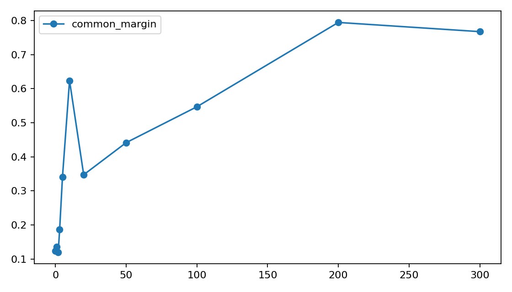
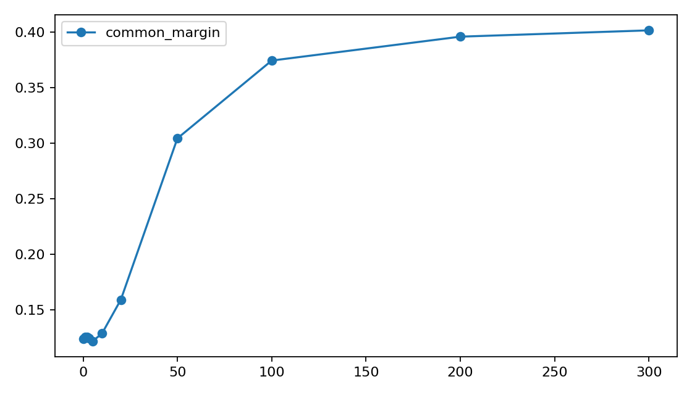
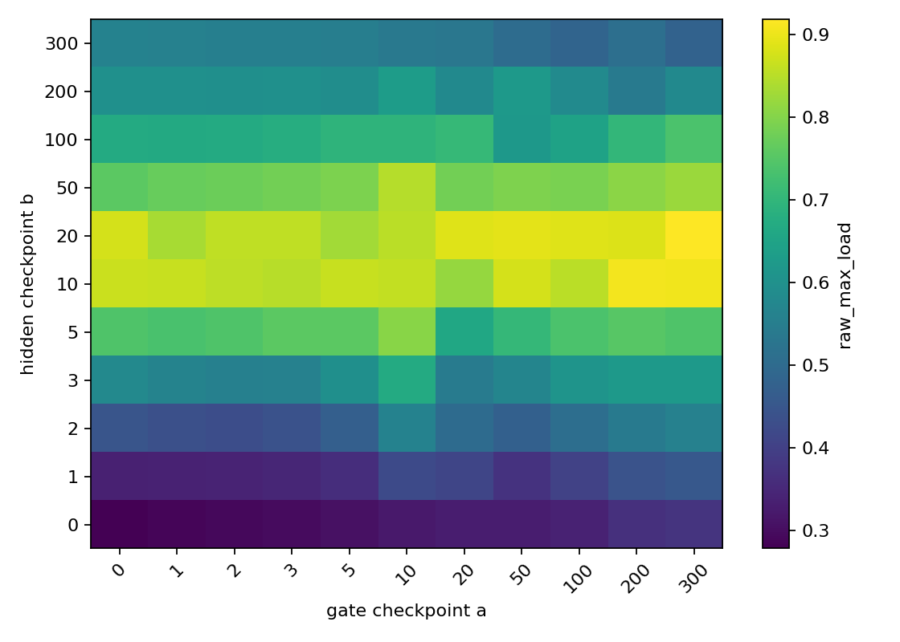

# A06_02_01 Cross-Checkpoint Replay Detailed Record

## 0. Quick Recap

Question:
Does the early common-logit spike in real DCLM top-1 MoE training come from router-weight update, hidden-state drift, or their interaction?

Answer:
The run supports early-training amplification, but not a router-weight-only explanation. In the strongest layer, normal training reaches `raw_max_load=0.9916` at step 10. Freezing the final-layer hidden producer suppresses this to `0.3242`. Replay shows that hidden-state drift and interaction explain most of the step-10 common-margin increase in the later layers.

Important execution caveat:
The ACP job status is `FAILED`, but the result artifacts are complete. The failure happened after `run_summary.json`, result CSVs, and figures were written, because an idle rank timed out at a replay barrier.

## 1. Source Files

Anchor:

```text
Projects/from-attention-to-search/main/problem_anchors/06_02_early_training_common_logit_amplification_anchor.md
```

Protocol and sanity check:

```text
Projects/from-attention-to-search/main/experiments/A06_02_01_cross_checkpoint_replay/protocol_for_approval.md
Projects/from-attention-to-search/main/experiments/A06_02_01_cross_checkpoint_replay/sanity_check.md
```

Runner and submit script:

```text
Projects/from-attention-to-search/main/experiments/A06_02_01_cross_checkpoint_replay/scripts/run_cross_checkpoint_replay.py
Projects/from-attention-to-search/main/experiments/A06_02_01_cross_checkpoint_replay/scripts/submit_cross_checkpoint_replay_4gpu_acp.sh
Projects/from-attention-to-search/main/experiments/A06_02_01_cross_checkpoint_replay/scripts/audit_common_batch_stability.py
```

Result directory:

```text
Projects/from-attention-to-search/main/experiments/A06_02_01_cross_checkpoint_replay/runs/cross_checkpoint_replay/a06_02_cross_checkpoint_replay_4gpu_20260614_full01
```

## 2. Experiment Setup

```text
model_family: Qwen-style decoder-only MoE
initialization: random
num_hidden_layers: 6
hidden_size: 512
num_attention_heads: 8
num_key_value_heads: 4
head_dim: 64
num_experts: 8
expert_hidden_dim: 2048
vocab_size: 151936
initializer_range: 0.02
router_type: linear
router_bias: false
top_k: 1
use_shared_expert: false
lambda_lb: 0.0
norm_topk_prob: false
gating_reference: exact active router linear input
```

Data:

```text
dataset: DCLM packed binary stream
span_length: 257 tokens
input_length: 256 tokens
target: shifted next-token target, 256 tokens
padding: none
audit_sequences: 8192
audit_tokens_per_layer: 2097152
train_sequences: 32768
```

Training:

```text
max_train_steps: 300
learning_rate: 3e-4
train_batch_size_per_rank: 2
audit_batch_size: 8
seeds: 0, 1, 2
checkpoints: 0, 1, 2, 3, 5, 10, 20, 50, 100, 200, 300
variants: normal, freeze_last_layer_hidden_producer
```

Freeze condition:

```text
freeze_last_layer_hidden_producer:
  freezes embeddings, layers 0-4, and the layer-5 pre-gate hidden-producing path
  keeps the layer-5 MoE block trainable
  tests whether router update alone can reproduce the final-layer step-10 spike
```

## 3. Commands

Full ACP submission:

```bash
A06_02_ALLOW_REAL_SUBMIT=1 \
RUN_NAME=a06_02_cross_checkpoint_replay_4gpu_20260614_full01 \
Projects/from-attention-to-search/main/experiments/A06_02_01_cross_checkpoint_replay/scripts/submit_cross_checkpoint_replay_4gpu_acp.sh
```

ACP job:

```text
job_id: pt-8by4iv9a
display_name: ats-a06-02-cross-checkpoint-replay-4gpu
worker: 4XN6lS-80GB
final_scheduler_state: FAILED
failure_cause: rank-3 replay barrier timeout after result completion
runtime_log: Projects/from-attention-to-search/main/experiments/A06_02_01_cross_checkpoint_replay/logs/acp/a06_02_cross_checkpoint_replay_4gpu_20260614_full01_runtime_20260614_053427.log
```

## 4. Artifact Map

```text
run_config: runs/cross_checkpoint_replay/a06_02_cross_checkpoint_replay_4gpu_20260614_full01/config/run_config.json
source_manifest: runs/cross_checkpoint_replay/a06_02_cross_checkpoint_replay_4gpu_20260614_full01/config/source_manifest.json
audit_manifest_preview: runs/cross_checkpoint_replay/a06_02_cross_checkpoint_replay_4gpu_20260614_full01/config/audit_manifest_preview.jsonl
train_manifest_preview: runs/cross_checkpoint_replay/a06_02_cross_checkpoint_replay_4gpu_20260614_full01/config/train_manifest_preview.jsonl
checkpoints: runs/cross_checkpoint_replay/a06_02_cross_checkpoint_replay_4gpu_20260614_full01/checkpoints/
partials: runs/cross_checkpoint_replay/a06_02_cross_checkpoint_replay_4gpu_20260614_full01/partials/
results: results/
figures: figures/
run_summary: runs/cross_checkpoint_replay/a06_02_cross_checkpoint_replay_4gpu_20260614_full01/run_summary.json
```

Result row counts:

```text
trajectory_metrics.csv: 396
gradient_metrics.csv: 66
checkpoint_manifest.csv: 66
replay_metrics.csv: 2178
replay_fraction_summary.csv: 18
common_batch_stability_split.csv: 864
common_batch_stability_summary.csv: 108
common_batch_stability_set_compare.csv: 54
common_checkpoint_stability.csv: 108
```

Replay coverage:

```text
normal replay seeds: 0, 1, 2
rows per seed: 726
layers: 0-5
gate checkpoints a: 0, 1, 2, 3, 5, 10, 20, 50, 100, 200, 300
hidden checkpoints b: 0, 1, 2, 3, 5, 10, 20, 50, 100, 200, 300
actual-pair reconstruction max error: 0.0
```

## 5. Metrics

`common_margin`:
The top-1 minus top-2 margin of the common component scores $Wc$.

`residual_margin`:
The average top-1 minus top-2 margin of residual scores $W(h_i-c)$ across audit tokens.

`dominance_ratio`:
`common_margin / residual_margin`. Larger values mean the shared component separates experts more strongly than token-specific residual variation.

`raw_max_load`:
The largest fraction of audit tokens routed to one expert under ordinary top-1 routing.

`centered_max_load`:
The largest fraction after subtracting the audit-batch common vector before routing.

`effective_experts`:
The inverse-simpson effective number of used experts. Lower values mean more traffic is concentrated into fewer experts even if all experts receive at least one token.

`pairwise_cos_mean` in the batch-stability audit:
The mean cosine similarity between split-level common vectors $c_s$ inside the same checkpoint, layer, seed, and sample set.

`primary_secondary_cos`:
The cosine similarity between two disjoint DCLM sample-set common vectors at the same checkpoint, layer, and seed.

`winner_agree`:
Whether $\arg\max(W_tc_{\mathrm{primary}})$ equals $\arg\max(W_tc_{\mathrm{secondary}})$.

Replay quantities:

```text
A_actual = common_margin(W10, H10) - common_margin(W0, H0)
A_gate   = common_margin(W10, H0)  - common_margin(W0, H0)
A_hidden = common_margin(W0, H10)  - common_margin(W0, H0)
interaction = A_actual - A_gate - A_hidden
```

## 6. Main Results

### 6.0 Cross-Batch Common Stability

Why this audit was added:
The anchor's P1 says the common component should be stable enough to receive coherent pressure. The original full run used one fixed audit batch for replay, which is necessary for $W_aH_b$ comparability, but it does not by itself prove that the common direction is stable across different DCLM batches.

Operation:

```text
script: scripts/audit_common_batch_stability.py
training: none
source checkpoints: existing normal checkpoints
seeds: 0, 1, 2
steps: 0, 10, 300
layers: 0-5
sample sets: primary and secondary, disjoint DCLM spans
splits per set: 8
sequences per split: 128
tokens per split: 32768
metrics: cosine(c_s,c_global), pairwise cosine(c_s,c_s'), Wc common winner agreement, Wc common-margin variation
```

Command:

```bash
conda activate spectral-hier
python Projects/from-attention-to-search/main/experiments/A06_02_01_cross_checkpoint_replay/scripts/audit_common_batch_stability.py \
  --run-dir Projects/from-attention-to-search/main/experiments/A06_02_01_cross_checkpoint_replay/runs/cross_checkpoint_replay/a06_02_cross_checkpoint_replay_4gpu_20260614_full01 \
  --steps 0 10 300 \
  --seeds 0 1 2 \
  --num-splits 8 \
  --seqs-per-split 128 \
  --audit-batch-size 16 \
  --device cuda:0
```

Overall result:

| step | cos_to_global_mean | pairwise_cos_mean | pairwise_cos_min | primary_secondary_cos | winner_agree between sets |
|---:|---:|---:|---:|---:|---:|
| 0 | 0.9652 | 0.9226 | 0.8189 | 0.9812 | 0.9444 |
| 10 | 0.9989 | 0.9974 | 0.9928 | 0.9995 | 0.9444 |
| 300 | 0.9964 | 0.9918 | 0.9689 | 0.9992 | 1.0000 |

Layer pattern:

| step | layer | pairwise_cos_mean | pairwise_cos_min | winner_match_global_rate |
|---:|---:|---:|---:|---:|
| 0 | 0 | 0.9407 | 0.8448 | 0.9375 |
| 0 | 5 | 0.9088 | 0.8026 | 0.9792 |
| 10 | 0 | 0.9874 | 0.9646 | 0.7708 |
| 10 | 1 | 0.9984 | 0.9959 | 1.0000 |
| 10 | 2 | 0.9993 | 0.9983 | 1.0000 |
| 10 | 3 | 0.9996 | 0.9990 | 1.0000 |
| 10 | 4 | 0.9997 | 0.9993 | 1.0000 |
| 10 | 5 | 0.9998 | 0.9995 | 1.0000 |

Interpretation:
Different DCLM batches give highly aligned common directions at the same checkpoint, especially during the step-10 spike and in late layers. Step 0 is only moderately stable because the common margin is weak; this makes the common winner more sensitive to small batch differences. The step-10 spike is therefore not a fixed-audit-batch artifact.

Checkpoint-direction caveat:

| step | mean cosine to step 0 |
|---:|---:|
| 0 | 1.0000 |
| 10 | 0.3650 |
| 300 | 0.1757 |

Interpretation:
The common vector is batch-stable within a checkpoint, but the direction itself drifts strongly during training. P1 should therefore be read as checkpoint-specific batch stability, not as one static common direction preserved from step 0 to step 10 or step 300.

### 6.1 Normal Trajectory

Mean over 3 seeds and 6 layers:

| step | common_margin | residual_margin | dominance_ratio | raw_max_load | centered_max_load | raw_gini_load |
|---:|---:|---:|---:|---:|---:|---:|
| 0 | 0.1237 | 0.2364 | 0.5251 | 0.2781 | 0.1561 | 0.3027 |
| 1 | 0.1352 | 0.2290 | 0.5889 | 0.3399 | 0.1604 | 0.4023 |
| 2 | 0.1198 | 0.2035 | 0.5960 | 0.4306 | 0.1796 | 0.5428 |
| 3 | 0.1861 | 0.1706 | 1.1451 | 0.5593 | 0.2022 | 0.6404 |
| 5 | 0.3403 | 0.1154 | 3.8256 | 0.7561 | 0.2238 | 0.7542 |
| 10 | 0.6236 | 0.0712 | 17.5995 | 0.8602 | 0.2402 | 0.8115 |
| 20 | 0.3473 | 0.0517 | 14.6522 | 0.8869 | 0.2315 | 0.8261 |
| 50 | 0.4414 | 0.1866 | 3.2607 | 0.7946 | 0.3849 | 0.8148 |
| 100 | 0.5468 | 0.4708 | 1.6210 | 0.6468 | 0.3965 | 0.7286 |
| 200 | 0.7944 | 0.5762 | 1.0910 | 0.5421 | 0.3488 | 0.6363 |
| 300 | 0.7674 | 0.6228 | 1.0198 | 0.4805 | 0.3389 | 0.5864 |

Interpretation:
The early concentration is strong by step 10, but the system partially relaxes by step 300. Therefore the supported claim is early route concentration, not permanent hard expert death.




### 6.2 Layer Pattern

Normal layer means at steps 0, 10, and 300:

| layer | step | common_margin | raw_max_load | centered_max_load | dominance_ratio |
|---:|---:|---:|---:|---:|---:|
| 0 | 0 | 0.1664 | 0.3143 | 0.1517 | 0.6892 |
| 0 | 10 | 0.0810 | 0.4137 | 0.1696 | 0.4030 |
| 0 | 300 | 2.5105 | 0.6266 | 0.3896 | 1.6883 |
| 1 | 0 | 0.0559 | 0.2578 | 0.1476 | 0.2492 |
| 1 | 10 | 0.3567 | 0.8515 | 0.1899 | 4.6278 |
| 1 | 300 | 1.6556 | 0.6387 | 0.3955 | 2.1556 |
| 2 | 0 | 0.1481 | 0.2977 | 0.1606 | 0.6478 |
| 2 | 10 | 0.2361 | 0.9244 | 0.2044 | 4.9302 |
| 2 | 300 | 0.0800 | 0.3414 | 0.3297 | 0.2601 |
| 3 | 0 | 0.0650 | 0.2747 | 0.1638 | 0.2774 |
| 3 | 10 | 0.6875 | 0.9890 | 0.2042 | 17.8488 |
| 3 | 300 | 0.0873 | 0.4325 | 0.3160 | 0.5038 |
| 4 | 0 | 0.1587 | 0.2659 | 0.1590 | 0.6686 |
| 4 | 10 | 0.9561 | 0.9912 | 0.2818 | 30.5776 |
| 4 | 300 | 0.1916 | 0.4653 | 0.2986 | 1.1753 |
| 5 | 0 | 0.1482 | 0.2582 | 0.1538 | 0.6184 |
| 5 | 10 | 1.4242 | 0.9916 | 0.3913 | 47.2098 |
| 5 | 300 | 0.0793 | 0.3786 | 0.3039 | 0.3356 |

Interpretation:
The step-10 spike is strongest in late layers, especially layers 3--5. This is consistent with an early feedback path through the hidden-state producer rather than a uniform router-weight-only change across all layers.

### 6.3 Final-Layer Freeze

Layer 5 mean over 3 seeds:

| variant | step | common_margin | raw_max_load | centered_max_load | raw_gini_load | dominance_ratio |
|---|---:|---:|---:|---:|---:|---:|
| normal | 0 | 0.1482 | 0.2582 | 0.1538 | 0.2397 | 0.6184 |
| normal | 10 | 1.4242 | 0.9916 | 0.3913 | 0.8700 | 47.2098 |
| normal | 300 | 0.0793 | 0.3786 | 0.3039 | 0.4981 | 0.3356 |
| freeze_last_layer_hidden_producer | 0 | 0.1482 | 0.2582 | 0.1538 | 0.2397 | 0.6184 |
| freeze_last_layer_hidden_producer | 10 | 0.1761 | 0.3242 | 0.1534 | 0.3414 | 0.7047 |
| freeze_last_layer_hidden_producer | 300 | 1.8162 | 0.7811 | 0.3013 | 0.7744 | 3.1283 |

Interpretation:
Freezing the final-layer hidden producer suppresses the normal step-10 spike. This validates that the fast final-layer amplification requires hidden-state changes. However, by step 300 the gate can still concentrate load with fixed hidden inputs, so this freeze does not prove that router weights are irrelevant; it shows they are not sufficient for the fast step-10 effect.




### 6.4 Cross-Checkpoint Replay

Mean step-10 replay increments over 3 seeds:

| layer | common_margin_00 | common_margin_1010 | A_actual | A_gate | A_hidden | interaction |
|---:|---:|---:|---:|---:|---:|---:|
| 0 | 0.1664 | 0.0810 | -0.0854 | 0.0465 | -0.0273 | -0.1046 |
| 1 | 0.0559 | 0.3567 | 0.3008 | 0.0731 | 0.4612 | -0.2336 |
| 2 | 0.1481 | 0.2361 | 0.0880 | 0.0442 | 0.1557 | -0.1118 |
| 3 | 0.0650 | 0.6875 | 0.6225 | 0.0614 | 0.3912 | 0.1699 |
| 4 | 0.1587 | 0.9561 | 0.7974 | -0.0009 | -0.0560 | 0.8542 |
| 5 | 0.1482 | 1.4242 | 1.2760 | -0.0137 | 0.4858 | 0.8038 |

Interpretation:
The gate-only replay $W_{10}H_0$ does not explain the late-layer spike. Layer 5 has a negative gate-only increment but a large actual increment. The later-layer effect is therefore carried by hidden-state drift and the interaction between changed hidden states and changed gate weights.




## 7. Gradient Evidence

Mean gradient norms for early backward steps:

| variant | backward_step | router_grad_norm | expert_grad_norm | other_grad_norm |
|---|---:|---:|---:|---:|
| normal | 0 | 0.1277 | 0.5960 | 5.2785 |
| normal | 1 | 0.1246 | 0.6639 | 7.1003 |
| normal | 2 | 0.1201 | 0.5964 | 6.8195 |
| normal | 3 | 0.1410 | 0.8218 | 8.5839 |
| freeze_last_layer_hidden_producer | 0 | 0.0326 | 0.1452 | 1.7934 |
| freeze_last_layer_hidden_producer | 1 | 0.0300 | 0.1377 | 1.7799 |
| freeze_last_layer_hidden_producer | 2 | 0.0268 | 0.1284 | 1.7641 |
| freeze_last_layer_hidden_producer | 3 | 0.0618 | 0.1869 | 2.3954 |

Interpretation:
The freeze condition changes the gradient scale because much of the network is frozen. These values are useful as execution diagnostics, but they do not by themselves identify the causal source of amplification.

## 8. Execution Failure Analysis

The full run produced complete result artifacts and then failed at the scheduler level.

Root cause:
Replay tasks were assigned to seeds 0, 1, and 2, so only ranks 0, 1, and 2 performed replay. Rank 3 reached the final distributed barrier early and waited longer than the default NCCL timeout. The other ranks completed replay and wrote the result CSVs before elastic shutdown.

Evidence:

```text
[rank0] replay done seed=0 rows=726
[rank1] replay done seed=1 rows=726
[rank2] replay done seed=2 rows=726
run_summary.json completed_at: 2026-06-14T06:02:58
NCCL timeout: rank3 barrier, 600000 ms
```

Fix:
The runner now initializes the distributed process group with a 60-minute timeout. This preserves the 4-GPU workflow while avoiding false failure after long replay tails.

## 9. Claim Boundary

Supported:
In this small random-initialized DCLM top-1 MoE, severe route concentration appears during the first 10 steps. The late-layer common-margin spike is not explained by router-weight update alone; it is mainly a hidden-state and interaction effect. The common direction during the step-10 spike is stable across disjoint DCLM batches, so the spike is not a fixed-audit-batch artifact.

Weakened:
The earlier stronger story that random router geometry alone directly causes the early spike is too narrow. Router update matters, but it is not sufficient for the fast step-10 late-layer amplification. A literal "same common direction across checkpoints" reading of P1 is also too strong: $c_{10}$ and $c_{300}$ are not close to $c_0$.

Not claimed:
This run does not establish pretrained large-MoE behavior, long-run expert specialization, deployable mitigation, or the exact split between expert-output feedback and earlier hidden-state drift.

## 10. Next Decision

Run the smallest split that separates hidden-state drift from expert-output feedback:

1. freeze gate only;
2. freeze experts only;
3. freeze earlier hidden-producing layers separately from the final-layer pre-gate input.

The next experiment should keep the same fixed audit set, exact gate-input capture, no shared expert, top-1 routing, and zero load-balance loss.
