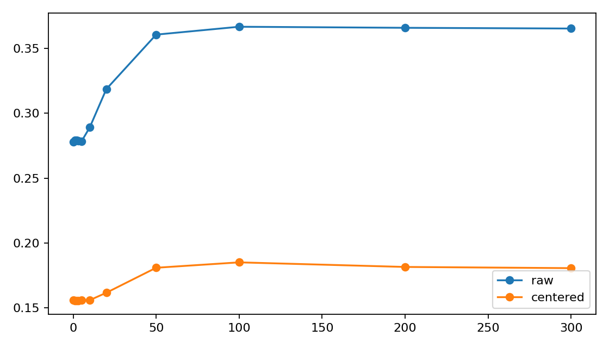

# A06_02_01 Cross-Checkpoint Replay Summary

## Purpose

This experiment tests why the common-logit channel becomes strongly amplified during the first few optimization steps in a real DCLM top-1 MoE run.

The decision question is whether the step-10 amplification is mainly carried by the router weights $W$, by the router input hidden states $H$, or by their interaction.

## Setup

```text
model: random-init Qwen-style decoder-only MoE
layers: 6
hidden_size: 512
attention_heads: 8
kv_heads: 4
experts: 8
expert_hidden_dim: 2048
router: linear, bias-free, top_k=1
shared_expert: disabled
load_balance_loss: lambda_lb=0.0
data: DCLM packed stream
sample: 257-token span, 256-token input, shifted 256-token target
audit_tokens: 8192 sequences x 256 tokens = 2,097,152 tokens
train_steps: 300
checkpoints: 0, 1, 2, 3, 5, 10, 20, 50, 100, 200, 300
seeds: 0, 1, 2
variants: normal, freeze_last_layer_hidden_producer
```

Run directory:

```text
Projects/from-attention-to-search/main/experiments/A06_02_01_cross_checkpoint_replay/runs/cross_checkpoint_replay/a06_02_cross_checkpoint_replay_4gpu_20260614_full01
```

## Conclusion

The experiment supports the early-training amplification story, but it weakens a router-weight-only explanation.

In the normal run, route concentration appears quickly: mean `raw_max_load` rises from `0.2781` at step 0 to `0.8602` at step 10, while replay effective experts drop from `6.79` to `1.70`. The final layer is the strongest case: `raw_max_load` reaches `0.9916` at step 10.

Cross-checkpoint replay shows that the step-10 common-margin spike is not mainly produced by applying the updated gate to the initial hidden states. The gate-only increment is small or negative in the strongest late layers. Hidden-state drift and the interaction between updated hidden states and updated gate weights explain most of the step-10 increase, especially in layers 3--5.

The final-layer freeze validation agrees with this interpretation. When the final-layer hidden producer is frozen, final-layer step-10 `raw_max_load` is only `0.3242`, compared with `0.9916` in the normal run. The gate can still create concentration later with fixed hidden inputs, reaching `0.7811` by step 300, but it does not reproduce the normal step-10 spike.

## Key Evidence

### Cross-Batch Common Stability

This post-hoc audit was added because the anchor's first physical prior requires the common component to be stable across different token batches, not only within the fixed replay audit batch.

The audit reloaded existing normal checkpoints and used two disjoint DCLM sample sets. Each set was split into 8 disjoint splits of 128 sequences each. For each seed, step, and layer, it compared the split-level common vectors $c_s$, the set-level mean common vector, and the common logits $W_tc_s$.

Main result:

| step | within-set pairwise cosine | primary-secondary cosine | winner agreement between sets | interpretation |
|---:|---:|---:|---:|---|
| 0 | 0.9226 | 0.9812 | 0.9444 | common direction is broadly batch-stable, but weak margins make some winners unstable |
| 10 | 0.9974 | 0.9995 | 0.9444 | common direction is highly batch-stable during the spike |
| 300 | 0.9918 | 0.9992 | 1.0000 | common direction remains highly batch-stable across disjoint batches |

Late layers at step 10 are especially stable: layers 1--5 have split-level common-winner agreement of `1.0000`; layer 0 is the only unstable case. This supports that the step-10 common-logit spike is not a fixed-audit-batch artifact.

Important boundary:
The common direction is stable across different batches at the same checkpoint, but it is not fixed across checkpoints. The mean cosine from step 10 to step 0 is only about `0.36`, and from step 300 to step 0 is only about `0.18`. Therefore the correct claim is batch-stable checkpoint-specific common direction, not a single static common direction throughout training.

Evidence files:

```text
results/common_batch_stability_summary.csv
results/common_batch_stability_set_compare.csv
results/common_checkpoint_stability.csv
```

### Normal Trajectory

Mean over 3 seeds and 6 layers:

| step | common_margin | residual_margin | dominance_ratio | raw_max_load | centered_max_load |
|---:|---:|---:|---:|---:|---:|
| 0 | 0.1237 | 0.2364 | 0.5251 | 0.2781 | 0.1561 |
| 1 | 0.1352 | 0.2290 | 0.5889 | 0.3399 | 0.1604 |
| 3 | 0.1861 | 0.1706 | 1.1451 | 0.5593 | 0.2022 |
| 5 | 0.3403 | 0.1154 | 3.8256 | 0.7561 | 0.2238 |
| 10 | 0.6236 | 0.0712 | 17.5995 | 0.8602 | 0.2402 |
| 300 | 0.7674 | 0.6228 | 1.0198 | 0.4805 | 0.3389 |

The step-10 spike is real but not monotonic to step 300. This means the result should be interpreted as early route concentration, not as permanent expert death.


### Final-Layer Freeze Validation

Layer 5 mean over 3 seeds:

| variant | step | common_margin | raw_max_load | centered_max_load | dominance_ratio |
|---|---:|---:|---:|---:|---:|
| normal | 0 | 0.1482 | 0.2582 | 0.1538 | 0.6184 |
| normal | 10 | 1.4242 | 0.9916 | 0.3913 | 47.2098 |
| normal | 300 | 0.0793 | 0.3786 | 0.3039 | 0.3356 |
| freeze_last_layer_hidden_producer | 0 | 0.1482 | 0.2582 | 0.1538 | 0.6184 |
| freeze_last_layer_hidden_producer | 10 | 0.1761 | 0.3242 | 0.1534 | 0.7047 |
| freeze_last_layer_hidden_producer | 300 | 1.8162 | 0.7811 | 0.3013 | 3.1283 |

This shows that the normal step-10 collapse-like concentration requires the hidden-producing path to keep changing. Router-weight update alone can concentrate later, but it does not explain the fast step-10 spike.



### Cross-Checkpoint Replay

Replay computes $Z_{a,b}=H_bW_a^\top$ on the fixed audit set. For step 10:

```text
A_actual = common_margin(W10, H10) - common_margin(W0, H0)
A_gate   = common_margin(W10, H0)  - common_margin(W0, H0)
A_hidden = common_margin(W0, H10)  - common_margin(W0, H0)
interaction = A_actual - A_gate - A_hidden
```

Mean over 3 seeds:

| layer | A_actual | A_gate | A_hidden | interpretation |
|---:|---:|---:|---:|---|
| 0 | -0.0854 | 0.0465 | -0.0273 | no amplification; fractions are not meaningful |
| 1 | 0.3008 | 0.0731 | 0.4612 | hidden drift dominates, with negative interaction |
| 2 | 0.0880 | 0.0442 | 0.1557 | small amplification, mostly hidden-related |
| 3 | 0.6225 | 0.0614 | 0.3912 | hidden drift plus interaction |
| 4 | 0.7974 | -0.0009 | -0.0560 | mostly interaction |
| 5 | 1.2760 | -0.0137 | 0.4858 | hidden drift plus interaction; gate-only does not explain spike |

The replay reconstruction check passed: actual diagonal `gate_reconstruction_max_error = 0.0`.


## Claim Boundary

This result covers a small random-initialized Qwen-style top-1 MoE trained on DCLM for 300 steps with shared expert disabled and load-balance loss disabled.

It supports that the common component is batch-stable at a fixed checkpoint, especially during the step-10 spike, so the spike is not a fixed-audit-batch artifact. It does not support a single static common direction across training checkpoints. It also does not prove behavior for pretrained large MoEs, later expert utility specialization, or deployable mitigation. It does not yet separate expert-output feedback from earlier-layer hidden drift; the final-layer freeze only validates that the fast final-layer spike needs the hidden-producing path.

## Execution Note

The ACP job is marked `FAILED` because rank 3 had no replay seed assigned and timed out while waiting at the final distributed barrier. The scientific outputs were already complete before that timeout:

```text
trajectory_rows: 396
gradient_rows: 66
checkpoint_rows: 66
replay_rows: 2178
fraction_rows: 18
completed_at: 2026-06-14T06:02:58
```

The runner has been patched to use a longer distributed timeout for future 4-GPU replay runs.

## Next Decision

The next minimal experiment should isolate expert feedback from hidden-state drift. A good next split is:

1. freeze gate only;
2. freeze experts only;
3. freeze earlier hidden-producing layers separately from the final-layer gate input.

The current result says the step-10 spike is a coupled hidden-state and interaction effect, not a simple router-weight-only effect.
