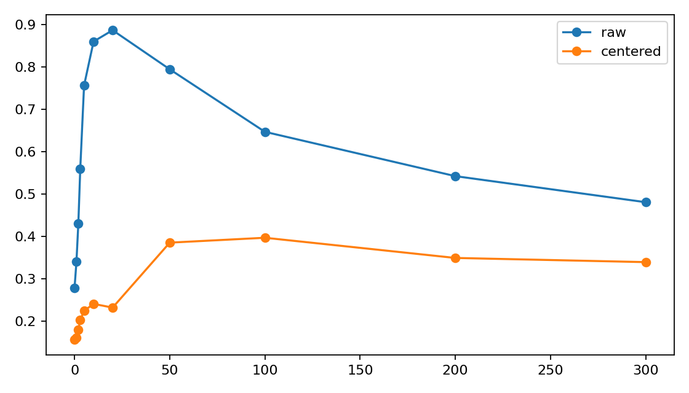
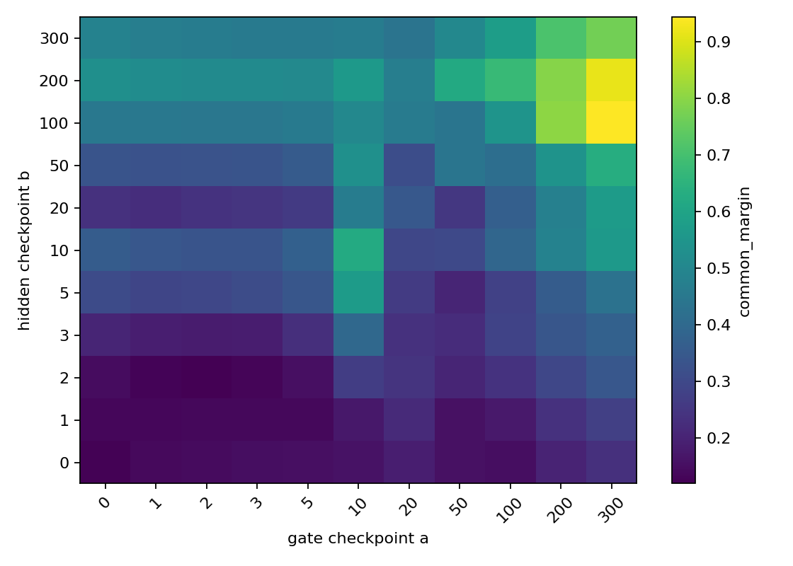

# Meeting Brief: Early-Training Common-Logit Amplification

## **Question**

真实 DCLM 文本中的 top-1 稀疏混合专家路由器，在训练前 10 步为什么会快速出现共同分量分数放大和专家负载集中？

这里的共同分量指固定审计 token 的路由输入均值 $c$。共同分量分数放大指不同专家在 $w_e^\top c$ 上的差距变大。负载集中指少数专家接收过多 token，但其他专家不一定完全死亡。

本轮重点不是重新证明第 0 步已经存在偏置，而是追问：第 10 步的放大主要来自路由器权重 $W$ 的更新、路由输入隐藏状态 $H$ 的变化、专家参数更新，还是这些因素之间的相互作用？

## **Conclusion**

本轮两个实验把之前的主线进一步收窄：

1. **第 10 步的共同分量分数放大不是单纯由路由器权重更新造成的。**  
   交叉 checkpoint 回放计算 $Z_{a,b}=H_bW_a^\top$。在第 5 层，正常训练从 step 0 到 step 10 的 `common_margin` 增量为 `1.2760`；但只把 step 10 路由器权重放到 step 0 隐藏状态上，即 $W_{10}H_0$，贡献为 `-0.0137`。因此不能把早期放大解释成“router 自己更新后直接制造了全部共同分量优势”。

2. **第 10 步的完整共同分量分数放大主要需要隐藏状态变化和 gate-hidden interaction。**  
   在第 5 层，$W_0H_{10}$ 的 hidden-only 贡献为 `0.4858`，剩余 interaction 为 `0.8038`。这里 interaction 指：单独改变 $W$ 和单独改变 $H$ 都解释不了的剩余项，即 $W$ 与 $H$ 同时改变后产生的额外放大。

3. **共同分量分数放大和原始 top-1 负载集中相关，但不是同一个现象。**  
   冻结全部路由器权重后，`raw_max_load_delta` 仍为 `0.7314`，几乎等于正常训练的 `0.7334`；但 `common_margin_delta` 只剩 `0.5354`，低于正常的 `1.2760`。这说明固定随机 gate 加上隐藏状态变化，已经足以造成强 top-1 负载集中；但完整共同分量分数放大还需要 gate-hidden interaction。

4. **第 5 层快速 spike 被定位到第 5 层 router 输入之前的 hidden-producing path。**  
   冻结第 5 层 gate 输入之前的隐藏状态生成路径后，`common_margin_delta` 从 `1.2760` 降到 `0.0278`，`raw_max_load_delta` 从 `0.7334` 降到 `0.0660`。因此第 5 层 step-10 快速 spike 不是普通随机波动，而是由进入该层 router 的隐藏状态生成路径驱动。

**主线更新：**  
真实文本 top-1 MoE 的早期问题应拆成两层：一层是 raw top-1 负载集中，固定随机 gate 加隐藏状态漂移就可以产生；另一层是共同分量分数通道的强放大，需要 hidden drift、expert update 和 gate-hidden interaction。当前已经不能说“router 权重更新单独造成早期集中”，也不能说“共同分量从第 0 步开始静态主导”。更准确的说法是：共同分量是 batch-stable、checkpoint-specific 的偏置方向；训练早期的隐藏状态变化和 gate-hidden interaction 会把它转化成严重负载集中。

## **Key Evidence**

**Evidence 1: 正常训练复现第 10 步早期集中。**

A06_02_01 正常训练中，3 个 seed、6 层平均：

```text
step0  raw_max_load = 0.2781
step10 raw_max_load = 0.8602
step0  common_margin = 0.1237
step10 common_margin = 0.6236
```

第 5 层最强：

```text
step0  raw_max_load = 0.2582
step10 raw_max_load = 0.9916
step0  common_margin = 0.1482
step10 common_margin = 1.4242
```

解释：早期集中是稳定复现的现象，但 step 300 又回落，说明这里审计的是早期训练动力学，不是长期专家死亡。



**Evidence 2: $W_{10}H_0$ 不解释第 5 层共同分量 spike。**

交叉 checkpoint 回放定义：

```text
A_actual      = common_margin(W10,H10) - common_margin(W0,H0)
A_gate        = common_margin(W10,H0)  - common_margin(W0,H0)
A_hidden      = common_margin(W0,H10)  - common_margin(W0,H0)
A_interaction = A_actual - A_gate - A_hidden
```

第 5 层结果：

```text
A_actual      = 1.2760
A_gate        = -0.0137
A_hidden      = 0.4858
A_interaction = 0.8038
```

解释：gate-only 贡献接近 0，hidden-only 只能解释一部分，最大剩余来自 $W$ 和 $H$ 同时变化后的 interaction。



**Evidence 3: freeze split 说明 raw load 和 common-margin 需要分开解释。**

第 5 层 step 0 到 step 10，3 个 seed 平均：

| condition | common_margin_delta | raw_max_load_delta | interpretation |
|---|---:|---:|---|
| normal | 1.2760 | 0.7334 | 正常 spike |
| freeze_gate_all | 0.5354 | 0.7314 | 固定 gate 仍有 raw load 集中，但 common-margin 不完整 |
| freeze_experts_all | 0.1919 | 0.7183 | 专家更新对 common-margin 重要，但 raw load 仍集中 |
| freeze_gate_and_experts | 0.2872 | 0.7114 | 非专家 hidden-producing path 仍可造成 raw load 集中 |
| freeze_prefix_before_layer5 | 0.0278 | 0.0660 | 第 5 层 spike 基本被压掉 |

解释：如果只看 `raw_max_load`，会误以为 gate/expert 更新都不重要；如果只看 `common_margin`，会忽略固定 gate 下仍然存在的负载集中。因此这两个指标回答的是不同问题。

**Evidence 4: 冻结语义通过梯度范数检查。**

```text
freeze_gate_all:
  router_grad_norm = 0.0000

freeze_experts_all:
  expert_grad_norm = 0.0000

freeze_gate_and_experts:
  router_grad_norm = 0.0000
  expert_grad_norm = 0.0000
```

解释：冻结条件确实冻结了目标模块，所以 freeze split 的差异可以用于因果判断。

**Evidence 5: common direction 是 batch-stable，但不是训练全程静态。**

A06_02_02 在 step 10、layers 3--5 上：

```text
pairwise_cos_mean >= 0.9999
primary_secondary_cos = 1.0000
common-winner agreement = 1.0000
```

但第 5 层 common direction 相对 step 0：

```text
step10 cos_to_step0  = 0.2574
step300 cos_to_step0 = 0.1417
```

解释：共同分量不是固定审计 batch 的偶然均值；它在同一 checkpoint 的不同 batch 间稳定。但它会随训练旋转，因此不能把它说成一个从 step 0 到 step 300 都不变的静态方向。

## **Detailed Setup**

**Data:**

```text
dataset = DCLM packed binary stream
sample_span = 257 tokens
input_tokens = 256
target_tokens = shifted 256
padding = none
train_sequences = 32768
audit_sequences = 8192
audit_tokens = 8192 x 256 = 2,097,152
```

**Model:**

```text
model = random-initialized Qwen-style decoder-only MoE
pretrained = false
layers = 6
hidden_size = 512
attention_heads = 8
kv_heads = 4
experts = 8
expert_hidden_dim = 2048
vocab_size = 151936
initializer_range = 0.02
```

**Router and MoE:**

```text
router = bias-free linear gate
router_input = exact hidden state entering the real gate
top_k = 1
shared_expert = false
load_balance_loss = 0.0
norm_topk_prob = false
oracle_gating = false
multihead_routing = false
```

**Runs:**

```text
A06_02_01:
  job_state = ACP marked failed after outputs completed
  completed_outputs = trajectory/replay/fraction tables complete
  reason = idle rank timed out at final distributed barrier

A06_02_02:
  job_id = pt-tfd7w34x
  state = succeeded
  trajectory_rows = 1386 / 1386 expected
  checkpoint_rows = 231 / 231 expected
  replay_rows = 15246 / 15246 expected
  fraction_rows = 126 / 126 expected
  max_router_logit_reconstruction_error = 0.0
```

## **Current Interpretation**

当前最稳妥的解释是：

```text
真实文本隐藏状态在训练早期快速漂移。
固定随机 top-1 gate 已经可以把这种漂移转成专家负载集中。
共同分量方向在同一 checkpoint 上跨 batch 稳定，因此可以被 router 读到。
完整 common-margin spike 需要 hidden drift 与 gate-hidden interaction。
专家参数更新强化 common-margin 通道，但不是 raw load concentration 的必要条件。
```

这不是在说所有专家已经死亡，也不是在说共同分量从初始化开始就静态主导，更不是在说大模型或预训练 MoE 必然出现同样机制。

## **Boundary**

当前结论覆盖：

- DCLM packed text。
- 随机初始化小型 Qwen-style causal LM。
- 6 层、8 专家、top-1 sparse MoE。
- 关闭 shared expert。
- 关闭 load-balance loss。
- 训练前 300 步。
- exact router input 上的 common-margin、raw load、centered load、cross-checkpoint replay 和 freeze split。

当前结论不覆盖：

- 预训练大模型。
- shared-expert MoE。
- top-2 或 top-4 训练。
- 长训练后的最终专家功能分工。
- 可部署缓解方法。
- Phase C expert-output forward-feedback intervention；这一项尚未执行。

## **Next Step**

下一步应该只追问剩下的 raw load concentration 机制：

```text
fixed random gate 下仍然出现 raw load concentration，
它究竟来自 residual anisotropy、position structure，
还是 expert-output forward feedback？
```

最小后续实验应拆分这三个竞争解释，而不是继续扩大共同分量 replay 网格。当前 common-margin claim 已经足够收窄：第 5 层 step-10 快速 common-logit spike 需要 layer-5 hidden-producing path 和 gate-hidden interaction。
