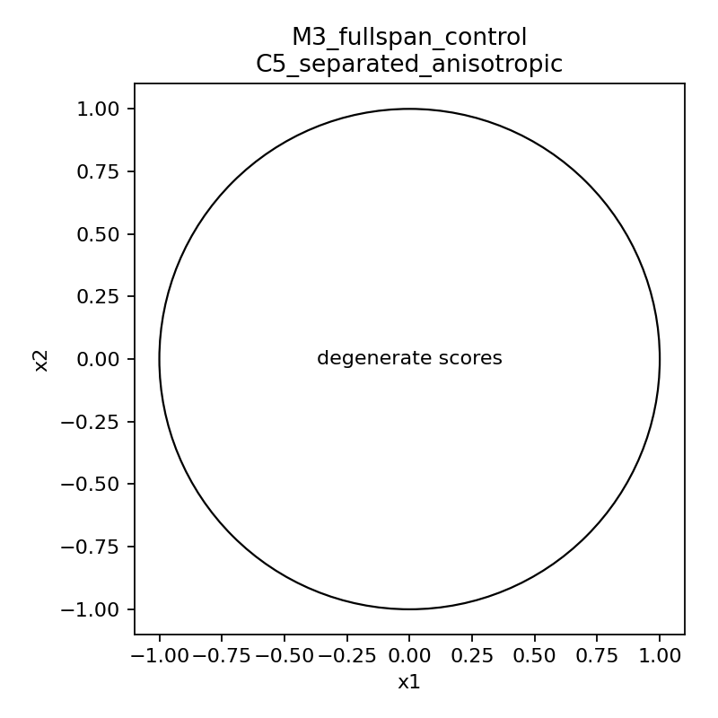

# Detailed: A06_E01_2x2_expert_geometry_metric_audit

Primary anchor: `06_2x2_expert_geometry_gate_anchor.md`  
Protocol: `protocol.md`  
Summary: `summary.md`

## 0. Quick Recap

Purpose:
Identify which expert-initialization-induced compatibility metric $q_e(x)$ is a valid static oracle routing metric in the minimal two-expert, two-dimensional setting.

Hypothesis:
Matrix response energy $q_e(x)=x^\top A_e^\top A_ex$ should be the most direct $2\times2$ expert-matrix geometry metric.

Experiment logic:
Compare prototype, projection, and matrix-response metrics across valid, degenerate, and confusing expert geometries. Judge each metric by load, margin, degeneracy, sign sensitivity, and predicted failure behavior.

Conclusion:
M4 matrix response energy is supported as the core metric. M3 top-1 projection is a useful low-rank approximation candidate. Prototype metrics are useful baselines but sign-sensitive. Full-span projection is invalid in 2D.

Evidence:
M4 has valid rate 1.00 in C3/C5, natural load error 0.0000 in both, and mean margin 1.5444 / 2.3873. In C2 it degenerates with mean margin approximately zero, as predicted.

## 1. Anchor Link And Decision Point

Anchor decision question:
In the minimal $2\times2$ setting, which expert-initialization-induced compatibility metric can define a non-degenerate static oracle routing rule that supports both balanced load and metric-defined specialization under uniform input?

Decision after this experiment:
Use M4 matrix response energy as the core mathematical model for the next router-construction or high-dimensional low-rank approximation stage.

## 2. Protocol Compliance Audit

approved conditions match actual conditions:
Yes. C1 random unconstrained, C2 orthogonal equal singular values, C3 orthogonal unequal singular values, C4 near-identical, and C5 separated anisotropic were run.

primary metric exists:
Yes. `metric_validity` is summarized in `tables/aggregate_metric_summary.csv` and `tables/metric_decision_summary.csv`.

central figures/tables exist:
Yes. Central tables are `aggregate_metric_summary.csv`, `metric_decision_summary.csv`, `sign_sensitivity.csv`, and `calibration_summary.csv`. Central figures are in `figures/`.

seeds/checkpoints recorded:
Yes. 100 expert-geometry seeds per condition. No checkpoints because this is a static audit.

known good/bad/confusing cases reviewed:
Yes. C5 supports the known-good anisotropic case; C2 supports isotropic degeneracy; M3 full-span is degenerate; M1/M2 expose sign sensitivity.

success/failure/insufficient-evidence criteria applied:
Yes. The result supports M4, weakens prototype-as-core, and validates full-span projection as a negative control.

## 3. Setup

Code:
`run_metric_audit.py`

Command:
`python run_metric_audit.py`

Input distribution:

- primary: 10,000 deterministic uniform samples on $S^1$;
- secondary: 10,000 random uniform unit-disk samples.

Expert seeds:
100 per condition.

Metric candidates:

- M1 signed prototype;
- M2 unsigned prototype;
- M3 top-1 projection;
- M3 full-span control;
- M4 matrix response.

Implementation correction during execution:
The first run incorrectly allowed M1/M2 prototypes under equal singular values because SVD returned arbitrary directions. The script was corrected so equal-singular-value prototypes are marked `undefined_prototype_equal_singular_values`, consistent with the protocol's right-singular-vector convention. Figures were also corrected to mark degenerate scores instead of plotting numerical noise.

## 4. Metrics And Decision Rules

Primary metric:
`metric_validity`

Decision components:

- non-degenerate scores;
- positive selected-expert margin;
- acceptable natural load or calibrated load with margin preserved;
- predicted failure in degenerate cases;
- sign-sensitive metrics identified explicitly.

Secondary metrics:

- `natural_load_error`;
- `calibrated_load_error`;
- `natural_mean_margin`;
- `natural_degeneracy_rate`;
- `sign_sensitivity_mean`;
- `sign_sensitivity_max`.

Important caveat:
The binary `metric_validity` threshold is permissive for near-identical experts because any positive margin above $10^{-6}$ can pass after calibration. For C4, margin scale is more informative than the valid/invalid flag.

## 5. Main Results

### Aggregate Decision Table

| Metric | Overall valid rate | C2 valid | C3 valid | C5 valid | Natural margin mean | Sign sensitivity mean | Interpretation |
| --- | ---: | ---: | ---: | ---: | ---: | ---: | --- |
| M1 signed prototype | 0.80 | 0.00 | 1.00 | 1.00 | 0.6261 | 0.5333 | Balanced but sign-sensitive baseline. |
| M2 unsigned prototype | 0.80 | 0.00 | 1.00 | 1.00 | 0.3601 | 0.2633 | Less sign-sensitive, still prototype-dependent. |
| M3 top-1 projection | 0.80 | 0.00 | 1.00 | 1.00 | 0.3610 | n/a | Useful low-rank candidate. |
| M3 full-span control | 0.00 | 0.00 | 0.00 | 0.00 | ~0 | n/a | Correctly invalid in 2D. |
| M4 matrix response | 0.80 | 0.00 | 1.00 | 1.00 | 1.1716 | n/a | Best core metric. |

### M4 Condition-Level Evidence

| Condition | Valid rate | Natural load error | Natural mean margin | Degeneracy rate | Interpretation |
| --- | ---: | ---: | ---: | ---: | --- |
| C1 random unconstrained | 1.00 | 0.2377 | 1.9035 | 0.0000 | Valid after calibration; random energy budgets can be naturally imbalanced. |
| C2 equal singular values | 0.00 | 0.3669 | ~0 | 1.0000 | Correct degeneracy. |
| C3 unequal singular values | 1.00 | 0.0000 | 1.5444 | 0.0000 | Strong support. |
| C4 near-identical | 1.00 | 0.2430 | 0.0226 | 0.0000 | Low-confidence margin; valid flag alone is too permissive. |
| C5 separated anisotropic | 1.00 | 0.0000 | 2.3873 | 0.0000 | Strongest support. |

## 6. Visualization Results

### M4 Matrix Response On Separated Anisotropic Experts


Purpose:
Show whether the main candidate metric produces an interpretable 2D partition in the clean anisotropic case.

Setup:
C5 separated anisotropic experts, seed 0, metric M4.

How to read:
Blue and orange are assigned expert regions. The dark band marks the low-margin boundary.

Observed result:
The partition is clean and symmetric, with natural load error 0.0000 and mean margin 2.3873.

Take-home:
M4 directly expresses the intended $2\times2$ expert-matrix geometry in the clean case.

Remaining uncertainty:
This does not test whether a trainable router can approximate the M4 boundary.

### M4 Degenerate Equal-Singular-Value Control


Purpose:
Confirm that M4 fails when no anisotropic input sensitivity exists.

Setup:
C2 orthogonal equal singular values, seed 0, metric M4.

How to read:
The plot prints `degenerate scores` because $q_1(x)$ and $q_2(x)$ are equal up to numerical tolerance.

Observed result:
Degeneracy rate is 1.0000 and mean margin is approximately zero.

Take-home:
M4 fails for the right reason.

Remaining uncertainty:
This only tests the isotropic control, not real trained expert geometry.

### Signed Prototype Baseline


Purpose:
Show what the simple signed prototype baseline does in the clean separated case.

Setup:
C5 separated anisotropic experts, seed 0, M1 signed prototype.

How to read:
The straight boundary shows a half-space split.

Observed result:
Natural load error is 0.0000 and mean margin is 0.9003, but mean sign sensitivity is 0.5333 across conditions.

Take-home:
Prototype routing can partition the input but is not a stable expert-matrix metric.

Remaining uncertainty:
One could define a separate sign convention, but that would be an extra modeling assumption not supported by this audit.

### Full-Span Projection Control



Purpose:
Verify that full-span projection is not a valid metric in 2D.

Setup:
C5 separated anisotropic experts, seed 0, M3 full-span control.

How to read:
The plot marks degenerate scores because both experts span all of $\mathbb{R}^2$.

Observed result:
Valid rate is 0.00 and degeneracy rate is 1.0000 in every condition.

Take-home:
Distance to the full expert span is uninformative in this minimal setting.

Remaining uncertainty:
Top-rank projection may still be useful as a low-rank approximation.

## 7. Stage Evidence And Failure Decomposition

| Stage | Evidence | Passed / failed / unclear | Failure reason | What this rules out |
| --- | --- | --- | --- | --- |
| Expert construction | `condition_summary.csv` records singular values and dominant directions. | Passed | n/a | Rules out condition mismatch as the main result source. |
| Metric computation | `aggregate_metric_summary.csv` and `metric_decision_summary.csv` summarize the full metric-condition-seed run. | Passed | n/a | Rules out missing metric coverage at the reported decision level. |
| Degenerate controls | C2 M4 degeneracy rate 1.0000; M3 full-span valid rate 0.00. | Passed | Expected degeneracy. | Rules out accepting full-span or isotropic geometry as specialization. |
| Sign audit | M1 sign sensitivity 0.5333; M2 0.2633. | Passed | Prototype sign dependence. | Rules out signed prototype as the core metric. |
| Calibration audit | C1 M4 natural load error 0.2377, calibrated load error 0.0000 with margin 1.4801. | Passed with caveat | Natural load imbalance under unequal energy budgets. | Rules out load balance as a necessary natural property for arbitrary matrices. |
| Metric selection | M4 has strongest C3/C5 margins and correct C2 failure. | Passed | n/a | Supports M4 as next-stage core metric. |

Falsified physical prior:
None. Expert-side input geometry can define useful metrics in anisotropic cases.

Falsified mathematical model:
Full-span projection as a metric is falsified in 2D.

Falsified operationalization / proxy:
Signed prototype as the core expert-matrix metric is weakened because of sign sensitivity.

Falsified implementation:
The initial implementation allowed arbitrary SVD directions under equal singular values; this was corrected before final results.

Falsified metric:
Binary `metric_validity` alone is too permissive for near-identical experts. Margin scale must be read with it.

Remaining rival explanations:
A trainable router may fail to approximate M4; high-dimensional low-rank approximation may lose the margin; common components may dominate real router inputs.

## 8. Full Experiment Record

Run command:

```bash
python run_metric_audit.py
```

Rows:

- full per-seed metric table: generated by `run_metric_audit.py` as `tables/metric_summary.csv`, but not promoted to Git because it is a raw reproducible artifact.
- Conditions: 5.
- Metrics: 5.
- Seeds per condition: 100.
- Unit-circle samples per seed: 10,000.
- Unit-disk samples per seed: 10,000.

Central output files:

- `tables/aggregate_metric_summary.csv`
- `tables/metric_decision_summary.csv`
- `tables/condition_summary.csv`
- `tables/sign_sensitivity.csv`
- `tables/calibration_summary.csv`
- `figures/partition_M4_matrix_response_C5_separated_anisotropic.png`
- `figures/partition_M4_matrix_response_C2_orthogonal_equal_singular.png`
- `figures/partition_M1_signed_prototype_C5_separated_anisotropic.png`
- `figures/partition_M3_fullspan_control_C5_separated_anisotropic.png`

## 9. Interpretation

Observation:
M4 matrix response energy has the largest margins in the decisive anisotropic cases and fails exactly when the expert matrices are isotropic.

Interpretation:
The full $G_e=A_e^\top A_e$ metric is the right minimal mathematical object for expert-aware routing in 2D.

Claim:
M4 should become the next-stage core metric.

Boundary:
This claim is static and geometric. It says nothing about trainability.

Observation:
M3 top-1 projection works in anisotropic cases but has lower margins than M4.

Interpretation:
M3 is a reasonable low-rank approximation target if M4 becomes too expensive or too high-dimensional.

Boundary:
It ignores singular-value scale and secondary directions.

Observation:
Prototype metrics route cleanly in many non-degenerate cases but show high sign sensitivity.

Interpretation:
Prototype metrics are useful baselines but not stable enough to be the core expert-matrix metric without an additional sign convention.

Boundary:
The result does not rule out a separately justified sign convention.

## 10. Claim Boundary

Can claim:

- M4 matrix response energy is supported as the core $2\times2$ expert-geometry metric.
- M3 top-1 projection is supported as a low-rank approximation candidate.
- M1/M2 prototypes are baselines, not the core metric.
- Full-span projection is invalid in 2D.

Cannot claim:

- Training will learn M4.
- A linear router can approximate M4.
- The result transfers to real text, high-dimensional MoE, or common-filtered hidden states.
- This proves semantic feature specialization or causal expert utility binding.

## 11. Next Decision

Next decision:
Test whether a router-construction rule can approximate the M4 oracle while preserving load and margin.

Recommended minimal follow-up:
Compare a quadratic M4 oracle, a top-1 projection approximation, and the best linear approximation on the same 2D conditions before moving to high-dimensional low-rank approximation.

## 12. Links And Artifact Map

anchor:
`06_2x2_expert_geometry_gate_anchor.md`

protocol:
`protocol.md`

summary:
`summary.md`

code workspace:
`Projects/from-attention-to-search/main/experiments/A06_E01_2x2_expert_geometry_metric_audit/`

runner:
`run_metric_audit.py`

config:
Constants inside `run_metric_audit.py`.

key code files:
`run_metric_audit.py`

data / manifest:
Synthetic 2D expert matrices generated by condition and seed inside `run_metric_audit.py`.

result dir:
`Projects/from-attention-to-search/main/experiments/A06_E01_2x2_expert_geometry_metric_audit/`

figure dir:
`figures/`

key tables:
`tables/aggregate_metric_summary.csv`, `tables/metric_decision_summary.csv`, `tables/calibration_summary.csv`, `tables/sign_sensitivity.csv`

logs / checkpoints:
No checkpoints. No training.

repro command:
`python run_metric_audit.py`

job id:
local run, no scheduler job id.
