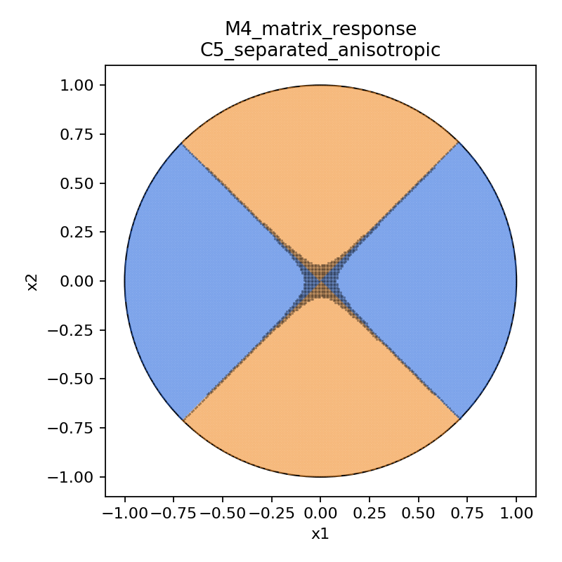
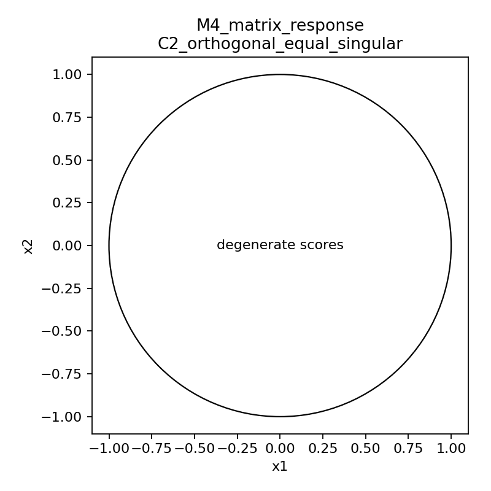
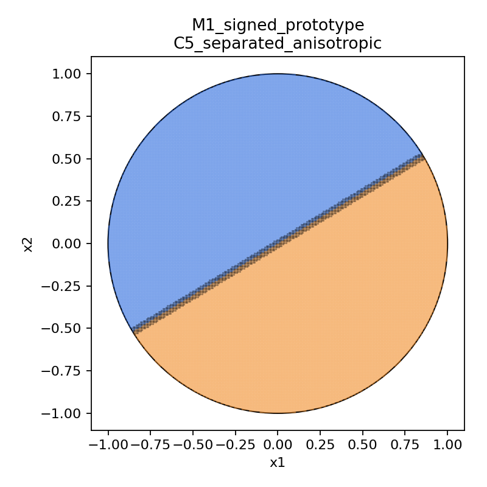

# Summary: A06_E01_2x2_expert_geometry_metric_audit

Primary anchor: `06_2x2_expert_geometry_gate_anchor.md`  
Protocol: `protocol.md`

## Purpose

This experiment tests which compatibility metric $q_e(x)$ should be used as the first mathematical object for expert-aware routing in the minimal two-expert, two-dimensional setting.

The uncertainty reduced here is not whether training will work. The uncertainty is which expert-initialization-induced metric can define a non-degenerate static oracle routing rule before any trainable router is introduced.

## Exact Setup

Two experts are represented as $2\times2$ matrices $A_1,A_2$. Inputs are sampled uniformly from the unit circle $S^1$ with 10,000 samples per seed and 100 expert-geometry seeds per stochastic condition.

Compared metrics:

- M1 signed prototype: $q_e(x)=x^\top m_e$.
- M2 unsigned prototype: $q_e(x)=(x^\top m_e)^2$.
- M3 top-1 projection: $q_e(x)=\|V_{e,1}^\top x\|^2$.
- M3 full-span control: $q_e(x)=\|V_{e,1:2}^\top x\|^2$.
- M4 matrix response: $q_e(x)=x^\top A_e^\top A_ex=\|A_ex\|^2$.

Expert conditions:

- C1 random unconstrained matrices;
- C2 orthogonal equal singular values;
- C3 orthogonal unequal singular values;
- C4 near-identical experts;
- C5 clearly separated anisotropic experts.

## Primary Metric

Primary metric: `metric_validity`.

It jointly checks whether a metric is non-degenerate, has positive selected-expert margin, has acceptable natural load or calibrated load with margin preserved, fails predicted degenerate cases for the right reason, and does not hide sign sensitivity.

This decides the current question because load alone can be arbitrary, and margin alone can be imbalanced. A usable metric must separate load balance from metric-defined specialization.

## Result

M4 matrix response energy is the best core metric for the next stage.

It succeeds in the anisotropic cases and fails in the expected isotropic case:

| Condition | M4 valid rate | Natural load error | Natural mean margin | Interpretation |
| --- | ---: | ---: | ---: | --- |
| C2 equal singular values | 0.00 | 0.3669 | ~0 | Correct degeneracy: $G_e=I$ gives no expert distinction. |
| C3 unequal singular values | 1.00 | 0.0000 | 1.5444 | Strong support: anisotropy creates a clean metric partition. |
| C5 separated anisotropic | 1.00 | 0.0000 | 2.3873 | Strong support: separated dominant directions give the clearest partition. |

M3 top-1 projection is a useful low-rank approximation candidate, but it discards singular-value scale. In C5 its mean margin is 0.6366 versus M4's 2.3873.

M1/M2 prototype metrics often produce balanced partitions, but they are not suitable as the main expert-matrix metric because they depend on arbitrary oriented singular-vector signs. Mean sign-sensitivity is 0.5333 for M1 and 0.2633 for M2.

M3 full-span projection is a successful negative control: it is degenerate in every condition because both full spans equal $\mathbb{R}^2$ in 2D.

Important metric caveat: the binary `metric_validity` criterion is too permissive for near-identical experts. In C4, M4 can be marked valid after calibration, but its natural mean margin is only 0.0226. Therefore near-identical cases should be read by margin scale, not only by valid rate.

## Key Figures

### Figure: M4 Matrix Response On Separated Anisotropic Experts

What this tests:
Whether the full matrix response metric can partition a clean anisotropic two-expert geometry.

How to read:
Blue and orange are the two expert assignments under $g(x)=\arg\max_e x^\top A_e^\top A_ex$. The black band marks the low-margin boundary.

Observed result:
The partition is clean and symmetric, with natural load error 0.0000 and mean margin 2.3873.

Take-home:
M4 captures the intended expert-matrix geometry in the clearest 2D case.

What this does not prove:
It does not prove that training will learn or preserve this partition.

### Figure: M4 Matrix Response Degenerates For Equal Singular Values

What this tests:
Whether M4 fails when experts have no anisotropic input sensitivity.

How to read:
The plot marks degenerate scores because $G_e=I$ makes $q_1(x)=q_2(x)$ up to numerical tolerance.

Observed result:
Degeneracy rate is 1.0000 and mean margin is approximately zero.

Take-home:
The metric fails for the right reason in the isotropic control.

What this does not prove:
It does not show that every random expert has useful geometry; it only validates the predicted failure mode.

### Figure: Signed Prototype Baseline On Separated Anisotropic Experts

What this tests:
Whether a simple linear prototype can partition the same clean geometry.

How to read:
The straight boundary shows the signed prototype's half-space split.

Observed result:
It gives load error 0.0000 and mean margin 0.9003, but sign-sensitivity is high.

Take-home:
Prototype routing is a useful baseline but not the main geometry model.

What this does not prove:
It does not prove stable expert geometry because the prototype depends on arbitrary oriented singular-vector signs.

## Claim Boundary

Can claim:

- M4 matrix response energy is the best current $2\times2$ compatibility metric for expert-aware static oracle routing.
- M3 top-1 projection is a plausible low-rank approximation candidate.
- Prototype metrics are baselines, not the core metric, because of sign sensitivity and loss of anisotropy.
- Full-span projection is invalid in 2D.

Cannot claim:

- A trainable router will learn this metric.
- This solves real MoE collapse.
- This proves semantic feature specialization or expert utility binding.
- This proves high-dimensional approximation works.
- This proves common removal is sufficient.

## Next Decision

Use M4 matrix response energy as the core model for the next stage, and treat M3 top-1 projection as the low-rank approximation target. The next decision is whether a router-construction rule can approximate the M4 oracle while preserving load and margin.
