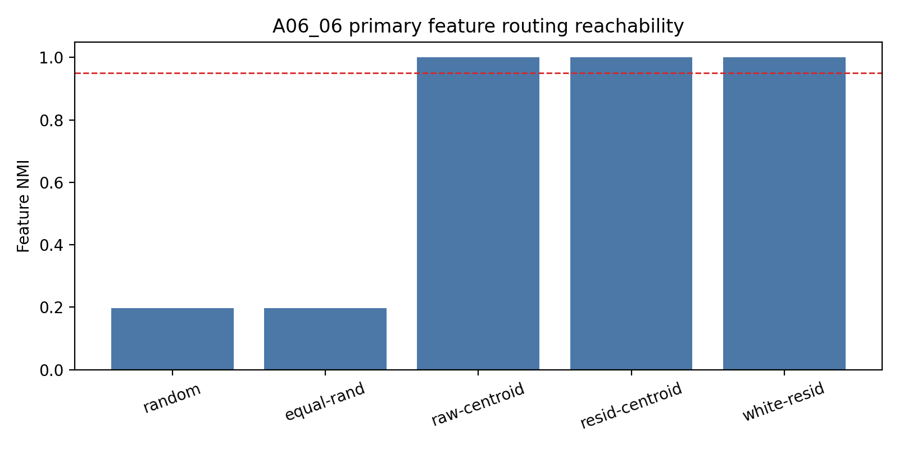
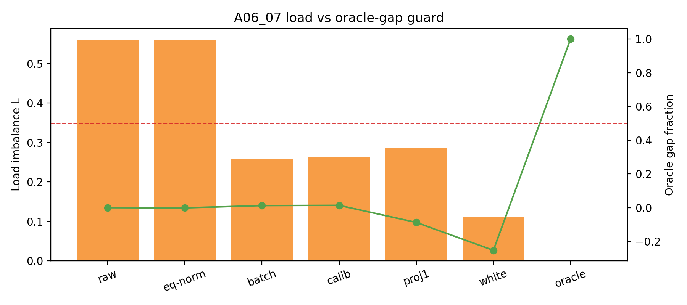

# Meeting Brief: A06_03 to A06_07 Router Geometry Line

## One-Sentence Conclusion

在严格均匀的 synthetic feature 设置里，随机初始化的 dot-product top-1 MoE 不会自然形成 feature-level specialization；我们已经把原因从“是不是 row norm”推进到“hidden common component 和 residual geometry 会制造负载偏置”，并进一步证明：目标 feature partition 本身可达，但只做全局去均值、去主方向、白化这类简单无标签控制，只能改善负载，不能恢复 feature specialization。

下一步不应该继续做只优化负载均匀的 router；应该先做无标签 feature discovery，或者从 oracle / pseudo-oracle partition 出发测试训练早期会不会把好分区破坏。

## Terms First

**Feature 是什么？**

本轮 synthetic setting 里，feature 不是自然语言语义，而是 4 个人工构造的 `(slot_token, target_token)` pair。每个样本只属于一个 `pair_id`，`pair_id=0,1,2,3`。

**Load 是什么？**

Load 是每个 expert 收到多少样本。4 个 expert 完全均匀时，每个 expert 收到 25%。我们用

$$
L = m \max_e |p_e - 1/m|
$$

衡量不均匀程度。这里 $m=4$，$p_e$ 是 expert $e$ 的路由比例。$L=0$ 表示完全均匀；$L$ 越大，负载越偏。

**Feature NMI 是什么？**

Feature NMI 衡量“router 分到的 expert 是否和真实 `pair_id` 对齐”。它回答的是 specialization，而不是负载。负载均匀只说明每个 expert 数量差不多；Feature NMI 高才说明同一种 feature 被稳定分到同一个 expert。

**Common component 是什么？**

给一批 hidden states $h_i$，共同分量就是平均 hidden state：

$$
c = \frac{1}{N}\sum_i h_i
$$

它可以理解成“这批样本共享的平均方向”。如果 router 直接用 $h_i$ 打分，那么 $w_e^\top c$ 可能让某些 expert 天生更容易赢。

**Residual geometry 是什么？**

去掉共同分量后得到 residual：

$$
r_i = h_i - c
$$

Residual geometry 指这些 $r_i$ 在空间里的形状：是不是像一个各方向差不多的球，还是沿某些方向拉长、按位置或 feature 带有结构。0605 的结论是：去掉 common 后，residual 仍不是球状均匀分布，所以随机 router 仍会产生负载偏置。

**Calibration 是什么？**

Calibration 在这里指“用来估计统计量的一半样本”，中文可以叫校准集或估计集。它不是训练集，也不是用标签调参。0606/0607 把每个 pair 的 4096 个样本均匀分成两半：

- calibration：每个 pair 2048 个样本，用来估计均值、协方差、feature centroid 等统计量；
- evaluation：每个 pair 2048 个样本，只用于评估路由效果。

**Calibration mean 是什么？**

Calibration mean 就是在 calibration hidden states 上估计的平均向量：

$$
c_{\text{calib}} = \frac{1}{N_{\text{calib}}}\sum_{j\in C} h_j
$$

然后在 evaluation 样本上使用：

$$
z_e(i) = w_e^\top (h_i - c_{\text{calib}})
$$

这检验的是：只用一批无标签样本估计全局 common component，再把它从 router input 中减掉，能不能恢复 feature routing。

**Whitening 是什么？**

Whitening 中文可以理解成“把 residual 的不同方向重新缩放，让 calibration residual 的协方差尽量接近单位矩阵”。具体做法：

先用 calibration set 估计均值：

$$
c_{\text{calib}} = \frac{1}{N_{\text{calib}}}\sum_{j\in C} h_j
$$

再得到 calibration residual：

$$
r_j = h_j - c_{\text{calib}}
$$

估计协方差：

$$
\Sigma = \frac{R_C^\top R_C}{N_{\text{calib}}-1}
$$

做特征分解：

$$
\Sigma = U \operatorname{diag}(\lambda) U^\top
$$

构造白化矩阵，实验里 $\epsilon=10^{-5}$：

$$
M = U \operatorname{diag}((\lambda+\epsilon)^{-1/2}) U^\top
$$

对 evaluation residual 做变换：

$$
\tilde r_i = (h_i - c_{\text{calib}})M^\top
$$

最后仍然用原来的随机 router row 打分：

$$
z_e(i) = w_e^\top \tilde r_i
$$

所以 whitening 没有用 pair label；它只用了 calibration hidden states 的均值和协方差。

## Data Setting

需要区分 0603 和 0604-0607：

- **0603** 是纯 gate-only 高维 Gaussian 实验，没有 symbolic slot 序列。它回答最理想输入下，随机 dot-product gate 的几何偏置来自哪里。
- **0604-0607** 使用同一类 synthetic hidden-state replay：序列长度 32，4 个严格均匀的 `(slot_token,target_token)` pair，4 个 experts，background token 与 pair id 无关，pair start 随机。
- slot 长度为 1。router readout 取 slot span 的最后一个位置；因为 slot 长度是 1，所以就是 `pair_start`，不是整条序列的最后一个 token。
- 模型只初始化，不训练；实验读 step-0 routing。

0605-0607 都在这个均匀 feature slot setting 上进行。

## Research Line

### 0603: 先看最干净的 gate-only 世界

问题：
如果输入本身是高维均匀分布，随机 dot-product gate 为什么仍有固定负载偏置？

结果：
在纯 gate-only 设置里，Gaussian router row 的 norm variation 会制造额外的 top-1 decision-cell imbalance。把 row norm 控制掉后，不均匀显著下降。

这个实验的作用：
它告诉我们，router row norm 是一个可分离的初始化偏置来源。但这只是理想 gate-only 世界，还没有经过 embedding / attention / hidden-state formation。

### 0604: 进入真实 hidden states 后，row norm 还主导吗？

问题：
当严格均匀的 symbolic features 经过 initialized Transformer hidden-state formation 后，负载不均匀还是主要来自 router row norm 吗？

结果：
不是。主要可测来源变成 hidden common component。row-norm normalization 几乎不降低 $L$；common-centering 明显降低 $L$。

主读数：

| Condition | Mean $L$ | Meaning |
| --- | ---: | --- |
| raw hidden + raw router | 0.5578 | 原始 step-0 routing 很不均匀 |
| norm-controlled router | 0.5577 | 控制 row norm 几乎没用 |
| common-centered hidden | 0.2578 | 去掉 hidden common 后明显改善 |

判断更新：
在 hidden-state setting 里，不能继续把 row norm 当作主解释；主机制转向 hidden common component。

### 0605: common-centering 之后，剩下的 load 是噪声吗？

问题：
去掉 common component 后，剩余 load imbalance 是有限样本噪声，还是 residual hidden states 还有真实几何结构？

结果：
剩余 load 是真实稳定的，不只是样本少造成的。Whitening 能进一步降低 $L$，matched isotropic control 更低，说明 residual covariance / structured residual geometry 仍在起作用。

主读数：

| Condition | Load $L$ |
| --- | ---: |
| common-centered residual replay | 0.2577 |
| centered + whitened replay | 0.1071 |
| matched isotropic replay | 0.0874 |

判断更新：
“去掉 common 就解决初始化几何问题”这个说法不成立。common 是第一层偏置，residual geometry 是下一层偏置。

### 0606: 如果给真实 feature label，目标 partition 可达吗？

问题：
如果我们允许用真实 `pair_id` label 来估计 feature centroid，那么 router 能不能做到 feature-level routing？

结果：
能。Oracle feature centroid 在 held-out evaluation 上达到 perfect routing。

主读数：

| Condition | Feature NMI | Load $L$ |
| --- | ---: | ---: |
| random Gaussian router | 0.1978 | 0.5610 |
| raw feature centroid | 1.0000 | 0.0000 |
| common-centered feature centroid | 1.0000 | 0.0000 |
| whitened residual centroid | 1.0000 | 0.0000 |

判断更新：
目标 feature partition 本身不是不可能。后面如果无标签方法失败，失败原因不是 hidden state 没有 feature signal，而是方法没有找到它。

边界：
0606 用了 label，所以它是 positive control，不是可部署方法。

### 0607: 无标签 global control 能不能接近 oracle？

问题：
不用 pair label，只做全局去均值、去最大主方向、白化，能不能接近 0606 的 oracle feature partition？

结果：
不能。它们可以显著改善 load，但几乎不改善 Feature NMI；whitening 甚至把 Feature NMI 打到接近 0。

全 sweep 均值：

| Condition | Load $L$ | Max load | Feature NMI |
| --- | ---: | ---: | ---: |
| baseline raw | 0.6867 | 0.4124 | 0.2302 |
| equal-norm rows | 0.6834 | 0.4121 | 0.2298 |
| calibration mean | 0.2837 | 0.3166 | 0.2353 |
| held-out batch mean | 0.2828 | 0.3163 | 0.2350 |
| projection top-1 | 0.2881 | 0.3158 | 0.1628 |
| whitened residual | 0.0860 | 0.2681 | 0.0150 |
| oracle feature centroid | 0.0000 | 0.2500 | 1.0000 |

判断更新：
Load balance 不是 specialization。Whitening 是最清楚的反例：它把 load 做得很好，但几乎完全破坏 feature routing。

## Why The Order Matters

0603 先给了理想 gate-only baseline：row norm 确实会造成几何偏置。

0604 说明进入 hidden-state formation 后，主解释改变：common component 比 row norm 更重要。

0605 说明 common-centering 不是终点：residual geometry 仍然制造偏置。

0606 说明目标 partition 是可达的：不能因为随机 router 失败就说 feature specialization 不存在。

0607 说明简单无标签 global control 不够：减少 load 不能当作 specialization 成功。

所以当前研究线不是“我们做了很多 ablation”，而是一个逐步收窄的判断链：

```text
uniform features
↓
不自动得到 uniform routing
↓
不只是 row norm
↓
hidden common component 很重要
↓
去 common 后 residual geometry 仍重要
↓
oracle feature partition 可达
↓
simple label-free global controls 只能修 load，不能找 feature
↓
下一步必须做 feature discovery 或 anti-lockin
```

## Central Figures

这些图只服务于一条判断链：从“负载为什么不均匀”走到“负载均匀不是 specialization”。

### A06_03: Gate-only Row Norm Bias


这张图说明：在纯 gate-only 高维输入里，Gaussian router row 的 norm variation 会增加固定决策区域的不均匀。它是后续 hidden-state 实验的 baseline，不是最终解释。

### A06_04: Hidden Common Component Dominates Row Norm


这张图说明：进入 initialized hidden states 后，去掉 common component 明显降低 load；单独控制 router row norm 几乎没用。

### A06_05: Residual Geometry Remains After Centering


这张图说明：common-centering 后仍有 residual load；whitening 和 matched isotropic control 都降低 load，说明 residual geometry 仍然是实在的几何因素。

### A06_06: Oracle Feature Partition Is Reachable



这张图说明：如果允许用真实 feature label 构造 centroid，feature-level routing 可以达到 perfect held-out NMI。

### A06_07: Load Improvement Is Not Specialization



这张图说明：calibration mean 和 whitening 可以显著降低 load，但 oracle-gap fraction 没有变好；特别是 whitening，load 很好但 Feature NMI 崩掉。

## What We Can Claim

- 在这个 synthetic hidden-state replay setting 中，严格均匀的 feature frequency 不保证均匀 routing，更不保证 feature-level specialization。
- Row norm 是 gate-only 世界的一个可分离偏置来源，但不是 0604-0607 hidden-state setting 的主解释。
- Hidden common component 是 step-0 load imbalance 的重要来源。
- 去掉 common 后 residual geometry 仍然会造成负载偏置。
- Oracle feature centroid 能达到 perfect held-out feature routing，说明 feature partition 可达。
- Simple label-free global centering / projection / whitening 不能作为 feature-specialization 方法；它们主要是 load controls。

## What We Cannot Claim

- 不能说所有 label-free 方法都失败；clustering、dictionary learning、contrastive grouping、gradient proxy 等还没有被裁定。
- 不能说真实 DCLM 上 feature 已经定义好了。
- 不能说训练会保持 oracle partition。
- 不能说 expert utility 或 semantic specialization 已经被证明。
- 不能把 load balance 当成 specialization 的主指标。

## Next Decision

最自然的下一步有两条：

1. **先发现 feature，再初始化 router。**  
   在 residual hidden states 上做 clustering、dictionary learning、contrastive feature estimation、gradient proxy 等，先得到 pseudo-feature centers，再测试 router initialization。

2. **从好 partition 出发测试 early lock-in。**  
   用 oracle 或 pseudo-oracle partition 初始化，然后观察 top-1 training 是否会破坏这个 partition，以及需要什么 anti-lockin 机制保护它。

如果进入真实 DCLM，必须先定义 feature/proxy specialization metric。不能只看 load。

## Source Map

- A06_03 summary: `Projects/from-attention-to-search/main/experiments/A06_03_high_dimensional_gaussian_gate_norm_variation/summary.md`
- A06_04 summary: `Projects/from-attention-to-search/main/experiments/A06_04_real_hidden_state_gate_geometry_decomposition/summary.md`
- A06_05 summary: `Projects/from-attention-to-search/main/experiments/A06_05_common_centered_residual_geometry_diagnostic/summary.md`
- A06_06 summary: `Projects/from-attention-to-search/main/experiments/A06_06_feature_level_initialization_positive_control/summary.md`
- A06_07 summary: `Projects/from-attention-to-search/main/experiments/A06_07_label_free_common_residual_control_router/summary.md`
- Handwritten line: `daily_research_reports/0622/exp_line.md`
