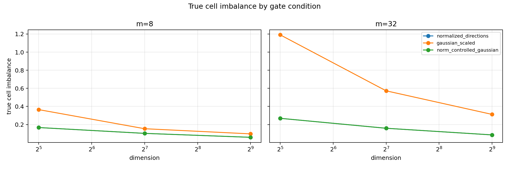
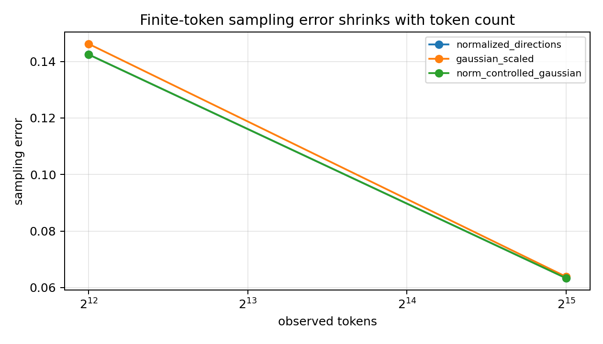

# A06_03 Summary: High-Dimensional Gaussian Gate Norm Variation

## Conclusion

The local paired gate-only experiment supports row-norm variation as the main extra source of true decision-cell imbalance in the standard Gaussian-scaled dot-product top-1 gate.

Across all tested `(d,m)` settings, removing only row-norm variation reduced the Gaussian true-cell imbalance toward the normalized-direction baseline. The norm-controlled Gaussian condition matched the normalized-direction condition because they use the same directions and differ only by a common positive scale.

This is mechanism evidence in a pure random gate-only setting. It does not claim trained MoE collapse, semantic specialization, attention/residual behavior, or a final router method.

## Primary Metric

Primary metric:
`true_cell_imbalance = m * max_e abs(p_e - 1/m)`.

Why it decides the question:
This metric measures the fixed decision-cell geometry of one gate initialization. It separates the gate's true top-1 cell imbalance from finite-token sampling noise.

## Key Results

| d | m | gaussian_scaled | norm_controlled | normalized | gaussian - norm_controlled |
|---:|---:|---:|---:|---:|---:|
| 32 | 8 | 0.3647 | 0.1667 | 0.1667 | 0.1981 |
| 32 | 32 | 1.1910 | 0.2686 | 0.2686 | 0.9224 |
| 128 | 8 | 0.1537 | 0.1023 | 0.1023 | 0.0514 |
| 128 | 32 | 0.5725 | 0.1588 | 0.1588 | 0.4137 |
| 512 | 8 | 0.0968 | 0.0588 | 0.0588 | 0.0380 |
| 512 | 32 | 0.3120 | 0.0854 | 0.0854 | 0.2266 |

Row-norm variation was nonzero only in the Gaussian-scaled condition. Mean Gaussian `row_norm_cv` was largest at lower dimension and remained positive at high dimension, for example 0.1211 at `(d=32,m=32)` and 0.0315 at `(d=512,m=32)`.

Finite-token sampling error decreased when observed tokens increased from 4,096 to 32,768. This supports the separation between sampling noise and fixed gate-cell imbalance.

## Visualization Results

What the figure tests:
Whether the fixed top-1 decision-cell imbalance is higher for Gaussian-scaled gates than for the same directions after row norms are equalized.

How to read it:
Lower is more balanced. Compare `gaussian_scaled` against `norm_controlled_gaussian` at the same dimension and expert count.

Observed result:
`gaussian_scaled` is consistently above `norm_controlled_gaussian`; `norm_controlled_gaussian` overlaps `normalized_directions`.

Take-home:
The extra Gaussian fixed floor is removed when the row-norm term is removed, supporting the row-norm variation hypothesis.

What it does not prove:
It does not show that this mechanism is sufficient to explain trained routing collapse or semantic expert specialization.

What the figure tests:
Whether finite-token observed-load noise shrinks with more sampled tokens.

How to read it:
Lower sampling error at larger token count means observed imbalance is less dominated by finite-token noise.

Observed result:
Sampling error decreases from 4,096 to 32,768 observed tokens across conditions.

Take-home:
The primary conclusion is not just a finite-token artifact; the fixed true-cell floor remains the relevant object.

What it does not prove:
It does not replace the true-cell imbalance metric as the primary causal readout.

## Claim Boundary

Can claim:
In pure gate-only high-dimensional uniform-input top-1 routing, row-norm variation is a causal contributor to the extra fixed true-cell imbalance of standard Gaussian-scaled dot-product gates beyond normalized direction geometry.

Cannot claim:
No claim about trained MoE collapse, semantic specialization, attention/residual dynamics, downstream task quality, or final router design.

## Next Decision

Treat row-norm variation as a separable initialization imbalance term in the broader routing-collapse decomposition. The next research decision is whether this term should become a required diagnostic baseline before interpreting trained-router load imbalance as semantic or data-driven specialization.

## Artifact Map

Anchor:
`Projects/from-attention-to-search/main/problem_anchors/06_03_high_dimensional_gaussian_gate_norm_variation_anchor.md`

Protocol:
`protocol.md`

Script:
`scripts/run_norm_variation_gate.py`

Tables:
`tables/results.csv`, `tables/aggregate_by_condition.csv`, `tables/paired_gaussian_vs_norm_controlled.csv`

Figures:
`figures/true_cell_imbalance_by_condition.png`, `figures/sampling_error_by_tokens.png`
