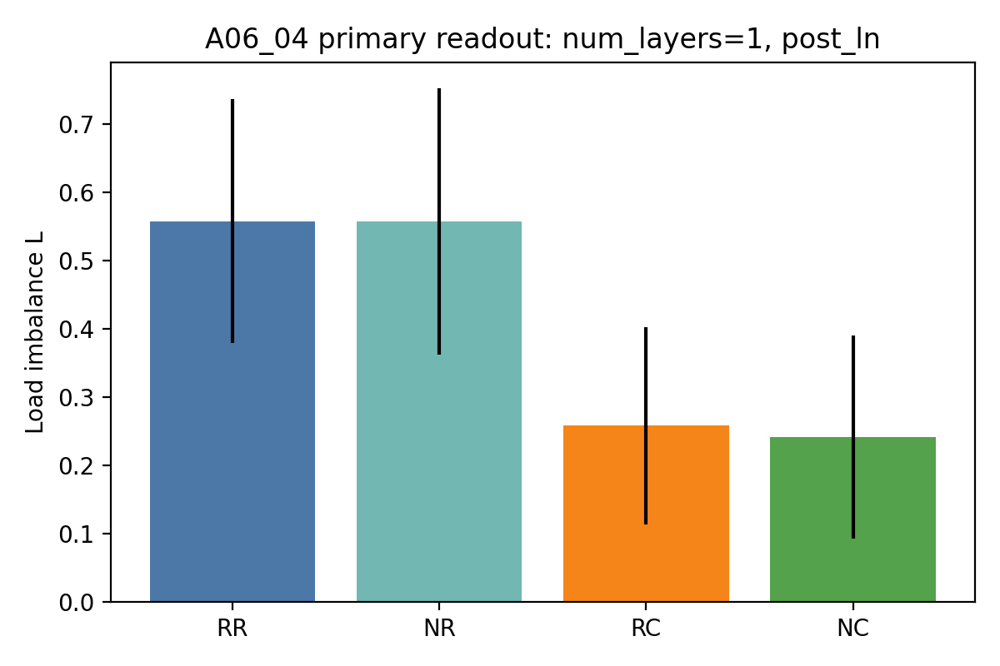
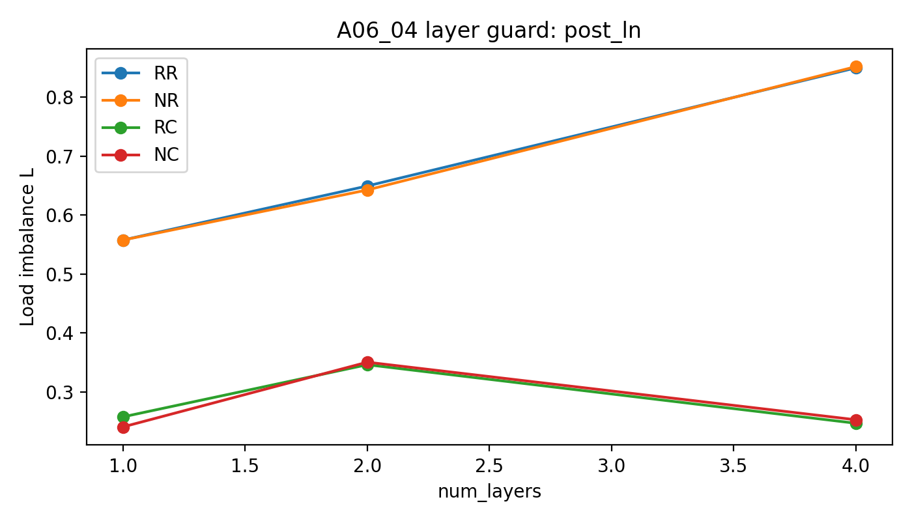

# Summary: A06_04 Synthetic Hidden-State Gate Geometry Decomposition

Primary anchor: `../../problem_anchors/06_04_real_hidden_state_gate_geometry_decomposition_anchor.md`  
Protocol: `protocol.md`

## Purpose

This experiment tests why an initialized dot-product top-1 router gives non-uniform expert load even when the synthetic `(slot,target)` pairs are sampled uniformly.

The uncertainty is whether step-0 load imbalance on model-produced hidden states is mainly explained by router-row norm variation, the hidden-state common component, their interaction, or neither.

## Exact Setup

The data are `seq_len=32` synthetic sequences with 4 uniformly sampled `(SLOT_s,TARGET_s)` pairs and 4 experts. The pair start is randomized over valid positions. All non-pair positions are filled with random background tokens independent of pair id. Routing is read at the last slot position, which is `pair_start` for the one-token slot used here.

The model is initialized only. No training is run. For each seed and layer depth, the final TransformerMoEBlock router input and final-router rows are extracted, then four score replays are computed on the same hidden states:

| Condition | Meaning |
| --- | --- |
| `RR` | raw router row, raw hidden state |
| `NR` | row-norm-normalized router row, raw hidden state |
| `RC` | raw router row, common-centered hidden state |
| `NC` | row-norm-normalized router row, common-centered hidden state |

The run used 8 seeds, `20260521..20260528`; `num_layers=1,2,4`; and `router_input_norm=post_ln,pre_ln_replay`. Each seed/depth used 4096 samples per pair, so each condition read 16,384 samples.

## Primary Metric

Primary metric: load imbalance $L=m\max_e |p_e-1/m|$.

This metric decides the question because the experiment asks whether a uniform symbolic pair distribution becomes non-uniform expert routing after hidden-state formation. Lower $L$ means closer-to-uniform top-1 expert load. The protocol does not use a hard reduction threshold; it reads paired effect direction and guard-sweep stability.

## Result

The result supports hidden common component as the main tested explanation for initialized load imbalance in this synthetic hidden-state setting.

In the primary readout, `num_layers=1` and `post_ln`, common-centering cuts the mean load imbalance by about half, while row-norm normalization does not help:

| Condition | Mean $L$ | Mean max load | Interpretation |
| --- | ---: | ---: | --- |
| `RR` | 0.5578 | 0.3739 | raw initialized routing is imbalanced |
| `NR` | 0.5577 | 0.3755 | row-norm normalization does not reduce imbalance |
| `RC` | 0.2578 | 0.3113 | common-centering gives the main reduction |
| `NC` | 0.2407 | 0.3084 | joint control is slightly lower in the primary readout |

The paired primary effects are:

| Effect | Mean value | Direction across 8 seeds | Judgment |
| --- | ---: | --- | --- |
| $E_{norm}=L^{RR}-L^{NR}$ | 0.0001 | 5 positive, 3 negative | not supported as main cause |
| $E_{common}=L^{RR}-L^{RC}$ | 0.3000 | 8 positive, 0 negative | supported |
| $E_{joint}=L^{RR}-L^{NC}$ | 0.3170 | 8 positive, 0 negative | supported mainly through common-centering |
| $E_{interaction}$ | 0.0169 | 5 positive, 3 negative | not stable |

The guard sweeps keep the same main ordering. Across both `post_ln` and `pre_ln_replay`, common-centering reduces mean $L$ by about 0.30 at 1 and 2 layers, and about 0.60 at 4 layers. Row-norm normalization remains near zero or slightly negative.

## Key Figures

### Figure: Primary Load Imbalance By Replay Condition

What this tests:
Whether norm control, common-centering, or their joint replay most reduces load imbalance in the primary readout.

Anchor question:
Does initialized step-0 top-1 load imbalance mainly come from expert-center norm variation, hidden common component, their interaction, or neither?

Protocol question:
Which score replay condition lowers $L$ on matched hidden states?

Metric shown:
Mean load imbalance $L$ for `num_layers=1`, `router_input_norm=post_ln`.

Metric definition:
$L=m\max_e |p_e-1/m|$, where $p_e$ is the top-1 load fraction for expert $e$.

Data source:
`tables/results.csv` and `tables/aggregate_by_condition.csv`.

How to read:
Lower bars mean closer-to-uniform expert load. `RR` is the raw baseline; `NR` tests row norm; `RC` tests hidden common-centering; `NC` tests the joint replay.

What this figure decides:
It identifies common-centering as the only replay that strongly lowers $L$ in the primary readout.

Observed result:
`RR` and `NR` are almost identical, while `RC` and `NC` are much lower.

Allowed claim:
For this initialized synthetic hidden-state setting, hidden common component is the dominant tested source of load imbalance.

What this figure does not prove:
It does not prove real-text behavior, training collapse, semantic specialization, expert utility, or a router method.

Anchor update implication:
Update the anchor from planned diagnostic to supported common-component mechanism, with residual hidden geometry still alive.

### Figure: Layer Guard Under Post-LayerNorm Readout

What this tests:
Whether the primary ordering is an artifact of the one-layer setting.

Anchor question:
Does the same common-centered replay remain informative when the initialized model has more layers?

Protocol question:
Does the condition ordering stay stable for `num_layers=1,2,4`?

Metric shown:
Mean load imbalance $L$ by layer depth and score replay condition.

Metric definition:
$L=m\max_e |p_e-1/m|$.

Data source:
`tables/aggregate_by_condition.csv`.

How to read:
For each layer depth, compare `RR` with `NR`, `RC`, and `NC`.

What this figure decides:
It checks whether common-centering remains the main reduction under the depth guard.

Observed result:
Raw imbalance grows with depth, especially at 4 layers, and common-centering remains the main reduction. Row-norm normalization stays close to raw.

Allowed claim:
The common-component interpretation is not limited to the one-layer primary readout.

What this figure does not prove:
It does not identify the exact source of the common component or prove a trained-model mechanism.

Anchor update implication:
The next diagnostic should focus on residual hidden geometry after common-centering, not row-norm normalization.

## Claim Boundary

Can claim:

- Uniform symbolic `(slot,target)` sampling can still produce imbalanced initialized top-1 routing after hidden-state formation.
- In this synthetic initialized setting, hidden common-centering is the strongest tested explanation of the imbalance.
- Router-row norm variation is weakened as the main explanation for this hidden-state run, despite earlier gate-only evidence.
- The tested interaction is not stable enough to be the main claim.

Cannot claim:

- Real-text routing behaves the same way.
- Training collapse is explained by this run.
- Semantic or causal expert specialization is achieved.
- Expert utility is aligned with route assignment.
- A final router method follows from this result.

## Next Decision

Run the next diagnostic on the residual load after common-centering: identify whether the remaining $L$ comes from hidden anisotropy, router-direction cell geometry, random-context structure, or finite-sample / position effects.
