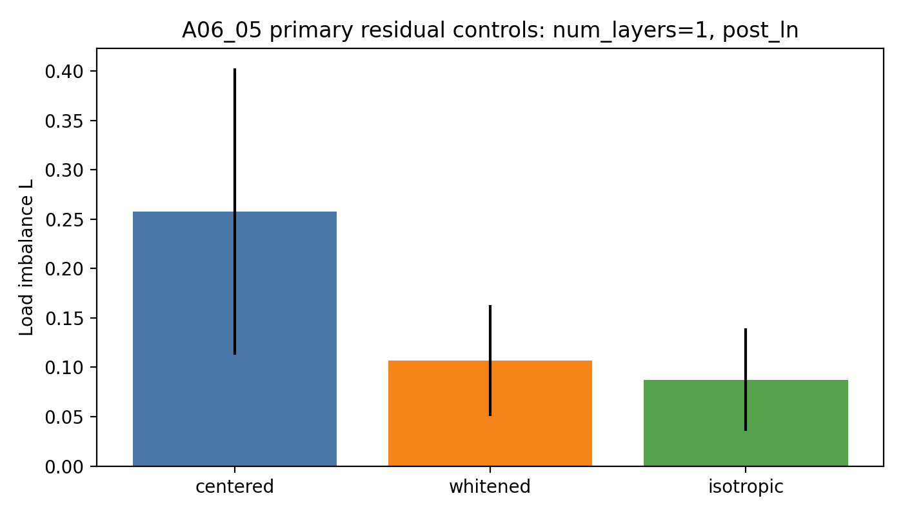
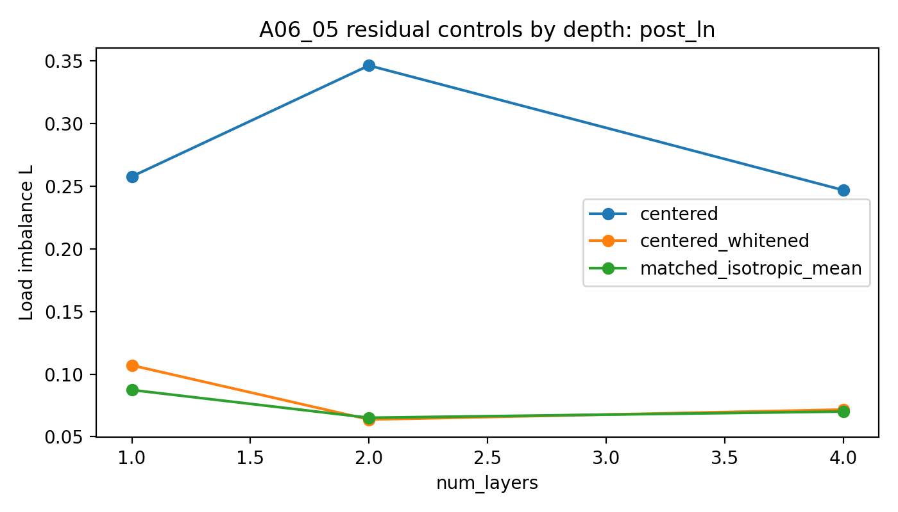
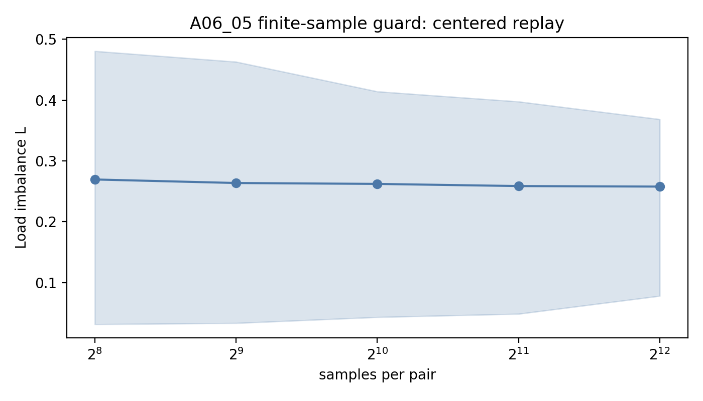
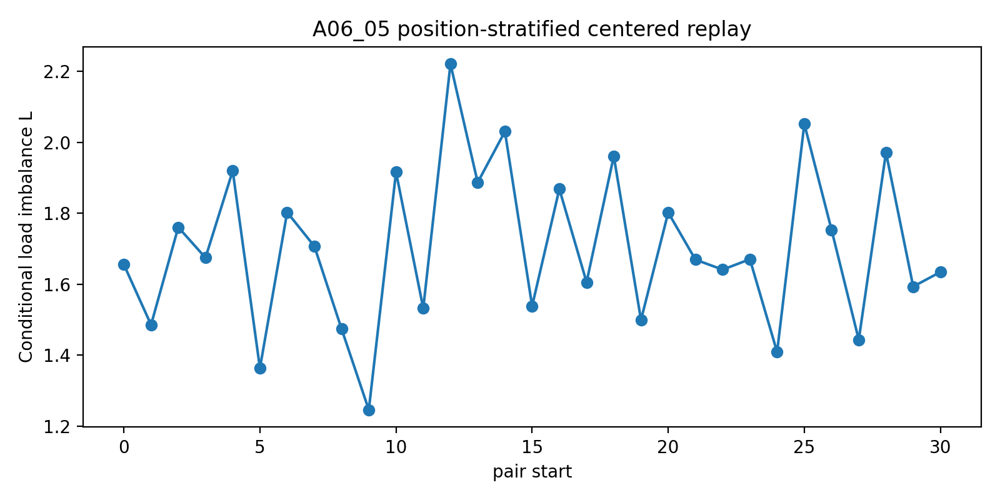

# Summary: A06_05 Common-Centered Residual Geometry Diagnostic

Primary anchor:
`../../problem_anchors/06_05_common_centered_residual_geometry_diagnostic_anchor.md`

Protocol:
`protocol.md`

## Purpose

A06_04 showed that the hidden common component is the dominant tested source of initialized synthetic hidden-state load imbalance, but common-centering did not make the router load uniform. A06_05 tests what remains after common-centering: residual covariance anisotropy, router-cell geometry under an isotropic matched control, context / position structure, or finite-sample noise.

## Exact Setup

The run reuses the A06_04 synthetic setup: sequence length 32, four strictly uniform `(slot,target)` pairs, four experts, randomized pair start, random background tokens independent of pair id, and routing at the last slot position. The initialized model is the same Transformer-MoE replay surface as A06_04. No training is performed.

Full run:

- seeds: `20260521` to `20260528`;
- depths: `num_layers in {1,2,4}`;
- router-input readouts: `post_ln`, `pre_ln_replay`;
- samples: 4096 per pair;
- primary run name: `a06_05_full_20260621_1`;
- execution: local CUDA replay, no ACP job id.

## Primary Metric

Primary metric:
$L=m\max_e |p_e-1/m|$, where $p_e$ is the fraction of samples routed to expert $e$ and $m=4$.

Why this decides the question:
The anchor asks why top-1 routing remains non-uniform after hidden common-centering. $L$ directly measures the remaining common-centered residual expert-load deviation that the residual explanations must account for.

## Result

The residual load is real and stable, not a finite-sample artifact. In the primary readout (`num_layers=1`, `post_ln`), centered residual replay has $L=0.2577$. Whitening reduces it to $L=0.1071$, and the matched isotropic replay is lower at $L=0.0874$.

Interpretation:
Residual covariance anisotropy is supported as a major source of the remaining imbalance, because whitening removes about 58.5% of the centered residual $L$ in the primary setting. Matched isotropic replay is not zero, so router-cell geometry and finite sample still set a lower floor, but they are not sufficient to explain the real residual load. Position-conditioned and pair-conditioned loads are much larger than the aggregate load, showing strong structured residual geometry; this is diagnostic evidence, not a claim that position alone causally creates aggregate imbalance.

Decision:
A06_05 supports controlling residual covariance / structured residual geometry before treating common-centering as enough. A06_06 should run as an oracle positive control: if feature-level initialization cannot overcome this residual geometry even with feature labels, the method direction is weak; if it can, A06_07 can ask whether a label-free proxy can approximate the same control.

## Key Figures

### Figure: Primary Residual Controls

What this tests:
Whether whitening and matched isotropic residual controls reduce common-centered load imbalance.

Anchor question:
After common-centering, what explains the remaining step-0 load imbalance?

Protocol question:
Does residual covariance anisotropy or real residual distribution geometry explain centered residual $L$?

Metric shown:
Mean $L$ across eight seeds for `num_layers=1`, `post_ln`.

Metric definition:
$L=m\max_e |p_e-1/m|$.

Data source:
`tables/aggregate_by_condition.csv`.

How to read:
Lower bars mean the replay is closer to uniform expert load.

What this figure decides:
Centered residual load is much higher than both whitened and matched isotropic controls.

Observed result:
`centered_replay=0.2577`, `centered_whitened_replay=0.1071`, `matched_isotropic_replay_mean=0.0874`.

Allowed claim:
Residual covariance / real residual geometry explains a substantial part of the post-common residual load.

What this does not prove:
It does not prove training collapse, semantic specialization, or a usable router method.

Anchor update implication:
Residual geometry remains an active mechanism; common-centering alone is not enough.

### Figure: Depth Guard

What this tests:
Whether the residual-control pattern is specific to one layer count.

Anchor question:
Is residual geometry a stable source after common-centering?

Protocol question:
Does whitening / isotropic reduction persist across `num_layers in {1,2,4}`?

Metric shown:
Mean $L$ by depth under `post_ln`.

Data source:
`tables/aggregate_by_condition.csv`.

How to read:
The gap between centered replay and the controls is the residual geometry contribution.

Observed result:
The gap persists at all depths. Centered $L$ is `0.2577`, `0.3463`, `0.2469`; whitened $L$ is `0.1071`, `0.0638`, `0.0717`; isotropic $L$ is `0.0874`, `0.0652`, `0.0702`.

Allowed claim:
The residual geometry explanation is not a one-depth artifact.

What this does not prove:
It does not identify which real trained layer will dominate after optimization.

Anchor update implication:
Carry residual covariance control into A06_06 as a required diagnostic boundary.

### Figure: Finite-Sample Guard

What this tests:
Whether centered residual $L$ shrinks toward uniform as sample count increases.

Metric shown:
Bootstrap mean and range of $L$ across balanced samples per pair.

Data source:
`tables/sample_count_guard_aggregate.csv`.

Observed result:
For `num_layers=1`, `post_ln`, $L$ stays near `0.2694 -> 0.2577` as samples per pair increase from 256 to 4096.

Allowed claim:
The aggregate residual load is not explained away by finite-sample noise at this sample scale.

What this does not prove:
It does not estimate an infinite-data population value from newly generated larger data; it is a bootstrap / subsample stability guard on the full run.

Anchor update implication:
Finite-sample noise is weakened as the main explanation.

### Figure: Position-Stratified Replay

What this tests:
Whether centered residual assignments vary by pair start position.

Metric shown:
Conditional $L$ by pair start for `num_layers=1`, `post_ln`.

Data source:
`tables/context_position_load_aggregate.csv`.

Observed result:
Conditional position loads are high: mean across positions is about `1.70`, with a range from about `1.25` to `2.22` in the aggregate table.

Allowed claim:
The residual hidden distribution has strong position-conditioned structure.

What this does not prove:
It does not show that position structure alone causes the aggregate imbalance, because conditional strata are smaller and can interact with pair identity and router rows.

Anchor update implication:
Position/context structure remains a live boundary for label-free controls.

## Claim Boundary

Can claim:

The remaining common-centered load imbalance in initialized synthetic hidden-state replay is not mainly finite-sample noise. Residual covariance anisotropy and structured residual geometry are supported as important sources.

Cannot claim:

This does not prove training collapse, real-text behavior, semantic expert specialization, expert utility, or a deployable label-free router method.

## Next Decision

Run A06_06 as a feature-level initialization positive control. Its protocol should explicitly use A06_05's boundary: common-centering alone is insufficient; an oracle feature-level initialization should be tested against residual covariance / structured residual load rather than against raw hidden common bias only.
