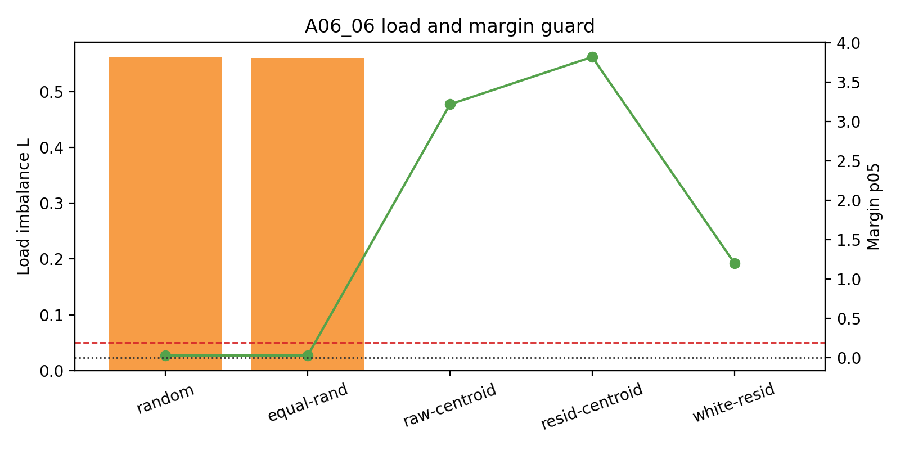
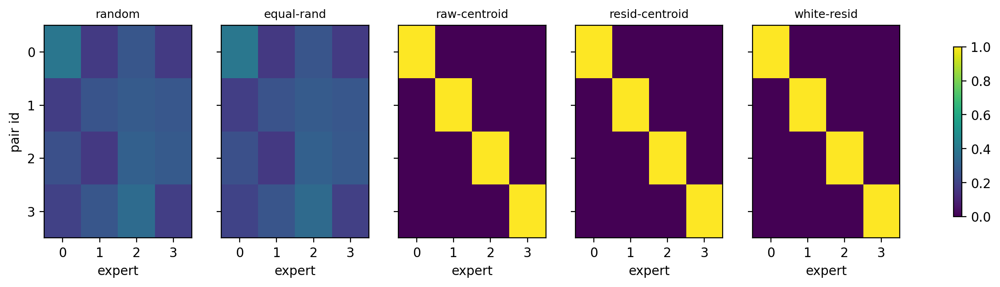

# Summary: A06_06 Feature-Level Initialization Positive Control

Primary anchor:
`../../problem_anchors/06_06_feature_level_initialization_positive_control_anchor.md`

Protocol:
`protocol.md`

## Purpose

A06_05 showed that common-centering does not eliminate initialized residual load; residual covariance / structured residual geometry remains active. A06_06 asks a reachability question: with oracle access to the four uniform `(slot,target)` pair identities, can feature-level router centers produce clean step-0 feature routing while keeping load balanced?

## Exact Setup

The run reuses the A06_04/A06_05 synthetic hidden-state extraction: four uniform pair features, four experts, randomized pair start, background tokens independent of pair id, route at the last slot position, no training.

Full run:

- seeds: `20260521` to `20260528`;
- depths: `num_layers in {1,2,4}`;
- readouts: `post_ln`, `pre_ln_replay`;
- samples: 4096 per pair, split into 2048 calibration and 2048 held-out evaluation samples per pair;
- conditions: random Gaussian router, equal-norm random router, raw feature centroids, common-centered residual feature centroids, common-centered whitened residual feature centroids;
- run name: `a06_06_full_20260621_1`;
- execution: local CUDA replay, no ACP job id.

## Primary Metric

Primary metric:
feature normalized mutual information (`feature_NMI`) between held-out `pair_id` and routed expert.

Co-metrics:
load imbalance $L=m\max_e |p_e-1/m|$ and top-1 routing margin.

Pass threshold:
`feature_NMI >= 0.95`, `L <= 0.05`, and `margin_p05 > 0` on held-out evaluation.

## Result

The positive control succeeds decisively. All three oracle centroid conditions pass in all 48 seed/depth/readout cells. In the primary readout (`num_layers=1`, `post_ln`):

| Condition | Feature NMI | Load $L$ | Margin p05 | Judgment |
| --- | ---: | ---: | ---: | --- |
| random Gaussian | 0.1978 | 0.5610 | 0.0289 | fail |
| equal-norm random | 0.1964 | 0.5610 | 0.0303 | fail |
| raw feature centroid | 1.0000 | 0.0000 | 3.2198 | pass |
| common-centered feature centroid | 1.0000 | 0.0000 | 3.8216 | pass |
| common-centered whitened centroid | 1.0000 | 0.0000 | 1.2040 | pass |

Interpretation:
Feature-level routing is reachable at initialization under oracle feature-centroid construction. This is not a label-free method, but it proves the target partition is geometrically available in the tested synthetic hidden states.

Important boundary:
The run does not support the stronger claim that common-centered centroids outperform raw centroids for reachability. Raw centroid, common-centered centroid, and whitened residual centroid all reach perfect NMI and perfect load balance. Common-centering improves the primary margin relative to raw in this run, but raw already passes.

## Key Figures

### Figure: Feature NMI By Condition

What this tests:
Whether oracle feature-centroid initialization can make routed expert identity match feature identity.

Metric shown:
Held-out feature_NMI, averaged across eight seeds for `num_layers=1`, `post_ln`.

Data source:
`tables/aggregate_by_condition.csv`.

Observed result:
Random baselines stay near `0.20`; all centroid oracle conditions reach `1.00`.

Allowed claim:
Feature-level routing specialization is reachable at step 0 under oracle centroid initialization.

What this does not prove:
No label-free construction, trained stability, expert utility, or real-text transfer.

Anchor update implication:
A06_07 is justified as a label-free approximation problem.

### Figure: Load And Margin Guard

What this tests:
Whether high NMI is accompanied by balanced load and positive margins.

Observed result:
All centroid oracle conditions have `L=0`; random baselines have high load. The common-centered condition has the largest primary margin p05 (`3.8216`), raw centroid is also strong (`3.2198`), and whitened centroid remains positive (`1.2040`).

Allowed claim:
The oracle partition is not a load-balanced mirage; it has positive held-out margins.

What this does not prove:
Margin at step 0 does not prove the partition survives training.

### Figure: Route Heatmap

What this tests:
Whether each pair feature maps cleanly to one expert.

Observed result:
Centroid conditions show one-hot pair-to-expert maps; random conditions are mixed / collapsed.

Allowed claim:
Oracle feature centers implement a clean one-feature-one-expert assignment.

## Claim Boundary

Can claim:

In the initialized synthetic hidden-state setting, feature-level routing specialization is reachable with oracle feature-centroid initialization on held-out evaluation samples.

Cannot claim:

This is not label-free, not a trained stability result, not expert utility evidence, and not a real-text / DCLM result.

## Next Decision

Proceed to A06_07. A06_07 should now be framed as a label-free approximation question: can a common/residual-control router construction recover the oracle-reachable partition without using `pair_id` labels?
