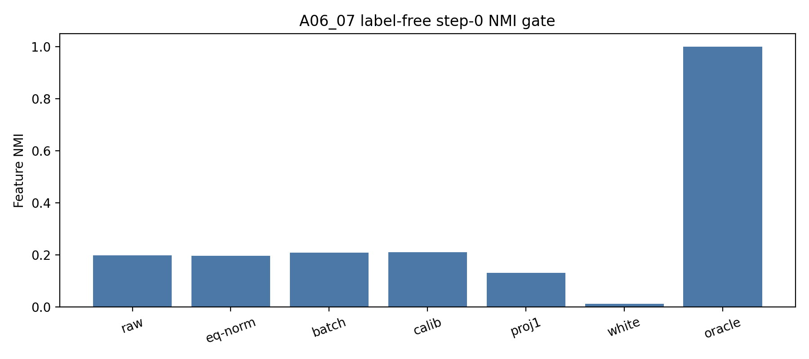
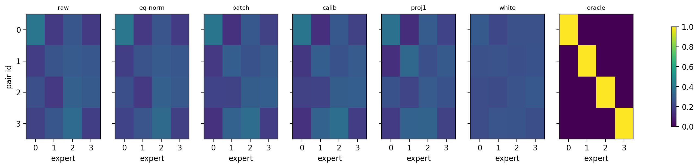

# Summary: A06_07 Label-Free Common / Residual-Control Router

Primary anchor:
`../../problem_anchors/06_07_label_free_common_residual_control_router_anchor.md`

Protocol:
`protocol.md`

## Purpose

A06_06 proved that the feature partition is reachable under oracle feature-centroid initialization. A06_07 tests whether label-free common / residual controls can recover that partition from random router rows at step 0, without using `pair_id` labels.

## Exact Setup

Same initialized synthetic hidden-state replay surface as A06_04/A06_05/A06_06:

- four uniform `(slot,target)` pair features;
- four experts;
- 4096 samples per pair, split into calibration and held-out evaluation halves;
- seeds `20260521..20260528`;
- depths `1,2,4`;
- readouts `post_ln`, `pre_ln_replay`;
- no training; step-0 replay gate only.

Conditions:
baseline raw router, equal-norm router rows, held-out batch mean centering, calibration mean centering, top-PC projection, whitened residual router, and A06_06 oracle feature-centroid upper bound.

## Primary Metric

Primary metric:
held-out feature_NMI between `pair_id` and routed expert.

Pass gate:
a label-free condition must improve NMI by at least `+0.25` absolute over baseline and close at least `50%` of the oracle gap. Load improvement alone is failure.

## Result

The label-free step-0 gate fails. Across all 336 condition cells, zero label-free rows pass. Common-centering strongly improves load but barely changes feature_NMI.

Full-sweep means:

| Condition | Feature NMI | NMI delta | Oracle gap fraction | Load $L$ |
| --- | ---: | ---: | ---: | ---: |
| baseline raw | 0.2302 | 0.0000 | 0.0000 | 0.6867 |
| equal-norm rows | 0.2298 | -0.0004 | -0.0003 | 0.6834 |
| calibration mean | 0.2353 | 0.0051 | 0.0053 | 0.2837 |
| held-out batch mean | 0.2350 | 0.0048 | 0.0048 | 0.2828 |
| projection top-1 | 0.1628 | -0.0674 | -0.0937 | 0.2881 |
| whitened residual | 0.0150 | -0.2152 | -0.2949 | 0.0860 |
| oracle feature centroid | 1.0000 | 0.7698 | 1.0000 | 0.0000 |

Interpretation:
Label-free common / residual controls can make expert load much more uniform, but they do not recover feature-level routing. Whitening is the clearest warning: it gives the best load (`L=0.0860`) while destroying NMI (`0.0150`).

## Key Figures

### Figure: NMI By Condition

What this tests:
Whether label-free controls move routing toward the oracle-reachable feature partition.

Observed result:
Only the oracle reaches high NMI. Label-free controls stay near baseline or get worse.

Allowed claim:
The tested label-free common/residual controls fail as feature-specialization methods at step 0.

What this does not prove:
It does not rule out all label-free methods, training losses, anti-lockin schedules, or real-model variants.

### Figure: Load Versus Oracle Gap

What this tests:
Whether load improvement coincides with feature-NMI improvement.

Observed result:
Common-centering and whitening reduce load substantially, but oracle-gap fraction remains near zero or negative.

Allowed claim:
Load balance is not a sufficient proxy for feature specialization in this setting.

### Figure: Route Heatmap

What this tests:
Whether routes form one-feature-one-expert maps.

Observed result:
Oracle heatmaps are one-hot; label-free controls show mixed or many-to-one structure.

Allowed claim:
The failure is structural, not just a scalar metric artifact.

## Claim Boundary

Can claim:

The tested label-free common / residual router-input controls do not approximate the oracle feature partition at step 0. They mostly produce load-only improvements.

Cannot claim:

This does not rule out learned label-free objectives, anti-lockin training, stronger clustering / dictionary learning, real DCLM hidden states, or feature discovery methods that use more structure than global common/residual controls.

## Next Decision

Do not promote simple global common-centering, top-PC removal, or whitening as the next method candidate. The next step should be a stronger label-free feature-discovery control, or an anti-lockin training test initialized from the A06_06 oracle / pseudo-oracle partition.
