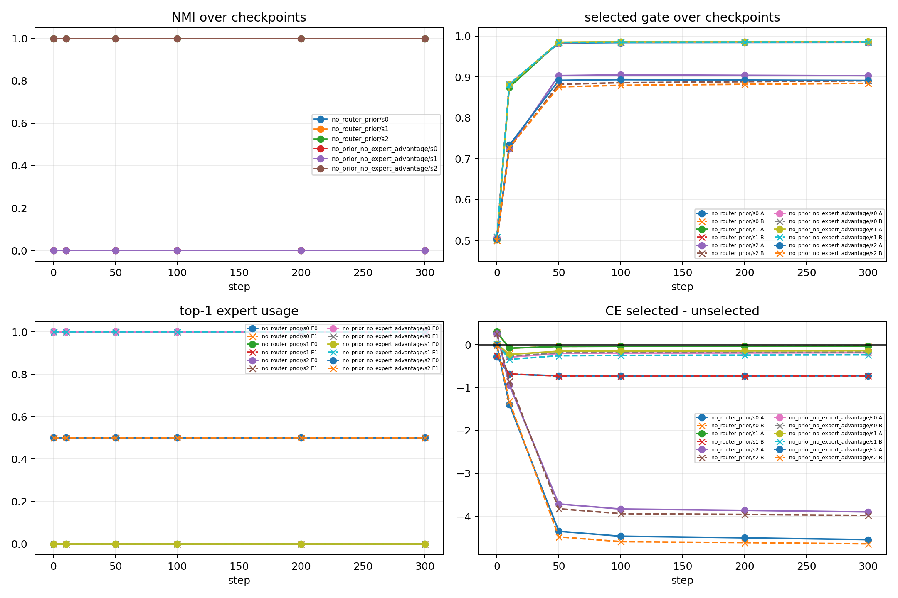
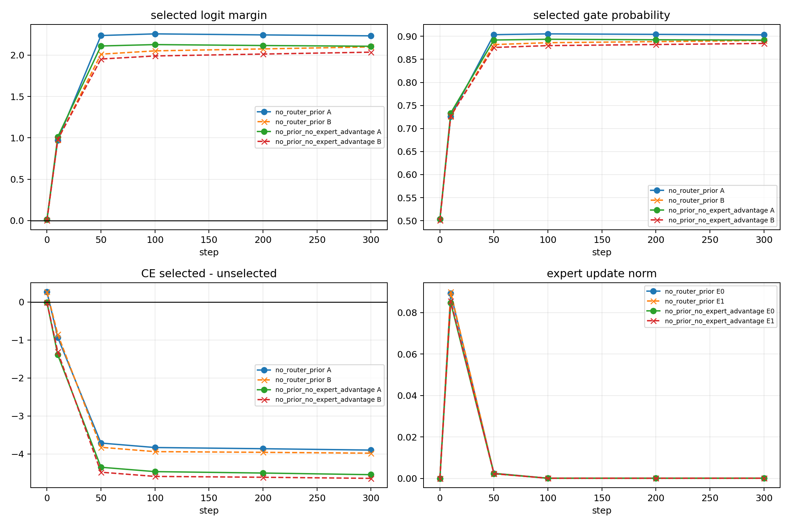
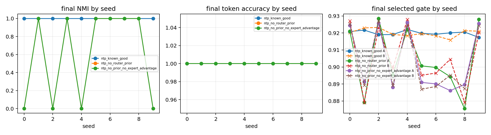

# Advisor Report Card: 2×2 NTP-style Top-1 Lock-in

## 0. Summary

我这次只回答一个最小问题：2×2 NTP-style top-1 proxy 中，router collapse 是早期锁死还是后期漂移。最小实验用两个正交 feature、两个 expert 和 linear top-1 router。结果是 failed seeds 在 step 0 已 A/B 同 expert，之后 selected gate 放大、未选 expert starvation；successful seed 在 step 0 已 split 并稳定保持。因此当前机制判断是 early top-1 lock-in + starvation，而不是 late optimization drift。这个实验不证明完整模型有效，而是把审计重点从最终热图转到早期轨迹，并说明任务学会不等于路由分化。边界是只说明 minimal route-pattern dynamics，不说明 full LM、attention 或 utility-aligned specialization。下一步只测一个 anti-lock-in 机制。

## 1. One-page Explanation

### Question

在一个最小的 next-token-prediction-style toy task 中，top-1 router collapse 是训练后期逐渐形成，还是由初始化附近的 expert 选择决定？

### Minimal Setup

使用两个正交 feature state：$h_A=e_1$、$h_B=e_2$。模型有 2 个 expert、一个 linear top-1 router 和一个 linear LM head。Top-1 router 指每个 token 只送入一个被选中的 expert；未选 expert 不接收该 token 的 expert update。

### Main Observation

Failed seeds 在 step 0 已经把 A/B 分到同一个 expert，最终 routing NMI 为 0。Successful seed 在 step 0 已经把 A/B 分到不同 expert，并稳定保持 NMI=1。NMI 是 route-label alignment 指标：这里 NMI=1 表示 A/B 被 clean split，NMI=0 表示没有 route-pattern separation。

### Interpretation

Early same-expert assignment 会被 selected gate confidence 放大，并造成未选 expert starvation。Starvation 指未选 expert 几乎没有 token traffic，因此没有机会学习该 feature。这个结果说明 task learning 不等于 route-pattern specialization：token accuracy 可以为 1，但 routing NMI 仍然可以为 0。

### Claim Boundary

这个结果只支持 minimal 2×2 NTP-style top-1 proxy 中的 route-pattern dynamics。它不说明 full LM、不说明 attention setting，也不说明 utility-aligned specialization。

### Next Decision

下一步只测试一个 anti-lock-in mechanism。首选 structured router initialization；如果不足，再单独比较 exploration noise 或 load balancing，不展开大规模 ablation grid。

## 2. Key Figures

### Figure 1: Early lock-in audit



**What to see:** Failed seeds 是否在 step 0 已经 A/B 同 expert，以及 selected gate 是否继续放大这个选择。

**Supports:** Collapse 在训练早期已经形成，并被 gate confidence 和 expert starvation 放大。

**Cannot prove:** 不能证明 full LM 或 attention setting 也会以同样方式 collapse。

### Figure 2: Success dynamics audit



**What to see:** Successful seed 是否在 step 0 已经 A/B split，并在训练中稳定保持 NMI=1。

**Supports:** 如果初始 routing geometry 给出 split，训练可以稳定放大 route-pattern separation。

**Cannot prove:** 不能证明这个 split 已经是 utility-aligned specialization。

### Figure 3: No-router-bias diagnostic



**What to see:** 去掉 router bias 后 random-init split rate 从 3/10 提高到 6/10，但仍不能保证 separation。

**Supports:** Router bias 是 collapse 风险因子之一，但不是唯一原因。

**Cannot prove:** 不能证明去掉 bias 就足以解决 top-1 lock-in。

## 3. Evidence Table

| observation | interpretation | boundary | next decision |
|---|---|---|---|
| Failed seeds step 0 已 A/B 同 expert，最终 NMI=0 | collapse 更像 early lock-in，而不是 late drift | 只在 2×2 proxy 中成立 | 测 anti-lock-in |
| Successful seed step 0 已 A/B split，并保持 NMI=1 | 初始 split 可以被训练稳定放大 | 只说明 route-pattern separation | 检查 structured init |
| Token accuracy 可为 1，但 routing NMI 可为 0 | task learning 不等于 route-pattern specialization | 不 claim utility alignment | 后续需要 utility evidence |

## 4. If Interrupted, Say This

老师，我这次不是 claim 完整 MoE specialization。我的问题更小：

```text
这个最小实验是否足以支持：
在 2×2 NTP-style top-1 proxy 中，route collapse 主要由 early top-1 lock-in + expert starvation 驱动，而不是 late optimization drift。
```

## 5. Questions For Advisor

1. 这个最小 failure mechanism 是否值得作为后续主线？
2. 下一步应优先测试 structured router initialization、exploration noise，还是 load balancing？
3. 什么时候应该把这个机制带回 multi-B / slot-context setting？
