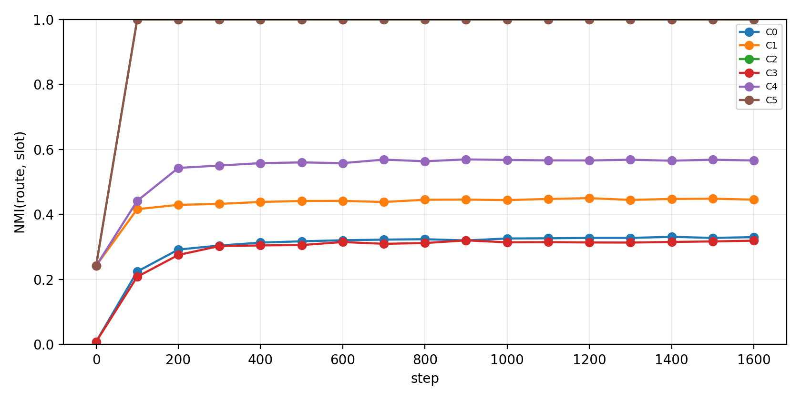
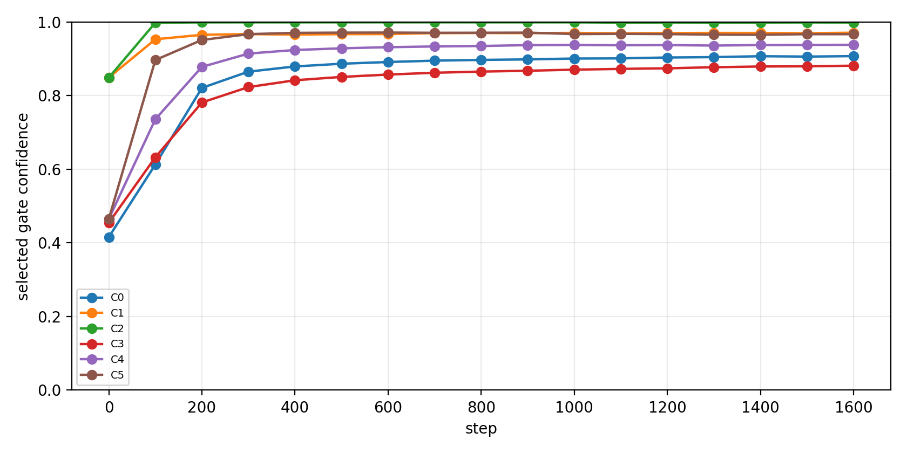
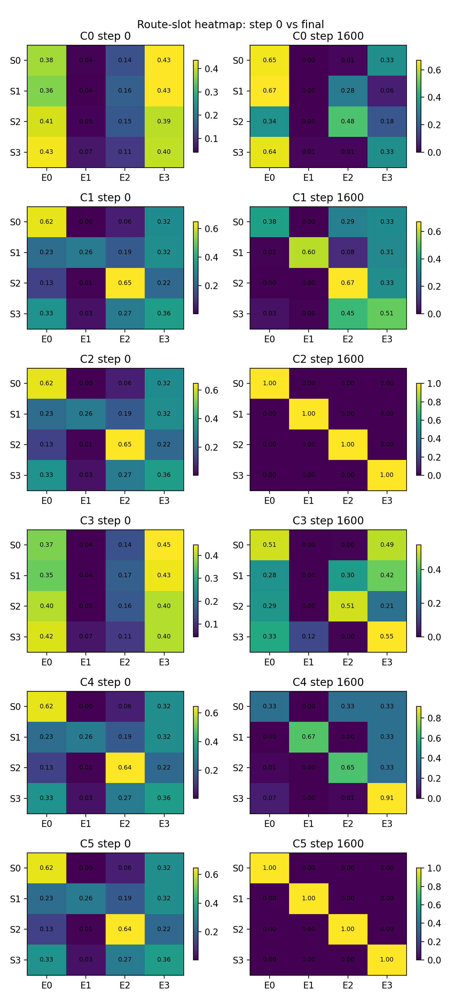
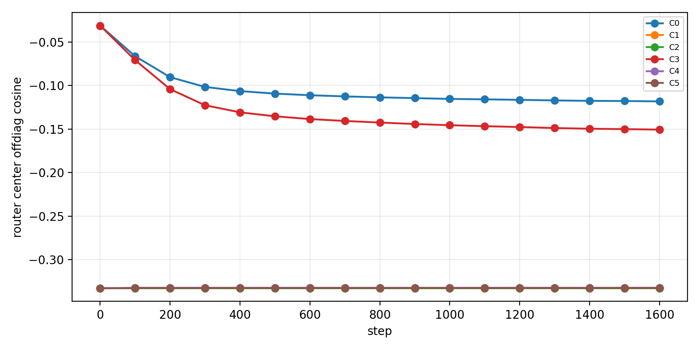

# Result Summary: H0603a Geometric Inhibition

Anchor:

```text
05_01_geometric_inhibition_anchor.md
```

Story:

在 uniform multi-B synthetic 中，无偏置 top-1 selected-gate router 使用 slot-stable initialization 后，geometric inhibition 是否还能额外稳定 slot-aligned routing。

## 0. Closure Summary

目的：

为组会提供一个简化版几何机制结果：只判断 routing geometry / stability，不声称完整 expert utility specialization。

假设 / 问题：

1. Q1: slot-stable init 是否真的把不同 slot 送到不同 expert？
2. Q2: 在已有 init 的情况下，geometric inhibition 是否还有额外贡献？
3. Q3: 它是否只是提高 selected gate confidence？
4. Q4: cosine router 是否真的更好？
5. Q5: 是否存在 accuracy tradeoff？

结论：

Q1 支持：slot-stable init 在 dot 和 cosine 下都显著提高 step-0 route-slot NMI。

Q2 支持：geometric inhibition 在 dot 和 cosine 下都把 final route-slot NMI 提到 1.000，并且 seed variance 变为 0。

Q3 rival 被削弱：geometric inhibition 确实提高 confidence，但 route-slot NMI 同时大幅提高，所以不是单纯 gate sharper。

Q4 部分支持：init-only 时 cosine final NMI 高于 dot，0.566 vs 0.446；但加 geometric inhibition 后 C5 和 C2 都达到 1.000，cosine 没有额外优势。

Q5 无 tradeoff：所有条件 target accuracy 都是 1.000。

关键证据：

| Question | Pair | Key Metric | Result |
| --- | --- | --- | --- |
| Q1 dot init | C1 vs C0 | step-0 route-slot NMI | 0.242 vs 0.009 |
| Q1 cosine init | C4 vs C3 | step-0 route-slot NMI | 0.242 vs 0.008 |
| Q2 dot geo | C2 vs C1 | final route-slot NMI | 1.000 vs 0.446 |
| Q2 cosine geo | C5 vs C4 | final route-slot NMI | 1.000 vs 0.566 |
| Q3 confidence-only rival | C2 vs C1 | confidence and NMI deltas | confidence +0.028, NMI +0.554 |
| Q3 confidence-only rival | C5 vs C4 | confidence and NMI deltas | confidence +0.029, NMI +0.434 |
| Q4 cosine init | C4 vs C1 | final route-slot NMI | 0.566 vs 0.446 |
| Q5 accuracy | all | target accuracy | 1.000 |

结论边界：

This proves neither label-free specialization nor full expert utility. Positive assignment is still external slot prior $a(s,i)=s$. The result supports geometric routing stabilization under a supervised prototype assignment.

下一步：

组会中应把它表述为：geometric inhibition can stabilize slot-assigned routing, and the main rival "only sharper gates" is weakened. 下一步若继续主线，应测试在 Zipfian 或 less-oracle prototype 下是否仍稳定。

## 1. Key Figures

Route-slot NMI trajectory:



Selected gate confidence trajectory:



Route heatmap:



Router center geometry:



## 2. Tables

```text
tables/h0603a_decision_metrics_compact.csv
tables/h0603a_question_pair_effects.csv
tables/h0603a_confidence_only_rival_check.csv
```
