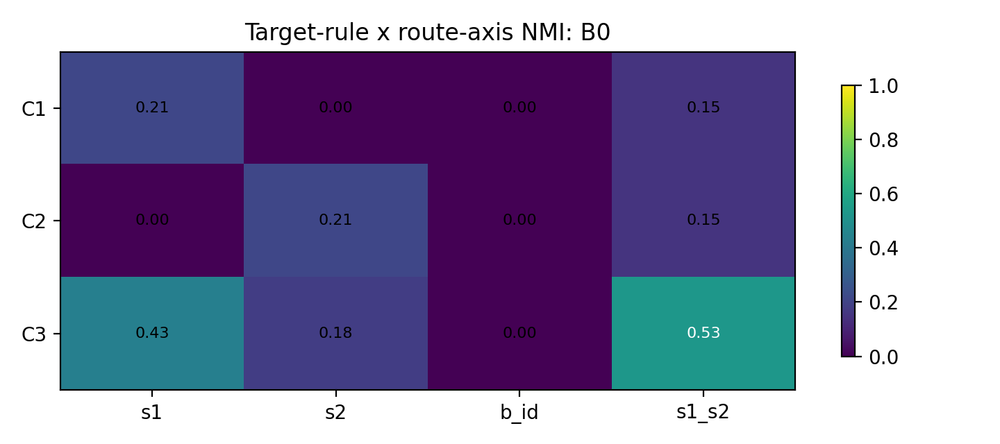
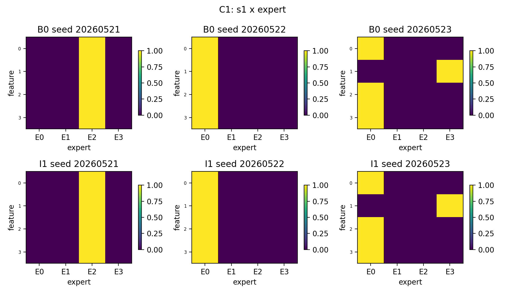
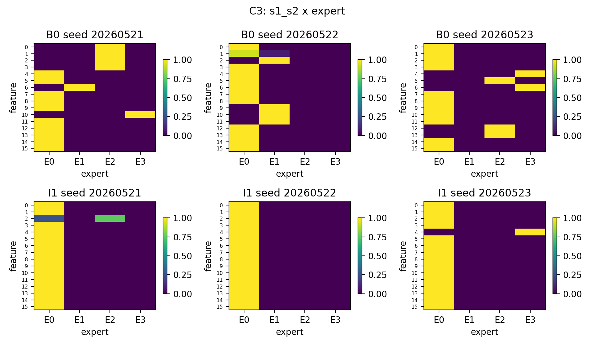

# Result Summary: A05_02_P1_compositional_token_feature_routing Compositional Token Feature Routing

Anchor: `Projects/from-attention-to-search/main/problem_anchors/05_02_feature_assumption_relaxation_anchor.md`

Story: P1 tested whether routing follows the target-relevant factor when one input context contains $S1$, $S2$, and nuisance $B_i$.

## 0. Closure Summary

目的：
放松 single-feature token 假设，检查普通 top-1 MoE 是否会随 target rule 改变 route axis。

假设 / 问题：
C1 应按 $S1$ route，C2 应按 $S2$ route，C3 应按 $(S1,S2)$ route。关键指标是归一化互信息（normalized mutual information, NMI），但只有在 target accuracy 高且 routing 不坍缩时才可解释。

结论：
P1 不能整体判为 positive。所有条件 target accuracy 都是 1.0，说明任务学会；但 C1/C2 大多数 seed 坍缩到单 expert，无法支持 target-rule-dependent routing。只有 C3-B0 在 3 个 seed 上相对 non-collapsed，并且 $(S1,S2)$ 是最高 route axis。

关键证据：

| Case | Condition | Target acc. | Active experts | Max load | Main route-axis result |
|---|---:|---:|---:|---:|---|
| C1 | B0 | 1.000 | 1.33 | 0.917 | only one non-collapsed-ish seed aligns $S1$ |
| C1 | I1 | 1.000 | 1.33 | 0.917 | same as B0 |
| C2 | B0 | 1.000 | 1.33 | 0.917 | only one non-collapsed-ish seed aligns $S2$ |
| C2 | I1 | 1.000 | 1.00 | 1.000 | hard collapse |
| C3 | B0 | 1.000 | 3.00 | 0.686 | NMI(route,$(S1,S2)$)=0.528, higher than $S1$=0.430, $S2$=0.183, $B_i$=0.000 |
| C3 | I1 | 1.000 | 1.67 | 0.964 | near collapse; route-axis claim invalid |

结论边界：
This result shows target learning can succeed without meaningful routing. It gives a weak positive clue only for C3-B0 compositional target routing, not for full P1.

下一步：
Do not use P1 as evidence that ordinary top-1 robustly selects target-relevant factors. The next decision should focus on why C1/C2 collapse under easy one-factor targets, or whether a load/entropy guard is required before assumption relaxation can be interpreted.

## 1. Validity Check

Target accuracy passed in all six condition groups. The invalidating factor is routing collapse, not task failure.

Collapse rule used here:
hard collapse if `active_experts <= 1` or `expert_load_max_fraction >= 0.95`. Partial concentration weakens positive claims when max load is near 0.75 or only two experts are active.

## 2. Primary Result

The primary NMI matrix is embedded below.

Interpretation:
For B0, C3 is the only condition where routing remains sufficiently distributed to read the route-axis NMI. It prefers $(S1,S2)$ over nuisance $B_i$, which is the expected axis for the compositional target.

Interpretation:
I1 does not repair C1/C2 and makes C3 closer to collapse. It should not be treated as a successful condition for P1.

## 3. Required Figures

## 4. Files

- Full detailed record: `detailed.md`
- Condition table: `tables/summary_by_condition.csv`
- Seed table: `tables/summary_by_seed.csv`
- Route matrix: `tables/route_matrix_by_seed.csv`
- Expert load table: `tables/expert_load_by_seed.csv`
