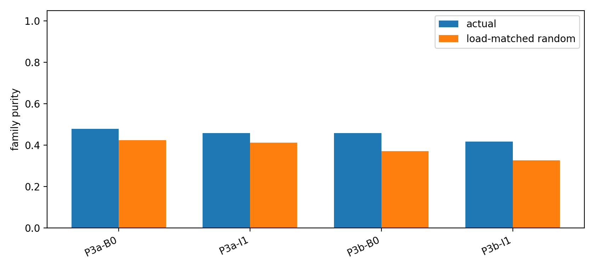
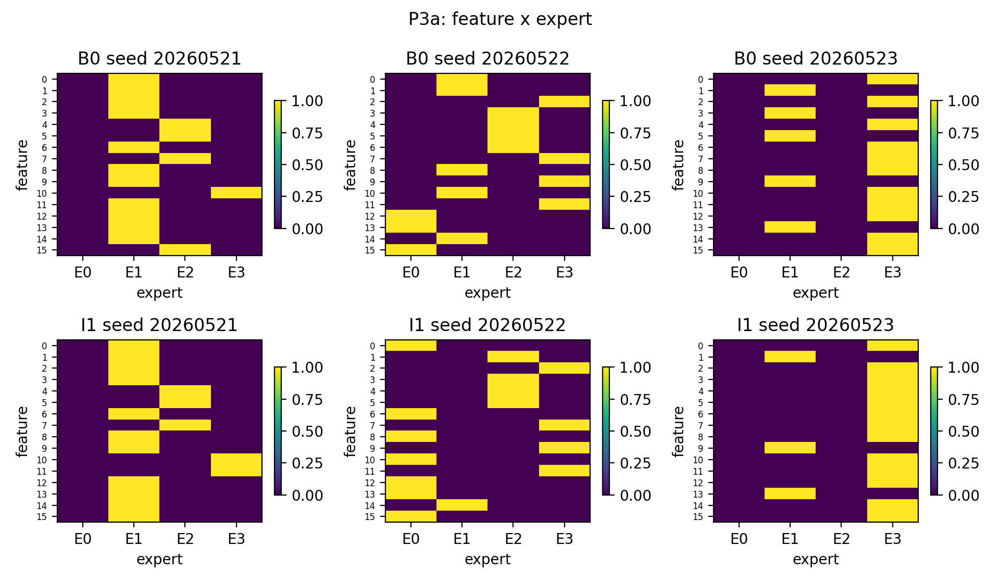
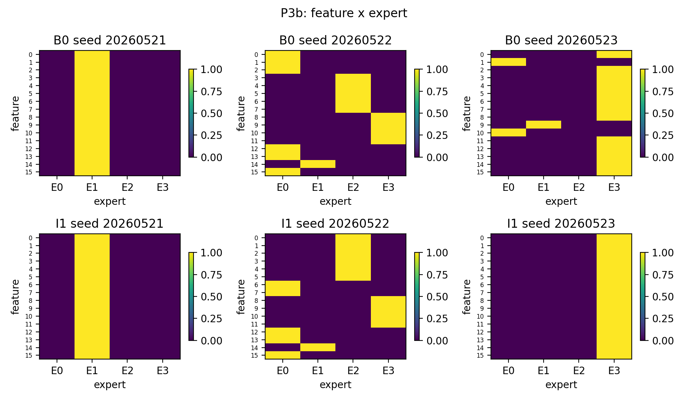
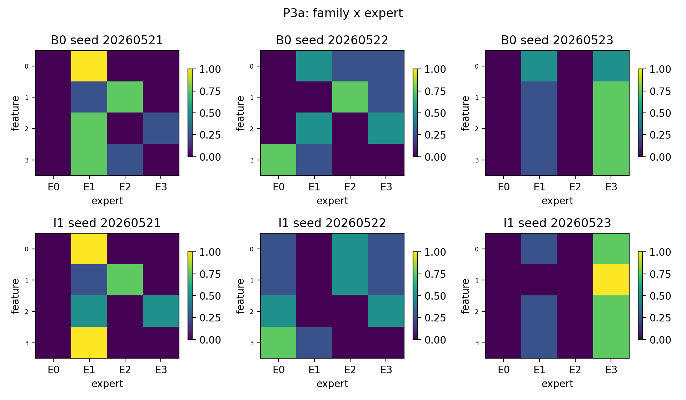
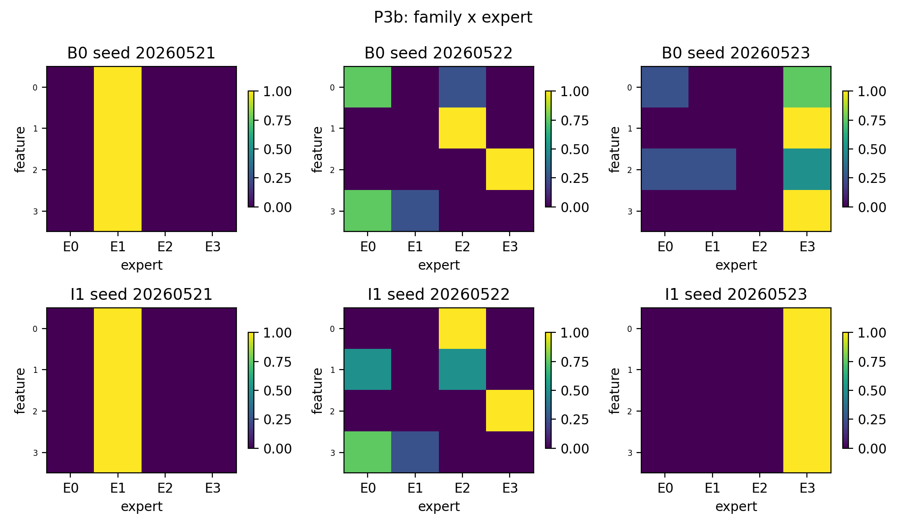
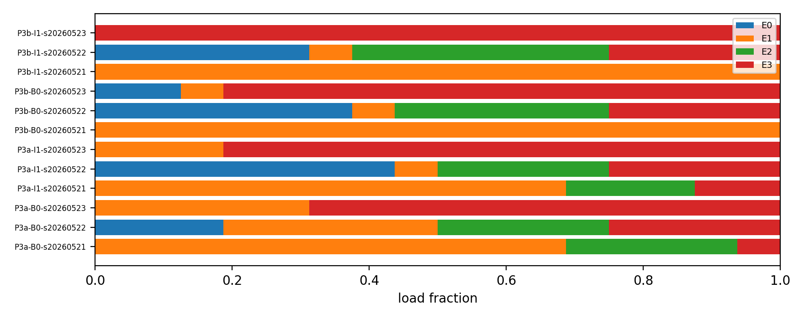
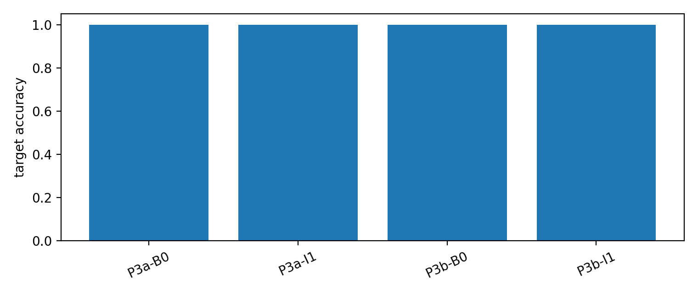

# Detailed Result: A05_02_P3_same_expert_feature_relation Same-Expert Feature Relation

Anchor: `Projects/from-attention-to-search/main/problem_anchors/05_02_feature_assumption_relaxation_anchor.md`

## 0. Quick Recap

目的：
测试同一 expert 中的多个 features 是否共享 family structure。

假设：
P3a 若 positive，说明 input-side family alone can induce grouping。P3b 若强于P3a，说明 shared target utility helps induce grouping。

实验思路：
使用 $G=4$, $K=4$, $F=16$, $E=4$ 的均匀 family-structured data。P3a 使用 feature-level target $Y_{gk}$；P3b 使用 family-level target $Y_g$。在最后一个 $F_{gk}$ token 位置记录 route。

结论：
P3a/P3b 都不支持稳定 family grouping。P3b 没有比 P3a 更强。

证据：
所有条件 target accuracy 为 1.0；但 family purity over random 的均值只有 0.047 到 0.090，且 seed 不稳定。

## 1. Run Identity

Code workspace:
`Projects/from-attention-to-search/XingyuD/Attention_Search_Experiments`

Runner:
`active/synthetic_data_understanding/scripts/run_h0605bc_feature_assumption_relaxation.py`

Config:
`active/synthetic_data_understanding/configs/h0605c_same_expert_feature_relation.json`

Command:

```bash
python active/synthetic_data_understanding/scripts/run_h0605bc_feature_assumption_relaxation.py \
  --experiment p3 \
  --config active/synthetic_data_understanding/configs/h0605c_same_expert_feature_relation.json \
  --run-name h0605c_same_expert_feature_relation_full_20260604 \
  --run-stage full \
  --max-parallel 2
```

Job id:
Local run, no ACP/SCO job id.

Actual hardware:
2 visible H100 GPUs. The task request said 4-card, but `nvidia-smi` exposed only GPU 0 and GPU 1.

Result dir:
`Projects/from-attention-to-search/XingyuD/Attention_Search_Experiments/active/synthetic_data_understanding/results/h0605c_same_expert_feature_relation/h0605c_same_expert_feature_relation_full_20260604/`

Figure dir:
`Projects/from-attention-to-search/XingyuD/Attention_Search_Experiments/active/synthetic_data_understanding/figures/h0605c_same_expert_feature_relation/h0605c_same_expert_feature_relation_full_20260604/`

Curated figures:
`figures/`

Curated tables:
`tables/`

## 2. Setup

Model:
Tiny Transformer with one top-1 selected-gate MoE FFN, 4 experts, $d_{\mathrm{model}}=128$, FFN dim 256.

Training:
standard full-sequence next-token prediction, 1200 steps, batch size 384, learning rate 0.0008, weight decay 0.01.

Seeds:
`20260521`, `20260522`, `20260523`.

Conditions:

- `B0`: no inhibition.
- `I1`: true token-conditioned inhibition comparison condition.

Route position:
last $F_{gk}$ token, immediately before target prediction.

Primary metric:
family purity over load-matched random baseline, $\Delta_{\mathrm{family}}$.

Validity metrics:
target accuracy, active experts, expert max-load fraction, normalized load entropy.

## 3. Condition-Level Results

| Case | Cond. | Acc. | Entropy | Max load | Active | NMI family | NMI feature | Actual purity | Random mean | Delta |
|---|---|---:|---:|---:|---:|---:|---:|---:|---:|---:|
| P3a | B0 | 1.000 | 0.666 | 0.563 | 3.00 | 0.282 | 0.569 | 0.479 | 0.424 | 0.055 |
| P3a | I1 | 1.000 | 0.611 | 0.646 | 3.00 | 0.286 | 0.543 | 0.458 | 0.411 | 0.047 |
| P3b | B0 | 1.000 | 0.446 | 0.729 | 2.67 | 0.319 | 0.379 | 0.458 | 0.372 | 0.087 |
| P3b | I1 | 1.000 | 0.301 | 0.792 | 2.00 | 0.237 | 0.224 | 0.417 | 0.327 | 0.090 |

Interpretation:

- P3a has only small family-purity gain over random and one negative seed.
- P3b does not become stronger than P3a in a reliable way. Mean delta is slightly larger, but this comes with higher concentration and seed instability.
- I1 does not create a stable structured grouping improvement.

## 4. Seed-Level Family Relation Results

| Case | Cond. | Seed | Actual purity | Random mean | Delta | Random 2.5% | Random 97.5% |
|---|---|---:|---:|---:|---:|---:|---:|
| P3a | B0 | 20260521 | 0.500 | 0.413 | 0.087 | 0.312 | 0.500 |
| P3a | B0 | 20260522 | 0.625 | 0.485 | 0.140 | 0.375 | 0.625 |
| P3a | B0 | 20260523 | 0.312 | 0.375 | -0.062 | 0.312 | 0.438 |
| P3a | I1 | 20260521 | 0.562 | 0.402 | 0.160 | 0.312 | 0.500 |
| P3a | I1 | 20260522 | 0.500 | 0.483 | 0.017 | 0.375 | 0.625 |
| P3a | I1 | 20260523 | 0.312 | 0.350 | -0.037 | 0.312 | 0.438 |
| P3b | B0 | 20260521 | 0.250 | 0.250 | 0.000 | 0.250 | 0.250 |
| P3b | B0 | 20260522 | 0.750 | 0.479 | 0.271 | 0.375 | 0.625 |
| P3b | B0 | 20260523 | 0.375 | 0.387 | -0.012 | 0.375 | 0.438 |
| P3b | I1 | 20260521 | 0.250 | 0.250 | 0.000 | 0.250 | 0.250 |
| P3b | I1 | 20260522 | 0.750 | 0.481 | 0.269 | 0.375 | 0.625 |
| P3b | I1 | 20260523 | 0.250 | 0.250 | 0.000 | 0.250 | 0.250 |

Full tables:

- `tables/summary_by_condition.csv`
- `tables/summary_by_seed.csv`
- `tables/family_relation_by_condition.csv`
- `tables/family_relation_by_seed.csv`

## 5. Figures



Figure interpretation:
The actual bars are not consistently above the load-matched random bars by a decisive margin. P3b has a small mean advantage but also stronger concentration and seed instability.













## 6. Claim Boundary

Can claim:

- The P3 tasks are learnable.
- Ordinary top-1 does not reliably group same-family features under this setup.
- Shared family-level target in P3b does not reliably strengthen family grouping over P3a.

Cannot claim:

- No architecture can learn family grouping.
- Family grouping is impossible under a load-balanced or utility-bound router.
- This is expert utility specialization evidence.

## 7. Next Decision

Mainline impact:

- affects hypothesis? yes. It weakens the idea that ordinary top-1 naturally forms structured same-expert grouping when $F>E$.
- affects claim boundary? yes. Same-feature consistency should not be promoted to same-expert relation.
- affects next decision? yes. A future positive P3 test needs an explicit non-collapse or utility-binding intervention.
- recommendation: treat ordinary top-1 same-expert assignment as closer to arbitrary bucket unless a stronger intervention changes P3b.
