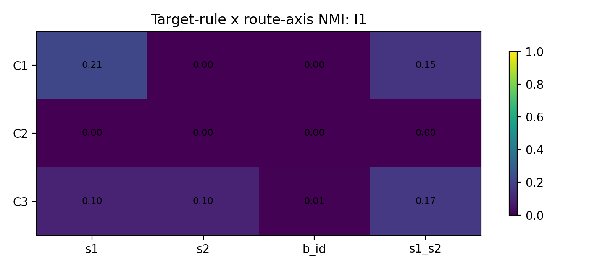
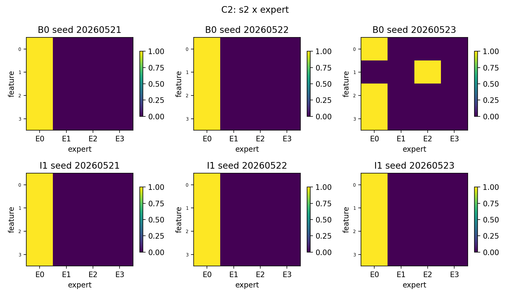
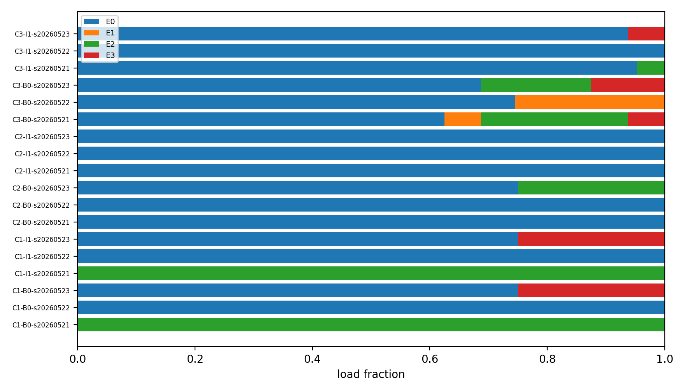

# Detailed Result: H0605b / P1 Compositional Token Feature Routing

Anchor: `Projects/from-attention-to-search/main/problem_anchors/05_02_feature_assumption_relaxation_anchor.md`

## 0. Quick Recap

目的：
测试 compositional token 中 route axis 是否随 target rule 改变。

假设：
C1 route by $S1$；C2 route by $S2$；C3 route by $(S1,S2)$。

实验思路：
使用同一输入格式 $[r_{\mathrm{start}},S1,S1,S1,S2,S2,S2,B_i,Y,r_{\mathrm{end}}]$，只改变 target rule；在 $B_i$ 位置记录 route。

结论：
P1 不整体支持。目标全部学会，但 C1/C2 多数 seed 坍缩；C3-B0 是唯一相对可解释的正向线索，显示 route 偏向组合轴 $(S1,S2)$。

证据：
见 `tables/summary_by_condition.csv`、`tables/summary_by_seed.csv` 和 `figures/`。

## 1. Run Identity

Code workspace:
`Projects/from-attention-to-search/XingyuD/Attention_Search_Experiments`

Runner:
`active/synthetic_data_understanding/scripts/run_h0605bc_feature_assumption_relaxation.py`

Config:
`active/synthetic_data_understanding/configs/h0605b_compositional_token_feature_routing.json`

Command:

```bash
python active/synthetic_data_understanding/scripts/run_h0605bc_feature_assumption_relaxation.py \
  --experiment p1 \
  --config active/synthetic_data_understanding/configs/h0605b_compositional_token_feature_routing.json \
  --run-name h0605b_compositional_token_feature_routing_full_20260604 \
  --run-stage full \
  --max-parallel 2
```

Job id:
Local run, no ACP/SCO job id.

Actual hardware:
2 visible H100 GPUs. The task request said 4-card, but `nvidia-smi` exposed only GPU 0 and GPU 1.

Result dir:
`Projects/from-attention-to-search/XingyuD/Attention_Search_Experiments/active/synthetic_data_understanding/results/h0605b_compositional_token_feature_routing/h0605b_compositional_token_feature_routing_full_20260604/`

Figure dir:
`Projects/from-attention-to-search/XingyuD/Attention_Search_Experiments/active/synthetic_data_understanding/figures/h0605b_compositional_token_feature_routing/h0605b_compositional_token_feature_routing_full_20260604/`

Curated figures:
`figures/`

Curated tables:
`tables/`

## 2. Setup

Model:
Tiny Transformer with one top-1 selected-gate MoE FFN, 4 experts, $d_{\mathrm{model}}=128$, FFN dim 256.

Training:
standard full-sequence next-token prediction, 1200 steps, batch size 384, learning rate 0.0008, weight decay 0.01.

Seeds:
`20260521`, `20260522`, `20260523`.

Conditions:

- `B0`: no inhibition.
- `I1`: true token-conditioned inhibition comparison condition.

Route position:
$B_i$ position, immediately before target prediction.

Primary metric:
归一化互信息（normalized mutual information, NMI）between route and $S1$, $S2$, $B_i$, $(S1,S2)$.

Validity metrics:
target accuracy, active experts, expert max-load fraction, normalized load entropy.

## 3. Condition-Level Results

| Case | Cond. | Acc. | Entropy | Max load | Active | NMI S1 | NMI S2 | NMI B | NMI S1S2 |
|---|---|---:|---:|---:|---:|---:|---:|---:|---:|
| C1 | B0 | 1.000 | 0.135 | 0.917 | 1.33 | 0.212 | 0.000 | 0.000 | 0.150 |
| C1 | I1 | 1.000 | 0.135 | 0.917 | 1.33 | 0.212 | 0.000 | 0.000 | 0.150 |
| C2 | B0 | 1.000 | 0.135 | 0.917 | 1.33 | 0.000 | 0.212 | 0.000 | 0.150 |
| C2 | I1 | 1.000 | 0.000 | 1.000 | 1.00 | 0.000 | 0.000 | 0.000 | 0.000 |
| C3 | B0 | 1.000 | 0.574 | 0.686 | 3.00 | 0.430 | 0.183 | 0.000 | 0.528 |
| C3 | I1 | 1.000 | 0.102 | 0.964 | 1.67 | 0.099 | 0.099 | 0.005 | 0.168 |

Interpretation:

- C1 and C2 have high accuracy but are mostly collapsed. The one non-collapsed-ish seed aligns with the target axis, but this is not stable enough for a positive claim.
- C3-B0 is the cleanest condition: target accuracy is 1.0, mean active experts is 3.0, mean max load is 0.686, and NMI with $(S1,S2)$ is highest.
- I1 does not improve the decision condition. It collapses C2 and nearly collapses C3.

## 4. Seed-Level Results

| Case | Cond. | Seed | Acc. | Entropy | Max load | Active | NMI S1 | NMI S2 | NMI B | NMI S1S2 |
|---|---|---:|---:|---:|---:|---:|---:|---:|---:|---:|
| C1 | B0 | 20260521 | 1.000 | 0.000 | 1.000 | 1 | 0.000 | 0.000 | 0.000 | 0.000 |
| C1 | B0 | 20260522 | 1.000 | 0.000 | 1.000 | 1 | 0.000 | 0.000 | 0.000 | 0.000 |
| C1 | B0 | 20260523 | 1.000 | 0.406 | 0.750 | 2 | 0.637 | 0.000 | 0.000 | 0.450 |
| C1 | I1 | 20260521 | 1.000 | 0.000 | 1.000 | 1 | 0.000 | 0.000 | 0.000 | 0.000 |
| C1 | I1 | 20260522 | 1.000 | 0.000 | 1.000 | 1 | 0.000 | 0.000 | 0.000 | 0.000 |
| C1 | I1 | 20260523 | 1.000 | 0.406 | 0.750 | 2 | 0.637 | 0.000 | 0.000 | 0.450 |
| C2 | B0 | 20260521 | 1.000 | 0.000 | 1.000 | 1 | 0.000 | 0.000 | 0.000 | 0.000 |
| C2 | B0 | 20260522 | 1.000 | 0.000 | 1.000 | 1 | 0.000 | 0.000 | 0.000 | 0.000 |
| C2 | B0 | 20260523 | 1.000 | 0.406 | 0.750 | 2 | 0.000 | 0.637 | 0.000 | 0.450 |
| C2 | I1 | 20260521 | 1.000 | 0.000 | 1.000 | 1 | 0.000 | 0.000 | 0.000 | 0.000 |
| C2 | I1 | 20260522 | 1.000 | 0.000 | 1.000 | 1 | 0.000 | 0.000 | 0.000 | 0.000 |
| C2 | I1 | 20260523 | 1.000 | 0.000 | 1.000 | 1 | 0.000 | 0.000 | 0.000 | 0.000 |
| C3 | B0 | 20260521 | 1.000 | 0.712 | 0.625 | 4 | 0.603 | 0.187 | 0.000 | 0.597 |
| C3 | B0 | 20260522 | 1.000 | 0.409 | 0.745 | 2 | 0.317 | 0.122 | 0.000 | 0.439 |
| C3 | B0 | 20260523 | 1.000 | 0.600 | 0.688 | 3 | 0.371 | 0.240 | 0.000 | 0.548 |
| C3 | I1 | 20260521 | 1.000 | 0.136 | 0.953 | 2 | 0.134 | 0.134 | 0.016 | 0.213 |
| C3 | I1 | 20260522 | 1.000 | 0.000 | 1.000 | 1 | 0.000 | 0.000 | 0.000 | 0.000 |
| C3 | I1 | 20260523 | 1.000 | 0.169 | 0.938 | 2 | 0.164 | 0.164 | 0.000 | 0.290 |

Full seed table:
`tables/summary_by_seed.csv`

## 5. Figures


Figure interpretation:
B0 shows the expected C3 compositional signal, but C1/C2 are mostly invalidated by collapse.



Figure interpretation:
I1 does not create a reliable target-rule-dependent route axis and increases concentration.







## 6. Claim Boundary

Can claim:

- P1 target tasks are learnable under full-sequence next-token prediction.
- C3-B0 gives a non-collapsed clue that compositional target utility can align routing with $(S1,S2)$.
- C1/C2 do not provide stable positive evidence because most seeds collapse.

Cannot claim:

- Ordinary top-1 robustly follows the target-relevant factor under compositional tokens.
- I1 is a successful repair for P1.
- The observed C3 routing is expert utility specialization.

## 7. Next Decision

Mainline impact:

- affects hypothesis? yes. P1 weakens broad target-rule-dependent routing under ordinary top-1.
- affects claim boundary? yes. C3 can be kept only as a partial clue.
- affects next decision? yes. Future P1 interpretation needs a load/entropy guard or a harder one-factor target that prevents trivial collapse.
- recommendation: pursue only if the next test isolates collapse in C1/C2; otherwise park P1 and use P3 as the next evidence for arbitrary bucket behavior.
