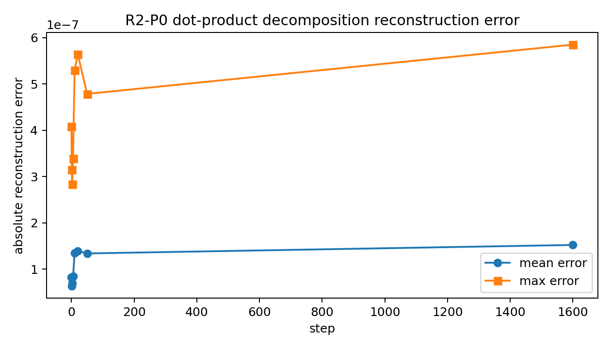
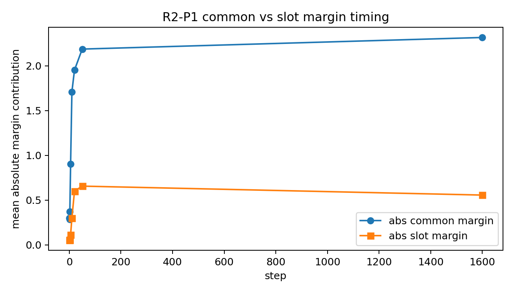
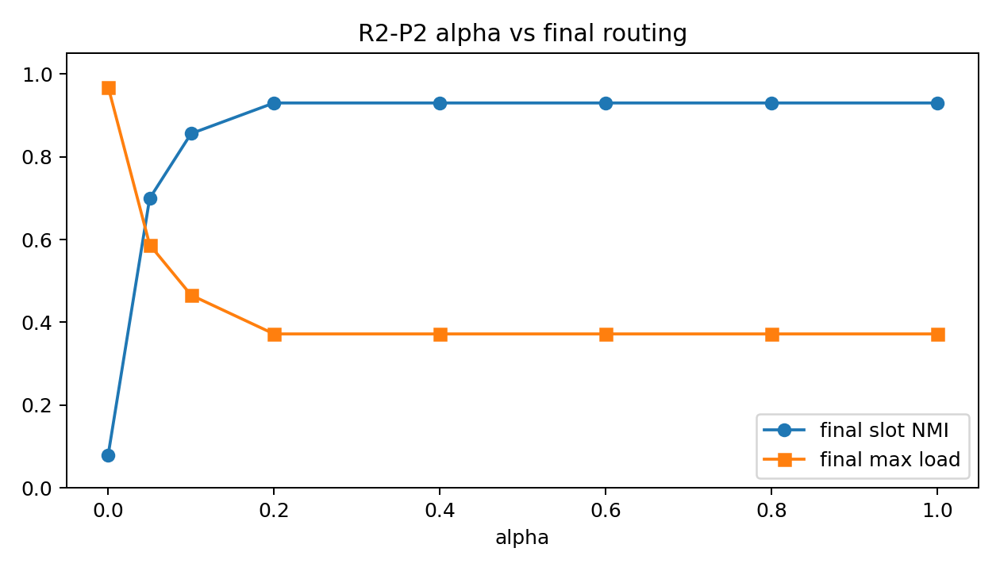
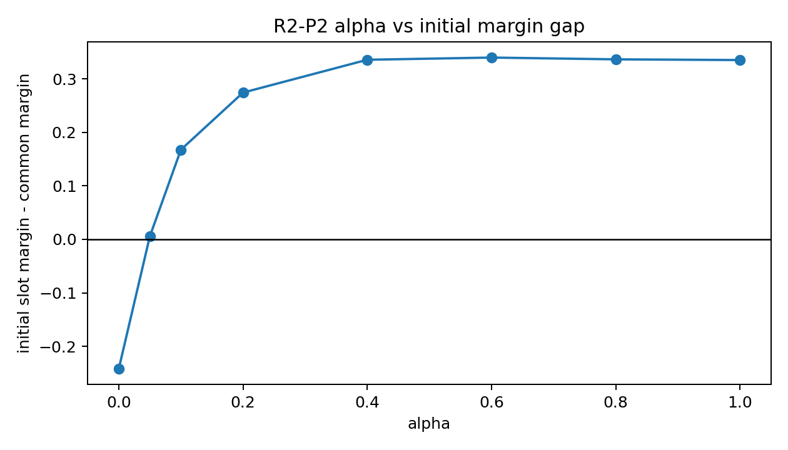
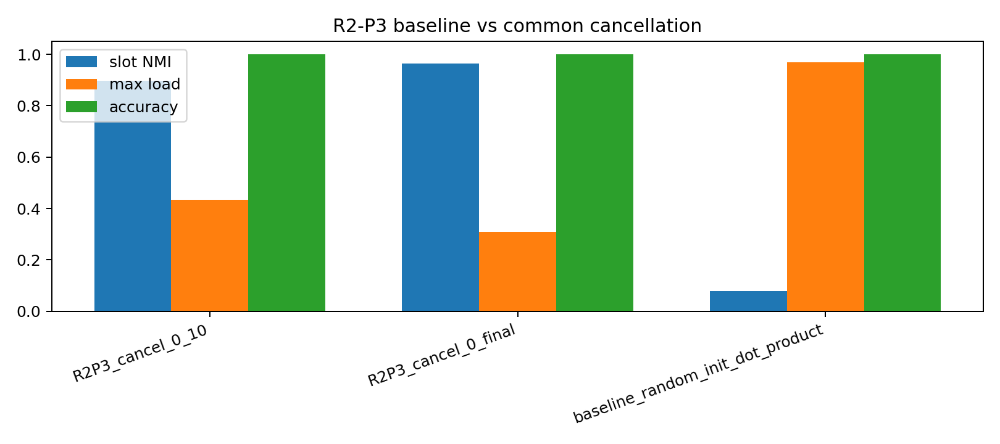
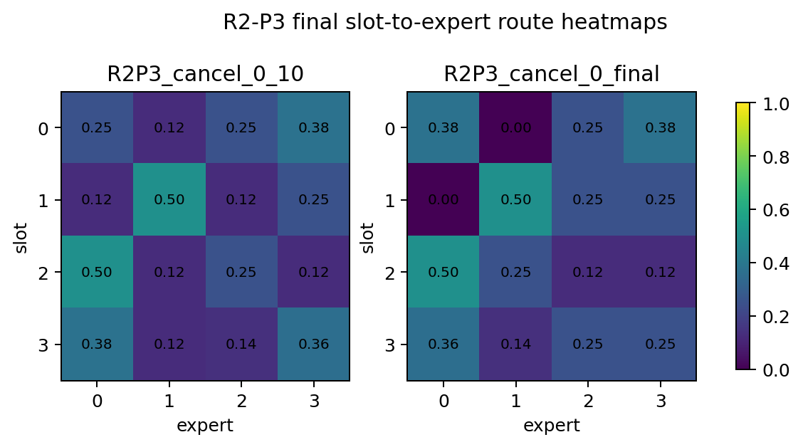
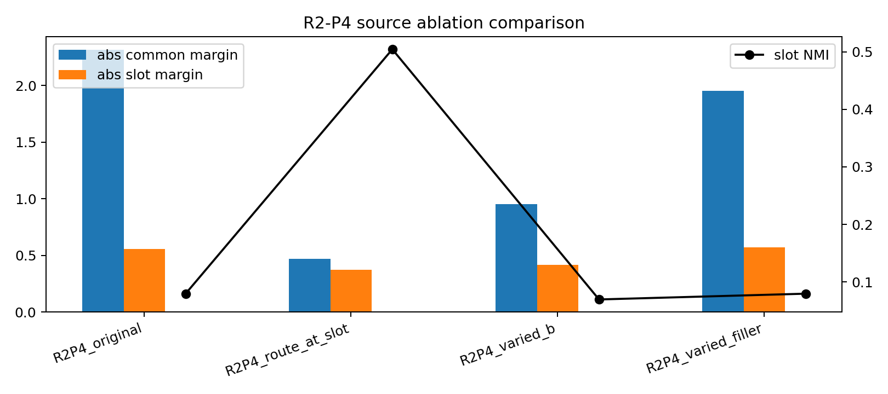

# A05_04_02 Round-2 Dot-Product Common-Logit Detailed Record

## Completion Status

The full Round-2 protocol run is completed.

- Run name: `round2_dotproduct_common_logit_4gpu_20260609`
- Run stage: `full`
- ACP job id: `pt-fplz4uf0`
- ACP state: `SUCCEEDED`
- Run status: `completed`
- Executed scope: R2-P0, R2-P1, R2-P2, R2-P3, R2-P4

The protocol-required final documents are:

- `results/round2_dotproduct_common_logit_4gpu_20260609/round2_summary.md`
- `results/round2_dotproduct_common_logit_4gpu_20260609/round2_detailed.md`

This file is the project-standard `detailed.md` entry so readers do not have to discover the nested Round-2 filenames manually.

## Source Files

- Protocol: `daily_research_reports/0609/round2_dotproduct_common_logit_protocol.md`
- Anchor: `main/problem_anchors/05_04_02_dotproduct_common_logit_causality_anchor.md`
- Runner: `main/experiments/A05/A05_04_02_round2_dotproduct_common_logit/scripts/run_round2_dotproduct_common_logit.py`
- Submit script: `main/experiments/A05/A05_04_02_round2_dotproduct_common_logit/scripts/submit_round2_dotproduct_common_logit_4gpu_acp.sh`
- Round-1 dot-product baseline: `main/experiments/A05/A05_04_01_round1_slot_specialization_protocol_dot_product/results/round1_slot_specialization_dot_product_4gpu_20260609`

## Setup

Model: same tiny sparse top-1 MoE family as Round 1. Positional embedding weights are zeroed and frozen.

Router: dot-product only, with $score_e(h)=w_e^T h$.

Routing: sparse top-1 only. No soft routing, no top-k with $k>1$, and no probability-weighted expert mixture.

Dataset: unchanged Round-1 moving-block data for the main run:

```text
prefix filler + SLOT_s B_CONST Y_s + suffix filler
```

The `SLOT_s B_CONST Y_s` block remains contiguous. Loss is computed at the `B_CONST` position. Routing metrics are computed at the `B_CONST` position except for the explicitly marked R2-P4 route-at-slot diagnostic.

## Implementation Notes

The common-logit decomposition separates the router logit at the routed audit position into common and slot-associated components under the dot-product router.

For common cancellation, the runner estimates the current common vector from the current batch or evaluation set at the routed audit position, then subtracts $w_e^T c_t$ only at that audit position in the router logits. Non-audited token positions keep their original dot-product top-1 scores.

This is an implementation adaptation relative to a purely analytic offline diagnostic; it is documented because it changes the training-time intervention surface.

## Artifact Map

- Result directory: `results/round2_dotproduct_common_logit_4gpu_20260609/`
- Figure directory: `figures/round2_dotproduct_common_logit_4gpu_20260609/`
- Run manifest: `results/round2_dotproduct_common_logit_4gpu_20260609/run_manifest.json`
- Run summary: `results/round2_dotproduct_common_logit_4gpu_20260609/run_summary.json`
- Raw aggregate metrics: `r2_all_trained_metrics_by_step.csv`
- Raw aggregate route confusion: `r2_all_trained_route_confusion.csv`
- Raw aggregate margin decomposition: `r2_all_trained_margin_decomposition.csv`
- P0 table: `r2_p0_decomposition_sanity.csv`
- P1 tables: `r2_p1_timing_by_seed.csv`, `r2_p1_common_predicts_final_table.md`
- P2 table: `r2_p2_alpha_sweep_metrics.csv`
- P3 tables: `r2_p3_common_cancel_metrics.csv`, `r2_p3_route_heatmaps.csv`
- P4 table: `r2_p4_source_ablation_metrics.csv`

## R2-P0 Decomposition Sanity

Purpose: verify that the dot-product logit decomposition reconstructs the original router logits accurately enough to support later margin claims.

Result:

- Mean reconstruction error: $1.073e^{-7}$
- Max reconstruction error: $5.849e^{-7}$
- Common-dominant cells: 2238/2560

Interpretation: the decomposition is numerically sound, and common-dominant logit cells are already widespread.



## R2-P1 Common-Logit Timing Audit

Purpose: determine whether common-logit dominance exists at initialization or emerges before lock-in.

Result:

- Step 0 common margin: 0.2993
- Step 0 slot margin: 0.0523
- Step 0 common-argmax predicts final dominant expert: 0.844
- Step 10 common margin: 1.7087
- Step 10 slot margin: 0.2993
- Step 10 common-argmax predicts final dominant expert: 0.969

Interpretation: common dominance is already present at step 0 and strengthens before step 10. Early common ranking is strongly predictive of the final dominant expert.



## R2-P2 Slot-Init Basin Audit

Purpose: test whether slot-initialized routing succeeds only after crossing a basin threshold.

Result:

| alpha | final slot NMI | max_load | initial slot-minus-common margin |
|---:|---:|---:|---:|
| 0 | 0.080 | 0.969 | -0.2421 |
| 0.05 | 0.699 | 0.587 | 0.0056 |
| 0.1 | 0.856 | 0.466 | 0.1676 |
| 0.2 | 0.930 | 0.372 | 0.2743 |
| 0.4 | 0.930 | 0.372 | 0.3357 |
| 0.6 | 0.930 | 0.372 | 0.3398 |
| 0.8 | 0.930 | 0.372 | 0.3365 |
| 1 | 0.930 | 0.372 | 0.3352 |

Interpretation: alpha 0.2 is the first tested basin threshold where mean final slot NMI reaches at least 0.90.





## R2-P3 Common-Logit Cancellation

Purpose: test whether cancelling the common component improves slot-level specialization rather than merely improving load balance.

Result:

| condition | final slot NMI | max_load | accuracy |
|---|---:|---:|---:|
| baseline_random_init_dot_product | 0.080 | 0.969 | 1.000 |
| R2P3_cancel_0_10 | 0.896 | 0.434 | 1.000 |
| R2P3_cancel_0_final | 0.963 | 0.309 | 1.000 |

Interpretation: common cancellation improves route-slot NMI while preserving accuracy. Under the protocol's NMI-plus-accuracy criterion, this supports a causal role for the common-logit component in random-init collapse.





## R2-P4 Common-Source Audit

Purpose: test likely sources of the common component without claiming full source identification.

Result:

| condition | common margin | slot margin | final slot NMI | accuracy |
|---|---:|---:|---:|---:|
| R2P4_original | 2.3158 | 0.5559 | 0.080 | 1.000 |
| R2P4_route_at_slot | 0.4681 | 0.3750 | 0.504 | 1.000 |
| R2P4_varied_b | 0.9528 | 0.4170 | 0.070 | 1.000 |
| R2P4_varied_filler | 1.9539 | 0.5715 | 0.080 | 1.000 |

Interpretation: fixed `B_CONST` / B-token identity is a likely major contributor, and the routed B position itself also contributes because route-at-slot reduces the common margin. Filler/template variation is not the main supported source. This does not fully identify the common source.



## Final Answers

1. Common-logit dominance is already present at step 0 and grows before step 10.
2. Early common-logit ranking predicts the final dominant expert before lock-in.
3. Slot-init success shows a basin threshold at alpha 0.2 among the tested values.
4. Common-logit cancellation improves slot-level specialization while preserving accuracy.
5. The likely common-component source is fixed `B_CONST` / B-token identity plus the routed B position; this is source evidence, not full source identification.
6. The next scientific decision is to design a minimal anti-common or anti-lock-in router that preserves sparse top-1 and makes slot specialization reachable from random initialization.

## Claim Boundary

Do not claim common source is fully identified. Do not treat load balance as feature specialization. Do not claim expert computation is causally slot-specialized. Do not claim transfer to real language models.
