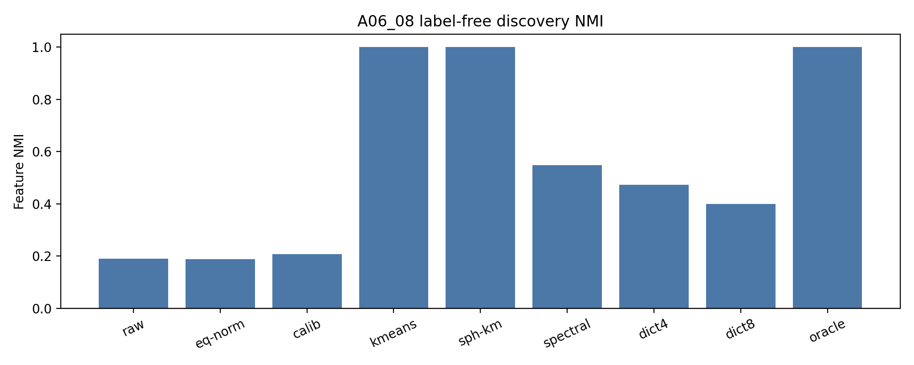
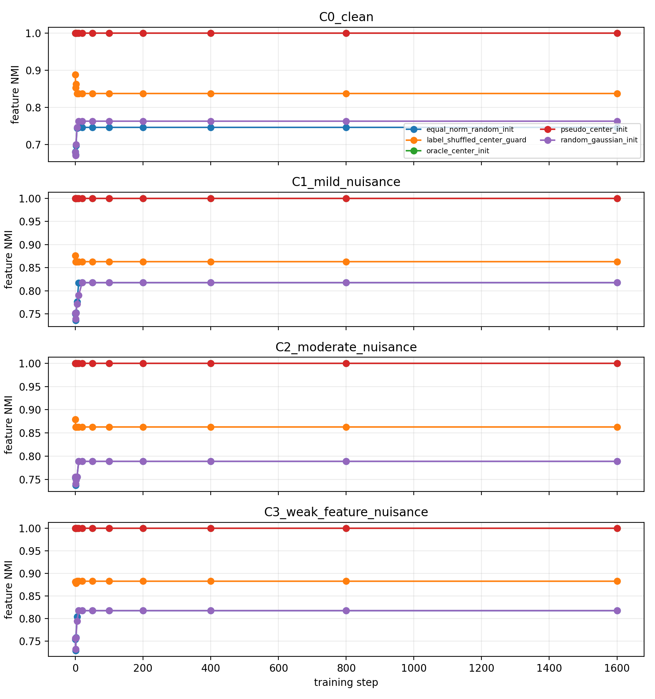
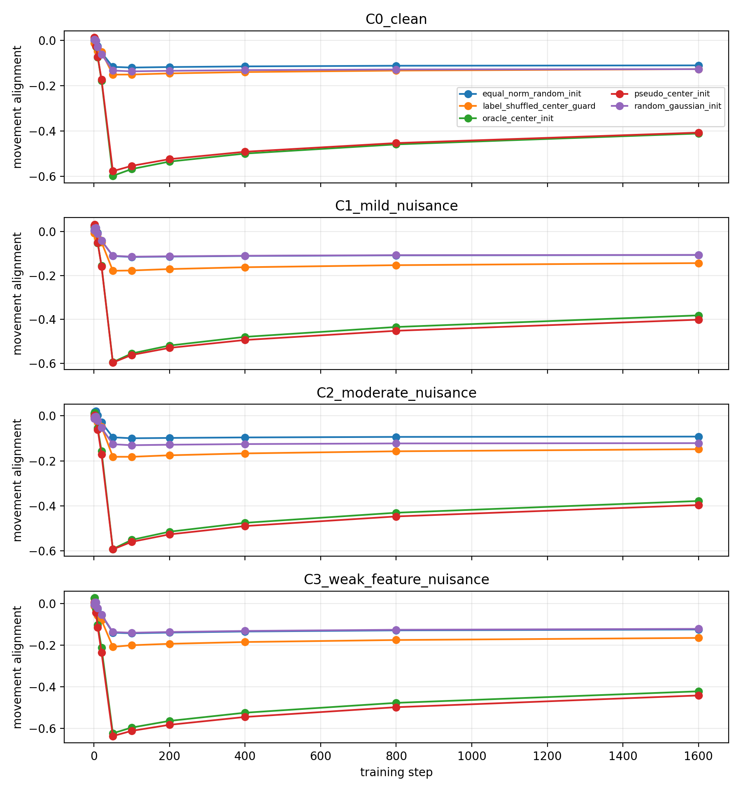
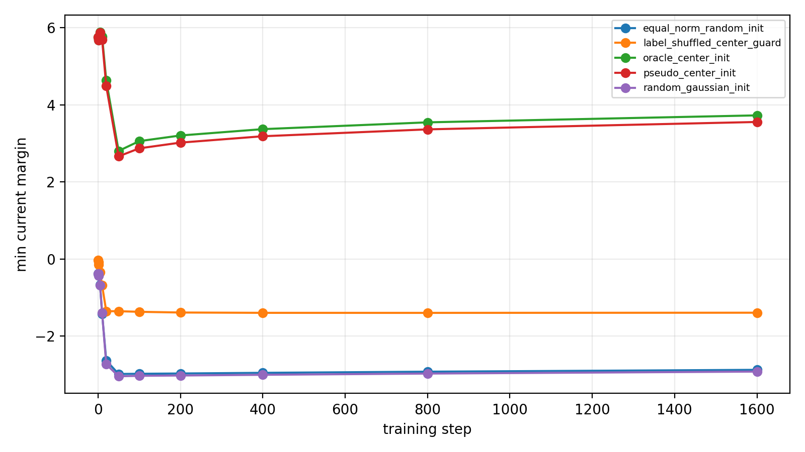
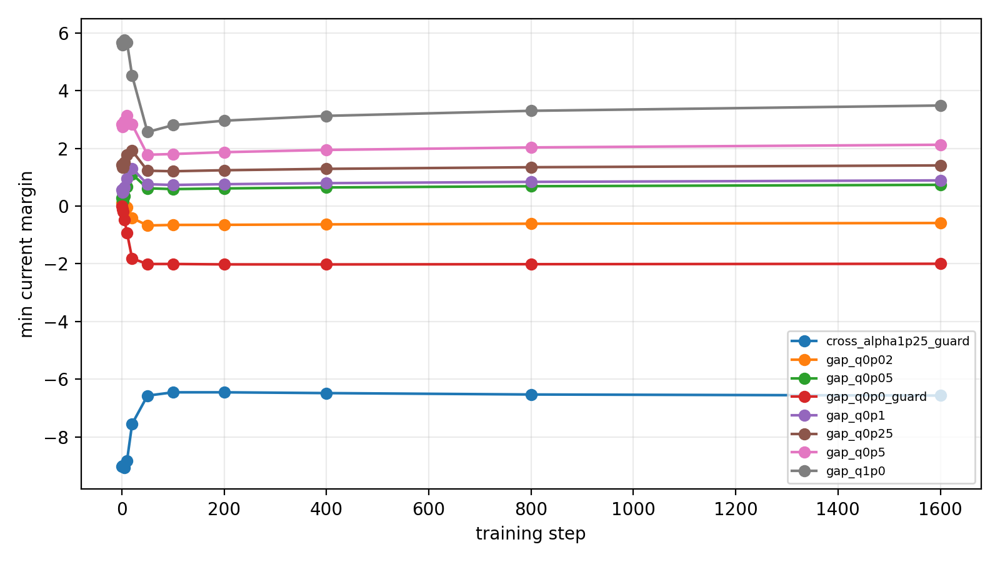
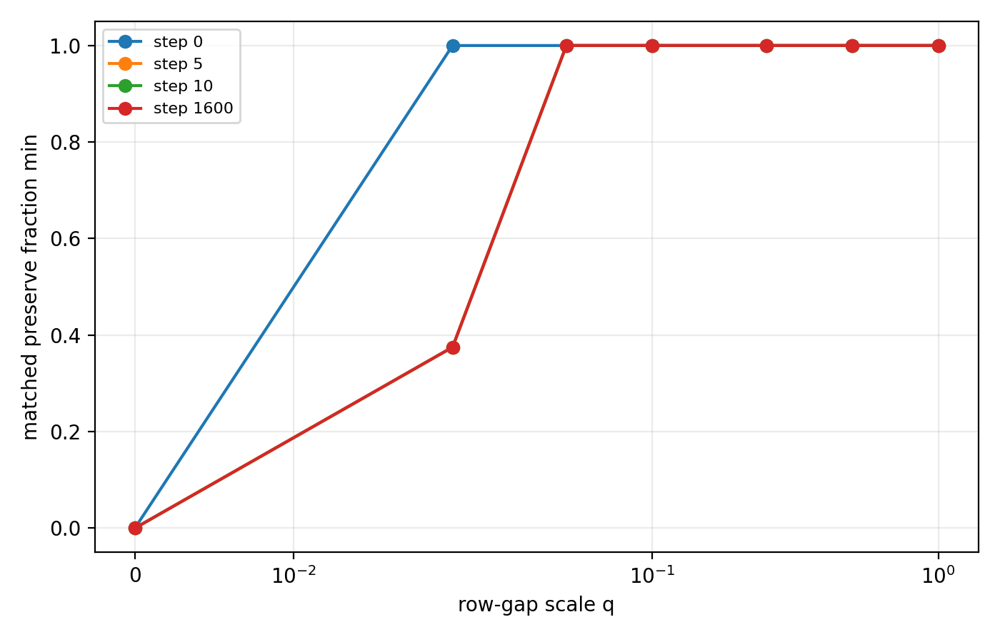
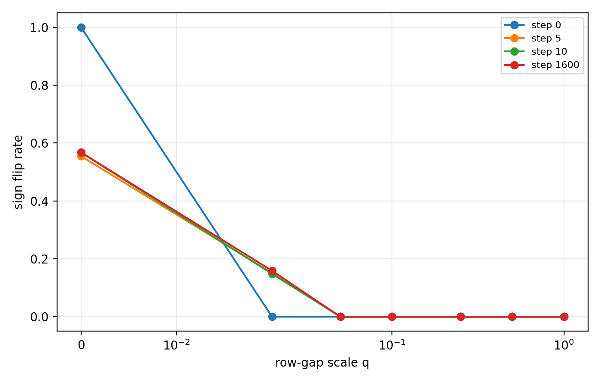
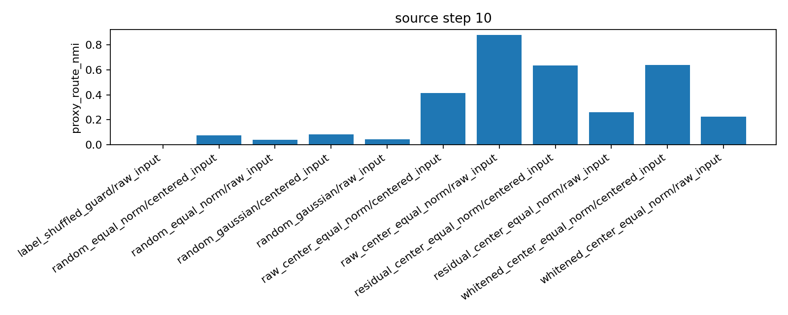
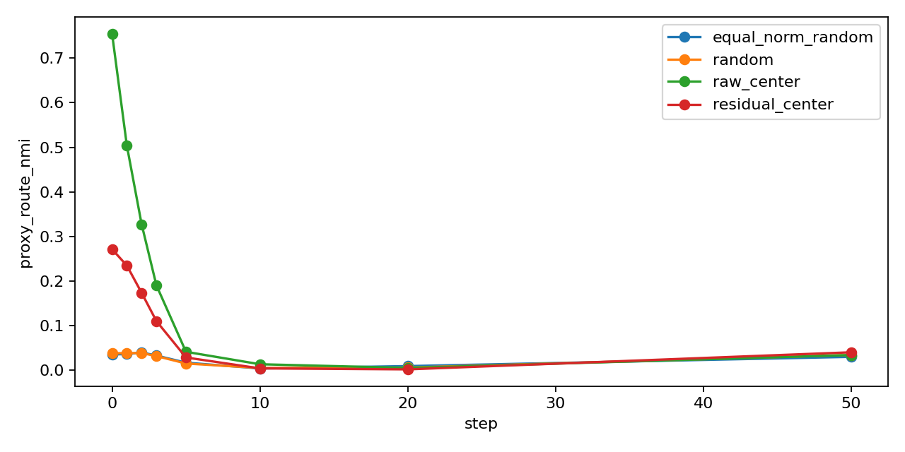
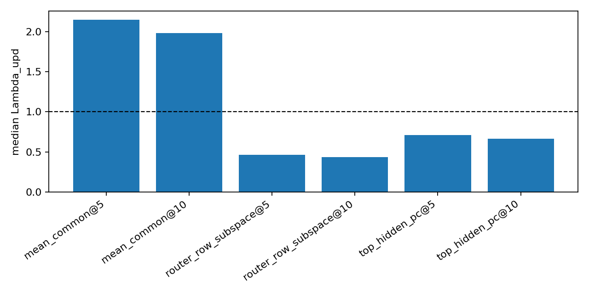

# 特征路由为何能保持，以及下一步如何分析公共与稀有特征干扰

## 0. 执行摘要

**研究问题：** 在均匀特征分布中，表征空间聚类初始化已经能让不同特征均匀进入不同专家，并在受控训练中（前1600步）保持；当前需要判断的是，这种保持到底来自什么机制，以及下一步如何把问题推进到 如何减少common部分与稀有特征的干扰。

**机制解释：** 当前机制判断是：合理初始化后，训练过程中门控行向量并没有主动跟随特征中心移动；保持分发有效 主要是因为初始化时给了特征到专家分配足够大的positive margin，训练漂移没有把这个margin消耗到零以下。

**核心公式：** 特征 $f$ 相对竞争专家 $e$ 的 margin 定义为：

$$
\gamma_{f,e}(t)
=
\bigl(w_{a(f)}(t)-w_e(t)\bigr)^\top\mu_f(t).
$$

训练后 margin 变化分解为：

$$
\gamma(t)-\gamma(0)
=
\Delta u(t)^\top\mu(0)
+u(0)^\top\Delta\mu(t)
+\Delta u(t)^\top\Delta\mu(t).
$$

**主要结果：** 现有证据支持“聚类初始化可以建立可保持的受控特征路由”和“保持依赖有限大小的初始margin”；同时，真实 DCLM 的common/residual轨迹监测说明common部分可能参与路由崩塌，但当前还不能稳定估计common部分，因此不能直接把减去common当成已验证方法。

**证据说明：** 归一化互信息表示特征分组和专家分配的一致程度，margin表示原专家相对竞争专家的分数优势；受控聚类初始化可达到特征一致性 `1.0` 和均匀负载，中心初始化训练后仍保持 `1.0`，但当初始margin缩小到 $q=0.02$ 时，最终原匹配保持率降到 `0.375`、margin变成 `-0.588`、翻转率升到 `0.159`。

1. 在均匀特征分布上，聚类得到的特征中心可以把特征均匀分配到不同专家，并在受控训练（前1600步，后logit稳定）中保持。
2. 分发保持不是因为门控行向量主动追踪特征中心，而是因为初始化提供了足够大的正margin。
3. common部分可能影响真实训练中的路由保持，但common/residual轨迹审计显示common部分的估计仍不稳健；下一步应将嵌套式学习作为建模启发，检验减去common部分的路由是否能降低公共高增益空间与稀有特征之间的干扰。

**结论边界：** 当前证据不能推出真实语义专家已经形成，不能推出common部分已经被正确估计，也不能推出减去common部分的门控方法已经有效。

**执行动作：** 下一步最小动作是设计一个common部分扣除的路由审计：先定义可复核的公共算子，再比较原始路由和扣除common部分后的路由是否提高稀有特征margin、减少margin翻转，并且不恶化语言模型损失。

## 1. 术语解释

| 术语 | 中文含义 | 具体对象或计算方式 | 单位或公式 | 为什么影响当前判断 | 不能证明什么 |
|---|---|---|---|---|---|
| 均匀特征分布 | 每个待区分特征出现次数相同，不靠频率差异取胜 | 本项目受控设置中的四个特征均匀出现 | 无 | 排除“某个专家只学了高频特征”的解释 | 不能代表真实文本分布 |
| 混合专家模型（MoE） | 用门控把词元分给不同专家的模型 | 本线中使用最高分唯一专家门控，即每个词元只进入得分最高的专家 | 无 | 专家分配由门控得分决定 | 不能单独证明专家有功能价值 |
| 门控行向量 | 某个专家对应的一行打分参数 | 专家 $e$ 的行向量 $w_e$ 对隐藏状态 $h$ 打分 $w_e^\top h$ | 未归一化得分 | 决定隐藏状态落入哪个专家区域 | 不能说明专家内部学了什么 |
| 特征中心 | 某一类特征在隐藏空间中的平均位置 | 对特征分组 $f$ 的隐藏状态求均值，记作 $\mu_f$ | 向量 | 聚类初始化就是用这些中心构造门控行 | 不能证明该特征有语义含义 |
| 聚类初始化 | 不使用人工标签，从隐藏状态中找出可重复分组，再用分组中心初始化门控 | 例如对路由位置残余隐藏状态做 $K=4$ 聚类，得到四个中心 | 无 | 它是“无标签建立专家分配”的关键步骤 | 不能证明训练后仍会保持 |
| 归一化互信息（NMI） | 两个分组是否一致 | 比较特征/代理标签和专家分配的一致程度 | 0 到 1，越高越一致 | 判断路由是否仍区分原分组 | 专家身份交换时可能仍然高 |
| 原匹配保持率 | 原来进入某专家的分组训练后是否仍在同一专家区域 | 比较第 0 步固定匹配和后续专家身份 | 比例 | 比 NMI 更严格，能发现身份交换 | 不能证明专家有用 |
| margin | 原专家相对竞争专家的分数优势 | $\gamma_{f,e}=(w_{a(f)}-w_e)^\top\mu_f$ | 未归一化分数差 | $\gamma>0$ 表示特征中心仍在原专家一侧 | 不能单独证明功能价值 |
| margin翻转率 | 成对margin跨过决策边界的比例 | $\gamma_{f,e}(t)\le 0$ 的成对比例 | 比例 | 直接显示路由边界是否被训练跨过 | 不能说明跨越原因 |
| common部分 | 多个特征共享、容易被门控或优化共同使用的方向 | 需要用投影 $P_C$ 估计，例如均值方向、最高方差方向、路由行子空间或梯度相关方向 | 投影 | 决定“减去common部分”到底减掉什么 | 当前还不能自动等同于真实干扰来源 |
| 稀有特征 | 出现频率低、组合更具体、容易被公共模式覆盖的特征信息 | 在下一步实验中用长尾分组、稀有上下文或稀有路由残差信号操作化 | 视实验定义而定 | 它对应导师文档中更晚、更难学习的长尾信息 | 不能直接等同于语义复杂性 |
| 高增益公共空间 | 被频繁训练、对损失下降贡献大的公共方向 | 可由读出矩阵奇异值、梯度对齐或路由更新方向估计 | 增益或投影比例 | 是连接嵌套式学习和门控干扰的候选机制 | 目前不能证明已经被正确估计 |
| DCLM | 当前真实文本训练数据来源 | 用 DCLM 词元流做语言模型训练和隐藏状态审计 | 数据集 | 提供比合成数据更真实的检验 | 不能代表所有自然语言或所有尺度 |

## 2. 机制解释与建模

**核心模型：**

本次汇报先看门控间隔（margin）本身。对特征分组 $f$，第 0 步匹配的专家是 $a(f)$，竞争专家是 $e$，间隔定义为：

$$
\gamma_{f,e}(t)
=
\bigl(w_{a(f)}(t)-w_e(t)\bigr)^\top\mu_f(t).
$$

其中 $\mu_f(t)$ 是特征中心，$w_{a(f)}(t)$ 是原匹配专家的门控行向量，$w_e(t)$ 是竞争专家的门控行向量。为了看 margin 如何变化，记

$$
u_{f,e}(t)=w_{a(f)}(t)-w_e(t),
$$

则 $\gamma_{f,e}(t)=u_{f,e}(t)^\top\mu_f(t)$。若所有竞争专家都满足 $\gamma_{f,e}(t)>0$，特征中心仍落在原专家一侧；若某些 $\gamma_{f,e}(t)\le 0$，路由边界已经被跨过。

训练后 margin 变化可以分解为：

$$
\gamma(t)-\gamma(0)
=
\Delta u(t)^\top\mu(0)
+u(0)^\top\Delta\mu(t)
+\Delta u(t)^\top\Delta\mu(t).
$$

三项分别表示：

- $\Delta u(t)^\top\mu(0)$：门控边界移动对原特征中心的影响。
- $u(0)^\top\Delta\mu(t)$：特征中心漂移在原门控边界上的影响。
- $\Delta u(t)^\top\Delta\mu(t)$：门控边界和特征中心同时移动的交互影响。

如果门控主动追踪特征中心，门控行向量的移动方向应该和匹配特征中心的移动方向一致，可用：

$$
A_{\mathrm{move}}(t)
=
\frac{1}{F}\sum_e
\cos\left(\Delta w_e(t),\Delta \tilde{\mu}_{\pi(e)}(t)\right)
$$

来检查。现有诊断显示，受控训练能保持特征路由，但 $A_{\mathrm{move}}$ 不是正向高对齐，因此“主动追踪”不是主要解释。

进一步缩小初始 margin 可以测试保持是否需要有限厚度。对门控行做：

$$
w'_e(q)=\bar w+q(w_e-\bar w),
$$

其中 $\bar w$ 是所有专家行向量的平均值。$q$ 越小，专家之间的初始差距越小，初始 margin 越薄。若 $q>0$ 的第 0 步分配正确但训练后失败，就说明“初始正确”不等于“训练可保持”。

**与common部分的关系：**

common部分不是本轮已经闭合的解释，而是下一步需要建模的候选机制。若隐藏状态可分成公共部分和特征残余：

$$
h = P_C h + (I-P_C)h,
$$

那么减去common部分的路由相当于让门控更多读取 $(I-P_C)h$。但 06_22 公共/残余轨迹审计的关键结果是：不同 $P_C$ 会给出相反的公共/残余判断。因此，下一步不能直接说“减去common部分一定有效”，而要先定义和训练目标相关的公共算子，再检验它是否提高稀有特征的margin。

**链接nested learning：**

嵌套式学习给出一个启发：高频公共上下文可能先形成高增益通道，后来的稀有或组合特征如果沿着这些通道更新，可能被公共空间吸收。这里不是把现有实验直接解释成导师理论的验证，而是把它转化成下一步可测问题：

> 减去common部分后的路由，是否能减少高增益公共空间对稀有特征margin的消耗？

## 3. 主要结果

**一句话总结：** 当前最重要结果是：受控特征路由已经可以通过聚类初始化建立并保持，但保持的机制是正margin缓冲；真实文本里的common部分可能干扰保持，不过 06_22 公共/残余轨迹审计显示common部分估计还没有闭合。

### 结果 1：在均匀特征分布上，聚类初始化可以建立均匀且可保持的特征路由。

**机制对应：** 该结果回答“特征到专家分配是否几何上可达”。如果聚类中心可以把四个均匀特征分到四个专家，并且负载均匀，那么后续问题才是训练如何保持，而不是初始化是否根本不可行。

**指标或条件定义：** 特征一致性用归一化互信息衡量，值为 `1.0` 表示特征分组和专家分配完全一致；负载 $L=0$ 表示四个专家使用均匀。

**证据：** 在 A06_08 中，对路由位置残余隐藏状态做 $K=4$ 聚类，聚类初始化在全部 `48/48` 个受控单元中通过，平均特征一致性为 `1.0`，负载 $L=0.0$。

进一步在受控训练中，中心初始化的特征一致性保持为 `1.0`，说明这个分配不只是第 0 步可达，也可以在当前受控训练窗口中保持。

**解释：** 这说明研究主线已经越过了“能不能初始化出特征路由”的第一关。当前真正的问题不是负载是否均匀，而是这种分配为什么能保持、何时会失效。

**边界：** 该结果属于受控均匀特征设置，不能推出真实文本语义专家已经形成，也不能推出专家内部已经有功能价值。

**来源：** `Projects/from-attention-to-search/main/experiments/A06/A06_08_label_free_feature_discovery_initialization/summary.md`；`Projects/from-attention-to-search/main/experiments/A06/A06_17_02_router_center_tracking_preservation/summary.md`。

### 结果 2：训练中的保持不是门控主动追踪特征中心，而是初始化给出了足够厚的正margin。

**机制对应：** 该结果对应第 2 节的margin分解。若门控主动追踪特征中心，门控行向量移动方向应与特征中心移动方向一致；若不是主动追踪，则需要看初始margin是否足够抵消训练漂移。

**指标或条件定义：** 移动对齐 $A_{\mathrm{move}}$ 衡量门控行向量是否跟随特征中心移动；margin $\gamma$ 衡量原专家相对竞争专家的分数优势；margin翻转率衡量多少成对边界被跨过。

**证据：** A06_17_02 中，伪中心和真实中心初始化最终特征一致性都是 `1.0`，但门控行向量移动与特征中心移动并不正向对齐：最终 $A_{\mathrm{move}}$ 分别约为 `-0.412` 和 `-0.398`。同时，两者最终仍保留正margin。

A06_21 进一步显示，伪中心和真实中心初始化在第 1600 步仍保持正margin、零翻转、原匹配保持率 `1.0`。

A06_23 把初始门控行差距按 $q$ 缩小后，$q\ge 0.05$ 仍保持；但 $q=0.02$ 虽然第 0 步分配正确，训练后最终原匹配保持率降到 `0.375`，最终margin变成 `-0.588`，margin翻转率升到 `0.159`。

**解释：** 这说明最高分唯一专家门控确实有路径依赖，但“初始分对”本身不够。真正决定训练保持的是训练漂移之后margin是否仍为正；如果初始化给的margin太薄，优化过程仍会把特征推过路由边界。

**边界：** 这个阈值属于当前受控设置，不能把 $q=0.05$ 当成真实文本的安全阈值。该结果也不能证明common部分就是失败原因。

**来源：** `Projects/from-attention-to-search/main/experiments/A06/A06_17_02_router_center_tracking_preservation/summary.md`；`Projects/from-attention-to-search/main/experiments/A06/A06_21_margin_budget_preservation_audit/summary.md`；`Projects/from-attention-to-search/main/experiments/A06/A06_23_top1_lockin_margin_threshold/summary.md`。

### 结果 3：真实文本中的路由保持失败已经出现，但 06_22 公共/残余轨迹审计显示common部分估计还不稳健。

**机制对应：** 该结果把受控margin机制推进到真实文本。真实 DCLM 中，代理中心能初始化门控，但普通训练会快速抹掉该分配；这提示公共/残余干扰可能重要，但common部分的估计必须先闭合。

**指标或条件定义：** 代理路由一致性是 DCLM 中可测分组和专家分配的一致程度。公共/残余更新比例 $\Lambda_{\mathrm{upd}}$ 比较路由margin更新沿公共方向和残余方向的相对大小；大于 1 表示在当前公共定义下公共项更大。

**证据：** A06_11 显示真实 DCLM 代理中心可以初始化门控，第 10 步来源的原始中心路由一致性达到 `0.8811`。

但 A06_22 复现了训练保持失败：原始中心初始化的代理路由一致性从第 0 步 `0.7549` 降到第 5 步 `0.0410`，第 10 步 `0.0131`；语言模型损失与随机初始化几乎相同，因此这不是训练崩坏。

06_22 公共/残余轨迹审计的关键边界是：公共主导判断随公共定义翻转。用全局均值方向定义公共时，$\Lambda_{\mathrm{upd}}@5=2.1507$、$\Lambda_{\mathrm{upd}}@10=1.9856$；但用隐藏状态最高方差方向定义公共时是 `0.7089/0.6666`，用路由行子空间定义公共时是 `0.4611/0.4332`。

**解释：** 这给出了一个更稳的叙述：真实文本保持失败确实存在，common部分是合理候选解释；但当前不能说“common部分已经被正确估计”，更不能说“减去common部分一定能修复门控”。下一步应把common部分定义成可检验对象。

**边界：** 这不能证明公共通道无关，也不能证明残余方向没有价值。它只能说明当前公共定义还不够物理，不能直接拿来构造方法结论。

**来源：** `Projects/from-attention-to-search/main/experiments/A06/A06_11_real_dclm_proxy_center_router_initialization/summary.md`；`Projects/from-attention-to-search/main/experiments/A06/A06_22_router_common_residual_trajectory_audit/summary.md`。

## 4. 执行动作

**下一步动作：** 设计并执行一个common部分扣除的路由审计：先定义和训练目标相关的公共算子 $P_C$，再比较原始路由 $h$ 与扣除common部分后的路由 $(I-P_C)h$，判断后者是否能提高稀有特征margin、降低margin翻转，并减少公共高增益空间与稀有特征之间的干扰。

**目的：** 让导师文档中的嵌套式学习成为下一步建模启发：高频公共结构可能形成高增益通道，稀有特征可能被这些通道吸收。我们的实验目标不是直接证明这个理论，而是把它转化成可证伪问题：扣除common部分后，稀有特征的路由margin是否更稳。

**完成判据：** 完成后必须报告：公共算子定义、公共算子稳健性、稀有特征当前margin、原匹配保持率、margin翻转率、语言模型损失、稀有特征损失或更新冲突指标。如果公共算子仍像 06_22 一样随定义翻转，则不能进入方法结论；如果扣除common部分稳定提高稀有特征margin且不损害损失，才进入下一轮门控机制建模。

## 5. 证据索引

| 结果 | 证据 | 主要指标或图 | 支持什么 | 不能证明什么 | 来源 |
|---|---|---|---|---|---|
| 结果 1 | 受控聚类初始化 | 聚类特征一致性 `1.0`，负载 $L=0.0$；`a06_08_feature_discovery_nmi.png` | 均匀特征分布中可无标签恢复特征中心 | 真实文本语义专家 | A06_08 |
| 结果 1 | 中心初始化训练保持 | 训练中特征一致性保持 `1.0`；`a06_17_02_feature_nmi_trajectory.png` | 受控特征分配可以保持 | 保持机制已经解释 | A06_17_02 |
| 结果 2 | 门控移动方向诊断 | $A_{\mathrm{move}}$ 为负；`a06_17_02_movement_alignment_trajectory.png` | 保持不是主动追踪特征中心 | 门控完全不受训练影响 | A06_17_02 |
| 结果 2 | margin预算审计 | 正margin、零翻转、原匹配保持率 `1.0`；`a06_21_controlled_margin_trajectory.png` | 保持由正margin缓冲解释 | 真实 DCLM 保持已解决 | A06_21 |
| 结果 2 | margin缩放阈值 | $q=0.02$ 失败，$q\ge 0.05$ 保持；`a06_23_current_margin_trajectory.png`，`a06_23_margin_threshold_preserve.png` | 第 0 步正margin不保证训练后仍为正，保持需要有限厚度margin | 数值阈值可迁移到真实文本 | A06_23 |
| 结果 3 | 真实 DCLM 初始化 | 第 10 步来源原始中心路由一致性 `0.8811`；`a06_11_real_proxy_router_init.png` | 真实分组可被门控读出 | 专家功能价值 | A06_11 |
| 结果 3 | 真实 DCLM 早期崩塌 | 一致性 `0.7549 -> 0.0410 -> 0.0131`；`a06_22_real_dclm_proxy_collapse.png` | 真实瓶颈是训练保持 | 崩塌根因已知 | A06_22 |
| 结果 3 | 06_22 公共定义稳健性审计 | $\Lambda_{\mathrm{upd}}$ 随公共定义翻转；`a06_22_common_projector_robustness.png` | common部分估计仍是建模瓶颈 | 公共通道无关 | A06_22 |

## 6. 来源索引

**Anchor：**

- `Projects/from-attention-to-search/main/problem_anchors/06_geometry_proxy_preservation/06_22_router_common_residual_trajectory_anchor.md`
- `Projects/from-attention-to-search/main/problem_anchors/06_geometry_proxy_preservation/06_23_top1_lockin_margin_threshold_anchor.md`

**Protocol：**

- `Projects/from-attention-to-search/main/experiments/A06/A06_22_router_common_residual_trajectory_audit/protocol.md`
- `Projects/from-attention-to-search/main/experiments/A06/A06_23_top1_lockin_margin_threshold/protocol.md`

**Summary：**

- `Projects/from-attention-to-search/main/experiments/A06/A06_08_label_free_feature_discovery_initialization/summary.md`
- `Projects/from-attention-to-search/main/experiments/A06/A06_11_real_dclm_proxy_center_router_initialization/summary.md`
- `Projects/from-attention-to-search/main/experiments/A06/A06_17_02_router_center_tracking_preservation/summary.md`
- `Projects/from-attention-to-search/main/experiments/A06/A06_21_margin_budget_preservation_audit/summary.md`
- `Projects/from-attention-to-search/main/experiments/A06/A06_22_router_common_residual_trajectory_audit/summary.md`
- `Projects/from-attention-to-search/main/experiments/A06/A06_23_top1_lockin_margin_threshold/summary.md`

**Detailed：**

- `Projects/from-attention-to-search/main/experiments/A06/A06_22_router_common_residual_trajectory_audit/detailed.md`
- `Projects/from-attention-to-search/main/experiments/A06/A06_23_top1_lockin_margin_threshold/detailed.md`

**Figures：**

- `daily_research_reports/0701/figures/a06_08_feature_discovery_nmi.png`
- `daily_research_reports/0701/figures/a06_11_real_proxy_router_init.png`
- `daily_research_reports/0701/figures/a06_17_02_feature_nmi_trajectory.png`
- `daily_research_reports/0701/figures/a06_17_02_movement_alignment_trajectory.png`
- `daily_research_reports/0701/figures/a06_21_controlled_margin_trajectory.png`
- `daily_research_reports/0701/figures/a06_22_common_projector_robustness.png`
- `daily_research_reports/0701/figures/a06_22_real_dclm_proxy_collapse.png`
- `daily_research_reports/0701/figures/a06_23_current_margin_trajectory.png`
- `daily_research_reports/0701/figures/a06_23_margin_threshold_preserve.png`
- `daily_research_reports/0701/figures/a06_23_margin_threshold_sign_flip.png`

## 7. 补充材料

**建议讲法：** 先讲“特征路由能被聚类初始化出来，并且在受控训练中保持”；再讲“优化诊断显示它不是因为门控追着特征中心跑，而是因为初始margin足够厚”；然后讲“margin变薄会失败，所以保持问题本质上是margin预算问题”；接着讲“真实文本里保持失败已经出现，但 06_22 公共/残余轨迹审计说明common部分估计还不稳健”；最后平稳过渡到导师文档：“嵌套式学习提示高频公共通道可能影响稀有特征，因此下一步检验扣除common部分的路由是否减少这种干扰。”

**为什么不直接说已经验证导师理论：** 当前结果只证明了受控路由保持的margin机制和真实文本中公共估计的瓶颈。导师文档提供下一步机制建模方向，但不是现有实验的已证明结论。

**为什么不能现在直接宣称减去common部分有效：** 06_22 已经显示公共主导判断随公共定义翻转。如果公共算子没有先被定义清楚，减去common部分可能只是改变负载或分数尺度，不能说明稀有特征干扰被修复。
