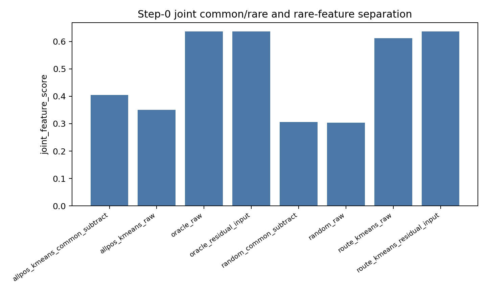
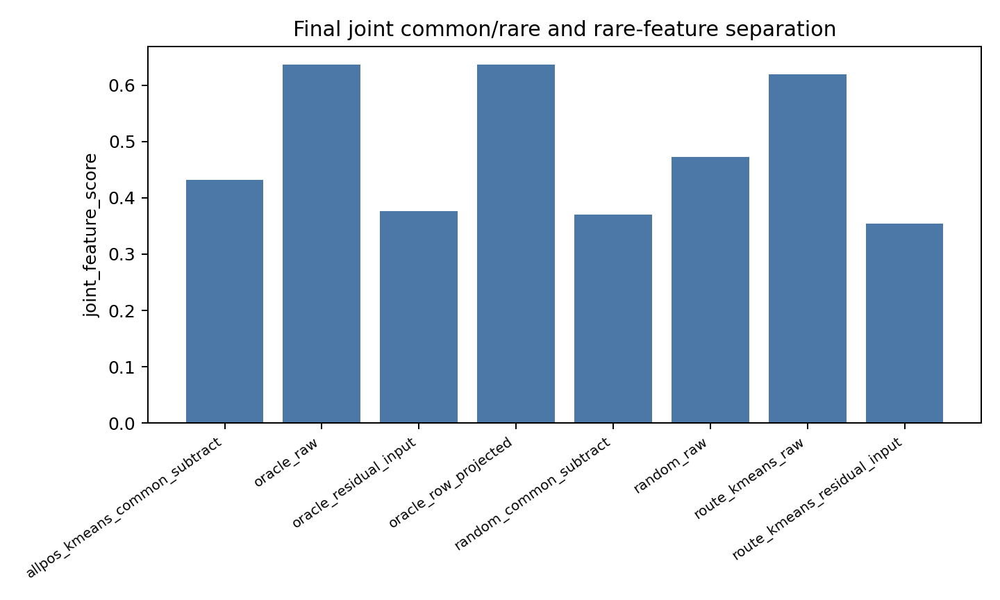
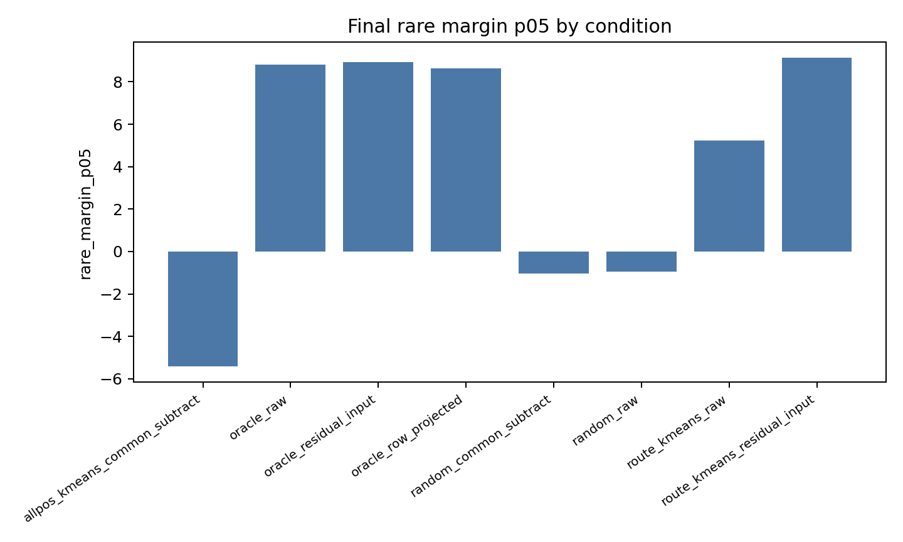
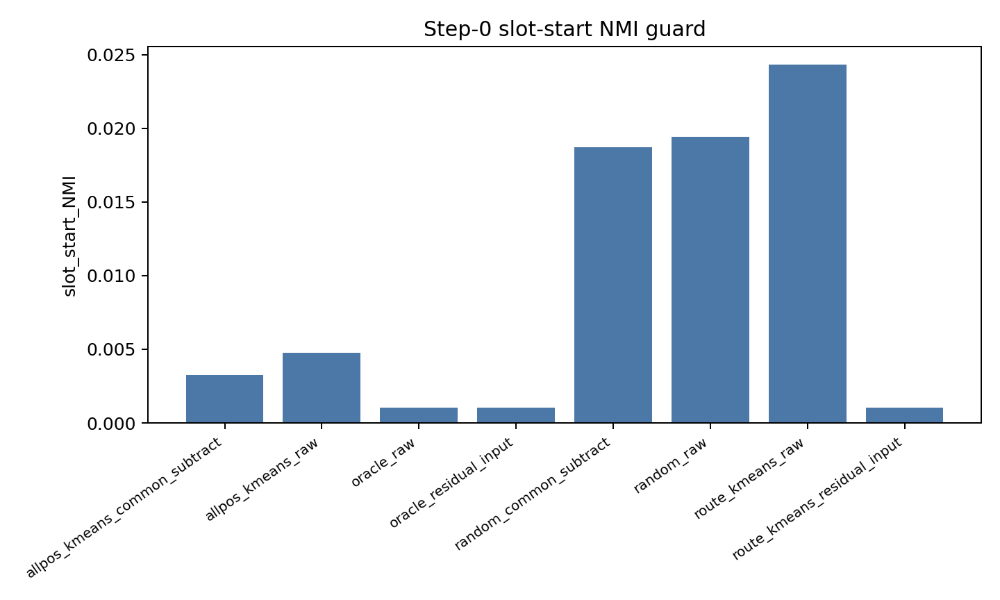

# Detailed: A06_24_synthetic_common_rare_transformer_moe

Primary anchor:
`../../../problem_anchors/06_geometry_proxy_preservation/06_24_synthetic_common_rare_transformer_moe_anchor.md`

Protocol:
`protocol.md`

Summary:
`summary.md`

## 0. Quick Recap

Purpose: Replace the vector-only A06_24_toy mechanism surface with a trained one-layer Transformer plus one-layer MoE synthetic common/rare audit.

Hypothesis: Common subtraction is mainly a concentration/load repair and does not supply route-relevant rare-feature centers.

Experiment logic: Compare random, all-position, route-position, and oracle router initializations under raw routing, common-subtracted routing, residual router input, and router-row projection. Evaluate on balanced held-out route-position states across 8 seeds and slot lengths 1/2/4/8.

Conclusion: Supported with refinement. Common subtraction alone does not match route-position/oracle centers; all conditions learn the target, but only route-position/oracle/row-projected conditions keep strong joint feature separation and positive rare margins. Residual input preserves rare-rare separation but can weaken common-vs-rare separation.

Evidence: 4-GPU ACP full run `pt-hb9swzcm`, `32` seed/slot cells, `1280` training trajectory rows.

## 1. Terminology / Definitions

| Term | Plain meaning | Concrete object / computation | Unit or formula | Why it matters | Cannot prove |
| --- | --- | --- | --- | --- | --- |
| Common feature | High-frequency synthetic feature | Feature id 0 | Probability mass | Tests frequency-dominated routing | Real common semantics |
| Rare features | Low-frequency synthetic features | Feature ids 1--3 | Feature id | Tests rare-rare separation | Real rare semantics |
| Route position | Task-relevant audited token | Last token in the repeated feature slot | Sequence index | Keeps routing tied to target prediction | Real route relevance |
| Rare-feature NMI | Rare feature / expert agreement | NMI(feature id, route) on rare eval examples | 0--1 | Primary rare separation metric | Common-vs-rare separation |
| Common/rare NMI | Binary common-vs-rare agreement | NMI(feature is rare, route) | 0--1 | Tests whether common separates from rare | Rare-rare separation |
| Joint feature score | Combined separation guard | `rare_feature_NMI * common_rare_NMI` | 0--about 0.637 here | Penalizes partial separation | Expert utility |
| Rare margin p05 | Lower-tail rare routing margin | 5th percentile of matched rare score gap | Logit difference | Tests basin robustness | Functional value |
| Sign flip | Margin crosses the boundary | Step-0 positive rare margin becomes non-positive | Fraction | Tests preservation | Cause alone |
| Slot-start NMI | Position nuisance agreement | NMI(slot_start, route) | 0--1 | Position leakage guard | No possible context-length effect |

## 2. Anchor Link And Decision Point

The anchor decision was whether common subtraction creates feature-level separation in a trained synthetic Transformer-MoE, or whether it only repairs concentration while rare-feature separation still requires route-relevant centers and preservation.

The decisive comparison is all-position common-subtracted centers versus route-position and oracle centers. The decisive metric is rare-feature NMI, guarded by common/rare NMI, joint feature score, rare margin p05, target accuracy, and slot-start NMI.

## 3. Protocol Compliance Audit

approved conditions match actual conditions: yes. The run includes random raw, random common-subtracted, all-position k-means raw, all-position common-subtracted k-means, route-position k-means raw, route-position residual-input k-means, oracle raw, oracle residual input, and oracle row projection.

primary metric exists: yes, `rare_feature_NMI`.

central figures/tables exist: yes, `condition_aggregate_step0.csv`, `condition_aggregate_final.csv`, trajectory tables, and central PNG figures.

seeds/checkpoints recorded: yes. Seeds `0--7`; slot lengths `1,2,4,8`; checkpoints `0,10,40,80,160`.

known good/bad/confusing cases reviewed: yes. Oracle and route-position controls pass; random and all-position common-subtracted conditions expose load/target-accuracy confounds.

success/failure/insufficient-evidence criteria applied: yes. Positive controls pass, target accuracy reaches `1.0`, and slot-start NMI is low. The result is sufficient for the synthetic boundary.

## 4. Setup

Research question: Does common subtraction separate common/rare and rare features, or only change concentration?

Data construction: Each sequence has neutral background tokens, a repeated feature slot, and a feature-specific target token immediately after the slot. Feature id 0 is common and appears with probability about `0.70` in calibration/training. Feature ids 1--3 are rare and share the remaining probability. Evaluation is balanced so the metric is not dominated by the common feature.

Train / eval / probe split: Calibration uses imbalanced samples. Evaluation uses balanced feature ids and balanced slot starts. Training batches are generated online with the imbalanced distribution.

Model / router / algorithm: One token embedding layer, one causal self-attention layer, one weighted top-1 MoE layer, and a language-model head. No explicit position embeddings are used. The selected expert output is multiplied by the selected softmax gate probability so router rows receive gradient.

Input representation / position encoding: no learned position embedding and no sinusoidal position embedding. Slot starts are balanced over three starts, and slot-start NMI is reported as a nuisance guard.

Loss / objective: cross-entropy at the route position to predict the feature-specific target token.

Optimizer or update rule: AdamW, learning rate `0.002`, weight decay `0.0001`, gradient clip `1.0`.

Training steps / tokens / batch size: full run trains each condition for `160` steps with batch size `256`.

Checkpoints: `0,10,40,80,160`.

Seeds: `0--7`.

Conditions and plain-language labels:

- `random_raw`: random router, raw routing.
- `random_common_subtract`: random router, router input subtracts common vector.
- `allpos_kmeans_raw`: centers fit on all token positions.
- `allpos_kmeans_common_subtract`: centers fit on all positions after common subtraction, and router input subtracts common vector.
- `route_kmeans_raw`: centers fit on route-position hidden states.
- `route_kmeans_residual_input`: centers fit on route-position residual states, and router input subtracts route common.
- `oracle_raw`: label-known feature centroids.
- `oracle_residual_input`: oracle residual centers with residual router input.
- `oracle_row_projected`: oracle centers with router rows projected away from common after updates.

Changed variables: center-fitting pool, common subtraction, and row projection.

Held fixed: model, no-position setting, feature distribution, slot-start balancing, training objective, optimizer, seeds, and checkpoints.

Script paths:

- `scripts/run_a06_24_synthetic_common_rare_transformer_moe.py`
- `scripts/submit_a06_24_synthetic_common_rare_transformer_moe_4gpu_acp.sh`

Result paths:

- `tables/data_audit.csv`
- `tables/step0_discovery.csv`
- `tables/training_trajectory.csv`
- `tables/condition_aggregate_step0.csv`
- `tables/condition_aggregate_final.csv`
- `figures/`
- `summary.json`

Known setup limitations: This is not full-sequence language modeling, and the target is directly tied to the feature id. Therefore self-organization under this clean task cannot be transferred to real DCLM without another protocol.

## 5. Metrics And Decision Rules

Primary metric: rare-feature NMI.

Guard metrics:

- common/rare NMI, because rare features can separate while common remains mixed with rare.
- joint feature score, because it requires both rare-rare and common-vs-rare separation.
- rare margin p05, because NMI can be high while the lower-tail basin is fragile.
- target accuracy, because routing failure is uninterpretable if the model does not learn.
- slot-start NMI, because position leakage would invalidate the no-position claim.

Decision rule: common subtraction is not promoted if all-position common-subtracted conditions fail to match route-position/oracle conditions on joint feature score and rare margin.

## 6. Main Results

### Decision Evidence

Step-0 aggregate:

| Condition | Rare NMI | Common/rare NMI | Joint score | Max load | Rare margin p05 |
| --- | ---: | ---: | ---: | ---: | ---: |
| random raw | 0.807 | 0.385 | 0.304 | 0.477 | -0.308 |
| random common-subtracted | 0.799 | 0.394 | 0.306 | 0.480 | -0.289 |
| all-position common-subtracted | 0.690 | 0.639 | 0.405 | 0.516 | -2.759 |
| route-position raw | 0.948 | 0.648 | 0.612 | 0.305 | 6.802 |
| route-position residual input | 1.000 | 0.637 | 0.637 | 0.250 | 11.657 |
| oracle raw | 1.000 | 0.637 | 0.637 | 0.250 | 11.561 |

Final aggregate:

| Condition | Rare NMI | Common/rare NMI | Joint score | Max load | Rare margin p05 | Target acc. |
| --- | ---: | ---: | ---: | ---: | ---: | ---: |
| random raw | 0.903 | 0.526 | 0.472 | 0.438 | -0.955 | 1.000 |
| random common-subtracted | 0.881 | 0.415 | 0.371 | 0.516 | -1.033 | 1.000 |
| all-position common-subtracted | 0.733 | 0.615 | 0.432 | 0.508 | -5.427 | 1.000 |
| route-position raw | 0.948 | 0.658 | 0.620 | 0.305 | 5.227 | 1.000 |
| route-position residual input | 1.000 | 0.355 | 0.355 | 0.444 | 9.144 | 1.000 |
| oracle raw | 1.000 | 0.637 | 0.637 | 0.250 | 8.807 | 1.000 |
| oracle residual input | 1.000 | 0.376 | 0.376 | 0.427 | 8.924 | 1.000 |
| oracle row-projected | 1.000 | 0.636 | 0.636 | 0.250 | 8.646 | 1.000 |

### Stage-Level Profiling Evidence

Data audit: calibration common fraction is about `0.70`, evaluation common fraction is exactly `0.25`, and each split uses three slot starts.

Position guard: maximum mean step-0 slot-start NMI is `0.024`; final slot-start NMI is about `0.001` for the central conditions.

Training: all final target accuracies are `1.0`, so loss/accuracy cannot distinguish clean specialization.

### Ambiguous Evidence

Random and all-position conditions can improve rare-feature NMI during training. This does not support common subtraction as a method because joint score and rare margin remain weaker than route-position/oracle conditions.

Residual input is not uniformly best. It preserves rare-rare separation and positive rare margins, but it can degrade common-vs-rare separation under training.

## 7. Visualization Results

### Step-0 Joint Feature Score



Purpose: Test whether step-0 routing separates both rare features and common/rare groups.

Setup: Full 4-GPU run, 8 seeds, slot lengths 1/2/4/8.

Metric definition: `joint_feature_score = rare_feature_NMI * common_rare_NMI`.

Metric unit: dimensionless score.

How to read: higher is better; route-position and oracle conditions should be near the positive-control ceiling.

Expected if supported: all-position common-subtracted remains below route-position and oracle.

Expected if weakened or incomplete: all-position common-subtracted matches route-position/oracle.

Observed result: all-position common-subtracted is `0.405`; route-position residual input and oracle are `0.637`.

Take-home: common subtraction does not replace route-relevant center selection.

Remaining uncertainty: this does not rule out task-aware selectors.

What this figure does not prove: real DCLM or semantic experts.

Anchor update implication: simple common subtraction remains parked as a standalone separator.

### Final Joint Feature Score



Purpose: Test whether clean separation survives training.

Observed result: oracle raw and oracle row-projected stay around `0.637`, route-position raw stays high at `0.620`, while all-position common-subtracted is `0.432`.

Take-home: target learning does not imply clean common/rare routing.

Remaining uncertainty: route-position raw is strong in this clean synthetic setting; a harder bridge is needed before real-DCLM transfer.

### Final Rare Margin Lower Tail



Purpose: Test rare-route basin thickness after training.

Observed result: all-position common-subtracted has rare margin p05 `-5.427`; random variants are negative; route-position raw, route-position residual input, oracle, and row-projected variants are positive.

Take-home: common subtraction can leave rare routing fragile even when accuracy is perfect.

### Step-0 Slot-Start NMI Guard



Purpose: Test whether route assignments track slot start.

Observed result: all means are low; maximum is `0.024`.

Take-home: the central result is not explained by an explicit position shortcut.

## 8. Stage Evidence And Failure Decomposition

| Stage | Evidence | Passed / failed / unclear | Failure reason | What this rules out |
| --- | --- | --- | --- | --- |
| Data audit | common fraction about 0.70 in calibration/training; balanced eval | passed | n/a | distribution mismatch as result artifact |
| No-position guard | slot-start NMI max mean 0.024 at step 0 | passed | n/a | explicit slot-start routing |
| Positive control | oracle and route-position residual step-0 joint score 0.637 | passed | n/a | hidden geometry absence |
| Common subtraction alone | random common-subtracted close to random; all-position common-subtracted below route/oracle | failed as separator | load/pool mismatch | common subtraction as standalone method |
| Training target | final target accuracy 1.0 in all conditions | passed | n/a | optimization crash |
| Preservation | row projection keeps joint score; residual input keeps rare NMI but weakens common/rare NMI | mixed | controls affect different parts | one-metric preservation claim |

Falsified physical prior: not falsified. P1/P2 are supported in this surface.

Falsified mathematical model: not falsified. The split $h=c+r$ remains useful, but residual input alone is not the full solution.

Falsified operationalization / proxy: simple global common subtraction as a feature separator is weakened.

Falsified implementation: none; positive controls and position guards pass.

Falsified metric: target accuracy is falsified as a specialization metric.

Remaining rival explanations: a task-aware selector may still work; a different common operator may preserve common/rare separation better than the global mean; harder language-like objectives may change random self-organization.

## 9. Full Experiment Record

ACP:

- job id: `pt-hb9swzcm`
- state: `SUCCEEDED`
- create time: `2026-07-02T17:26:00Z`
- update time: `2026-07-02T17:28:51.297599Z`
- worker spec: `n6ls.iu.i40.4`
- GPUs: 4
- run name: `a06_24_synthetic_full_4gpu_20260702_172558`

Command:

```bash
torchrun --standalone --nproc_per_node=4 \
  scripts/run_a06_24_synthetic_common_rare_transformer_moe.py \
  --run-name a06_24_synthetic_full_4gpu_20260702_172558 \
  --run-stage full \
  --output-dir <experiment-output-dir>
```

Local smoke:

- `a06_24_synthetic_smoke_local_v3`
- purpose: validate script, positive controls, aggregation, and figures.

Local 2-GPU fallback:

- started after ACP stayed in STARTING;
- stopped after ACP succeeded;
- not used for final evidence.

## 10. Interpretation

The result agrees with the older A06_07/A06_17/A06_20 boundary, but on a stronger surface. Common subtraction is not enough to identify route-relevant feature centers. All-position common-subtracted routing has some common/rare signal, but it does not provide the clean rare-feature route basin that route-position and oracle centers provide.

The preservation story is more nuanced than the toy result. Residual input is good for rare-rare separation and rare margins, but it can let the common feature mix back with rare experts. Router-row projection preserves the full partition better when the claim includes both common-vs-rare and rare-vs-rare separation.

## 11. Claim Boundary

Can claim:

- This synthetic no-position Transformer-MoE run supports parking simple global common subtraction as a standalone feature-separation method.
- Route-relevant centers remain necessary for clean step-0 separation under common/rare imbalance.
- Row projection is a stronger preservation candidate than residual input for preserving the full common/rare partition in this setup.
- Target accuracy is not a specialization metric.

Cannot claim:

- real-DCLM transfer;
- semantic expert roles;
- expert utility;
- impossibility of task-aware common operators;
- that residual input is useless.

## 12. Next Decision

Next anchor: test a task-aware route-relevant state selector or a row-projected preservation update on a harder bridge. The next protocol should make joint feature score and rare margin p05 primary guards, with target accuracy only as a validity condition.

## 13. Links And Artifact Map

anchor:
`../../../problem_anchors/06_geometry_proxy_preservation/06_24_synthetic_common_rare_transformer_moe_anchor.md`

protocol:
`protocol.md`

summary:
`summary.md`

code workspace:
source experiment workspace: `Projects/from-attention-to-search/main/experiments/A06/A06_24_synthetic_common_rare_transformer_moe`

runner:
`scripts/run_a06_24_synthetic_common_rare_transformer_moe.py`

config:
`run_config.json`

key code files:
`scripts/run_a06_24_synthetic_common_rare_transformer_moe.py`
`scripts/submit_a06_24_synthetic_common_rare_transformer_moe_4gpu_acp.sh`

data / manifest:
synthetic data generated online by the runner; distribution audit in `tables/data_audit.csv`.

result dir:
package-local result dir: `.`

figure dir:
`figures/`

key tables:
`tables/condition_aggregate_step0.csv`
`tables/condition_aggregate_final.csv`
`tables/training_trajectory.csv`
`tables/data_audit.csv`

logs / checkpoints:
raw logs and checkpoints are excluded from this curated sync package; ACP job id is preserved below.

repro command:
see Section 9.

job id:
`pt-hb9swzcm`
