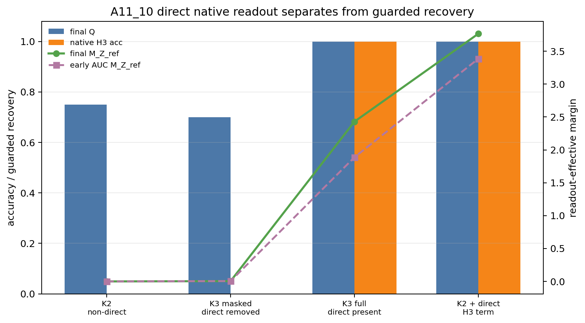

# MTP 如何更高效地学习长程语义：从表示保证到参数传递

## 0. 执行摘要

**研究问题：** 多词元预测目标（MTP）能否比只预测下一词的目标（NTP）更直接、更高效地让当前隐藏状态保留长程语义信息。这里的“长程语义”特指：前缀中已经出现、最近未来词不需要、但更远未来词才会显式使用的变量 $Z$。

**机制解释：**

1. 最小构造把“直接监督”与“间接学习”分开：下一词 $Y_1$ 对所有分支相同，第二词 $Y_2$ 才一一编码 $Z$。

$$
Y_1=A,\qquad Y_2=S_Z.
$$

2. 只要预测范围覆盖第一个携带 $Z$ 的未来位置，低该位置损失就保证当前隐藏状态 $h_T$ 保留 $Z$。

$$
\tau=\min\{j:I(Z;Y_j\mid Y_{<j})>0\},\qquad
\mathbb E[-\log q_\tau(S_Z\mid h_T)]\le\varepsilon
\Rightarrow I(h_T;Z)\ge H(Z)-\varepsilon.
$$

3. “一阶语义速度”只看当前参数点的一次无穷小或单步梯度：它衡量语义间隔的瞬时变化方向。在 K=2 的分支折叠点，NTP 没有分支相关的一阶方向，MTP 的第二位置损失给出严格正方向。

$$
G_1^{margin}=0,\qquad
G_2^{margin}
=\frac{\lambda_2}{m^2}\sum_z\|u_z-\bar u\|^2>0.
$$

4. 一阶方向本身不等于多步训练更快；在直接优化隐藏状态、固定语义读出方向时，它可以通过精确更新式累积成有限步命中界。

$$
M_K(t+1)-M_K(t)=\eta G_K^{hidden}(t),\qquad
T_\gamma(K)\le
\left\lceil\frac{\gamma-M_K(0)}{\eta g_K}\right\rceil
$$

其中命中阈值前要求 $G_K^{hidden}(t)\ge g_K>0$。

5. 对真实模型参数做更新时，直接语义信号还要经过编码器参数化，并与其他位置的损失干扰竞争。

$$
\frac{dM_K}{dt}
=\frac1{m^2}v^\top\Theta v
-\frac1m v^\top\Theta(c+\nabla_HL_{background}),
\qquad \Theta=JJ^\top.
$$

**主要结果：**

1. 在一一编码的受控数据中，已经证明：预测范围覆盖第一个携带 $Z$ 的未来词时，低该位置损失会强迫当前 $h_T$ 保留 $Z$。
2. 在固定读出方向、直接优化隐藏状态的模型中，已经证明有限步语义恢复；受控 Transformer 实验进一步显示，直接有信息目标在早期持续提供正语义速度，并形成更强的模型自身预测。
3. 多词元预测的有效性不由 $K$ 的大小单独决定，而由新增未来词是否含有 $Z$、其输出方向是否与已有语义方向对齐，以及编码器能否把该方向传入参数更新共同决定。

**证据说明：**

1. 对结果 1：K=2 最小构造和第一个有信息位置为 3 的构造都满足覆盖律；低有信息位置交叉熵推出 $I(h_T;Z)$ 的下界。
2. 对结果 2：
   - 在第 3 个未来位置首次携带 $Z$ 的构造中，K1/K2 的语义速度近 0，K3 为 $0.003816$。
   - A11_10 中所有直接有信息条件在 `5/5` 个种子的早期窗口保持正语义速度。
   - 全位置训练中，含当前前缀直接 H3 监督的条件最终模型自身 H3 准确率和保守恢复分数均为 `1.0`；移除该直接项后，外部读出仍可恢复，但模型自身 H3 准确率为 `0`。
3. 对结果 3：
   - 固定 K=4 和信息位置，仅改变输出方向时，对齐条件的语义速度为 `0.015262`，低对齐或冲突条件为 `0.000954`。
   - 新增共享未来词没有直接增量；新增对齐的信息词增强速度；新增冲突的信息词削弱速度。
   - A11_10 的参数空间曲率证书经常非正或过松，因此尚未得到紧的 Transformer 有限步命中界。

**结论边界：** 当前结论只适用于受控数据和明确假设下的目标函数、隐藏状态与参数传递机制；不能推出自然语言中 MTP 已优于 NTP，不能推出 NTP 学不到 $Z$，不能推出 $K$ 越大越好，也不能声称已经实验证明更省样本。

**执行动作：** 下一步只研究 K=2 的参数传递：固定数据与输出方向，检验直接语义信号是否按编码器语义切向核 $v^\top\Theta v$ 传入参数更新，并分离背景干扰与非线性余项。

## 1. 术语解释

| 术语 | 中文含义 | 具体对象或计算方式 | 为什么影响当前判断 | 不能证明什么 |
|---|---|---|---|---|
| 多词元预测目标（MTP） | 同一个当前隐藏状态预测多个未来词 | $L_K=\sum_{j=1}^K\lambda_j\operatorname{CE}(q_j(\cdot\mid h_T),Y_j)$ | 可能把更远处的语义目标直接监督到 $h_T$ | $K$ 越大一定越好 |
| 下一词预测目标（NTP） | 当前隐藏状态只预测下一词 | $L_1=\operatorname{CE}(q_1(\cdot\mid h_T),Y_1)$ | 当前前缀上的非覆盖对照 | NTP 在全位置训练中学不到 $Z$ |
| 长程语义变量 $Z$ | 前缀中已有、最近未来词不需要、更远未来词才使用的信息 | 受控实验中的分支身份 | 是需要保留到 $h_T$ 的对象 | 自然语言全部语义 |
| 第一个有信息未来位置 $\tau$ | 第一个新增 $Z$ 信息的未来偏移 | $\tau=\min\{j:I(Z;Y_j\mid Y_{<j})>0\}$ | 决定预测范围是否含直接语义目标 | 真实文本只有一个固定距离 |
| 直接语义监督 | 当前 $h_T$ 直接预测编码 $Z$ 的未来词 | $\operatorname{CE}(q_\tau(\cdot\mid h_T),S_Z)$ | 给当前状态最短的语义监督路径 | 唯一可能的学习路径 |
| 间接迁移 | 其他位置的损失通过共享参数改变 $h_T$ | 全位置训练中的背景参数更新 | 解释非覆盖条件也可能读出 $Z$ | 模型自身会使用该信息 |
| 语义间隔 $M_K$ | $h_T$ 沿模型可用语义方向的分离程度 | $M_K=m^{-1}\sum_zv_z^{(K)\top}h_z$ | 有限步效率的目标量 | 自然语言质量 |
| 一阶隐藏状态语义速度 $G_K^{hidden}$ | 当前参数点的一次无穷小或单步梯度把 $h_T$ 推向语义方向的瞬时变化率 | $m^{-1}\sum_zv_z^{(K)\top}(-\nabla_{h_z}L_K)$ | 判断目标是否立即提供正确方向 | 多步训练必然更快、最终性能更好 |
| 模型自身 H3 准确率 | 模型第三未来位置预测头从 $h_T$ 预测 $S_Z$ 的准确率 | top-1 accuracy | 区分模型自身使用与外部探针可读 | 下游任务收益 |
| 保守恢复分数 $Q$ | 三种恢复检测的最小值 | $Q=\min\{A_{decoder},A_{probe},C_{swap}\}$ | 防止只看单个探针 | 直接监督来源 |
| 语义切向核 $\Theta$ | 编码器参数更新改变隐藏状态语义方向的能力 | $\Theta=JJ^\top$，$J=\partial H/\partial\theta$ | 连接隐藏状态定理与 Transformer 参数训练 | 非线性长期收敛 |

## 2. 机制解释与建模

### 2.1 数据构造：把直接监督单独暴露出来

在决策位置 $T$ 之前，模型已经看到分支变量 $Z$，但局部上下文对所有分支相同。最小 K=2 后缀为：

$$
Y_1=A,\qquad Y_2=S_Z,\qquad Z\mapsto S_Z\text{ 为一一映射}.
$$

因此，NTP 在当前前缀只需预测共享词 $A$；MTP 的第二位置损失则直接要求同一个 $h_T$ 区分 $Z$。这比较的是监督路径，不是模型最终容量。

### 2.2 表示保证：低损失为什么迫使 $h_T$ 含有 $Z$

如果预测范围覆盖 $Y_\tau=S_Z$，预测器只能依据 $h_T$ 还原 $S_Z$。由于 $S_Z$ 与 $Z$ 一一对应，低交叉熵给出：

$$
\mathbb E[-\log q_\tau(S_Z\mid h_T)]\le\varepsilon
\Rightarrow
I(h_T;Z)\ge H(Z)-\varepsilon.
$$

这个定理回答“最终表示必须含有什么”，但单独不回答“训练需要多少步”。

### 2.3 隐藏状态效率：正语义速度如何累积

“一阶”指在当前状态不追踪完整训练轨迹，只计算一次无穷小或单步梯度造成的语义间隔变化。它回答“目标此刻把状态往哪里推、推多快”，不能单独回答“经过许多步后是否更早恢复”。

在 K=2 的分支折叠点，NTP 只预测共享 $A$，各分支更新相同，中心化后抵消；MTP 增加 $Y_2=S_Z$，得到：

$$
G_1^{margin}=0,
\qquad
G_2^{margin}
=\frac{\lambda_2}{m^2}\sum_z\|u_z-\bar u\|^2>0.
$$

这一步已经证明 MTP 在当前隐藏状态上具有 NTP 没有的直接局部语义方向，但仍不是有限步效率结论。

令有信息未来位置的中心化输出方向之和为：

$$
v_z^{(K)}=\sum_{j\in\mathcal I_K}\lambda_j(u_{j,z}-\bar u_j).
$$

语义间隔和语义速度定义为：

$$
M_K(t)=\frac1m\sum_zv_z^{(K)\top}h_z(t),
$$

$$
G_K^{hidden}(t)=\frac1m\sum_zv_z^{(K)\top}
\left(-\nabla_{h_z}L_K\right).
$$

当隐藏状态本身是优化变量且 $v_z^{(K)}$ 固定时，每一步都有精确恒等式：

$$
M_K(t+1)-M_K(t)=\eta G_K^{hidden}(t).
$$

因此，只要达到阈值前始终有 $G_K^{hidden}(t)\ge g_K>0$，就得到：

$$
T_\gamma(K)\le
\left\lceil\frac{\gamma-M_K(0)}{\eta g_K}\right\rceil.
$$

在固定规则单纯形输出头、共享损失不进入语义子空间的 K=2 模型中，已经进一步证明 MTP 的模型自身语义预测在有限步内越过任意高于随机水平的阈值，而 K=1 的统一反事实语义读出保持在随机水平。

### 2.4 一般 K：为什么不是越大越好

固定输出头的一步语义速度为：

$$
G_K=\frac1{m^2}\sum_z\|v_z^{(K)}\|^2.
$$

新增一个有信息未来位置 $r$ 的增量为：

$$
G_{K\cup r}-G_K
=\frac1{m^2}\sum_z
\left(2v_z^{(K)\top}a_{r,z}+\|a_{r,z}\|^2\right).
$$

所以新增共享位置没有直接语义增量；新增对齐方向会增强；新增冲突方向可能削弱。真正的效率对象是有信息位置及其方向几何，而不是 $K$ 这个整数。

### 2.5 参数空间边界：隐藏状态定理为何不能直接推广

Transformer 实际更新的是参数 $\theta$，隐藏状态满足 $H=H(\theta)$。参数梯度流中的语义间隔速度分解为：

$$
\frac{dM_K}{dt}
=\frac1{m^2}v^\top\Theta v
-\frac1m v^\top\Theta(c+\nabla_HL_{background}).
$$

第一项是直接语义方向经过编码器后的有效强度；第二项是公共目标和其他位置损失在该方向上的帮助或干扰。离散参数更新还包含非线性二阶余项。当前没有同时得到非空且足够紧的传递下界、干扰上界和非线性余项上界。

### 2.6 当前推进到哪一步

1. **表示层已经闭合：** 低有信息位置损失推出 $h_T$ 含有 $Z$。
2. **一阶隐藏状态机制已经闭合：** 覆盖有信息位置产生正语义速度；非覆盖共享目标在分支折叠点没有该方向。
3. **受控隐藏状态有限步理论已经闭合：** 固定读出方向时有精确累积式；规则单纯形 K=2 模型有显式恢复步数上界。
4. **受控 Transformer 实验已经给出支持：** 直接语义速度在早期持续，并对应更强的模型自身远期预测；但外部可读性也可能来自间接迁移。
5. **参数空间理论尚未闭合：** 还缺编码器语义传递下界、背景干扰界和非线性余项界；自然语言样本效率更没有得到证明。

## 3. 主要结果

**一句话总结：** MTP 在受控模型中的可证明优势，是把更远处首次出现的语义目标直接作用到当前隐藏状态；这条优势已经在隐藏状态空间形成有限步定理，但尚未完整提升为 Transformer 参数空间效率定理。

### 结果 1：覆盖第一个有信息未来词，会给当前隐藏状态带来表示保证。

**机制对应：** 第 2.1 至 2.2 节的 K=2 构造和覆盖律。

**指标或条件定义：** $Y_\tau=S_Z$ 一一编码 $Z$；有信息位置损失为 $\mathbb E[-\log q_\tau(S_Z\mid h_T)]$。

**证据说明：**

- 理论上，低该位置损失推出 $I(h_T;Z)\ge H(Z)-\varepsilon$。
- K=2 构造中，next-two 直接预测 $S_Z$，next-one 在同一前缀只预测共享 $A$。
- 第一个有信息位置为 3 的实验中，只有覆盖该位置的 K3 获得直接语义目标。

**解释：** 该结论说明 MTP 改变了当前表示必须满足的约束，而不只是增加一个总损失项。

**边界：** 它不说明 NTP 在其他位置监督下最终学不到 $Z$，也不说明 MTP 已经更省样本。

**来源：** [A11 主故事](story_cn.md)；[A11_10 anchor](anchor/11_10_finite_step_semantic_efficiency_anchor.md)。

### 结果 2：直接有信息目标先产生严格正的一阶语义速度，再在明确条件下累积为有限步恢复。

**机制对应：** 第 2.3 节的精确语义间隔更新。

**指标或条件定义：** $G_K^{hidden}$ 测一步梯度在语义方向上的投影；模型自身 H3 准确率测模型是否直接用自己的未来位置预测头读出 $Z$；$Q$ 只测保守可读性。

**证据说明：**

- 在第 3 个未来位置首次携带 $Z$ 的无泄漏构造中，K1 为 $7.28\times10^{-12}$，K2 为 $-1.16\times10^{-11}$，K3 为 $0.003816$。
- A11_10 中，所有直接有信息条件在 `5/5` 个种子的早期窗口保持正语义速度。
- 全位置直接条件最终模型自身 H3 准确率和 $Q$ 都为 `1.0`；非直接条件仍有 $Q=0.75/0.70$，但模型自身 H3 准确率为 `0`，语义间隔近 0。
- 所有条件最终最近两个共享目标的准确率均为 `1.0`，直接语义恢复没有牺牲局部预测。

图中比较外部可读恢复、模型自身 H3 预测和语义间隔。非直接条件可以让 $Z$ 对外部读出可见，但只有含当前前缀直接 H3 监督的条件同时获得满分模型自身预测和较大语义间隔。该图不能证明自然语言收益。

**解释：** K=2 闭式公式先证明当前点上的局部方向；精确更新式再把持续的正方向累积成有限步结论。实验支持这条正方向在早期没有立即消失，并说明外部可读与模型自身直接使用不是同一件事。

**边界：** A11_10 的参数空间命中证书经曲率修正后经常非正或极松，因此还不能把该隐藏状态定理写成紧的 Transformer 训练步数上界。

**来源：** [A11_10 finite-step summary](experiments/A11_10_finite_step/summary.md)；[A11_10 indirect-transfer summary](experiments/A11_10_indirect_transfer/summary.md)。

### 结果 3：一般 K 的效率由有信息位置的方向和决定，而参数传递是当前唯一未闭合环节。

**机制对应：** 第 2.4 节的向量增量公式和第 2.5 节的参数空间分解。

**指标或条件定义：** $G_K$ 测输出方向合成后的直接语义速度；$v^\top\Theta v$ 测编码器能否把该方向传入参数更新。

**证据说明：**

- 固定 K=4 和两个有信息位置时，对齐条件的语义速度为 `0.015262`，低对齐或冲突条件为 `0.000954`，且 `5/5` 个种子方向一致。
- next-K 审计中，K2 近 0，K3 覆盖首个有信息位置后速度打开；新增共享 H4 无直接增量，对齐 H4 增强，冲突 H4 削弱。
- 冻结输出头时方向规律在早期训练仍成立；输出头可训练时方向会漂移，因此多步解释必须记录当前输出几何。

**解释：** 这些结果排除了“只要增加预测位置就会更好”的说法，并把下一步收束到编码器对语义方向的传递能力，而不是继续扩大 K。

**边界：** 真实文本中有信息位置和输出方向尚未识别，参数空间传递下界也尚未证明。

**来源：** [A11 主故事](story_cn.md)；[A11_08 summary](experiments/A11_08_general_k/summary.md)；[A11_09 summary](experiments/A11_09_next_k/summary.md)。

## 4. 执行动作

**下一步动作：** 正式化 K=2 语义切向核传递问题，固定数据、输出头和损失权重，只改变编码器对分支语义方向的雅可比强度。

**目的：** 判断隐藏状态上的直接语义优势是否按 $v^\top\Theta v$ 传入参数更新，并把参数化瓶颈、背景损失干扰和非线性余项分开。

**完成判据：** 一步真实参数更新的语义间隔变化能够由切向核直接项与背景干扰项联合解释；若不能，必须明确失败来自传递系数近零、干扰抵消，还是非线性余项过大。

## 5. 证据索引

| 结果 | 主要证据 | 关键指标 | 支持什么 | 不能证明什么 | 来源 |
|---|---|---|---|---|---|
| 结果 1 | 覆盖律与低损失表示定理 | $I(h_T;Z)$ 下界 | 覆盖有信息位置带来表示约束 | 训练速度与自然语言收益 | A11 story / 11_10 anchor |
| 结果 2 | 无泄漏速度、早期持续性、直接项加减控制 | $G_K^{hidden}$、模型自身 H3、$Q$、$M_Z$ | 直接监督形成正语义速度和模型自身读出 | 紧的 Transformer 命中界 | A11_06 / A11_10 |
| 结果 3 | 固定 K 的方向几何与 next-K 增量审计 | $G_K$、方向对齐、$v^\top\Theta v$ | K 的效果取决于信息与方向 | 真实文本方向天然对齐 | A11_08 / A11_09 / A11_10 |

## 6. 来源索引

**Story：**

- [A11 长程语义效率主故事](story_cn.md)

**整合来源：**

- [隐藏状态到参数空间简报](source_brief_hidden_to_parameter_cn.md)

**Anchor：**

- [11_10 有限步语义效率](anchor/11_10_finite_step_semantic_efficiency_anchor.md)

**Protocol：**

- [A11_10 protocol](experiments/A11_10_finite_step/protocol.md)

**Summary：**

- [A11_10 finite-step summary](experiments/A11_10_finite_step/summary.md)
- [A11_10 indirect-transfer summary](experiments/A11_10_indirect_transfer/summary.md)
- [A11_08 general-K summary](experiments/A11_08_general_k/summary.md)
- [A11_09 next-K summary](experiments/A11_09_next_k/summary.md)

**Detailed：**

- [A11_10 finite-step detailed](experiments/A11_10_finite_step/detailed.md)
- [A11_10 indirect-transfer detailed](experiments/A11_10_indirect_transfer/detailed.md)

**Figure：**

- `daily_research_reports/0710/meetings/figures/mtp_a11_10_direct_native_margin_split.png`
