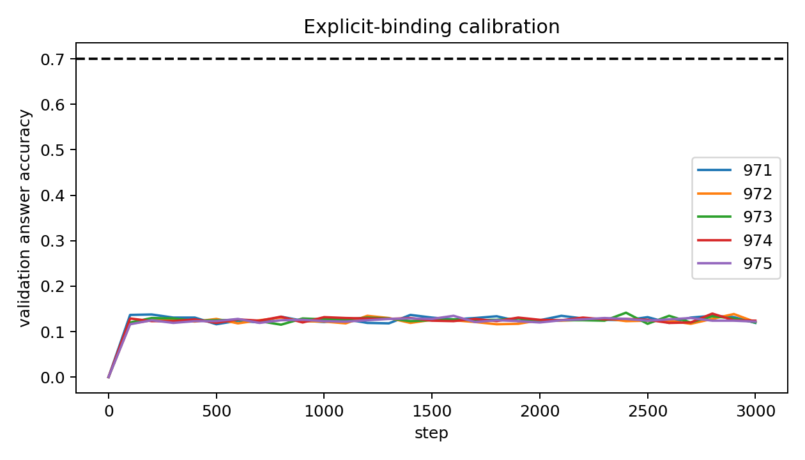
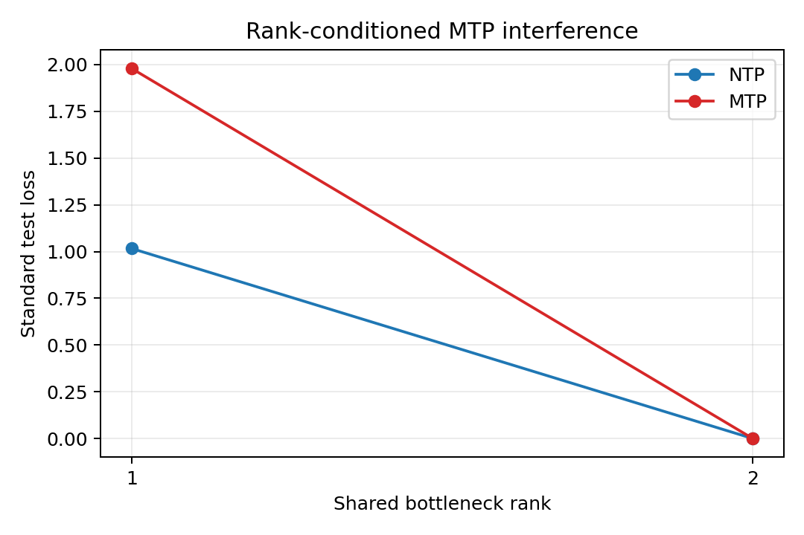

# 多词元预测能否形成并被标准主头利用长程组合表征

## 0. 执行摘要

**研究问题：** 在必须联合远程证据的任务中，多词元预测（MTP）相比下一词元预测（NTP）增加的直接未来监督，能否形成组合状态并增强标准主头对该状态的实际利用？

**机制解释：**

1. 任务要求模型先从第一段证据得到中间实体 $B$，再用 $B$ 查询第二段证据得到答案 $Y$。

$$
B=\pi_1(A),\qquad Y=\pi_2(B).
$$

2. 在决策位置 $h_T$，NTP 只直接预测格式词元；MTP 额外从同一状态直接预测组合答案。最终评价仍统一使用下一位置 $h_{T+1}$ 上的标准主头。

$$
L_{MTP}=L_N+\lambda L_A,
\qquad
L_A=\operatorname{CE}(q_2(\cdot\mid h_T),Y).
$$

其中 $\operatorname{CE}$ 表示交叉熵损失。

3. MTP 是否妨碍标准目标取决于两项梯度的局部关系；只有内积为负时，辅助更新才会相对 NTP-only 减慢标准损失下降。

$$
L_N(\theta_M')-L_N(\theta_N')
\approx -\eta\lambda\langle g_N,g_A\rangle.
$$

4. 隐藏状态中能够读出答案变量，只能说明信息存在。功能利用还要求改变该变量时，标准主头的答案随之改变。

$$
\Delta C_{patch}=C_{patch}^{MTP}-C_{patch}^{NTP}.
$$

**主要结论：**

1. **根据树状结构构建了合成数据，但一层transformer目前没有学会任务。** 两张完整的一一映射表保证任意单表都不能决定答案，模型必须形成中间实体并按顺序组合证据；然而现有小模型的答案准确率仍处于八分类随机水平，因此当前还不能用它解释 NTP 与 MTP 的差异。
2. **线性受控实验支持结构性容量竞争。** 当共享表示只能保留一个独立方向时，MTP 学习未来因子会损害标准因子；允许两个方向后损害消失。课程学习改变训练顺序，但不能补出结构上缺失的方向。
3. **MTP 已被证明会对 $h_T$ 施加直接的未来任务更新，但功能利用尚未得到证明。** 该更新可能与标准目标局部冲突，也可能在 $h_T\rightarrow h_{T+1}$ 的状态传递中失效，因此最终判断必须落在共同标准主头上。

**证据说明：**

1. 任意单表对答案的信息为零，两表联合完全确定答案；现有小模型答案准确率接近 `0.125`，格式准确率为 `1.0`，说明模型学会了输出接口但没有学会组合规则。
2. 秩为 1 时，MTP 相对 NTP 的标准损失差为 `0.9084–1.0218`，未来因子误差在五次重复中全部改善；秩为 2 时标准损失差降至数值零；秩为 1 时课程条件的双目标联合通过率为 `0/5`。
3. 信息性未来目标在 $h_T$ 上产生直接任务定向更新；但该方向传到 $h_{T+1}$ 后可以由有利变为不利，局部几何改善也未稳定转化为标准主头行为改善。

**结论边界：** 当前证据支持受控的直接监督机制和线性结构性秩竞争，但不能推出 MTP 普遍优于或弱于 NTP，也不能解释模型规模效应、真实多跳任务收益或课程预训练收益。

**执行动作：** 下一步只建立一个已经学会两跳组合的共享预训练模型检查点；能力门槛通过后，再从同一检查点比较 NTP 与信息性第二未来词元预测对标准主头因果利用的影响。

## 1. 术语解释

| 术语 | 具体含义 | 如何测量 | 为什么重要 | 不能证明什么 |
|---|---|---|---|---|
| 下一词元预测（NTP） | 每个位置只直接预测紧邻的下一个词元 | 标准主头交叉熵 $L_N$ | 是共同训练基线和最终评价接口 | NTP 无法间接学到远程变量 |
| 信息性第二未来词元预测 | 从 $h_T$ 额外预测包含组合答案的第二未来词元 | $L_N+\lambda L_A$ | 是 MTP 相比 NTP 多出的直接监督 | 辅助头准确等于标准任务收益 |
| 标准主头 | NTP 与 MTP 共同使用的普通下一词元输出头 | $q_1(\cdot\mid h_{T+1})$ | 保证两种训练方法比较同一输出接口 | 完整语言模型质量 |
| 长程组合语义 | 局部上下文不能替代远处证据，且答案必须联合多个证据才能确定 | 单表控制、局部窗口控制、证据替换 | 明确任务真正要求模型形成什么 | 一般自然语言语义 |
| 表征秩 | 共享状态能够同时保留的独立任务方向数 | 线性模型中显式限制编码矩阵秩 | 检验容量不足是否足以造成目标竞争 | Transformer 的全局容量 |
| 梯度冲突 | 辅助目标的更新方向抵消标准目标的更新方向 | $\langle g_N,g_A\rangle<0$ | 预测局部标准损失下降是否变慢 | 完整训练最终一定变差 |
| 表征形成 | 任务变量可以从隐藏状态中恢复 | 留出数据上的探针准确率 | 是功能利用的必要条件 | 模型输出因果依赖该变量 |
| 因果利用 | 替换任务变量后，标准主头答案按替换来源改变 | 任务子空间补丁效应减同秩随机补丁效应 | 区分信息存在与真正参与预测 | 真实基准一定提升 |

## 2. 机制解释与建模

### 2.1 长程语义的精确定义

本文研究的不是一般语言学意义上的语义，而是**任务相关长程组合语义**：

> 模型必须从远离决策位置的多个证据中形成一个任务状态；局部上下文或任意单个证据不足以替代这些信息，该状态需要经过有序组合才能决定答案，并且会随必要证据的改变而改变。

这个定义包含四个可检验条件：

1. **远程信息不可替代：** 已知问题附近的局部文本后，远处证据仍提供回答所必需的新信息。
2. **证据必须联合使用：** 任意单个证据或不完整证据集合不足以确定答案。
3. **存在结构化中间状态：** 模型需要先形成并保存中间变量，再用它完成后续计算。
4. **对表面变化稳定、对证据变化敏感：** 改写、行顺序和无关干扰不应改变答案；替换必要证据则应使答案按规则改变。

远程信息不可替代可以写为：

$$
I(Y;X_{\mathrm{far}}\mid X_{\mathrm{local}},Q)>0.
$$

因此，词元距离长本身不是长程语义。远处信息必须在给定局部上下文后仍不可替代，并通过组合状态影响最终预测。探针能够从隐藏状态读出该变量也不等于模型已经利用它；还必须证明该变量能够跨位置保存，并且干预它会改变标准主头的答案。

### 2.2 构建的数学模型

设查询实体为 $A$，两张表分别表示随机的一一映射 $\pi_1$ 和 $\pi_2$：

$$
A\xrightarrow{\pi_1}B\xrightarrow{\pi_2}Y.
$$

用四个实体展示一条可手算样本：

```text
TABLE_1: v0->v2  v1->v0  v2->v3  v3->v1
TABLE_2: v0->v1  v1->v3  v2->v0  v3->v2
QUERY: 从 v1 出发，依次查询 TABLE_1 和 TABLE_2
OUTPUT: <DECIDE> <FMT_0> <ANS_v1>
```

计算过程为：

```text
TABLE_1 给出 v1 -> v0，因此中间实体是 v0；
再查询 TABLE_2 的 v0 行，得到 v0 -> v1；
最终答案是 v1。
```

每张表都是完整的一一映射，所有候选答案都会出现。第一张表只能确定中间实体，不知道第二步结果；第二张表包含全部输出，但不知道应该查询哪一行。因此：

$$
I(Y;\pi_1\mid A)=I(Y;\pi_2\mid A)=0,
\qquad
I(Y;\pi_1,\pi_2\mid A)=\log 4.
$$

上式对应四实体手算例子。实际实验使用 8 个实体，因此随机准确率为 $1/8=0.125$，两表联合提供的答案信息为 $\log 8$。

这里的长程语义不是单纯词元距离大，而是局部窗口不足以决定答案，远处证据在给定局部信息后仍不可替代。它对应 2WikiMultiHopQA 和 MuSiQue 等多跳问答中的公司 $\rightarrow$ 创始人 $\rightarrow$ 出生国家；LongBench 多文档问答进一步加入更长上下文和更多干扰。它也对应代码分析中的配置项 $\rightarrow$ 调用模块 $\rightarrow$ 实际参数。

当前任务长度为 155 个原子词元，只隔离有序关系组合和非局部证据必要性，不包含自然语言歧义、检索失败和世界知识，也不能作为超长上下文能力证据。

### 2.3 NTP 与 MTP 到底比较什么

输出接口为三个原子词元：

```text
<DECIDE> <FMT_0> <ANS_y>
```

- $h_T$ 是模型读完表和问题后，在 `<DECIDE>` 位置的隐藏状态。
- NTP 从 $h_T$ 直接预测 `<FMT_0>`；读入该词元后，再由标准主头从 $h_{T+1}$ 预测 `<ANS_y>`。
- MTP 保留相同的标准目标，并额外要求 $h_T$ 直接预测 `<ANS_y>`。

因此，MTP 明确多出一条从答案误差到 $h_T$ 的直接监督路径：

$$
\Delta h_T^{(A)}=-\eta_h\nabla_{h_T}L_A.
$$

辅助头和探针只能解释表征形成；最终性能必须比较 $h_{T+1}$ 上的共同标准主头。

### 2.4 为什么 MTP 可能损害标准目标

第一种机制是局部梯度冲突。令：

$$
g_N=\nabla_\theta L_N,
\qquad
g_A=\nabla_\theta L_A.
$$

令 $\theta_N'$ 表示只做 NTP 后的一步参数，$\theta_M'$ 表示同时加入辅助目标后的一步参数，$\eta$ 是学习率，$\lambda$ 是辅助目标权重。联合更新相对 NTP-only 对标准损失的额外影响为：

$$
L_N(\theta_M')-L_N(\theta_N')
\approx -\eta\lambda\langle g_N,g_A\rangle.
$$

当内积为负时，辅助更新抵消标准更新，使局部标准损失下降变慢；内积为正时则可能有利。因此梯度冲突是状态相关机制，不是 MTP 的固定属性。

第二种机制是结构性容量竞争。在线性最小模型中，标准目标需要因子 $U$，未来目标需要独立因子 $Z$，两者共享编码器：

$$
h=W[U;Z],
\qquad
\operatorname{rank}(W)\le r.
$$

当 $r=1$ 时只有一个独立通道，模型必须在 $U$ 与 $Z$ 之间取舍；当 $r=2$ 时两者可以共存。课程学习可以改变优化路径，但不能把一个结构通道变成两个。

### 2.5 什么才算标准主头使用了表征

功能利用需要同时满足三项条件：

1. **信息存在：** 留出探针可以从 $h_T$ 恢复组合变量。
2. **因果控制：** 把来源样本的组合变量成分补到目标样本后，$h_{T+1}$ 上的标准主头应转向来源答案。
3. **任务特异性：** 同秩随机方向不能产生同样效果；移除任务方向应比移除随机方向更损害标准预测。

主要判断量为：

$$
C_{patch}=F_{task}-F_{random},
$$

$$
\Delta C_{patch}=C_{patch}^{MTP}-C_{patch}^{NTP}.
$$

$F_{task}$ 是任务子空间补丁后标准主头转向来源答案的比例，$F_{random}$ 是同秩随机补丁的对应比例。只有 $\Delta C_{patch}>0$ 且干净答案准确率不下降，才支持 MTP 增强了标准主头的因果利用。

## 3. 主要结论

**总体判断：** 当前已经明确了任务所需的组合结构、容量不足如何产生目标竞争，以及 MTP 在 $h_T$ 上多出的直接监督；尚未闭合的是这条监督能否在会做任务的神经模型中传到 $h_{T+1}$，并被标准主头因果使用。

### 结论 1：任务模型具有严格的联合必要性，但当前小模型没有学会组合规则

**证据：** 任意单表对答案的信息为零，两表联合完全决定答案。现有模型最佳训练准确率为 `0.1249`、验证准确率为 `0.1211`，五次独立测试为 `0.1274–0.1353`，接近随机水平 `0.125`；格式准确率为 `1.0`。



**解释：** 数据构造确实隔离了有序组合能力；答案随机而格式完全正确，说明模型只学会输出接口，没有学会由第一张表结果选择第二张表查询行的规则。因此当前模型不能用于解释 NTP/MTP 的机制差异。

**边界：** 这不证明 Transformer 无法完成组合，也不证明合成任务能够代表完整的真实多文档问答。

### 结论 2：结构性缺秩足以造成 MTP 学到未来信息但损害标准目标

**证据：** 秩为 1 时，MTP 相对 NTP 的标准损失差为 `0.9084–1.0218`，同时未来因子误差在五次重复中全部改善；秩为 2 时标准损失差最大绝对值仅 `1.23e-13`。秩为 1 时，等辅助剂量课程的双目标联合通过率为 `0/5`。



**解释：** 一个共享方向不足以同时保存两个独立任务因子，未来目标只能通过挤出标准方向来改善；增加第二个方向后两者可以共存。训练顺序不能修复结构上缺失的方向。

**边界：** 这是直接给定因子的线性模型中的充分机制，不是 Transformer 的规模规律；课程仍可能缓解容量足够时的非凸路径或有限预算问题。

### 结论 3：MTP 的直接任务更新已经成立，但标准主头利用仍是未决问题

**证据：** 当预测范围首次覆盖信息性未来词元时，$h_T$ 出现 NTP 在同一位置没有的直接任务定向更新；新增未来位置的作用取决于其是否包含新信息以及输出方向是否对齐。该方向传到 $h_{T+1}$ 后可以由有利变为不利，局部语义间隔改善也未稳定转化为标准主头行为改善。

**解释：** 表征形成、跨位置传递和标准主头利用是三个不同环节。当前证据只闭合了第一个环节，并揭示第二个环节可能失败；探针或辅助头变好不能替代标准主头的因果证据。

**边界：** 后续因果利用实验即使通过，也只能支持受控任务中的功能利用，不能直接推出真实多跳问答提升。

## 4. 执行动作

**下一步动作：** 使用约 6 亿参数的预训练模型建立一个共享 NTP 任务检查点；本阶段只判断模型是否真正学会两跳组合，不运行 MTP 对比。

**目的：** 先排除模型不会做任务这一阻塞，使后续训练目标差异可以解释。

**完成判据：** 五次独立重复中，完整上下文准确率均至少为 `0.70`、格式准确率至少为 `0.99`、单表准确率不高于 `0.20`、证据替换一致率至少为 `0.90`。任一条件失败则停止。

**门槛通过后的唯一比较：** 从同一任务检查点克隆 NTP 与信息性第二未来词元预测条件，统一使用标准主头，比较 $\Delta C_{patch}$、任务子空间消融和干净答案准确率。

## 5. 证据索引

| 结论 | 决定性证据 | 支持什么 | 不能证明什么 |
|---|---|---|---|
| 任务模型与能力门槛 | 单表零信息；两表完全决定；答案准确率约 `0.125`；格式准确率 `1.0` | 任务具有联合必要性，当前模型未学会组合 | 真实任务收益 |
| 结构性容量竞争 | 秩 1 标准损失差 `0.9084–1.0218`；秩 2 约零；课程联合通过率 `0/5` | 缺秩足以造成目标取舍，课程不能修复缺秩 | Transformer 尺度规律 |
| 直接监督与利用边界 | $h_T$ 上直接更新成立；$h_{T+1}$ 上方向可反转；行为改善不稳定 | 表征形成不等于跨位置利用 | 真实下游因果利用 |

## 6. 来源索引

| 结论 | Anchor / Protocol | Summary / Detailed | 图 |
|---|---|---|---|
| 任务校准 | [任务校准 Anchor](anchors/11_23_composition_calibration_anchor_cn.md)、[显式绑定 Anchor](anchors/11_23b_explicit_binding_calibration_anchor_cn.md)、[任务校准 Protocol](source_results/task_calibration/protocol_cn.md)、[显式绑定 Protocol](source_results/explicit_binding_calibration/protocol_cn.md) | [任务校准 Summary](source_results/task_calibration/summary.md)、[Detailed](source_results/task_calibration/detailed.md)、[显式绑定 Summary](source_results/explicit_binding_calibration/summary.md)、[Detailed](source_results/explicit_binding_calibration/detailed.md) | [校准曲线](figures/mtp_composition_calibration_curves.png) |
| 容量与课程 | [秩竞争 Anchor](anchors/11_24_task_rank_competition_anchor_cn.md)、[课程边界 Anchor](anchors/11_25_curriculum_rank_boundary_anchor_cn.md)、[秩竞争 Protocol](source_results/rank_competition/protocol_cn.md)、[课程 Protocol](source_results/curriculum_rank_boundary/protocol_cn.md) | [秩竞争 Summary](source_results/rank_competition/summary.md)、[Detailed](source_results/rank_competition/detailed.md)、[课程 Summary](source_results/curriculum_rank_boundary/summary.md)、[Detailed](source_results/curriculum_rank_boundary/detailed.md) | [秩竞争图](figures/mtp_rank_competition.png) |
| 直接监督与跨位置边界 | [标准主头因果利用 Anchor](anchors/11_27_standard_head_causal_representation_use_anchor_cn.md)、[待审批 Protocol](protocol/standard_head_causal_representation_use_protocol_cn.md) | [当前位置直接更新](supporting_summaries/current_state_direct_update_summary.md)、[预测范围规律](supporting_summaries/informative_horizon_inclusion_summary.md)、[跨位置方向](supporting_summaries/cross_position_transport_summary.md)、[端到端行为边界](supporting_summaries/end_to_end_behavior_boundary_summary.md) | — |

## 7. 补充材料

### 组会开场稿：机制先行版本

> 当前研究先固定一个最小问题：第一段证据只给出中间实体，第二段证据只有在知道该实体后才能确定答案，因此模型必须完成 $A\rightarrow B\rightarrow Y$ 的有序组合。在这个位置上，NTP 只直接预测格式词元，而 MTP 额外从同一个 $h_T$ 预测组合答案，所以 MTP 确实多出一条直接未来监督。现有线性证据表明，如果共享表示只有一个独立方向，这条额外监督会挤占标准目标方向；有两个方向后损害消失。但当前小型神经模型还没有学会组合任务，所以还不能判断这条监督是否被标准主头真正使用。下一步先建立通过任务门槛的共享预训练模型检查点，再比较标准主头的因果利用。

### 暂不启动的后续问题

1. **尺度曲线：** 小模型 NTP 更好、中等模型 MTP 更好、更大模型重新趋同是否成立？该问题需要在同一模型家族、同一数据与相同标准目标下比较任务相关有效秩、因果利用和相对各自 NTP 基线的增益。
2. **课程机制：** 容量足够但早期优化冲突存在时，等辅助剂量课程是否减少负梯度面积和标准子空间旋转？当前结论只是否定课程修复结构性缺秩。
3. **真实迁移：** 合成任务中的因果利用指标能否预测多跳问答或长上下文多文档问答表现？该问题只有在受控神经任务门槛通过后才具备检验条件。
4. **稀疏专家与路由：** 只有当真实工作负载被证明包含多个相互干扰、弱共享的计算子空间，并且条件参数能够减少该干扰时，才恢复该研究方向。
