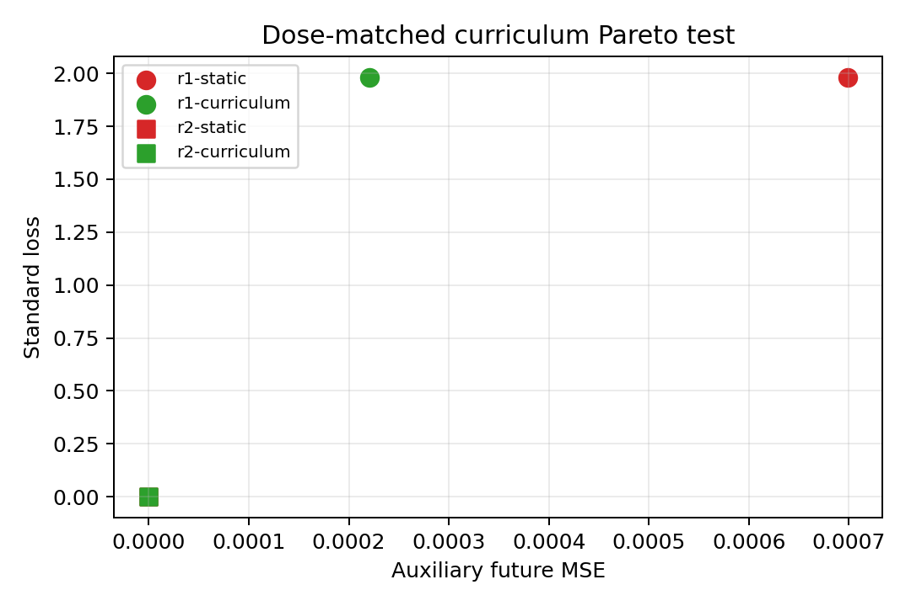

# Summary: A11_25 Curriculum Rank Boundary

## Result Snapshot

**Verdict:** weakened as a repair for structural rank deficiency.
**What we established:** dose-matched NTP-to-MTP scheduling does not Pareto-improve static MTP at rank 1.
**What the experiment shows:** schedule order cannot create the missing representation direction; at rank 2 both schedules reach near-zero loss.
**What we do next:** reserve curriculum for a future neural optimization-conflict regime, not the structural-rank regime.

## Primary Result

Rank-1 curriculum standard gains range from `-0.00213` to `+0.000134`, far below the preregistered `0.1`; Pareto pass is `0/5`. Rank-2 maximum standard loss is `1.55e-13` and maximum auxiliary MSE `4.17e-14`.

## Key Figure

## Claim Boundary

This does not contradict curriculum benefits caused by nonconvex paths, optimizer state, or finite-budget conflict in neural models.
