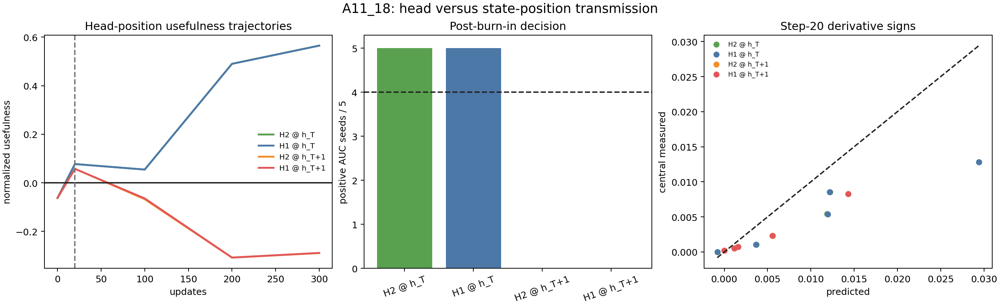

# A11_18 Head-Position Cross-Kernel: Summary

## What We Established

The persistent cross-interface failure is caused by state position, not output-head identity. Over the preregistered post-burn-in interval `20-200`:

- H2 at $h_T$: positive usefulness AUC in `5/5` seeds;
- H1 at $h_T$: positive in `5/5`;
- H2 at $h_{T+1}$: positive in `0/5`;
- H1 at $h_{T+1}$: positive in `0/5`.

**Decision:** `position bottleneck` supported. The extra H2 loss creates a useful semantic direction at the current pre-action state, and that direction remains useful under the standard H1 readout. It does not remain useful after moving through the shared `Decision` token to the next state.

## Metric And Theory

Let $d_2$ be the H2 hidden descent direction at $h_T$, $v_a$ the A/B readout vector under head $a$, and $J_p=\partial h_p/\partial\theta_S$. The local usefulness for head $a$ at state position $p$ is:

$$
U_{a,p}=v_a^\top J_pJ_T^\top d_2.
$$

The normalized measured form is:

$$
\widehat U_{a,p}
=-\frac{\langle\nabla_{\theta_S}M_{a,p},g_D^S\rangle}
{\|\nabla_{\theta_S}M_{a,p}\|\|g_D^S\|}.
$$

Changing head modifies $v_a$ while holding $J_p$ fixed. Changing state position replaces the self-kernel $J_TJ_T^\top$ by the cross-position kernel $J_{T+1}J_T^\top$.

## Setup And Validity

- exact A11_17 NTP trajectories, seen diagnostic batch, H2 gradient, model, optimizer, seeds, and checkpoints;
- primary AUC interval `20-200`, excluding the known step-0 CE transient;
- job `pt-c60nyzy6`, 5/5 tasks complete on four H100 GPUs;
- all coverage, balance, finite-value, H2-copy, restore, and curve-reproduction guards pass;
- step-20 central derivative signs pass all four cells in `4/5` seeds; seed 974 is near zero and is the only numerical-sign guard failure.

## Primary Evidence

| Cell | AUC positive seeds | Mean step 200 $\widehat U$ | Mean step 300 $\widehat U$ | Decision |
|---|---:|---:|---:|---|
| H2 at $h_T$ | 5/5 | 0.4903 | 0.5653 | direct baseline passes |
| H1 at $h_T$ | 5/5 | 0.4899 | 0.5649 | head switch passes |
| H2 at $h_{T+1}$ | 0/5 | -0.3082 | -0.2893 | position switch fails |
| H1 at $h_{T+1}$ | 0/5 | -0.3077 | -0.2887 | full transport fails |

Within each position, H1 and H2 usefulness are nearly identical. At step 300 their mean differences are below `0.001`. This directly rules out head drift as the main explanation.

## Visualization Results

The two $h_T$ curves overlap and become strongly positive. The two $h_{T+1}$ curves also overlap and become strongly negative. The bar chart gives the decisive `5/5, 5/5, 0/5, 0/5` split.

## Theoretical Update

Direct MTP supervision can give a standard-head-useful semantic direction at the current state:

$$
v_1^\top J_TJ_T^\top d_2>0.
$$

That does not imply usefulness one token later:

$$
v_1^\top J_{T+1}J_T^\top d_2>0,
$$

because the cross-position kernel is not positive semidefinite. Therefore downstream MTP efficiency requires both current-state formation and semantic transport to the eventual use position.

## Boundary And Next Decision

We can say that the current controlled natural-language fine-tuning setup supports useful semantic formation at $h_T$ but adverse one-token position transport to $h_{T+1}$. We cannot claim this is universal across bridge tokens, positions, architectures, pure MTP pretraining, or full downstream trajectories.

The next decision is whether this negative transport is specific to the literal bridge token `Decision` or reflects a broader cross-position law. The smallest grounded audit should hold the prompt and gradient fixed while varying only a few natural bridge tokens, not introduce a new training method.
