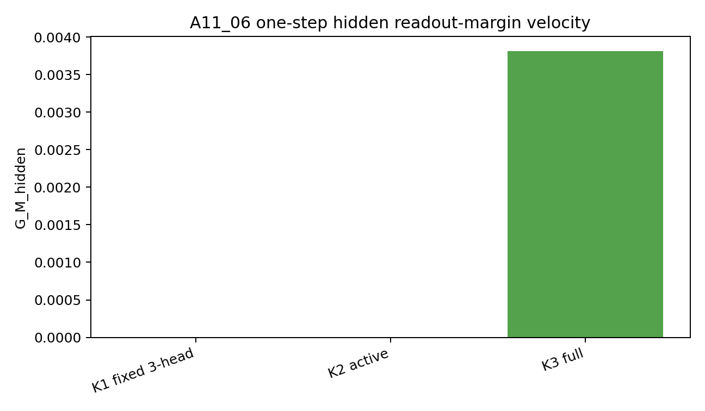
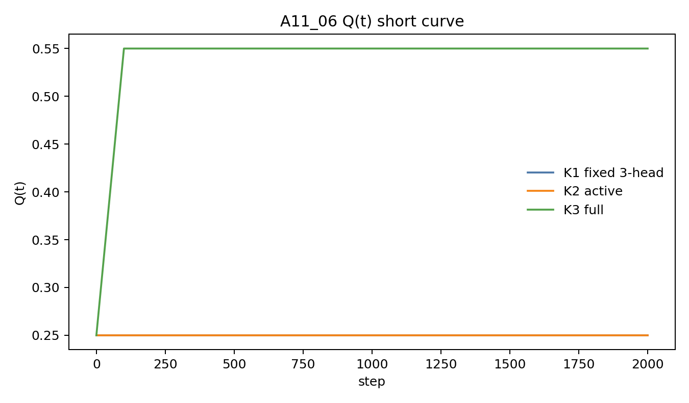

# A11_06 Readout-Effective Margin Efficiency Summary

## What We Established

A11_06 supports the first-order mechanism behind the A11 story. In the clean
`tau=3` decision-prefix setup, K3 is the only condition whose active objective
contains the informative target `h_T -> S_Z`. Its activation-space hidden-state
gradient has positive readout-effective semantic margin velocity:

$$
G_M^{hidden}=\frac{1}{m}\sum_z (u^0_{S_z}-\bar u^0)^\top(-\nabla_{h_z}L_K).
$$

K1 and K2 are near zero; K3 is positive. The step-0 leakage gate also passes:
`Q(0)=0.25`, `M_Z(0)\approx0`, `E_Z(0)=0`, and native horizon-3 accuracy is 0.

## Terminology / Definitions

| Term | Plain meaning | Concrete object / formula | Why it matters | Cannot prove |
|---|---|---|---|---|
| K1 fixed 3-head | NTP baseline with three available heads but only horizon 1 active | active loss `L1` | controls for head count | K1 cannot learn via longer active losses in decision-only training |
| K2 active | non-covering MTP baseline | active loss `L1 + L2`, with `Y1=A`, `Y2=C` | tests non-informative extra horizon | all-position indirect transfer |
| K3 active | covering MTP condition | active loss `L1 + L2 + L3`, with `Y3=S_Z` | tests direct informative supervision | natural-language benefit |
| `M_Z_ref` | fixed readout-effective semantic margin | $\frac1m\sum_z (u^0_{S_z}-\bar u^0)^\top h_z$ | checks whether `h_T` moves toward the initial correct output rows | current head adaptation |
| `G_M_hidden` | activation-space first-order margin velocity | $\frac1m\sum_z (u^0_{S_z}-\bar u^0)^\top(-\nabla_{h_z}L_K)$ | primary one-step mechanism metric | parameter-space sample efficiency |
| `E_Z` | branch separation energy | $\frac{1}{2m^2}\sum_{z,z'}\|h_z-h_{z'}\|^2$ | checks hidden branch separation | output usability |
| `Q(t)` | guarded semantic recovery | $\min\{A(t),P(t),S(t)\}$ | conservative recovery metric | exact causal path |

`A(t)` is the suffix decoder accuracy from frozen `h_T` to `Z`; `P(t)` is an
independent frozen linear probe accuracy; `S(t)` is branch-swap consistency.

## Setup

Data:

$$
Y_1=A,\qquad Y_2=C,\qquad Y_3=S_Z.
$$

Run:

```text
job id: pt-57nu5dv1
run name: a11_06_readout_effective_margin_efficiency_4gpu_20260708_165829
scope: decision-only
seeds: 971, 972, 973, 974, 975
steps: 2000
eval interval: 100
one-step eta: 1e-4, 3e-4, 1e-3
```

## Main Result

One-step activation-space metric at `eta=3e-4`:

| Condition | `G_M_hidden` mean | `G_E_velocity` mean | Parameter finite-diff `Delta_M/eta` | `Delta Y1 CE` | `Delta Y2 CE` | Interpretation |
|---|---:|---:|---:|---:|---:|---|
| K1 fixed 3-head | `7.28e-12` | 0.00000 | 0.000027 | -0.024084 | -0.000205 | no first-order semantic margin |
| K2 active | `-1.16e-11` | 0.00000 | 0.000032 | -0.024295 | -0.024185 | no first-order semantic margin |
| K3 active | 0.003816 | 0.000060 | -0.000705 | -0.024303 | -0.024243 | positive direct hidden-state margin |

The parameter finite-difference margin is not used as the primary judgment in
this parameterized Transformer because it is very small and numerically
unstable at the tested step sizes. The activation-space metric is the direct
implementation of the theorem's first-order quantity.

Short decision-only curve:

| Condition | Reach rate for `Q>=0.9` | Mean `T_0.9` reached-only | Early AUC Q | Final Q | Final `M_Z_ref` | Final `E_Z` |
|---|---:|---:|---:|---:|---:|---:|
| K1 fixed 3-head | 0.00 | NA | 0.250 | 0.25 | 0.000000 | 0.000 |
| K2 active | 0.00 | NA | 0.250 | 0.25 | -0.000000 | 0.000 |
| K3 active | 0.40 | 100 | 0.535 | 0.55 | 1.356 | 22.649 |

## Visualized Results

### One-Step Hidden Margin



This figure tests the theorem-facing quantity. K1 and K2 are at zero; K3 has a
positive hidden-state readout-margin velocity. This supports the mechanism that
the informative horizon creates an immediate semantic update direction at
`h_T`.

### Short Q Curve



This figure checks whether the one-step mechanism starts to appear in short
training. K3 rises above K1/K2; K1/K2 remain at chance-level guarded recovery.
This is supportive, but the short curve is secondary to the one-step hidden
gradient.

## Claim Boundary

Can claim:

```text
In the controlled clean tau=3 decision-prefix setup, the informative K3 target
creates positive first-order readout-effective hidden-state margin velocity,
while non-covering K1/K2 do not.
```

Cannot claim:

```text
Full all-position efficiency is proven by A11_06 alone.
NTP cannot recover Z in all-position training.
Natural-language MTP benefit follows.
MoE routing utility follows.
```

Next decision: run A11_07 to test whether this one-step mechanism survives as
multi-step semantic-efficiency evidence under no-leakage all-position training.

## Artifacts

- Runner: `Projects/from-attention-to-search/XingyuD/Attention_Search_Experiments/active/synthetic_data_understanding/scripts/run_a11_03_04_semantic_efficiency.py`
- Config: `Projects/from-attention-to-search/XingyuD/Attention_Search_Experiments/active/synthetic_data_understanding/configs/a11_06_readout_effective_margin_efficiency.json`
- Remote result: `Projects/from-attention-to-search/XingyuD/Attention_Search_Experiments/active/synthetic_data_understanding/results/a11_06_readout_effective_margin_efficiency/a11_06_readout_effective_margin_efficiency_4gpu_20260708_165829/`
- Curated tables: `tables/`
- Figures: `figures/`
