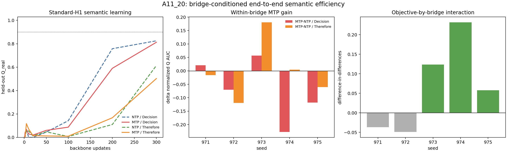

# A11_20 End-to-End Bridge-Conditioned Semantic Efficiency: Summary

## Conclusion

This run does **not** support the preregistered claim that a bridge with favorable local transport is sufficient to make MTP more efficient than NTP on the standard downstream action.

The bridge does modulate semantic-margin geometry: the objective-by-bridge interaction in H1-margin AUC is positive in `5/5` seeds, with mean `+2.052`. But the same interaction in the conservative held-out behavioral score $Q_{real}$ is positive in only `3/5`; MTP beats NTP under `Therefore` in only `2/5`; and no condition reaches $Q_{real}\ge0.9$ for three consecutive evaluations. Local-language guards also fail in all five paired seeds. The formal status is therefore **insufficient**, while the behavioral superiority hypothesis is empirically weakened.

## Terminology And Metrics

The task defines long-horizon semantics as an early state that is unavailable from the later local request alone, invariant under paraphrase, and counterfactually changes the correct assistant action.

The held-out score is

$$
Q_{real}(t)=\min\{A_{H1}(t),C_{para}(t),S_{cf}(t)\},
$$

where $A_{H1}$ is native standard-head answer accuracy, $C_{para}$ is prediction consistency across meaning-preserving early paraphrases, and $S_{cf}$ is correct prediction change when the early state is counterfactually changed.

For objective $o$ and bridge $b$,

$$
A_{o,b}=\frac1{300}\int_0^{300}Q_{real}(o,b,t)\,dt,
$$

$$
\Delta_b=A_{MTP,b}-A_{NTP,b},
\qquad
\Delta_{int}=\Delta_{Therefore}-\Delta_{Decision}.
$$

$\Delta_{int}>0$ asks whether the favorable bridge selectively improves MTP relative to NTP. It removes bridge-common language difficulty, but does not remove all nonlinear optimization differences.

## Setup

- Qwen3-0.6B Base;
- fixed A11_13 persistent-assistant task and held-out paraphrase split;
- objectives: NTP or K=2 MTP;
- bridge token: `Decision` or `Therefore`;
- seeds `971-975`, 300 AdamW updates, matched examples and batch schedules;
- standard H1 action after the bridge is the common downstream interface.

## Main Evidence

| Quantity | Result | Decision |
|---|---:|---|
| $Q_{real}$ interaction positive | 3/5 | below 4/5 support threshold |
| `Therefore` MTP gain positive | 2/5 | no reliable MTP advantage |
| `Decision` MTP gain positive | 2/5 | no reliable MTP advantage |
| mean $Q_{real}$ interaction | +0.0656 | positive mean, seed-unstable |
| H1-margin interaction positive | 5/5 | bridge modulates semantic geometry |
| mean H1-margin interaction | +2.052 | relative direction matches A11_19 |
| sustained $Q_{real}\ge0.9$ | 0/20 runs | threshold efficiency not adjudicable |
| local guard pass | 0/5 | formal validity gate fails |

Mean condition results:

| Condition | $Q$ AUC | Final $Q$ | H1-margin AUC | Final H2 native |
|---|---:|---:|---:|---:|
| NTP / `Decision` | 0.4328 | 0.8250 | 5.3547 | 0.0000 |
| MTP / `Decision` | 0.3652 | 0.8125 | 2.7074 | 0.9025 |
| NTP / `Therefore` | 0.1502 | 0.6138 | 1.5324 | 0.0000 |
| MTP / `Therefore` | 0.1481 | 0.5025 | 0.9368 | 0.7413 |

MTP learns its private H2 answer interface, but this does not produce a standard-H1 behavioral advantage.

The first panel shows held-out $Q_{real}$ learning. The second shows per-seed within-bridge MTP-minus-NTP AUC. The third is the preregistered difference-in-differences. The interaction is mixed rather than seed-stable.

## Validity And Implementation Audit

All `20/20` training tasks and `200/200` checkpoint rows completed; values are finite; step-0 objective pairing passes `5/5`; sample and batch hashes match.

The inherited A11_14 aggregator reported a hash failure because it requires one selected bridge-embedding hash across all conditions. That requirement is invalid for an experiment intentionally using two bridge tokens. The correct within-bridge NTP/MTP initialization guard passes. No training rerun is needed.

Local guards fail because at least one bridge in every seed exceeds the preregistered local-CE or accuracy tolerance. This is an observed tradeoff, not a missing artifact.

## Claim Boundary And Next Decision

Supported: bridge-conditioned state transitions modulate the relative H1 semantic-margin effect of MTP.

Weakened: favorable one-step local transport is sufficient to produce more efficient robust downstream behavior.

Not supported: MTP is more sample/update efficient than NTP on this natural-language proxy.

The A11 story should close with a two-level result: MTP has a provable direct current-state semantic-supervision advantage, but converting that advantage into robust downstream efficiency requires additional conditions not captured by local margin alignment alone.
