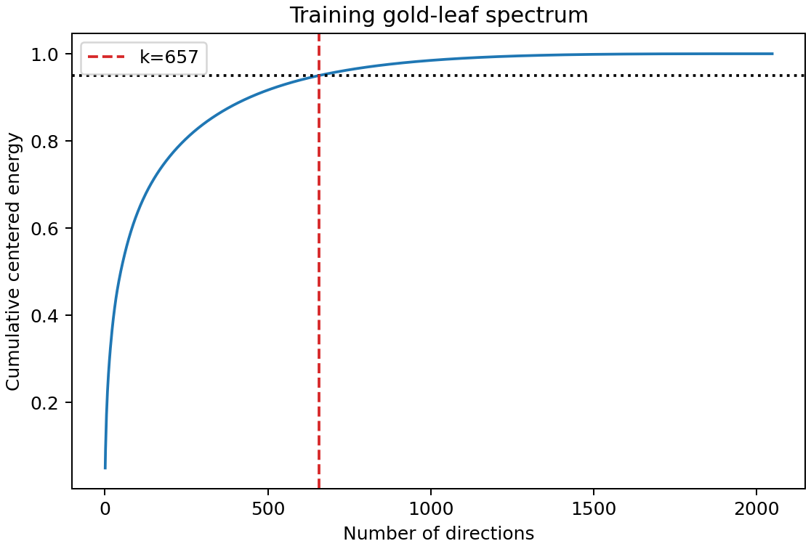
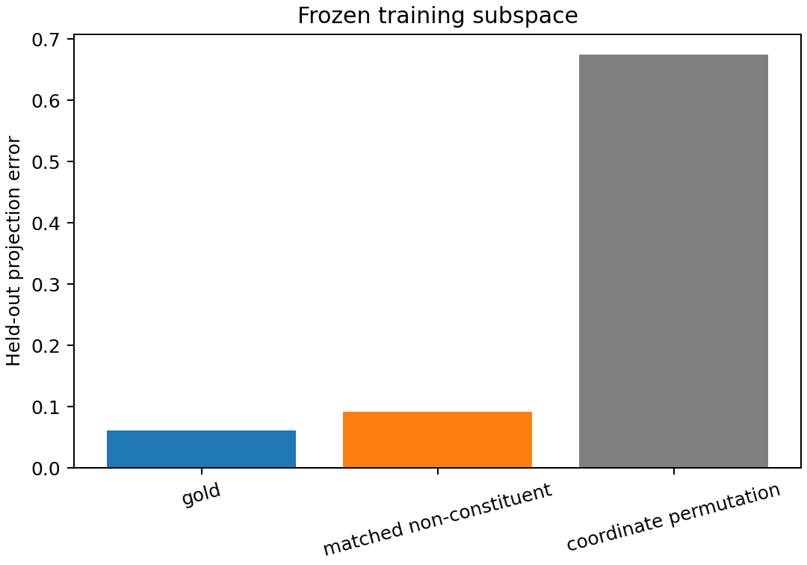

# A14_E02 Summary: Constituents Share More Structure, but the Absolute Low-Rank Premise Is Not Established

## Direct Result

**Verdict: insufficient.** A training subspace learned from 14,888 gold coarse
leaves generalized to 1,969 held-out constituent/control pairs. Test projection
error was 0.0606 for gold constituents and 0.0921 for same-sentence,
same-length, frequency-matched non-constituents, a 34.2% relative advantage
with sentence-bootstrap 95% interval [29.1%, 38.9%].

However, retaining 95% of centered training energy required 657 of 2,048
directions, or 32.1% of the ambient width. That misses the registered
$k/d\le25\%$ low-dimensionality threshold. The result therefore supports a
tree-specific subspace advantage but not the stronger absolute leaf-low-rank
premise.

## Decision Decomposition

| Registered clause | Result |
| --- | --- |
| $k/d\le0.25$ | fail: 0.321 |
| held-out gold error $\le0.075$ | pass: 0.0606 |
| relative advantage $\ge0.10$ | pass: 0.342 |
| bootstrap lower bound $>0$ | pass: 0.291 |
| at least 500 matched pairs | pass: 1,969 |

## Boundary

The evidence is specific to centered 2,048-dimensional PPMI span means in the
NLTK Penn Treebank sample. Mean composition was a measurement device and cannot
show that syntax causes the geometry. The coordinate-permutation projection
error (0.674) confirms nontrivial cross-coordinate covariance, but not semantic
or coordinate-invariant intrinsic dimension.

## Next Decision

Test whether a pretrained decoder has tree-specific leaf and parent-child
geometry beyond identical random initialization, while using a common EOS
readout rather than mean pooling.
