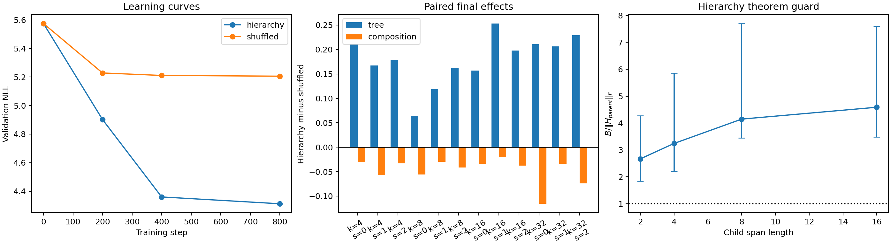

# A14_E04 Summary: Hierarchy Creates Tree-Aligned Compression, Not the Registered Linear-Propagation Mechanism

## Direct Result

**Pre-registered verdict: insufficient.** None of the 12 final
hierarchy/shuffled pairs passed the registered equal-capability guard because
the shuffled models did not reach 50% root-state probe accuracy. In addition,
zero of 48 final hierarchy transitions had a non-vacuous theorem bound.

The paired intervention nevertheless gives a consistent descriptive split:

- tree-subspace effect, hierarchy minus shuffled: **+0.1796**, all 12 pairs
  positive, all-pair cluster-bootstrap interval [0.1492, 0.2066];
- shared-composition effect: **-0.0469**, all 12 pairs negative, interval
  [-0.0628, -0.0345];
- step-0 effects were 0.0038 and 0.0010, respectively;
- latent state count tracked final hierarchy leaf effective rank with Spearman
  correlation 0.949.

These all-pair intervals are descriptive because the registered capability
gate admitted no pair; they do not replace the primary verdict.

## Interpretation

The randomized order intervention caused tree-boundary-aligned subspace
compression to emerge from a near-zero initialization contrast. It did **not**
increase the registered shared parent-operator advantage. That advantage was
already about 0.76 at initialization and remained larger in shuffled models.

This reveals a confound in the parent-child test: a parent string is literally
the concatenation of its two children. True children therefore preserve parent
token content, while cross-parent permutation changes content. The probe can
win without detecting the latent tree. A valid next composition control must
hold the parent token sequence fixed and compare the annotated split with an
alternative split of the same tokens.

## Capability-Guard Boundary

Final root-state accuracy averaged 0.699 for hierarchy and 0.150 for shuffled.
The guard was intended to exclude under-capable models, but root-state
retention is itself downstream of the hierarchy intervention. Requiring it to
be equal conditions on part of the mechanism and blocks the registered causal
comparison. This is a protocol limitation, not permission to relabel the
result as a pass.

## Conclusion

The controlled data support a causal effect of hierarchy-aligned training on
tree-span subspace geometry. They reject the stronger claim that the current
shared-linear composition metric or recursive norm bound explains that effect.

## Next Decision

Replace cross-parent child permutation with a same-parent, same-token
alternative-split control and optimize a stability/prediction Pareto frontier
for the shared operator before making any low-rank propagation claim.
