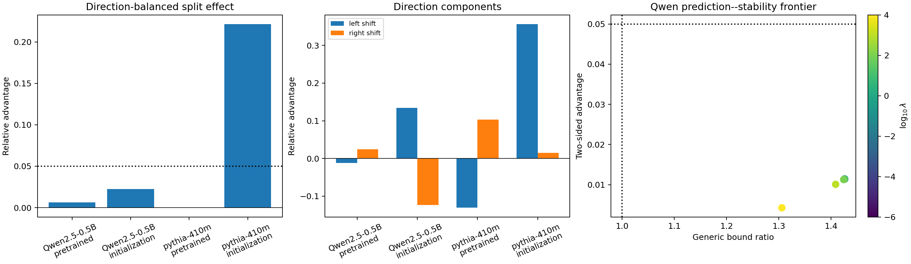

# A14_E06 Summary: Direction Balancing Removes the Pythia Gold-Split Effect

## Direct Result

**Registered verdict: insufficient.** After every parent was compared with
equal-weight one-word left and right boundary shifts, neither pretrained model
showed the registered 5% gold-split advantage:

- Qwen: **+0.0064**, 95% interval **[-0.0525, 0.0631]**;
- Pythia: **-0.00014**, interval **[-0.0210, 0.0208]**.

Pythia's E05 effect of +0.1486 therefore did not survive the direction-balanced
control. No Qwen validation-eligible point combined 5% advantage with a bound
ratio below one; the minimum was **1.3061**.

## Hypothesis Updates

| Hypothesis | Direct result | Registered update |
| --- | ---: | --- |
| H6a Qwen two-sided specificity | +0.0064 [-0.0525, 0.0631] | insufficient |
| H6b Pythia two-sided replication | -0.00014 [-0.0210, 0.0208] | insufficient; registered 5% effect strongly weakened |
| H6c model-general specificity | neither model passed | insufficient / unsupported |
| H6d stability compatibility | 0 compatible points; minimum 1.3061 | fail |

## Interpretation

The gold split is not uniformly better than nearby alternatives when shift
direction is controlled within every parent. Pythia's two direction components
remain opposite (-13.07% against left shift, +10.34% against right shift) and
cancel under equal weighting. Qwen's components are much smaller (-1.21% and
+2.43%). This is the pattern expected from boundary-position or child-length
geometry, not a model-general gold-tree preference.

Random initialization also produced substantial, model-dependent effects:
Pythia initialization had +22.16% two-sided advantage, while pretrained Pythia
had approximately zero. This further prevents a learned-syntax interpretation.

## Conclusion

The same-parent evidence does not support the key empirical premise of one
global shared-linear tree-composition mechanism. What remains supported from
the broader A14 line is relative tree-aligned subspace geometry, not a stable
gold-split recursion or a non-vacuous norm-bound explanation.

## Exactly One Next Decision

Close the global shared-linear propagation claim in A14; if work continues,
open a separate question on node-type/depth-conditioned or gated subspaces
rather than adding another global linear split probe.
