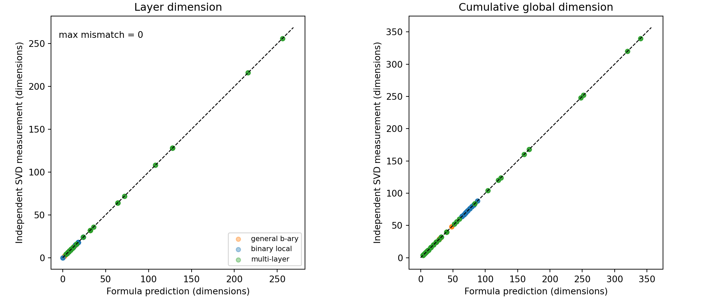
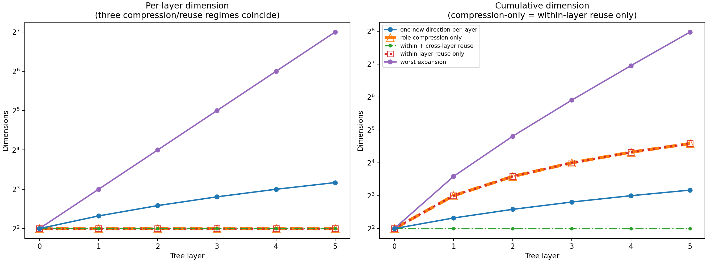

# Summary: A14_E07 Reachable-Space Accounting

Primary package:
[A14 probabilistic sparse-activation tree handoff](../../README.md)

Protocol: [protocol.md](protocol.md)

## Result Snapshot

**Verdict: pass for the registered synthetic implementation audit.**

**What we established:** across 950 registered records, the largest absolute
difference between the exact dimension recurrence and an independent SVD
measurement was 0 dimensions.

**What the experiment shows:** the implementation separately realizes role
compression, within-layer direction reuse, cross-layer direction reuse, and
finite-sample activation. Full activation reached the reachable dimension in
20/20 records; deficient activation produced a strict gap in 20/20 records.

**What we do next:** use this accounting as the mathematical basis for a new
Thinking Card on constrained conditional local low-rank composition. Do not
infer a real-language mechanism or authorize an experiment from this run.

## Terminology / Definitions

| Term | Plain meaning | Concrete computation | Unit | Cannot prove |
| --- | --- | --- | --- | --- |
| Reachable dimension | Number of directions permitted by the maps | SVD dimension of the sum of realized role-image bases | dimensions | Observed data activate all directions |
| Dimension mismatch | Formula prediction minus independent measurement | Maximum absolute integer difference | dimensions | A numerical run proves the theorem |
| Full activation | Samples span every reachable output direction | Observed rank equals reachable dimension | boolean/rate | Natural language has sufficient activation |
| Deficient activation | Correlated samples span only part of the reachable space | Observed rank is strictly below reachable dimension | boolean/rate | Sample scarcity is the only cause of low observed rank |

## Exact Setup

- Ambient dimension: 512.
- Arithmetic: float64.
- Branching factors: 2, 3, and 4.
- Rotation seeds: 0--4.
- Registered conditions excluding rotations: 190.
- Registered records including rotations: 950.
- No text, noise, model training, pretrained model, or optimizer.
- Runner: `scripts/run_reachable_space_accounting.py`.
- Machine result: `outputs/A14_E07_full/summary.json`.

## Primary Metric And Result

The primary metric is the maximum absolute dimension mismatch. The registered
pass value was exactly 0; the measured value was exactly 0.

All seven deliberately wrong-estimator negative controls were rejected. There
were no construction failures, oracle/SVD disagreements, rotation failures,
or spectral-gap failures.

## Key Figures

### Predicted versus independently measured dimension

Every registered point lies on the equality line. This supports implementation
agreement only; it does not establish a property of language.

### Growth under distinct mechanisms

The curves separate worst expansion, fixed layer rank with growing global
rank, fixed global dimension under cross-layer reuse, and bounded new-direction
growth. They demonstrate that layerwise low rank alone is insufficient.

## Claim Boundary

Can claim: the registered synthetic implementation exactly realizes the
refined reachable-space accounting.

Cannot claim: language exhibits the registered overlaps; Transformers use
shared linear role maps; conditional local low-rank composition is empirically
supported; or a MoE design follows.

## Next Decision

Approve or reject a Thinking Card that fixes the finite condition variable,
matched global baseline, held-out metric, and falsifier. A protocol comes only
after that decision.
