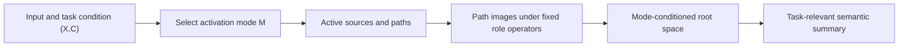

# Conditional Low-Dimensional Computation in a Globally High-Dimensional Tree

## A Probabilistic Sparse-Activation Theorem, Its Evidence Boundary, and Its Relation to Routing

## Abstract

The original proposal was that short-sequence leaves share a low-dimensional
representation space and therefore remain in one low-dimensional space after a
finite number of tree compositions. This is false in general. Role-specific
composition operators can send the same leaf directions into independent new
directions. Even if every layer is low-dimensional, different layers can occupy
different spaces and make the concatenated global state matrix high-rank.

The precise replacement is a conditional-computation theorem. For a fixed
activation mode, a root state lies in the sum of the path-image spaces reachable
under that mode. If every local information source has dimension at most $r$
and a computation activates at most $s$ sources with probability at least
$1-\delta$, then its mode-reachable dimension is at most $sr$ with probability
at least $1-\delta$. This is a theorem about the capacity of a conditioned
computation, not a theorem that the whole language system is globally
low-rank.

The result permits a globally high-capacity tree while each input or task uses
a low-dimensional active subtree. This is more compatible with a task-relevant
semantic summary than a single global shared space. The result still assumes
fixed linear path operators, sparse activation, reusable modes, and controlled
residuals. None of these premises has yet been established in real language
models. In particular, a low-dimensional active subtree need not retain task
information and does not by itself imply MoE or a Router.

The only next decision is whether to promote “a task-conditioned,
low-dimensional active subtree that preserves held-out task utility” into the
next formal researcher judgment record. Router architecture design remains parked until that
decision is made.

---

## 1. What Is Being Modeled?

### 1.1 The language object

We approximate the task-relevant processing of a long sequence by a finite
rooted tree. A leaf represents a short sequence, an internal node summarizes
its children, the root is the long-sequence summary needed for the current
task, and edge roles distinguish ordered children.

The tree is a computation-graph approximation, not a claim that language is
only a tree. Real language includes coreference, multiple-parent relations, and
cross-sentence links and is closer to a graph. The finite dependencies used by
one input-task computation can nevertheless be unrolled into an active tree.

### 1.2 Why the root is a task-relevant summary

A sentence contains details irrelevant to a particular task. If the root must
losslessly preserve every detail in its subtree, the required degrees of
freedom should generally grow with input size. A fixed low-dimensional root is
then not a natural target.

This model studies a weaker and more useful object:

> The root only needs to preserve a semantic summary sufficient for the
> current task; it need not reconstruct every leaf.

An inactive branch is not absent from the full system. It is simply unused
under the current input-task condition.

### 1.3 Rank belongs to a matrix, not to one vector

A nonzero vector regarded as a $d\times1$ matrix always has rank one. We must
collect states from multiple samples. For root states sharing mode $m$, define

$$
H_\rho^{(m)}=[h_{\rho,1}^{(m)},\ldots,h_{\rho,n}^{(m)}]
\in\mathbb R^{d\times n}.
$$

Conditional low rank means that this matrix has a low-dimensional column
space. It is distinct from every layer separately being low-rank, all layers
and conditions being globally low-rank, or the data having low nonlinear
intrinsic dimension.

---

## 2. Why a Static Tree Does Not Automatically Preserve Low Rank

Suppose all leaves share the one-dimensional space

$$
S_0=\operatorname{span}(e_1).
$$

If the left-role operator sends $e_1$ to $e_2$ and the right-role operator sends
$e_1$ to $e_3$, the parent layer can use two independent directions. Later
layers can create more. Short leaves, a shared low-dimensional leaf space, and
finite depth are therefore all insufficient.

Two mechanisms control dimension:

- **role compression**: how many current directions each role keeps;
- **direction reuse**: how many directions are shared across roles and across
  new versus historical layers.

Static reachable-space theory computes a new layer as the sum of its role-image
spaces and the global space as the sum of layer spaces. Independent images can
grow rapidly; compression and reuse slow that growth.

> A tree specifies who depends on whom, but not how many new linear directions
> are produced. Low rank is a property of the composition mechanism, not tree
> topology alone.

---

## 3. The Probabilistic Sparse-Activation Tree

Let $T$ be a finite ordered rooted tree with root $\rho$ and ambient dimension
$d$. Each leaf $u$ has local state

$$
h_u\in S_u\subseteq\mathbb R^d,
\qquad \dim S_u=r_u\le r.
$$

The original shared-leaf-space premise is the special case $S_u=S_0$ for all
leaves. Each edge from child $c_j(v)$ to parent $v$ has a fixed linear role
operator $W_{v,j}$. “Fixed” means shared across samples for that structural
role.

Each edge also has a binary gate $m_{v,j}\in\{0,1\}$. All gates form an
activation mode $M=m$, which may depend on input $X$ and task condition $C$:

$$
M\sim p(M\mid X,C).
$$

For fixed mode $m$,

$$
h_v^{(m)}=\sum_jm_{v,j}W_{v,j}h_{c_j(v)}^{(m)}.
$$

A leaf affects the root only if every gate on its unique root path is active.
Let $A(m)$ be the active leaf set and $N(m)=|A(m)|$. Let $B_u(m)$ be the ordered
product of role operators on active leaf $u$'s path. Define

$$
\mathcal R_\rho(m)=\sum_{u\in A(m)}B_u(m)S_u,
\qquad q(m)=\dim\mathcal R_\rho(m).
$$

$q(m)$ is a mechanism-capacity quantity. It describes directions a mode can
generate; finite observations need not activate them all.

---

## 4. Fixed-Mode and High-Probability Theorems

### Theorem 1: Path expansion

For every fixed mode $m$,

$$
h_\rho^{(m)}=\sum_{u\in A(m)}B_u(m)h_u.
$$

Therefore

$$
\operatorname{Col}(H_\rho^{(m)})\subseteq\mathcal R_\rho(m),
\qquad
\operatorname{rank}(H_\rho^{(m)})\le q(m).
$$

**Proof.** Recursively expand every parent from leaves to root. Each expansion
left-multiplies a child by its role operator, and only paths with all gates
equal to one survive. Each active contribution belongs to $B_u(m)S_u$; their
sum belongs to the sum of those spaces. Apply this argument to every sample
column.

### Theorem 2: Active-source dimension

For every fixed mode,

$$
q(m)
\le\sum_{u\in A(m)}\dim(B_u(m)S_u)
\le\sum_{u\in A(m)}r_u
\le rN(m).
$$

Hence if $N(m)\le s$,

$$
\operatorname{rank}(H_\rho^{(m)})\le\min(d,sr).
$$

**Proof.** A linear map cannot increase the dimension of one subspace, and the
dimension of a sum is no larger than the sum of component dimensions. The
bound is tight before saturation at $d$ when the path images are injective and
independent; compression or reuse makes it smaller.

### Theorem 3: High-probability conditional dimension

If

$$
\Pr\{N(M)\le s\mid C=c\}\ge1-\delta,
$$

then

$$
\Pr\{q(M)\le sr\mid C=c\}\ge1-\delta.
$$

**Proof.** Whenever $N(M)\le s$, Theorem 2 deterministically gives
$q(M)\le sr$. The first event is contained in the second.

Only mode selection is random. The theorem says that a computation drawn from
the input-task distribution has bounded reachable dimension with high
probability; it does not say that one vector is “low-rank with probability.”

If each active internal node retains at most $k$ children and depth is $L$,
then $q(M)\le rk^L$. This is low-dimensional only when $rk^L\ll d$; finite depth
alone remains insufficient.

---

## 5. Conditional Low Dimension Is Not Global Low Dimension

If condition $C=c$ uniquely determines mode $m(c)$, then

$$
\operatorname{rank}(H_{\rho\mid c})\le q(m(c)).
$$

If a condition mixes modes, define

$$
\mathcal R_c=
\sum_{m\in\operatorname{supp}(M\mid C=c)}\mathcal R_\rho(m).
$$

Only $\operatorname{rank}(H_{\rho\mid c})\le\dim\mathcal R_c$ is guaranteed.
Even if every mode has dimension $q$, $J$ independent modes can require $Jq$
dimensions.

For a minimal globally high-rank construction, take $d$ conditions and let

$$
\mathcal R_c=\operatorname{span}(e_c).
$$

Each conditional matrix has rank at most one, while their concatenation can
have rank $d$. The model therefore permits a globally high-capacity system in
which each realized computation is locally low-dimensional.

---

## 6. Capacity, Observed Rank, Noise, and Task Sufficiency

$q(m)$ measures theoretically available directions. A finite dataset may span
less because of insufficient samples or correlated source states. Equality
requires observed active-source tuples, after path mapping, to span all of
$\mathcal R_\rho(m)$; sample count alone is not sufficient.

Internal nodes may also inject local sources:

$$
h_v=\xi_v+\sum_jm_{v,j}W_{v,j}h_{c_j(v)},
\qquad \xi_v\in S_v.
$$

Expanding each active source along its root path gives the same theorem, with
$N(m)$ counting active information sources rather than only leaves.

For noisy states, let the propagated root residual be $E_\rho^{(m)}$. If the
low-dimensional signal has reachable dimension $q(m)$, then

$$
\Delta_{q(m)}(H_\rho^{(m)})\le\|E_\rho^{(m)}\|_F.
$$

This gives a meaningful effective-rank certificate only when
$\|E_\rho^{(m)}\|_F/\|H_\rho^{(m)}\|_F$ is small. A normalized bound near or
above one is vacuous. Effective rank is singular-value energy concentration,
not exact rank or nonlinear intrinsic dimension.

Most importantly, low dimension does not imply task sufficiency. Let
$R_{\mathrm{full}}$ be the best task risk from the full representation and
$R_{\mathrm{sparse}}$ that from the sparse representation. Sparse computation
is $\varepsilon$-task-sufficient only if

$$
R_{\mathrm{sparse}}-R_{\mathrm{full}}\le\varepsilon.
$$

Closing every gate yields a zero-dimensional root. If the target is a bit in a
removed leaf, task error becomes unavoidable. Thus geometric control and task
information preservation are independent requirements.

---

## 7. Why the Conditional Model Is a Better Physical Prior

“Better” is a modeling prior, not an established empirical result.

First, classification, retrieval, reading comprehension, and next-token
prediction do not require every input detail in the same way. Different tasks
select different evidence, so condition-dependent paths are more natural than
one complete shared space.

Second, language dependencies may form a DAG or general graph. The finite paths
used by one input-task computation can be unrolled into an active tree. The
full graph stores possible relations, while the active tree describes one
realized computation. Global complexity and sparse realized computation can
therefore coexist.

Third, existing real-model tests do not support a stable, model-general global
linear syntactic composition rule, and all measured propagation bounds are
vacuous. A condition-, node-type-, depth-, or role-dependent mechanism is a
more defensible hypothesis than strengthening the rejected global one.

These motivations do not establish that real models use a few reusable modes,
that active subtrees are task-sufficient, or that a learnable Router recovers
the modes.

---

## 8. What Existing Theory and Experiments Establish

### 8.1 E07: Static dimension accounting is implemented correctly

E07 constructed synthetic trees with known subspaces and linear operators and
independently measured dimensions by singular-value decomposition. Across 190
conditions and five global rotations, for 950 records total:

- exact dimension mismatches: 0;
- construction, SVD, rotation, and spectral failures: 0;
- seven deliberately wrong estimators were all rejected;
- full-activation cases reached the reachable space, while deficient cases
  showed strict gaps.

For a representative binary tree with leaf dimension 4 and depth 5:

| Mechanism | Final-layer dimension | Cumulative dimension |
|---|---:|---:|
| No compression or reuse | 128 | 252 |
| Compression only | 4 | 24 |
| Within-layer reuse only | 4 | 24 |
| Within- and cross-layer reuse | 4 | 4 |

This establishes a nontrivial distinction: each layer may remain
low-dimensional while the cumulative global space keeps growing. Cross-layer
reuse is required to stop that accumulation.

E07 is an implementation audit. It contains no text, neural model, training,
noise, or probabilistic gate and does not validate a language mechanism.

### 8.2 E02: Constituents show relative shared geometry, not strong absolute low rank

For Penn Treebank PPMI phrase representations, held-out projection error was
0.0606 for true constituents and 0.0921 for length- and frequency-matched
nonconstituents, a 34.2% relative advantage. This supports more shared linear
geometry among constituents than among matched controls.

Retaining 95% of the energy, however, required 657 of 2048 dimensions, or
32.1% of the ambient space. This does not establish the strong $r\ll d$ leaf
premise and does not test neural recursive composition.

### 8.3 E04: Hierarchical training changes tree-boundary geometry but does not establish shared composition

Controlled hierarchical training produced a +0.1796 tree-span subspace
advantage over shuffled-order training, positive in all 12 pairs. Within that
generator, hierarchical conditioning can therefore causally change
tree-boundary geometry.

The registered capability guard passed in 0/12 pairs; shared-composition
advantage was -0.0469; and all 48 propagation bounds exceeded one. The retained
observation is tree-aligned compression, not a shared linear composition rule
or a non-vacuous propagation certificate.

### 8.4 E06: Real models do not support a stable global shared-linear split rule

E06 fixed the parent span and exact tokens, balanced left and right boundary
shifts, and compared gold syntactic splits only with neighboring wrong splits.
The pretrained two-sided advantage was +0.0064 for Qwen and -0.0001 for
Pythia, both with intervals crossing zero. Minimum eligible propagation bounds
were 1.3061 and 1.4535 and remained vacuous.

Current evidence therefore does not support a model-general global shared
linear syntactic composition operator. It does not rule out nonlinear,
node-conditioned, depth-conditioned, or task-conditioned mechanisms.

### 8.5 Evidence synthesis

| Proposition | Current status |
|---|---|
| Static reachable dimension is determined by compression and reuse | **Proved; E07 implementation audit passed** |
| True constituents have relatively more shared subspace geometry | **Local empirical support** |
| Hierarchical training can alter tree-boundary geometry | **Controlled causal support with failed guards** |
| Real models obey one global shared linear composition rule | **Not supported; claim closed** |
| Real computation uses few reusable modes with high probability | **Missing** |
| A low-dimensional active subtree preserves task utility | **Missing** |
| A Router learns these conditions and improves downstream utility | **Missing** |

Experiments do not prove the probabilistic theorem. Linear algebra proves the
theorem; experiments audit an implementation or test real-world premises.

---

## 9. Relation to a Router

A Router selects computational branches, parameter modules, or experts from an
input or condition. In this model it can be interpreted as producing mode $M$:

$$
(X,C)\longmapsto M\longmapsto\text{active subtree}.
$$

The theorem safely supports only:

> If the mode selected by a Router contains few low-dimensional active sources
> and has controlled path operators, its conditional linear reachable
> dimension is controlled.

It does not imply that multiple experts are required, that Top-1 or Top-$k$ is
optimal, that low-rank experts are sufficient, that the geometrically nearest
expert has the highest task utility, or that sparse activation lowers loss.

Moving from the theorem to a functional Router requires at least five further
pieces of evidence:

1. **finite reusable modes** across many samples;
2. **mode identifiability** from input or context;
3. **functional heterogeneity**, so modes need different functions;
4. **conditional utility**, so the matched expert lowers held-out task loss;
5. **task sufficiency and sample sparsity**, so each sample needs only a few
   experts without losing important information.

Tree depth, node type, composition role, and task condition are therefore
candidate Router variables, not established expert labels.

---

## 10. Consolidated Belief Update

1. **The original global claim is false.** Shared low-dimensional leaves and
   finite depth do not imply a globally low-dimensional tree.

2. **The correct static controls are known.** Role compression, within-layer
   reuse, and cross-layer reuse determine reachable-space growth; E07 verifies
   that the implementation distinguishes layerwise from global low dimension.

3. **The probabilistic extension changes the target.** It controls a
   mode-conditioned reachable space instead of requiring one global space.

4. **Global high capacity and local low dimension can coexist.** Different
   conditions can use different low-dimensional spaces whose aggregate spans
   the ambient dimension.

5. **Conditional low dimension is not semantic sufficiency.** Task information
   preservation and mode reuse are separate empirical requirements.

6. **A Router is only a possible mode generator.** The theorem provides a
   geometric capacity boundary, not a theory of Router learning, expert
   specialization, or downstream utility.

---

## 11. Claim Boundary

### We may claim

- Under a fixed finite tree, low-dimensional local sources, fixed linear role
  operators, and a fixed activation mode, the root lies in the sum of active
  path-image spaces.
- If at most $s$ sources are active with probability at least $1-\delta$, the
  mode-reachable dimension is at most $sr$ with at least that probability.
- Conditions can each be low-dimensional while their global aggregate is
  high-dimensional.
- Exact dimension bounds imply effective-rank bounds only when propagated
  residual energy is small.
- E07 validates static accounting implementation, and E06 does not support a
  model-general global shared-linear composition operator.

### We may not claim

- natural language, world knowledge, or arbitrary Transformers are inherently
  low-rank;
- real models implement a probabilistic sparse active tree;
- per-mode low dimension makes every conditional or global matrix low-rank;
- sparse active trees automatically preserve task-relevant semantics;
- the theory derives MoE, low-rank experts, Top-$k$, or a specific Router;
- existing experiments validate probabilistic gating, reusable modes, or
  conditional expert utility.

---

## 12. Exactly One Next Decision

**Decide whether “a task-conditioned low-dimensional active subtree that
preserves held-out task utility” should be promoted into the next formal
researcher judgment record. Until then, the probabilistic tree remains a completed
conditional theory and Router architecture design remains parked.**

---

## 13. Audit Appendix

The main text is self-contained. This appendix only provides traceability.

### 13.1 Theory sources

- [Package index and static-tree boundary](README.md)
- Static-tree closure source: `Projects/from-attention-to-search/main/stories/14_tree_low_rank_language_structure/01_tree_aligned_compression_without_linear_propagation.md`
- [Formal probabilistic proof, Chinese](theory/probabilistic_sparse_activation_tree_theory_proof_cn.md)

### 13.2 Experiment sources and realization details

| Experiment | Data / model | Key parameters | Primary measurement | Records |
|---|---|---|---|---|
| E07 | Synthetic subspaces and linear trees; no text, model, training, or checkpoint | $d=512$; branching 2/3/4; leaf dimensions 4/8; five rotations | Predicted versus float64 SVD-measured dimension | [summary](evidence/E07/summary.md); [detailed](evidence/E07/detailed.md) |
| E02 | NLTK Penn Treebank; 2048-dimensional PPMI phrase means | 199 files, 3914 sentences; seed 1402; 1000 bootstraps | Held-out projection error and 95%-energy rank | [summary](evidence/E02/summary.md) |
| E04 | Controlled hierarchical versus shuffled training; four-layer width-128 decoder | $k_\star=4,8,16,32$; seeds 0--2; 12 pairs; 800 updates | Tree-span advantage, shared composition, bound, guard | [summary](evidence/E04/summary.md) |
| E06 | Penn Treebank; Qwen2.5-0.5B and Pythia-410m pretrained/random-init states | 3500/500/480 parent split; 8192 leaves; 1000 bootstraps; ridge $10^{-6}$ to $10^5$ | Same-parent, same-token, balanced gold-split advantage and bound | [summary](evidence/E06/summary.md) |

### 13.3 Key runtime artifacts

- E07 runner: `Projects/from-attention-to-search/XingyuD/Attention_Search_Experiments/active/tree_low_rank/scripts/run_reachable_space_accounting.py`
- E07 config: `Projects/from-attention-to-search/XingyuD/Attention_Search_Experiments/active/tree_low_rank/configs/exp7_reachable_space_accounting.yaml`
- E07 outputs: `Projects/from-attention-to-search/XingyuD/Attention_Search_Experiments/active/tree_low_rank/outputs/A14_E07_full/`
- E02 outputs: `Projects/from-attention-to-search/XingyuD/Attention_Search_Experiments/active/tree_low_rank/outputs/A14_E02_full/`
- E04 outputs: `Projects/from-attention-to-search/XingyuD/Attention_Search_Experiments/active/tree_low_rank/outputs/A14_E04_full/`
- E06 outputs: `Projects/from-attention-to-search/XingyuD/Attention_Search_Experiments/active/tree_low_rank/outputs/A14_E06_full/`

### 13.4 State classification

| Item | Type |
|---|---|
| Fixed-mode expansion, $q(m)\le rN(m)$, and probability corollary | **Theorem / proved** |
| Low-dimensional sources, fixed role operators, sparse modes | **Assumption / unverified** |
| E07 exact agreement, E02 projection advantage, E04 tree effect, E06 near-zero split effect | **Observation / direct result** |
| Conditional active trees are a better task-summary model than one global shared space | **Interpretation / bounded** |
| These conditions naturally yield useful experts and a learnable Router | **Speculation / missing evidence** |
