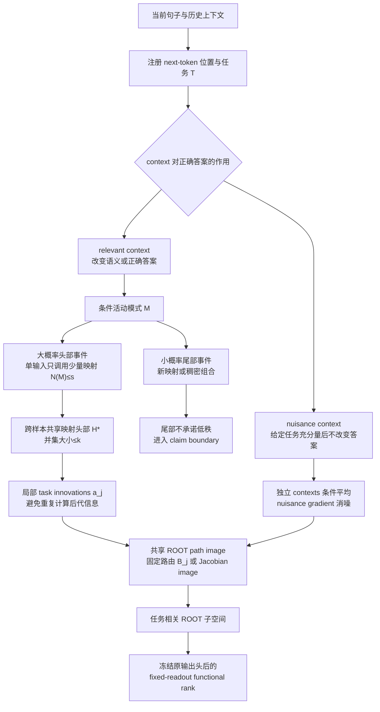
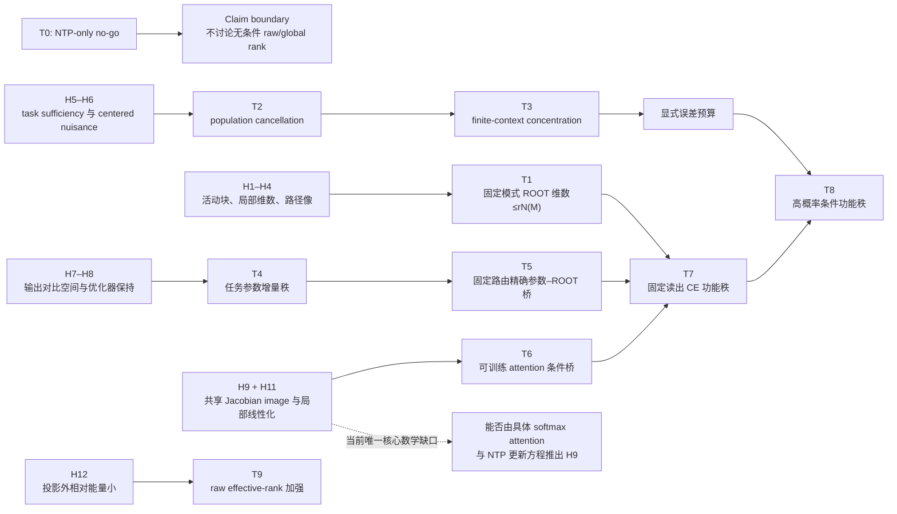

# 证明附录：共享组合结构与简化 NTP Transformer 的条件低秩定理

本附录与主文档共同构成完整理论稿。符号沿用主文档。

---

# A.1 NTP-only no-go 的补充反例

## A.1.1 不同模式各自一维、全局满秩

设环境空间为 $\mathbb R^d$，模式 $m_i$ 下：

$$
h_\rho^{(m_i)}(x)=\alpha(x)e_i.
$$

每个模式的 ROOT 矩阵秩至多为 1，但将所有模式样本拼接后可达秩 $d$。因此：

$$
\forall m,\quad
\operatorname{rank}H_\rho^{(m)}\le1
$$

不蕴含：

$$
\operatorname{rank}
[
H_\rho^{(m_1)},\ldots,H_\rho^{(m_d)}
]
\ll d.
$$

## A.1.2 共享规则的 raw high-rank 实现

给定低维任务表示 $h_{\mathrm{task}}$，增加任意高秩 $n(x)$：

$$
h(x)=
\begin{bmatrix}
h_{\mathrm{task}}(x)\\
n(x)
\end{bmatrix}.
$$

输出头忽略 $n(x)$。因此共享规则可具有低功能秩而 raw effective rank 很高。

---

# A.2 固定路由一层 Transformer 路径展开

初始状态：

$$
x_t^0
=
x_{t,\mathrm{base}}
+
\sum_jC_{t,j}a_j
+
D_t\psi.
$$

ROOT：

$$
h_\rho
=
x_\rho^0
+
W_O
\sum_t\alpha_{m,t}W_Vx_t^0.
$$

代入初始状态：

$$
h_\rho
=
x_{\rho,\mathrm{base}}
+
W_O
\sum_t\alpha_{m,t}W_Vx_{t,\mathrm{base}}
$$

$$
+
\sum_j
\left[
C_{\rho,j}
+
W_O
\sum_t\alpha_{m,t}W_VC_{t,j}
\right]a_j
$$

$$
+
\left[
D_\rho
+
W_O
\sum_t\alpha_{m,t}W_VD_t
\right]\psi.
$$

定义：

$$
h_{\rho,\mathrm{base}}^{(m)}
=
x_{\rho,\mathrm{base}}
+
W_O
\sum_t\alpha_{m,t}W_Vx_{t,\mathrm{base}},
$$

$$
B_j(m)
=
C_{\rho,j}
+
W_O
\sum_t\alpha_{m,t}W_VC_{t,j},
$$

$$
D_\rho^{(m)}
=
D_\rho
+
W_O
\sum_t\alpha_{m,t}W_VD_t.
$$

则：

$$
h_\rho
=
h_{\rho,\mathrm{base}}^{(m)}
+
\sum_jB_j(m)a_j
+
D_\rho^{(m)}\psi.
$$

这证明固定路由一层 Transformer 是静态路径像模型的一个精确实例。注意 softmax attention 权重在此被模式固定；若 $W_Q,W_K$ 训练并随 context 变化，则 $\alpha_{m,t}$ 不再固定，需要 Jacobian 桥。

---

# A.3 有限 context 集中定理的完整证明

固定 $(\phi_m,Y,M)$。令：

$$
v
=
W_o^\top(p-e_Y).
$$

由：

$$
\|p-e_Y\|_2\le\sqrt2,
\qquad
\|W_o\|_{\mathrm{op}}\le B_W,
$$

得到：

$$
\|v\|_2\le\sqrt2B_W.
$$

加权经验 nuisance gradient 为：

$$
G
=
\sum_{j=1}^Lw_jv\psi_j^\top
=
v\bar\psi^\top,
$$

其中：

$$
\bar\psi=\sum_jw_j\psi_j.
$$

所以：

$$
\|G\|_{\mathrm{op}}
=
\|v\|_2\|\bar\psi\|_2.
$$

若每个 $\psi_j$ 条件 $\sigma_\psi$-sub-Gaussian，独立加权和 $\bar\psi$ 的任意单位方向 $u$ 满足：

$$
\mathbb E
\exp(
\lambda u^\top\bar\psi
)
\le
\exp\left(
\frac{
\lambda^2\sigma_\psi^2
\sum_jw_j^2
}{2}
\right).
$$

定义：

$$
n_{\mathrm{eff}}
=
\frac1{\sum_jw_j^2}.
$$

则 $u^\top\bar\psi$ 为参数 $\sigma_\psi/\sqrt{n_{\mathrm{eff}}}$ 的 sub-Gaussian。

取单位球的 $1/2$-net $\mathcal N$，满足：

$$
|\mathcal N|\le5^q.
$$

若 $\|\bar\psi\|_2\ge t$，存在 $u\in\mathcal N$ 使：

$$
u^\top\bar\psi\ge t/2.
$$

因此：

$$
\Pr[
\|\bar\psi\|_2\ge t
]
\le
5^q
\exp\left(
-\frac{
n_{\mathrm{eff}}t^2
}{
8\sigma_\psi^2
}
\right).
$$

令右侧等于 $\delta$，可取：

$$
t
=
2\sqrt2\sigma_\psi
\sqrt{
\frac{
q\log5+\log(1/\delta)
}{
n_{\mathrm{eff}}
}
}.
$$

乘以 $\|v\|_2\le\sqrt2B_W$，得到：

$$
\|G\|_{\mathrm{op}}
\le
4B_W\sigma_\psi
\sqrt{
\frac{
q\log5+\log(1/\delta)
}{
n_{\mathrm{eff}}
}
}.
$$

证毕。

## 同一 context 重复的反例

若 $\psi_j=\psi_0$ 对所有 $j$ 成立，则：

$$
\bar\psi
=
\sum_jw_j\psi_0
=
\psi_0.
$$

无论重复多少次：

$$
\|G\|_{\mathrm{op}}
=
\|v\psi_0^\top\|_{\mathrm{op}}
$$

都不衰减。

---

# A.4 一般矩阵 Bernstein 版本

以下在 $U=0$ 处成立；更一般地，只需明确满足
$\mathbb E[X_i\mid\phi_i,Y_i,M_i]=0$，不能只由“context 多样”替代零均值
条件。

令：

$$
X_i
=
v_i\psi_i^\top
\in\mathbb R^{d\times q},
$$

条件独立、零均值，并满足：

$$
\|v_i\|_2\le\sqrt2B_W,
\qquad
\|\psi_i\|_2\le B_\psi,
$$

$$
\left\|
\mathbb E[
\psi_i\psi_i^\top
\mid\phi_i,Y_i,M_i
]
\right\|_{\mathrm{op}}
\le\sigma_\psi^2,
$$

$$
\mathbb E[
\|\psi_i\|_2^2
\mid\phi_i,Y_i,M_i
]
\le q\sigma_\psi^2.
$$

则：

$$
\|X_i\|_{\mathrm{op}}
\le
\sqrt2B_WB_\psi
=:L.
$$

矩阵 Bernstein 方差参数满足：

$$
\nu
=
\max
\left\{
\left\|
\sum_i\mathbb E[X_iX_i^\top]
\right\|_{\mathrm{op}},
\left\|
\sum_i\mathbb E[X_i^\top X_i]
\right\|_{\mathrm{op}}
\right\}
\le
2nB_W^2q\sigma_\psi^2.
$$

矩阵 Bernstein 给出，以至少 $1-\delta$ 的概率：

$$
\left\|
\frac1n\sum_iX_i
\right\|_{\mathrm{op}}
\le
2B_W\sigma_\psi
\sqrt{
\frac{
q\log((d+q)/\delta)
}{n}
}
+
\frac{
2\sqrt2B_WB_\psi
\log((d+q)/\delta)
}{
3n
}.
$$

该版本允许 $(\phi_i,Y_i)$ 变化，但要求相应条件均值为零。

---

# A.5 参数子空间保持定理的细节

定义：

$$
\mathcal G_m
=
\{
A:
\operatorname{Col}(A)\subseteq\mathcal T_m,\;
\operatorname{Row}(A)\subseteq\mathcal F_m
\}.
$$

这是一个线性矩阵子空间。

单样本任务梯度：

$$
g_t
=
R_m^\top W_o^\top(p-e_Y)\phi_m^\top
\in\mathcal G_m.
$$

考虑更新：

$$
\Delta\Theta_{t+1}
=
\sum_{\tau\le t}
c_{t,\tau}g_\tau
+
d_t\Delta\Theta_t,
$$

其中 $c_{t,\tau},d_t$ 为标量。这覆盖 SGD、mini-batch SGD、标量 momentum、Nesterov 和标量 weight decay 的任务增量形式。

由 $\mathcal G_m$ 对标量线性组合封闭，且 $\Delta\Theta_0=0\in\mathcal G_m$，归纳得：

$$
\Delta\Theta_t\in\mathcal G_m.
$$

任意 $A\in\mathcal G_m$ 的列空间包含于 $b_m$ 维 $\mathcal T_m$，行空间包含于 $a_m$ 维 $\mathcal F_m$，所以：

$$
\operatorname{rank}(A)
\le
\min(a_m,b_m).
$$

## Adam 反例

向量化后令理论子空间为：

$$
\mathcal G
=
\operatorname{span}
\left\{
\begin{bmatrix}1\\1\end{bmatrix}
\right\}.
$$

梯度 $g=(1,1)^\top\in\mathcal G$。取对角预条件器：

$$
D=
\begin{bmatrix}
1&0\\0&2
\end{bmatrix}.
$$

则：

$$
Dg=
\begin{bmatrix}1\\2\end{bmatrix}
\notin\mathcal G.
$$

一般逐坐标预条件可以破坏子空间保持。

## 混合模式的联合空间

若共享参数块接收多个模式的梯度，先把所有 mode-specific 矩阵子空间按冻结的
全局任务库坐标嵌入同一个参数矩阵空间，再令

$$
\mathcal G_{\mathcal A}
=
\operatorname{span}_{m\in\mathcal A}\mathcal G_m.
$$

同一归纳只保证 $\Delta\Theta_t\in\mathcal G_{\mathcal A}$。因此参数秩上界由
联合行、列空间维数决定；除非额外证明不同模式共享这些空间，否则不能把每个
模式各自的 $\min(a_m,b_m)$ 当作混合训练后完整增量的上界。

---

# A.6 Jacobian covariance 的弱桥

令：

$$
Z_x
=
J_\rho(x;\theta_0)G_m
\in\mathbb R^{d\times g_m}.
$$

定义：

$$
C_m
=
\mathbb E[
Z_xZ_x^\top
\mid M=m
].
$$

令 $P_{m,r}$ 投影到 $C_m$ 前 $r$ 个特征向量。对任意 $\alpha$：

$$
\mathbb E
\|
(I-P_{m,r})Z_x\alpha
\|_2^2
\le
\|\alpha\|_2^2
\sum_{j>r}\lambda_j(C_m).
$$

证明：

$$
\|(I-P)Z_x\alpha\|_2^2
\le
\|\alpha\|_2^2
\|(I-P)Z_x\|_F^2.
$$

取期望：

$$
\mathbb E
\|(I-P)Z_x\|_F^2
=
\operatorname{tr}((I-P)C_m).
$$

取 top-$r$ 投影，由 PCA 最优性：

$$
\operatorname{tr}((I-P_{m,r})C_m)
=
\sum_{j>r}\lambda_j(C_m).
$$

证毕。

该结果说明 expected Jacobian image covariance 低尾是足够桥，但并未从 NTP 自动推出。

---

# A.7 entropy effective-rank 上界证明

设非零矩阵 $H$ 的最大可能秩为 $Q$，并取 $1\le k<Q$。定义奇异能量分布：

$$
p_i
=
\frac{\sigma_i^2}{\sum_j\sigma_j^2}.
$$

令实际尾部质量：

$$
t=\sum_{i>k}p_i\le\tau.
$$

固定 $t$ 时，熵在头部 $k$ 个方向均匀分配 $1-t$、尾部 $Q-k$ 个方向均匀分配 $t$ 时最大。因此：

$$
H(p)
\le
h_2(t)
+
(1-t)\log k
+
t\log(Q-k).
$$

右侧对 $t$ 的导数为：

$$
\log
\frac{
(1-t)(Q-k)
}{
tk
}.
$$

当 $t\le(Q-k)/Q$ 时非负，所以若 $\tau\le(Q-k)/Q$，最大值在 $t=\tau$ 取得：

$$
H(p)
\le
h_2(\tau)
+
(1-\tau)\log k
+
\tau\log(Q-k).
$$

指数化：

$$
r_{\mathrm{eff}}(H)
\le
\exp(h_2(\tau))
k^{1-\tau}(Q-k)^\tau.
$$

若 $\tau>(Q-k)/Q$，安全上界退化为 $r_{\mathrm{eff}}\le Q$。
当 $k=Q$ 时也直接使用这个平凡上界；当 $\tau=0$ 时约定
$h_2(0)=0$。

---

# A.8 lookup contrast-logit 下界

取 contrast 矩阵：

$$
C\in\mathbb R^{(V-1)\times V},
\qquad
C\mathbf1=0.
$$

必须保持的 code：

$$
Z^\star=CW_oH.
$$

设：

$$
r_\star=\operatorname{rank}(Z^\star).
$$

对任意 rank-$u$ 投影 $P$，有：

$$
\operatorname{rank}(CW_oPH)
\le u.
$$

若 $u<r_\star$，Eckart–Young 的谱范数形式给出：

$$
\|CW_oPH-Z^\star\|_{\mathrm{op}}
\ge
\sigma_{u+1}(Z^\star).
$$

所以高秩 lookup 下界依赖非退化 code，而不是 rule count 本身。

---

# A.9 主定理误差项的一个具体局部界

令参数更新分解为：

$$
\Delta\theta
=
G_m\alpha
+
e_{\mathrm{bg}}
+
e_{\mathrm{opt}}.
$$

假设：

$$
\|\alpha\|_2\le R_G,
\qquad
\|e_{\mathrm{bg}}\|_2\le\rho_{\mathrm{bg}},
\qquad
\|e_{\mathrm{opt}}\|_2\le\rho_{\mathrm{opt}}.
$$

设：

$$
L_\rho
=
\left(
\mathbb E
\|J_\rho(x;\theta_0)\|_{\mathrm{op}}^2
\right)^{1/2}.
$$

若：

$$
J_\rho G_m=B_mA_x+E_x,
\qquad
\left(
\mathbb E\|E_x\|_{\mathrm{op}}^2
\right)^{1/2}
\le\tau_J,
$$

且 Jacobian 在半径 $R_\theta$ 内 $L_J$-Lipschitz，则可取：

$$
\eta_{\mathrm{background}}
\le
B_WL_\rho\rho_{\mathrm{bg}},
$$

$$
\eta_{\mathrm{optimization}}
\le
B_WL_\rho\rho_{\mathrm{opt}},
$$

$$
\eta_{\mathrm{Jacobian}}
\le
B_WR_G\tau_J,
$$

$$
\eta_{\mathrm{linearization}}
\le
\frac12B_WL_JR_\theta^2.
$$

finite-context nuisance 项由 A.3 或 A.4 给出。初始项直接测量：

$$
\eta_{\mathrm{initial}}
=
\mathbb E
\|W_o(I-P_m)h_\rho(\theta_0)\|_2.
$$

这些界说明主定理中的误差必须被单独推导或测量，而不是由活动稀疏性自动变为零。

---

# A.10 从自然语言任务到条件功能秩

下图说明本文如何把“自然语言有层级结构”改写为一个可审计的任务条件模型。
图中的树是某个注册 next-token 任务下的活动计算轨迹，不是对完整语言本体的
静态树声明。

该图同时澄清三个容易混淆的判断：

1. rare sample 可以调用已经学会的 common mapping，因此 rare 不自动增加映射
   并集；
2. 单输入稀疏 $s$ 只控制单模式方向预算，跨样本还需要共享头部 $k$；
3. raw hidden state 可以保留高秩 nuisance；本文的主对象是冻结原输出头后的
   任务功能方向。

---

# A.11 证明依赖与开放桥接条件

依赖图的读取规则是：

- T1–T5 在各自受控模型中给出精确或标准集中结论；
- T6 不是从 NTP 自动得到的定理，而是把 H9 转成可测量误差的条件桥；
- T8 只有在活动头部事件、训练 good event 和误差预算同时成立时才生效；
- T9 是对 raw geometry 的额外加强，不是 T8 的同义改写。
