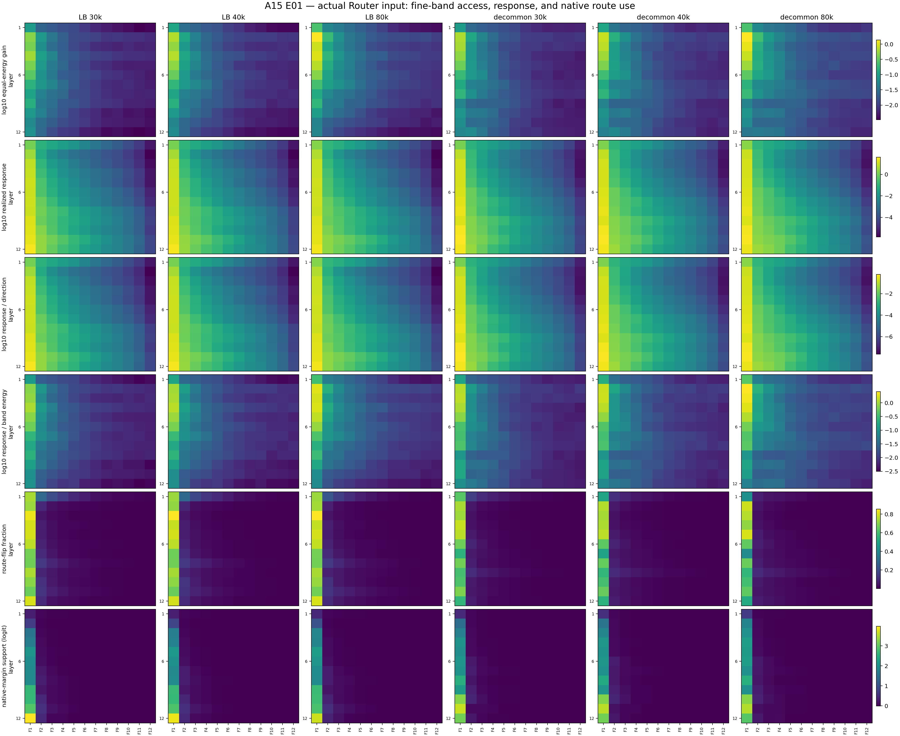
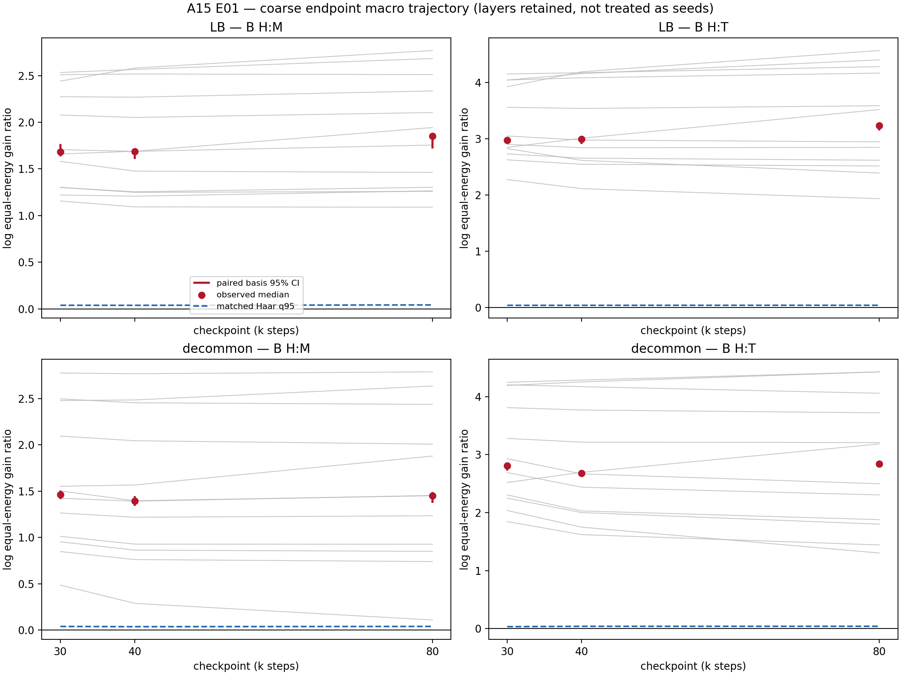
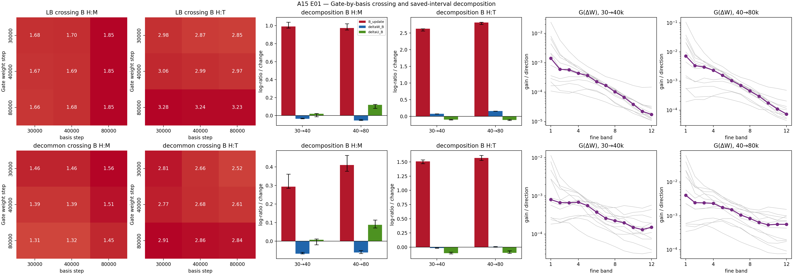

# Detailed: A15_00_E01_actual_router_input_band_response

Primary anchor: [A15_00](../../../../problem_anchors/15_linear_gate_spectral_training_bias/15_00_covariance_head_gate_alignment/15_00_covariance_head_gate_alignment_anchor.md)  
Protocol: [protocol.md](protocol.md)  
Summary: [summary.md](summary.md)

## 0. Quick Recap

**Purpose:** Measure which covariance bands a trained linear Gate can access
and currently uses on its actual deployed input, then separate net Gate-weight
allocation from representation-basis drift over 30k--40k and 40k--80k.

**Hypothesis:** Endpoint equal-energy gain and both saved Gate intervals
persistently favor and strengthen the covariance head relative to middle and
tail.

**Experiment logic:** Directly hook the Gate pre-input; fit its covariance
basis; report coarse H/M/T and fine 12x64 access/use; compare $G$ contrasts to
a singular-value-preserving orientation null; then compute the complete
$W_{30/40/80}\times U_{30/40/80}$ crossing and paired basis uncertainty.

**Conclusion:** Endpoint head access passes decisively and is not explained by
input energy. Middle/tail access and route use are nonzero but weaker. The
strict persistent-training hypothesis fails because fixed-basis head:middle
strengthening is precisely negative in all four lineage-by-interval cases,
although every net displacement is itself head-oriented.

**Evidence:** Six endpoint replays; 12 layers; two resolutions; 200 paired
training-sequence basis bootstraps; 2000 paired held-out-document bootstraps;
256 matched Gate orientation nulls; full crossing; half splits, wrong-object,
wrong-layer, DC, reconstruction, and response-cross-term audits.

## 1. Terminology / Definitions

| Term | Plain meaning | Concrete object / computation | Unit or formula | Why it matters | Cannot prove |
| --- | --- | --- | --- | --- | --- |
| Gate-effective input $r_\ell$ | Exact tensor seen by the Gate | Direct `mlp.gate` pre-input; LB $r=g$, decommon $r=g-c$ | activation | Correct covariance object | Semantic content |
| Expert input $h_\ell$ | Tensor sent to experts | First MoE argument | activation | Known-bad object control | Router geometry |
| Head/middle/tail | High/mid/low covariance ranks | 1--64 / 65--320 / 321--768 | 64/256/448 directions | Registered coarse comparison | Token frequency or utility |
| Fine band $F_j$ | Equal-width rank block | twelve consecutive 64-rank blocks | 64 directions | Detects hidden peaks | Semantics |
| $C_E$ | Removes expert-common logit shift | $I-\mathbf1\mathbf1^T/E$ | linear operator | Routing uses expert contrasts | Load or loss |
| $G_A$ | Equal-energy Gate access | $\|C_EWU_A\|_F^2/d_A$ | logit²/activation²/direction | Removes all covariance eigenvalue amplification | Token use or utility |
| $V_A$ | Realized band response | $\mathbb E\|C_EWP_Ax\|^2$ | logit²/token | Actual response | Learned preference by itself |
| $S_A$ | Response per observed band energy | $V_A/\mathbb E\|P_Ax\|^2$ | logit²/activation² | Partial energy control | Pure orientation in a wide band |
| Route flip $F_A$ | Native top-1 changes after band removal | token mean of flip indicator | token fraction | Current decision dependence | Better redispatch |
| Margin support $D_A$ | Native-winner margin lost after removal | signed native margin difference | logit | Current decision support | Functional value |
| $\mathbf B^{update}$ | Where a saved net Gate displacement points | coarse $G$ log ratios of $\Delta W$, averaged over endpoint bases | log ratio | Net allocation direction | Change after addition to $W$ |
| $\Delta_W\mathbf B$ | Fixed-basis endpoint effect of changing $W$ | symmetric crossing contrast | log-ratio change | Actual Gate-weight strengthening/dilution | Per-step gradient cause |
| $\Delta_U\mathbf B$ | Fixed-Gate effect of changing basis | symmetric crossing contrast | log-ratio change | Representation-drift rival | Cause of drift |

## 2. Anchor Link And Decision Point

The anchor separated four claims: equal-energy access, current use, saved
training allocation, and functional utility. E01 decides only the first three.
Its strict pass required both lineages to have supported head endpoint
contrasts at 40k/80k, supported head-oriented updates in both intervals, and
positive fixed-basis $\Delta_W\mathbf B$ in both contrasts and intervals.

The result updates Q1 but does not trigger matched joint training. Q2's
independent-token compatibility residual remains the admission gate.

## 3. Protocol Compliance Audit

| Audit item | Result | Evidence |
| --- | --- | --- |
| Approved conditions match actual conditions | pass | Two registered lineages, 30k/40k/80k, 32x256 calibration sequences, 64x256 held-out documents |
| Primary metric exists | pass | Per-layer and model-median $B_{H:M},B_{H:T}$ with basis intervals and matched nulls |
| Central figures/tables exist | pass | Three registered figures and all mandatory CSV/JSON outputs |
| Seeds/checkpoints recorded | pass | Seeds 20260730/20260731; six file hashes in checkpoint manifest |
| Known good/bad/confusing cases reviewed | pass | Native replay, $h$ negative control, synthetic unit tests, $B^{update}$ versus $\Delta_WB$ separation |
| Success/failure/insufficient rules applied | pass | Strict verdict `fail`; typed outcome retained rather than converted to energy-only |

The calibration-source amendment was applied before any primary metric: the
registered training source is a uint32 token stream without document
boundaries, so the resampling unit is a fixed nonoverlapping 256-token training
sequence, not a source document. Counts, shards, model states, and evaluation
documents did not change.

## 4. Setup

**Research question:** What bands can the trained Gate access and use, and do
two saved net Gate intervals persistently strengthen head preference?

**Data construction:** Thirty-two deterministic fixed nonoverlapping sequences
from `/data/share/109_cache_dir/hf_data/dclm_bin/global-shard_01_of_10` fit each
endpoint basis. Sixty-four deterministic 256-token source documents from the
separate DCLM evaluation shard measure use.

**Train / eval / probe split:** No optimization occurred. Calibration uses the
registered training stream; all response/use uncertainty uses the separate
held-out shard. The same token IDs and order are reused at all six endpoints.

**Token hashes:** calibration
`4ab7d5015ab3da808843e4040288ce55fafef2ddf2587a98b6f8f45b4f65571d`;
evaluation
`aa9873b87e5f181dddffcf498c53268ce86f893f843852e9d2bbc04e79401160`.

**Model / Router / algorithm:** Two existing 12-layer, width-768, 8-expert,
top-1 linear-Gate lineages. LB has no input center and was trained with load
balancing; decommon subtracts a checkpoint running center before its Gate.

**Input representation / position encoding:** The covariance object is the
direct Gate pre-input. Position encoding is inherited from the frozen model
and was not changed or separately interpreted.

**Loss / objective:** Not applicable to E01; no loss or update was computed.

**Optimizer or update rule:** Not run. Saved state differences define
$\Delta W$; they do not expose raw gradients or optimizer moments.

**Training steps / tokens / batch size:** Existing checkpoints at 30k, 40k,
and 80k. Frozen capture used batches of four sequences. Interval magnitudes
are not compared as rates because 10k and 40k step spans differ.

**Checkpoints:** Exact roots and SHA-256 values are in the worker
`runs/a15_00_e01/checkpoint_manifest.json`. All six registered 30k endpoints
were available; no 20k/10k fallback was used.

**Seeds:** data and orientation null 20260730; paired basis and evaluation
bootstrap 20260731. Decommon orientation null uses an explicit 100000 offset.

**Conditions and plain-language labels:** LB actual input; decommon actual
centered input; wrong expert input; next-layer basis; calibration halves;
Haar-oriented Gate; DC; same/between-endpoint $W/U$ combinations.

**Changed variables:** Model lineage, saved step, layer, and spectral band.

**Held fixed:** Token IDs/order, model architecture, expert order, band
registration, aggregation, resampling counts, seeds, and decision rules.

**Script paths:** Worker files `endpoint.py`, `audit_core.py`,
`analyze_model.py`, and `summarize_results.py` under the code workspace listed
in Section 13.

**Result paths:** Full machine-readable results are under worker
`runs/a15_00_e01/analysis`; curated tables and figures are beside this record.

**Known setup limitations:** Only two related lineages and checkpoints from
30k onward are available. A checkpoint difference is a macro net displacement,
not a sequence of optimizer updates. Calibration has sequence but not source
document boundaries. Layers are repeated structure, not independent seeds.

## 5. Metrics And Decision Rules

The primary access statistic is

$$
B_{H:M}=\log\frac{G_H+10^{-12}}{G_M+10^{-12}},\qquad
B_{H:T}=\log\frac{G_H+10^{-12}}{G_T+10^{-12}}.
$$

A model-level endpoint or update contrast is supported when its observed
median over eligible layers exceeds the matched Haar q95 and its paired basis
95% interval is above zero. A fixed-basis effect is positive only when its 95%
interval is above zero; an interval entirely at or below zero is counterevidence;
an interval containing zero is insufficient. No practical percentage threshold
is used.

The primary aggregation is the median over 12 retained layers. Layers are not
treated as independent samples. All layer values remain in the evidence
tables. Basis bootstraps resample 32 training sequences with paired indices
across steps. Evaluation bootstraps resample 64 source documents with paired
indices. Fine bands use a simultaneous max-deviation envelope.

For fixed $U$, the exact band-gain change exposes why update orientation and
endpoint strengthening differ:

$$
\Delta G_A
=\frac{2\langle C_EW U_A,C_E\Delta W U_A\rangle_F
+\|C_E\Delta W U_A\|_F^2}{d_A}.
$$

$G_A(\Delta W)$ retains only the second term. Endpoint dynamics also depend
on the signed first term and, in the full model, on $U$ drift.

## 6. Main Results

### 6.1 Decision evidence: endpoint access

All 12 layers are eligible in both contrasts at all six endpoints. The model
median results are:

| Lineage | Step | $B_{H:M}$ | Ratio | $B_{H:T}$ | Ratio | Supported |
| --- | ---: | ---: | ---: | ---: | ---: | --- |
| LB | 30k | 1.683 | 5.38 | 2.976 | 19.60 | yes / yes |
| LB | 40k | 1.689 | 5.41 | 2.995 | 19.98 | yes / yes |
| LB | 80k | 1.850 | 6.36 | 3.233 | 25.36 | yes / yes |
| decommon | 30k | 1.463 | 4.32 | 2.811 | 16.63 | yes / yes |
| decommon | 40k | 1.394 | 4.03 | 2.682 | 14.61 | yes / yes |
| decommon | 80k | 1.452 | 4.27 | 2.842 | 17.15 | yes / yes |

Matched endpoint null q95 values are 0.034--0.042, far below the observed
contrasts. Input energy is not needed to produce this conclusion because $G$
contains no covariance eigenvalue factor.

At 80k, median absolute coarse $G_H/G_M/G_T$ values are
0.243/0.047/0.011 for LB and 0.220/0.047/0.013 for decommon. Middle and tail
therefore have nonzero access.

### 6.2 Decision evidence: realized use

At 80k, median head/middle/tail quantities are:

| Lineage | $V$ | $S$ | Route flip | Native-margin support |
| --- | --- | --- | --- | --- |
| LB | 11.103 / 0.852 / 0.013 | 0.359 / 0.064 / 0.014 | 0.741 / 0.126 / 0.018 | 2.012 / 0.301 / 0.006 |
| decommon | 15.735 / 1.482 / 0.028 | 0.450 / 0.067 / 0.016 | 0.645 / 0.089 / 0.013 | 2.193 / 0.351 / 0.007 |

$V$ combines Gate gain and data energy; $S$ partially controls group energy;
$G$ is the decisive equal-energy access measure. Route flip and margin use are
native-decision quantities, not redispatch utility.

### 6.3 Decision evidence: saved intervals

Every net update direction passes its matched orientation test:

| Lineage | Interval | $B^{update}_{H:M}$ | $B^{update}_{H:T}$ | Null q95 range |
| --- | --- | ---: | ---: | ---: |
| LB | 30k→40k | 0.990 | 2.630 | 0.040--0.043 |
| LB | 40k→80k | 0.974 | 2.814 | 0.040--0.041 |
| decommon | 30k→40k | 0.293 | 1.511 | 0.039--0.056 |
| decommon | 40k→80k | 0.410 | 1.570 | 0.046--0.050 |

But the fixed-basis endpoint effect is:

| Lineage | Interval | $\Delta_WB_{H:M}$ 95% interval | $\Delta_WB_{H:T}$ 95% interval |
| --- | --- | --- | --- |
| LB | 30k→40k | [-0.035, -0.028] | [0.074, 0.081] |
| LB | 40k→80k | [-0.055, -0.042] | [0.155, 0.164] |
| decommon | 30k→40k | [-0.068, -0.060] | [-0.019, -0.011] |
| decommon | 40k→80k | [-0.066, -0.050] | [-0.001, 0.013] |

This falsifies persistent fixed-basis strengthening across both contrasts and
lineages. The representation-only rival is also too strong: $W$ effects are
precise and update directions are nonrandom. The correct type is mixed
maintenance/dilution with representation drift, not energy-only or
representation-only.

### 6.4 Stage-level profiling evidence

The complete fine profile is head-decaying rather than hiding a middle/tail
peak. F1 model-median geometric $G$ is 0.149--0.243 across endpoints; the
largest other fine band is 0.056--0.076. F1's log gain relative to the fine
mean is 1.58--1.77, compared with simultaneous Haar upper q95 0.108--0.119.

The $3\times3$ crossing shows small endpoint movement relative to the large
head contrast. Late H:M endpoint increases in both lineages include a positive
$U$ contribution while the fixed-basis $W$ contribution is negative.

### 6.5 Debug-only and control evidence

- Direct Gate-input replay is exact under the registered tolerance; expert
  input is not a no-op replacement.
- Actual same-layer H:M/H:T contrasts exceed next-layer-basis contrasts by
  model-median differences 1.27--1.85 and 2.54--3.00.
- Actual-input contrasts exceed expert-input-basis contrasts by 0.68--1.31
  and 1.82--2.42.
- Coarse half-split overlaps all beat dimension-matched random q95 values.
- Maximum basis orthogonality relative Frobenius error is
  $1.45\times10^{-6}$; maximum energy reconstruction error is
  $1.81\times10^{-7}$.
- Middle/tail fine-response cross terms are nonzero and can reach about 19%
  at individual layers; they are reported rather than assuming response
  additivity. Their model medians are much smaller.

### 6.6 Failed or ambiguous evidence

- Causal origin before 30k is unobserved.
- A saved net displacement does not reveal raw gradient, Adam preconditioning,
  cancellation between steps, or moment-state effects.
- Decommon late $\Delta_WB_{H:T}$ contains zero and is insufficient for that
  local contrast.
- Two related lineages cannot support a universal model claim.

## 7. Visualization Results

### Actual Router Input: Fine-Band Access And Current Use



**Purpose:** Show all 12 registered fine bands for equal-energy access,
realized response, partial energy normalization, route flip, and margin use.

**Setup:** Six frozen endpoints; rows are layers and columns are F1--F12.

**Metric definition / unit:** $G$ and $S$ are logit²/activation²; $V$ is
logit²/token; $v$ is logit²/token/direction; flip is a token fraction; margin
support is logit. Positive metrics use log10 color where labeled.

**How to read:** Compare equal-width columns within each metric row, then check
whether use metrics follow access.

**Expected if supported:** F1 remains strongest after energy control and has
larger native-decision effects.

**Expected if weakened or incomplete:** $V$ alone is head-heavy, while $G/S$
are flat or another fine band peaks.

**Observed result:** F1 is consistently strongest in both lineages and all
steps. Middle/tail cells are nonzero but much weaker; flip and margin dependence
are concentrated toward early eigen-rank bands.

**Take-home:** Head dominance survives equal-energy access measurement and is
currently used by native routing.

**Remaining uncertainty:** The figure does not show functional compatibility
or loss under alternative dispatch.

**What this figure does not prove:** That head use is beneficial or that
middle/tail information is absent.

**Anchor update implication:** Endpoint Q1 moves from unresolved to supported
head-biased access with nonzero weaker middle/tail access.

### Coarse Endpoint Macro Trajectory



**Purpose:** Show endpoint head contrasts over 30k/40k/80k without collapsing
away layer heterogeneity.

**Setup:** Gray lines retain each layer; red points are model medians with
paired basis intervals; blue dashed lines are matched Haar q95.

**Metric definition / unit:** Log equal-energy gain ratios $B_{H:M}$ and
$B_{H:T}$.

**How to read:** Values above zero favor head; separation above blue rejects a
random orientation at matched singular values.

**Expected if supported:** Strong positive endpoint contrasts, with consistent
increase if late training continually strengthens them.

**Expected if weakened or incomplete:** Contrasts near zero/null or opposite
movement between stages.

**Observed result:** Every endpoint is strongly positive; model medians are
nearly flat from 30k to 40k and rise modestly by 80k, with substantial stable
layer offsets.

**Take-home:** The state is head aligned by 30k. Endpoint movement alone cannot
identify whether $W$ or $U$ caused the late rise.

**Remaining uncertainty:** The alignment onset before 30k and per-step path
are unavailable.

**What this figure does not prove:** Monotonic gradient pressure toward head.

**Anchor update implication:** Use the crossing, not endpoint slopes, for the
training clause.

### Gate-By-Basis Crossing And Saved-Interval Decomposition



**Purpose:** Separate update-vector orientation, fixed-basis Gate effects, and
representation-basis effects.

**Setup:** Median-layer 3x3 Gate-weight/basis crossings, two interval component
bars with paired basis intervals, and per-layer fine $G(\Delta W)$ profiles.

**Metric definition / unit:** Crossing and components use log gain ratios or
log-ratio change; fine update gain is logit²/activation²/direction.

**How to read:** Red $B^{update}$ above zero says the net update itself points
more to head. Blue $\Delta_WB$ says whether adding it strengthens the existing
contrast at fixed bases. Green $\Delta_UB$ isolates basis drift.

**Expected if supported:** Red and blue are positive in both contrasts and
both intervals.

**Expected if weakened or incomplete:** Red is positive but blue is zero or
negative, or green explains endpoint change.

**Observed result:** Red is positive everywhere; H:M blue is negative
everywhere. H:T blue is positive only for LB, negative/uncertain for decommon.
Late green H:M is positive in both lineages.

**Take-home:** Net updates remain head-oriented but do not persistently make
the already head-biased Gate more head selective.

**Remaining uncertainty:** Signed per-step cross terms and optimizer state can
only be recovered in an online run.

**What this figure does not prove:** That training never favored head before
30k or that head alignment was not learned.

**Anchor update implication:** Strict H1 fails; record the typed mixed outcome.

## 8. Stage Evidence And Failure Decomposition

| Stage | Evidence | Passed / failed / unclear | Failure reason | What this rules out |
| --- | --- | --- | --- | --- |
| S0 provenance | Six hashes, shapes, coordinate signatures | passed | — | checkpoint mismatch |
| S1 actual input | Native logit/top-1 replay | passed | — | using $h$ as Gate geometry |
| S2 basis | Half splits, overlap null, reconstruction | passed | — | unstable coarse basis explanation |
| S3 endpoint access | $G$ and Haar comparisons | passed | — | energy-only endpoint account |
| S4 current use | $V/v/S/F/D$ on held-out documents | passed as measurement | no loss metric | native non-use, not utility |
| S5 update orientation | Both $B^{update}$ components/intervals | passed | — | isotropic net displacement |
| S6 fixed-basis strengthening | $\Delta_WB$ | failed strict H1 | H:M negative in all cases; decommon H:T not persistent | persistent late strengthening |
| S6 basis drift | $\Delta_UB$ | mixed | contrast-specific signs | pure representation-only account |
| S7 aggregate | registered joint conditions | failed with typed result | endpoint access and update orientation pass; strengthening fails | full persistent-allocation claim |

**Falsified physical prior:** The strong late form of P2—both audited late
intervals continually increase both head contrasts—is falsified.

**Falsified mathematical model:** No algebraic metric is falsified. The data
show that update-only squared gain is insufficient to model endpoint change;
the signed $W$--$\Delta W$ term is required.

**Falsified operationalization / proxy:** Reading $B^{update}$ alone as
“training makes the Gate more head-biased” is falsified.

**Falsified implementation:** None. All registered implementation guards pass.

**Falsified metric:** None. $V$ and $S$ remain descriptive; $G$ correctly
separates energy; crossing metrics separate $W/U$ effects.

**Remaining rival explanations:** Alignment may have arisen before 30k; early
gradients, optimizer preconditioning, regularization/load balance, or upstream
representation learning may establish it. Net differences can hide
within-interval cancellation. Functional compatibility remains unmeasured.

## 9. Full Experiment Record

### 9.1 Endpoint and uncertainty inventory

- Endpoints: LB/decommon x 30k/40k/80k x 12 layers.
- Bands: F1--F12 plus H/M/T.
- Point metrics: $G,\Psi,V,v,S$, input energy, route flip, native-margin
  support, and calibration variance fraction.
- Basis uncertainty: 200 paired sequence resamples.
- Evaluation uncertainty: 2000 paired document resamples, stored per endpoint,
  layer, and band.
- Orientation null: 256 matched orientations for every endpoint and net
  interval; all nonzero expert-contrast ranks are seven.
- Basis overlap null: 256 orientations for dimensions 64/256/448.

### 9.2 Mandatory output audit

The worker analysis manifest records SHA-256 and byte size for all mandatory
outputs. Curated copies here include the endpoint contrast, trajectory,
fine-profile, control, reconstruction, cross-term, and verdict tables.

### 9.3 Test and smoke audit

`tests/test_audit_core.py` passed 7/7 tests. Both lineage smoke runs passed
actual-input relation, exact native replay, top-1 agreement, and basis
reconstruction before full endpoint extraction. The analysis primitive was
cross-checked against the independent `audit_core.py` implementation.

### 9.4 Execution environment

Frozen endpoint extraction and inference ran locally on two NVIDIA H100 80GB
HBM3 devices. Private dependencies were isolated under worker `.deps`:
Transformers 4.51.3, tokenizers 0.21.1, safetensors 0.5.3, zstandard 0.23.0,
protobuf 3.20.3, seaborn 0.13.2. No checkpoint, model source, dataset, or
system package was modified.

## 10. Interpretation

The trained Gates are not merely reacting to more head input energy. Their
expert-relative row spaces are aligned with the actual-input covariance head,
and that alignment is layer-specific and stable to sequence resampling. The
head is also the dominant contributor to native routing decisions.

However, the observed state and the late training direction are different
questions. Existing $W$ has H:M ratios around 4--6, whereas the net update
alone has H:M ratios $\exp(B^{update})$ around 1.34--2.69. The update is
head-oriented relative to isotropy but generally less head-oriented than the
state it is added to. That is consistent with maintaining head access while
allocating relatively more new capacity to middle directions. The exact
endpoint effect then depends on signed alignment with $W$ and on $U$ drift.

The data therefore update the original intuition in two directions:

1. The “only covariance energy makes head look important” rival is rejected
   for these endpoints.
2. The stronger “late training keeps increasing relative head selectivity”
   interpretation is rejected. A causal learned-origin claim remains
   insufficient because no pre-30k or per-step evidence exists.

## 11. Claim Boundary

**Can claim:** In the two audited lineages at 30k/40k/80k, the actual Gate
input has reproducible head-dominant equal-energy access; middle/tail access
and native use are nonzero but weaker; both saved net Gate displacements are
head-oriented; fixed-basis relative strengthening is not persistent.

**Cannot claim:** A universal linear-Gate law; expressive blindness to
middle/tail; semantic meaning of eigen-rank; functional usefulness or harm of
any band; covariance as the causal gradient source; onset before 30k; per-step
dynamics; expert formation; or validation-loss/FLOP improvement.

## 12. Next Decision

**Exactly one mainline decision:** Does spectrum pass Q2's independent-data
compatibility-residual admission gate? Do not launch a spectral joint-training
comparison from Q1 alone.

A separate online-dynamics Protocol is justified only if the researcher wants
to resolve the origin of the Q1 endpoint state. Its purpose is not to test
utility. A 4/6-layer small baseline on 8x5090 should densely save:

$$
A_A(t)=\frac{1}{d_A}\|C_EW_tU_{t,A}\|_F^2,
$$

raw $\nabla_WL$, optimizer-preconditioned $\Delta W_t$, optimizer moments,
fixed-probe $U_t$, the signed term
$2\langle C_EW_tU_A,C_E\Delta W_tU_A\rangle/d_A$, the quadratic update term,
$\Delta_UB$, Router margins/flips/loads, and checkpoint/token counters from
initialization. This distinguishes gradient pressure, optimizer effects,
state-update interference, and representation drift.

## 13. Links And Artifact Map

**Anchor:** [A15_00 anchor](../../../../problem_anchors/15_linear_gate_spectral_training_bias/15_00_covariance_head_gate_alignment/15_00_covariance_head_gate_alignment_anchor.md)  
**Protocol:** [protocol.md](protocol.md)  
**Summary:** [summary.md](summary.md)  
**Code workspace:** `/data/250010109/Research_System/Projects/from-attention-to-search/XingyuD/MoE_Routing_Experiments/active/a15_00_router_band_response`  
**Runner:** `endpoint.py`  
**Analysis:** `analyze_model.py`, `summarize_results.py`  
**Config:** Frozen constants in `endpoint.py`, `analyze_model.py`, and the approved Protocol  
**Key code files:** `audit_core.py`, `endpoint.py`, `analyze_model.py`, `summarize_results.py`, `tests/test_audit_core.py`  
**Data / manifest:** worker `runs/a15_00_e01/data/data_manifest.json`  
**Checkpoint manifest:** worker `runs/a15_00_e01/checkpoint_manifest.json`  
**Result dir:** worker `runs/a15_00_e01/analysis`  
**Figure dir:** [figures](figures/)  
**Key tables:** [endpoint](tables/endpoint_contrasts.csv), [trajectory](tables/trajectory_decomposition.csv), [fine profile](tables/fine_profile_summary.csv), [controls](tables/control_contrast_summary.csv), [basis reconstruction](tables/basis_reconstruction.csv), [response cross terms](tables/response_cross_terms.csv), [verdict](tables/verdict.json)  
**Logs / checkpoints:** worker `logs/*.log`; checkpoint roots are recorded in the Protocol and checkpoint manifest  
**Repro commands:**

```bash
PYTHONPATH=.deps:. python endpoint.py prepare-data
PYTHONPATH=.deps:. python endpoint.py preflight
CUDA_VISIBLE_DEVICES=0 PYTHONPATH=.deps:. python endpoint.py extract --model lb --step 30000 --device cuda:0
CUDA_VISIBLE_DEVICES=0 PYTHONPATH=.deps:. python analyze_model.py --model lb --device cuda:0
CUDA_VISIBLE_DEVICES=0 PYTHONPATH=.deps:. python summarize_results.py --device cuda:0
```

Repeat `extract` for all six model/step combinations and `analyze_model` for
both lineages; independent devices may be used.  
**Job id:** not applicable; local container execution.  
**Curated artifact hashes:** generated worker `analysis_manifest.json`; source
checkpoint and token hashes are preserved in their manifests.

