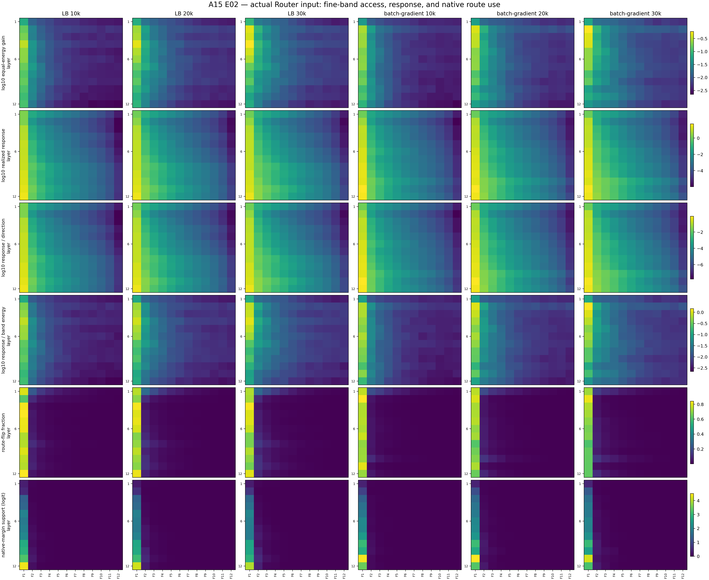
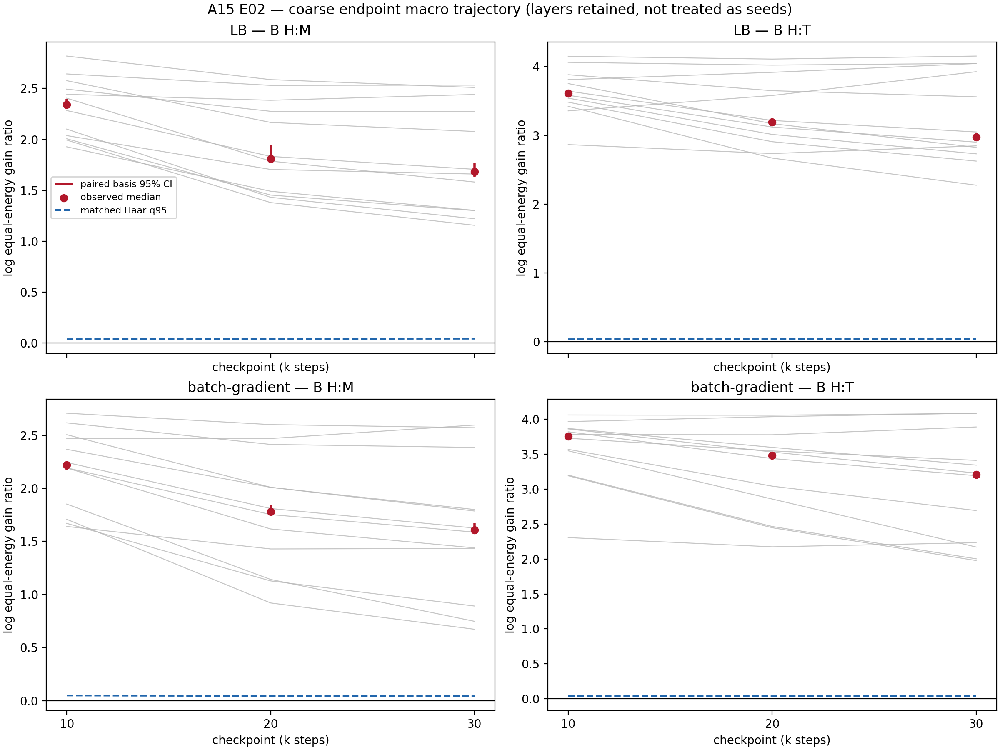
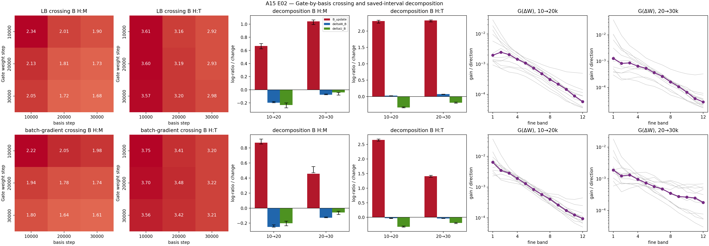

# Detailed: A15_00_E02 Early Head-Alignment Onset

Primary anchor: [A15_00](../../../../problem_anchors/15_linear_gate_spectral_training_bias/15_00_covariance_head_gate_alignment/15_00_covariance_head_gate_alignment_anchor.md)  
Protocol: [protocol.md](protocol.md)  
Summary: [summary.md](summary.md) / [summary_cn.md](summary_cn.md)

## 0. Quick Recap

**Purpose:** Move the Q1 audit window earlier and determine whether equal-energy
head alignment is already present at 10k, then separate 10k--30k Gate-weight
effects from representation-basis drift.

**Hypothesis:** Both LB and batch-gradient are head-aligned at 10k, and both
10k--20k and 20k--30k Gate-weight changes continue to strengthen head versus
middle and tail at fixed bases.

**Experiment logic:** Hook the representation directly entering each Gate,
fit its covariance basis on fixed calibration tokens, compute equal-energy
Gate gain at coarse and fine resolutions, and cross all three Gate weights
with all three representation bases. Compare endpoint and net-update
orientation with singular-value-preserving random directions.

**Conclusion:** Early endpoint hypothesis passes; progressive-strengthening
hypothesis fails. Both lineages are extremely head-aligned by 10k. From 10k
to 30k, both endpoint head:middle and head:tail ratios decline. Fixed-basis
Gate effects dilute H:M in both lineages; H:T is diluted in batch-gradient but
slightly strengthened in LB, where basis drift more than offsets it.

**Evidence:** All guards pass. At 10k, LB has $G_H/G_M=10.42$ and
$G_H/G_T=37.11$; batch-gradient has 9.19 and 42.73. Matched orientation-null
q95 is only 0.034--0.048 in log-ratio units. See
[the decision figure](figures/figure0_early_onset_decision.png),
[endpoint table](tables/endpoint_contrasts.csv), and
[trajectory table](tables/trajectory_decomposition.csv).

## 1. Terminology / Definitions

| Term | Plain meaning | Concrete object / computation | Unit or formula | Why it matters | Cannot prove |
| --- | --- | --- | --- | --- | --- |
| actual Gate input $r_\ell$ | representation the linear Gate actually receives | direct `mlp.gate` pre-input hook | activation | correct Q1 object | expert-input geometry |
| head $H$ | largest-covariance directions | eigen-ranks 1--64 | 64 directions | highest-variance group | semantic commonness |
| middle $M$ | intermediate-covariance directions | ranks 65--320 | 256 directions | comparison group | functional utility |
| tail $T$ | lowest-covariance directions | ranks 321--768 | 448 directions | comparison group | functional uselessness |
| fine band $F_j$ | consecutive covariance block | ranks $64(j-1)+1$ through $64j$ | 64 directions | detects within-group structure | task frequency |
| $G_A$ | Gate selectivity after equalizing direction energy | $\|C_EWU_A\|_F^2/d_A$ | logit²/activation²/direction | removes eigenvalue amplification | token use or utility |
| $B_{H:M},B_{H:T}$ | relative equal-energy head gain | $\log(G_H/G_M)$, $\log(G_H/G_T)$ | dimensionless log ratio | endpoint decision metric | onset time |
| $V_A^\perp$ | realized expert-relative logit response | $\mathbb E\|C_EWP_Ax\|^2$ | logit²/token | current total response | active preference after energy control |
| $S_A^\perp$ | response divided by band energy | $V_A^\perp/\mathbb E\|P_Ax\|^2$ | logit²/activation² | partial energy normalization | equal weighting within a wide band |
| $B^{update}$ | orientation of net saved Gate displacement | average $B(\Delta W,U_a)$ and $B(\Delta W,U_b)$ | log ratio | where net displacement points | endpoint strengthening |
| $\Delta_WB$ | fixed-basis Gate-weight effect | symmetric $W_a/W_b$ crossing difference | log-ratio change | strengthening versus dilution | per-step gradient cause |
| $\Delta_UB$ | fixed-Gate basis effect | symmetric $U_a/U_b$ crossing difference | log-ratio change | representation-drift rival | drift cause |
| route flip | top-1 expert changes after removing a band | token fraction | 0--1 | current route dependence | loss benefit |
| margin support | native top-1 margin removed with a band | mean logit difference | logit | current decision support | functional compatibility |

## 2. Anchor Link and Decision Point

E01 established head-dominant endpoints at 30k/40k/80k but found no
persistent fixed-basis strengthening across both contrasts. E02 uses the
earliest common existing checkpoints of two lineages to adjudicate one local
uncertainty: whether strong head alignment is already present by 10k and how
the next two saved intervals change it.

The parent Q1 distinction is preserved:

1. $V$ says how much raw response a band produces on actual tokens;
2. $G$ says how the Gate itself is oriented after equalizing direction energy;
3. $\Delta_WB$ says whether saved Gate-weight changes strengthen that relative
   orientation;
4. none of these says whether dispatching on the band improves training.

## 3. Protocol Compliance Audit

| Contract item | Actual execution | Verdict |
| --- | --- | --- |
| Approved before execution | Protocol status frozen as approved on 2026-07-30 | pass |
| Registered lineages | LB and batch-gradient only | pass |
| Registered checkpoints | 10k, 20k, 30k for both; no fallback | pass |
| Actual Gate input | direct Gate pre-input; relation and native replay checked in every layer | pass |
| Two resolutions | H/M/T plus F1--F12 | pass |
| Primary metrics | endpoint $B$, $B^{update}$, $\Delta_WB$, $\Delta_UB$ | pass |
| Complete crossing | all $W_s\times U_t$, $s,t\in\{10k,20k,30k\}$ | pass |
| Data pairing | same token tensors across all six endpoints and identical to E01 | pass |
| Bootstrap/null | 200 basis bootstraps, 2,000 document bootstraps, 256 orientation nulls | pass |
| Required controls | half split, same-dimension overlap null, wrong layer, expert-input basis, reconstruction | pass |
| Central figures/tables | decision, full-band, endpoint, decomposition figures and complete CSVs | pass |
| Pass/fail/insufficient rules | early-onset pass; progressive-strengthening fail; lineage-conditioned type | applied |
| Excluded work | no decommon, new training, Q2/Q3, graph, sync, commit, or push | respected |

## 4. Setup

### 4.1 Models and original training configurations

Both lineages are 12-layer, width-768, eight-expert, top-1 Qwen3 MoE models
with a linear Gate. Original training used DCLM, sequence length 1024, global
batch size 768 sequences, learning rate $10^{-4}$, and 1,000 warmup steps.

| Label | Relevant training condition | Important limitation |
| --- | --- | --- |
| LB | no Router-input centering; $\lambda_{LB}=0.01$ | differs from batch-gradient in both center and LB |
| batch-gradient | running input center; `router_center_grad_mode=batch_only`; decay base 0.99, scale 40; $\lambda_{LB}=0$ | training-time batch component affected both gradient and forward center |

The batch-gradient lineage is therefore a second real training lineage, not a
pure center-gradient causal ablation.

### 4.2 Checkpoints and provenance

| Lineage | Step | Nominal training tokens | Bytes | SHA-256 |
| --- | ---: | ---: | ---: | --- |
| LB | 10,000 | 7.86432B | 1,040,584,409 | `78d194f48326736918937416112c2b980c9773d4ac610b61262588ad612b9787` |
| LB | 20,000 | 15.72864B | 1,040,584,409 | `0a90a9b8022e176f257e1516fdf7d77661d9202f5b30a5650901fd0a0996cc24` |
| LB | 30,000 | 23.59296B | 1,040,584,409 | `308aedb0e49182cd482aac9f9a8197f303325b9b4b6ae6d65007052f9f02dd66` |
| batch-gradient | 10,000 | 7.86432B | 1,040,607,468 | `a72149c256c384bac9c4e562f5924f1705fd4a3583b8bd4c75c9b2c9a46584f3` |
| batch-gradient | 20,000 | 15.72864B | 1,040,607,468 | `505319114d0249372da9a9463ca8a736bae81979f388d3ce9d718a45af26f7f2` |
| batch-gradient | 30,000 | 23.59296B | 1,040,607,468 | `d742053359ec807e002a0188fdeb58b6d6a8704d52874ab8e82d1b97a0e3b6af` |

Nominal token counts use `global_batch_size × seq_len × global_step`; they are
included to prevent the 10k checkpoint from being described as initialization
or very early training.

All state files reported the requested global step, 12 Gate matrices of shape
`8×768`, expert IDs 0--7, and a constant coordinate signature within each
lineage. LB has no running-center buffers; batch-gradient has one in each
layer.

### 4.3 Data construction and split

| Role | Source and unit | Shape | SHA-256 |
| --- | --- | --- | --- |
| covariance calibration | DCLM training binary stream; 32 deterministic non-overlapping sequences | 32×256 | `4ab7d5015ab3da808843e4040288ce55fafef2ddf2587a98b6f8f45b4f65571d` |
| held-out evaluation | separate DCLM held-out shard; 64 source documents | 64×256 | `aa9873b87e5f181dddffcf498c53268ce86f893f843852e9d2bbc04e79401160` |

Selection seed is 20260730. The held-out source file SHA-256 is
`4c5ce60258943051758148653c448bb57724af7592cc9d3e9c053cc6f9e10323`;
the tokenizer JSON SHA-256 is
`aeb13307a71acd8fe81861d94ad54ab689df773318809eed3cbe794b4492dae4`.
The complete E02 token tensor has the same SHA-256 as E01.

Calibration tokens fit the mean, eigenvalues, and basis. Evaluation documents
compute $V$, $S$, route flips, margins, and document bootstrap intervals. No
evaluation token is used to select bands or fit bases.

### 4.4 Changed and held-fixed variables

**Changed:** training lineage and checkpoint step.

**Held fixed:** token IDs, masks and order; band ranks; actual-input hook;
expert-contrast centering; checkpoint loader; calibration and evaluation
sizes; bootstrap indices and seeds; orientation-null construction; aggregation
as median across eligible layers.

### 4.5 Execution environment

- host: `app-527825a6c39545639c7c70a32677976f-5cd6cd4747-gz7zf`
- Python 3.10.12
- PyTorch `2.3.0a0+6ddf5cf85e.nv24.04`
- Transformers 4.51.3
- two NVIDIA H100 80GB HBM3 GPUs; driver 580.95.05
- source-repository HEAD: `d8e4305ebe9864aca69bb58a805927abd940d784`
- E01/E02 worker files are untracked in the source repository; exact files and
  result manifests are retained in the paths below.

### 4.6 Known setup limitations

There is no checkpoint before 10k, no initialization measurement, and no
per-step gradient or optimizer update log. The audit has two training
lineages but not independent training seeds. Twelve layers are retained as
structured observations, not treated as independent seeds.

## 5. Metrics and Decision Rules

Let $C_E=I_E-\mathbf1\mathbf1^\top/E$ and $\bar W=C_EW$. For band $A$,

$$
G_A(W,U)=\frac1{d_A}\|\bar WU_A\|_F^2,
$$

$$
B_{H:M}=\log\frac{G_H+10^{-12}}{G_M+10^{-12}},\qquad
B_{H:T}=\log\frac{G_H+10^{-12}}{G_T+10^{-12}}.
$$

$\exp(B)$ is the equal-energy gain ratio. Endpoint support requires a paired
basis-bootstrap lower bound above zero and an observed model median above the
matched singular-value-preserving orientation-null q95. This is a statistical
distinguishability rule, not a practical-effect threshold.

For interval $a\to b$, $B^{update}$ is the mean spectral contrast of
$\Delta W=W_b-W_a$ in the endpoint bases. The fixed-basis Gate effect and
fixed-Gate basis effect are the symmetric crossing terms registered in the
Protocol. Positive $\Delta_WB$ means that replacing $W_a$ with $W_b$
strengthens relative head selectivity at fixed bases; negative means dilution.

Uncertainty and controls:

- 200 paired calibration-sequence basis bootstraps, seed 20260731;
- 2,000 paired held-out-document bootstraps, seed 20260731;
- 256 Haar-Stiefel right-orientation samples, seeds 20260730 for LB and
  20460730 for batch-gradient;
- 256 same-dimension projector-overlap null samples, seed 20460730;
- calibration half splits of 16 sequences each;
- simultaneous fine-band bootstrap/null envelope across F1--F12.

## 6. Main Results

### 6.1 Decision evidence: endpoint head alignment

| Lineage | Step | Contrast | Median $B$ | Gain ratio | 95% basis interval | Orientation-null q95 | Supported |
| --- | ---: | --- | ---: | ---: | ---: | ---: | --- |
| LB | 10k | H:M | 2.344 | 10.42 | [2.299, 2.395] | 0.037 | yes |
| LB | 10k | H:T | 3.614 | 37.11 | [3.575, 3.616] | 0.034 | yes |
| LB | 20k | H:M | 1.810 | 6.11 | [1.813, 1.943] | 0.041 | yes |
| LB | 20k | H:T | 3.194 | 24.38 | [3.174, 3.229] | 0.037 | yes |
| LB | 30k | H:M | 1.683 | 5.38 | [1.634, 1.766] | 0.043 | yes |
| LB | 30k | H:T | 2.976 | 19.60 | [2.931, 2.998] | 0.040 | yes |
| batch-gradient | 10k | H:M | 2.218 | 9.19 | [2.172, 2.244] | 0.048 | yes |
| batch-gradient | 10k | H:T | 3.755 | 42.73 | [3.713, 3.754] | 0.043 | yes |
| batch-gradient | 20k | H:M | 1.781 | 5.94 | [1.742, 1.843] | 0.044 | yes |
| batch-gradient | 20k | H:T | 3.485 | 32.62 | [3.451, 3.492] | 0.036 | yes |
| batch-gradient | 30k | H:M | 1.606 | 4.99 | [1.579, 1.669] | 0.041 | yes |
| batch-gradient | 30k | H:T | 3.211 | 24.80 | [3.182, 3.224] | 0.041 | yes |

Percentile basis intervals may be slightly bootstrap-biased relative to the
full-basis point estimate. This does not affect any endpoint decision because
all intervals and points are far from zero and the matched null.

### 6.2 Decision evidence: saved-interval decomposition

| Lineage | Interval | Contrast | $B^{update}$ | $\Delta_WB$ [95% interval] | $\Delta_UB$ [95% interval] | Reading |
| --- | --- | --- | ---: | ---: | ---: | --- |
| LB | 10→20k | H:M | 0.666 | -0.197 [-0.196, -0.179] | -0.232 [-0.275, -0.199] | $W$ and $U$ both dilute H:M |
| LB | 10→20k | H:T | 2.304 | +0.029 [0.021, 0.030] | -0.335 [-0.344, -0.315] | $W$ sharpens, $U$ more strongly dilutes |
| LB | 20→30k | H:M | 1.041 | -0.075 [-0.074, -0.065] | -0.040 [-0.080, -0.041] | $W$ and $U$ both dilute H:M |
| LB | 20→30k | H:T | 2.325 | +0.074 [0.067, 0.075] | -0.190 [-0.202, -0.169] | $W$ sharpens, $U$ more strongly dilutes |
| batch-gradient | 10→20k | H:M | 0.870 | -0.251 [-0.251, -0.221] | -0.201 [-0.235, -0.173] | $W$ and $U$ both dilute H:M |
| batch-gradient | 10→20k | H:T | 2.650 | -0.030 [-0.038, -0.024] | -0.323 [-0.332, -0.301] | $W$ and $U$ both dilute H:T |
| batch-gradient | 20→30k | H:M | 0.456 | -0.129 [-0.128, -0.117] | -0.059 [-0.084, -0.043] | $W$ and $U$ both dilute H:M |
| batch-gradient | 20→30k | H:T | 1.409 | -0.038 [-0.040, -0.033] | -0.190 [-0.212, -0.179] | $W$ and $U$ both dilute H:T |

Every $B^{update}$ has a positive basis interval and exceeds its matched null
q95 (0.039--0.056). The progressive hypothesis fails because $B^{update}$ is
not the registered strengthening metric. All fixed-basis effects above are
precise in sign.

### 6.3 Stage-level profile

The median endpoint $G_H$ is approximately stable from 10k to 30k, while
$G_M$ and $G_T$ increase:

| Lineage | Band | Median $G$ at 10k | Median $G$ at 30k |
| --- | --- | ---: | ---: |
| LB | H / M / T | 0.159 / 0.0159 / 0.00422 | 0.154 / 0.0308 / 0.00741 |
| batch-gradient | H / M / T | 0.188 / 0.0195 / 0.00454 | 0.192 / 0.0349 / 0.00787 |

This supports the plain-language description “middle/tail catch up” at the
joint endpoint. The crossing analysis is required to avoid assigning all of
that broadening to Gate weights: LB H:T broadening is driven by basis drift
despite a positive fixed-basis Gate effect.

At the fine resolution, F1 is strongest at every endpoint and F2 exceeds the
simultaneous orientation-null envelope. F3 is below that envelope at 10k but
above it at 30k in both lineages. No later fine-band peak reverses the overall
ordered decay.

### 6.4 Current native route use

| Lineage | Step | H flip | M flip | T flip |
| --- | ---: | ---: | ---: | ---: |
| LB | 10k | 0.797 | 0.079 | 0.009 |
| LB | 30k | 0.745 | 0.115 | 0.014 |
| batch-gradient | 10k | 0.743 | 0.056 | 0.008 |
| batch-gradient | 30k | 0.674 | 0.086 | 0.011 |

These medians show nonzero and growing middle/tail current dependence, while
head removal remains much more disruptive. They cannot establish loss benefit
or the quality of a middle/tail-only dispatch rule.

### 6.5 Control and debug evidence

- All 72 coarse model × step × layer cells are eligible under half-split sign
  reproduction and same-dimension overlap guards.
- Same-layer actual-input $B$ exceeds the next-layer-basis control by median
  1.47--2.21 log units for H:M and 2.93--3.57 for H:T, depending on lineage and
  step.
- It exceeds the expert-input-basis control by 0.96--1.64 for H:M and
  2.08--2.56 for H:T.
- Basis orthogonality relative errors are about $1.3$--$1.5\times10^{-6}$;
  rank coverage is 768 and eigenvalues are nonincreasing.
- Band-energy reconstruction errors are below the registered $10^{-5}$ guard.
  Within-group response cross terms are retained rather than assuming response
  additivity across fine bands.

## 7. Visualization Results

### 7.1 Early-onset decision view


**Purpose:** Put the two decision-bearing quantities side by side.  
**Setup:** Rows are lineages. Left panels show endpoint $B$ at 10k/20k/30k;
right panels show $\Delta_WB$ for the two intervals.  
**Metric/unit:** Dimensionless log equal-energy gain ratio and its change.  
**How to read:** Positive endpoint values above dashed null q95 establish head
alignment. Positive right-panel values mean further strengthening; negative
values mean dilution.  
**Observed:** All endpoints are strongly positive, but all H:M fixed-basis
effects are negative. Batch-gradient H:T is negative; LB H:T is positive.  
**Take-home:** Strong head alignment predates 10k, but is not progressively
strengthened from 10k to 30k.  
**Remaining uncertainty:** Onset and gradient dynamics before 10k.  
**Does not prove:** functional utility or pure batch-gradient causality.  
**Anchor implication:** close early endpoint question as pass and persistent
strengthening as fail.

### 7.2 Full fine-band access and use



**Purpose:** Deliver all registered fine bands for $G$, $V$, response per
direction, $S$, route flip, and margin support.  
**Setup:** Six endpoint columns, 12 layer rows, F1--F12 columns within each
heatmap.  
**How to read:** It is a localization/debug figure; compare the spectral shape
within each metric, not colors across separately normalized metric rows.  
**Observed:** F1 dominates throughout; F2 and then F3 gain relative access;
middle/tail effects are nonzero.  
**Take-home:** Q1 is not a binary head-versus-invisible-rest result.  
**Remaining uncertainty:** semantic or functional content of the bands.  
**Does not prove:** that redispatching with any band improves loss.

### 7.3 Coarse endpoint macro trajectory



**Purpose:** Show model medians, layer traces, basis intervals, and matched
nulls without hiding layer heterogeneity.  
**Observed:** Both contrasts decline at the model-median level in both
lineages, while every layer remains positive.  
**Take-home:** The endpoint stays head-dominant but becomes less exclusive.  
**Does not prove:** that the Gate weight alone caused the decline.

### 7.4 Gate-by-basis crossing and decomposition



**Purpose:** Separate Gate-weight and representation-basis contributions and
show the fine orientation of net displacement.  
**Setup:** Full $3\times3$ crossing, interval decomposition, and F1--F12
$G(\Delta W)$ profiles for each lineage.  
**Observed:** Net displacements are head-oriented, but fixed-basis effects do
not jointly strengthen both contrasts. Basis drift consistently lowers both
endpoint contrasts in this early window.  
**Take-home:** $B^{update}>0$ cannot be used as evidence of increasing endpoint
head selectivity.  
**Remaining uncertainty:** signed step-level $W$--update interactions before
the saved endpoints.  
**Does not prove:** optimizer or gradient causality.

All four PNGs were opened at original resolution after generation. The compact
decision figure has readable labels and non-clipped intervals. The full-band
and crossing figures are intentionally detailed and belong in this evidence
ledger, not the one-page knowledge update.

## 8. Stage Evidence and Failure Decomposition

| Stage | Evidence | Passed / failed / unclear | Failure reason | What this rules out |
| --- | --- | --- | --- | --- |
| S0 provenance | six hashes, steps, Gate shapes, center buffers, expert IDs | pass | none | wrong/mixed checkpoint |
| S1 data pairing | E01/E02 tensor hashes identical | pass | none | token-selection drift |
| S2 actual input | relation/replay errors 0, top-1 1.0 | pass | none | auditing expert input or wrong transform |
| S3 basis validity | reconstruction, rank, half split, overlap null | pass | none | unstable/invalid coarse basis |
| S4 endpoint onset | four 10k contrasts far above zero and orientation null | pass | none | energy-only/random Gate orientation |
| S5 net displacement | all $B^{update}$ supported | pass | none | spectrally flat net updates |
| S6 progressive fixed-basis strengthening | both contrasts positive in both intervals | fail | H:M negative everywhere; batch-gradient H:T negative | persistent 10k--30k head sharpening |
| S7 lineage agreement | exact H:T Gate effect | partial | LB positive, batch-gradient negative | universal early H:T update law |
| S8 functional effect | loss/compatibility under spectral dispatch | not tested | outside Protocol | nothing about utility |

**Falsified physical prior:** the stronger version of P2 in which ongoing
10k--30k optimization continuously increases both relative head contrasts.

**Not falsified:** high-variance directions may drive a rapid pre-10k
alignment; the earliest checkpoint is too late to observe its formation.

**Falsified mathematical reading:** using positive $B^{update}$ as a proxy for
positive endpoint $\Delta_WB$.

**Operationalization/implementation:** not falsified; all object and replay
guards pass.

**Remaining rivals:** pre-10k Gate-gradient alignment, pre-10k representation
co-adaptation, initialization-to-data coincidence not measured directly, and
training-objective differences between the two lineages.

## 9. Full Experiment Record

### 9.1 Code changes

The validated E01 worker was parameterized through `A15_EXPERIMENT=e02` while
preserving E01 as the default. E02 selects `runs/a15_00_e02`, steps
10k/20k/30k, and models LB/batch-gradient. The actual-input relation now uses
the registered model center mode rather than a model-name special case. The
combined analyzer received an E02-specific typed verdict and a compact
decision figure.

### 9.2 Reproduction commands

```bash
cd /data/250010109/Research_System/Projects/from-attention-to-search/XingyuD/MoE_Routing_Experiments/active/a15_00_router_band_response
PYTHONPATH=.deps:. pytest -q
A15_EXPERIMENT=e02 PYTHONPATH=.deps:. python endpoint.py prepare-data
A15_EXPERIMENT=e02 PYTHONPATH=.deps:. python endpoint.py preflight
A15_EXPERIMENT=e02 PYTHONPATH=.deps:. python endpoint.py smoke --model lb --step 10000 --device cuda:0
A15_EXPERIMENT=e02 PYTHONPATH=.deps:. python endpoint.py smoke --model batchgrad --step 10000 --device cuda:0
A15_EXPERIMENT=e02 PYTHONPATH=.deps:. python endpoint.py extract --model lb --step STEP --device cuda:0 --batch-size 4
A15_EXPERIMENT=e02 PYTHONPATH=.deps:. python endpoint.py extract --model batchgrad --step STEP --device cuda:0 --batch-size 4
A15_EXPERIMENT=e02 PYTHONPATH=.deps:. python analyze_model.py --model lb --device cuda:0 --bootstrap-batch-size 4 --null-batch-size 32
A15_EXPERIMENT=e02 PYTHONPATH=.deps:. python analyze_model.py --model batchgrad --device cuda:1 --bootstrap-batch-size 4 --null-batch-size 32
A15_EXPERIMENT=e02 PYTHONPATH=.deps:. python summarize_results.py --device cuda:0 --overlap-batch-size 4
```

Replace `STEP` with each of 10000, 20000, and 30000.

### 9.3 Execution evidence

- unit tests: 7/7 passed;
- smoke: both lineages passed, with relation/replay error 0 and top-1 1.0;
- endpoint extraction elapsed 27.9--35.1 seconds per checkpoint;
- per-lineage basis bootstrap elapsed 68.8--71.7 seconds;
- orientation null elapsed 1.51--1.55 seconds per lineage;
- raw plus analysis run root: approximately 1.1GB;
- final combined analysis status: pass; early-onset verdict: pass;
  progressive-strengthening verdict: fail.

Operational note: the first batch-gradient analysis attempt was interrupted
during layer-1 bootstrap after both analyzers were accidentally placed on
GPU0. It had produced no final bootstrap or null artifact. The lineage was
rerun cleanly on GPU1 before the combined summary. The first compact-figure
render used asymmetric `errorbar` lengths even though a percentile bootstrap
interval may not contain the full-basis point; plotting was corrected to
explicit interval lines. No metric or verdict changed.

## 10. Interpretation

There are three distinct conclusions.

First, head-dominant raw response is not merely caused by large covariance
energy. $G$ removes the eigenvalues, and the actual Gate orientation remains
orders of magnitude beyond matched random orientation by 10k. Same-layer
specificity further supports a learned or co-learned Gate–representation
alignment.

Second, “trained into the head” has a temporal boundary. The 10k state is
training-associated and non-random, but there is no empirical initialization
point. E02 supports “formed by or before 10k” rather than “we observed the
gradient form it.” Since 10k is about 7.86B nominal tokens, this is still a
wide interval.

Third, the dynamics after 10k broaden rather than sharpen the endpoint
spectral profile. Middle access increases relative to head in both Gate
weights and bases. Tail behavior is partly objective/lineage dependent: the
batch-gradient Gate broadens toward tail, while the LB Gate weight slightly
sharpens against tail and the representation basis drives the endpoint in the
opposite direction.

## 11. Claim Boundary

**Supported:**

- actual-input equal-energy head alignment is already strong at 10k in LB and
  batch-gradient;
- alignment exceeds a singular-value-matched orientation null and is
  layer-specific;
- middle/tail access and current route effects are nonzero;
- 10k--30k endpoint head ratios decline;
- fixed-basis Gate-weight changes dilute H:M in both lineages, with
  lineage-conditioned H:T behavior;
- representation-basis drift lowers both endpoint contrasts in this window.

**Cannot claim:**

- exact onset before 10k or during warmup;
- a measured per-step covariance-gradient mechanism;
- that `batch_only` alone caused the cross-lineage difference;
- that linear Gates are expressively unable to use middle/tail;
- that middle/tail dispatch helps or harms held-out loss;
- functional compatibility, expert formation, or loss/FLOP improvement;
- universality beyond these two lineages and one training seed each.

## 12. Next Decision

**Exactly one decision:** authorize or reject A15_00_E03, a dense online Q1
dynamics run from initialization through at most 2B tokens.

If authorized, completion requires time-resolved logging of:

- $W_t$ and the actual optimizer-applied $\Delta W_t$;
- raw Gate gradients before optimizer preconditioning;
- actual Gate-input covariance bases on a fixed probe buffer;
- endpoint $B_t$, $B^{update}$, $\Delta_WB$, $\Delta_UB$, and signed
  $W_t$--$\Delta W_t$ band cross terms;
- margin, route flip, expert load, and center state.

The run succeeds as a Q1 dynamics audit only if it locates whether the large
head contrast forms during warmup, immediately after warmup, or later, and
separates raw-gradient, optimizer, and representation contributions. It does
not test Q2 functional utility.

## 13. Links and Artifact Map

- anchor: [A15_00](../../../../problem_anchors/15_linear_gate_spectral_training_bias/15_00_covariance_head_gate_alignment/15_00_covariance_head_gate_alignment_anchor.md)
- protocol: [protocol.md](protocol.md)
- summary: [summary.md](summary.md)
- Chinese reading path: [summary_cn.md](summary_cn.md)
- code workspace: `/data/250010109/Research_System/Projects/from-attention-to-search/XingyuD/MoE_Routing_Experiments/active/a15_00_router_band_response`
- run root: `runs/a15_00_e02`
- raw endpoints: `runs/a15_00_e02/raw/{lb,batchgrad}_{10000,20000,30000}`
- checkpoint manifest: `runs/a15_00_e02/checkpoint_manifest.json`
- data manifest: `runs/a15_00_e02/data/data_manifest.json`
- combined analysis manifest: `runs/a15_00_e02/analysis/analysis_manifest.json`
- typed verdict: [tables/verdict.json](tables/verdict.json)
- endpoint table: [tables/endpoint_contrasts.csv](tables/endpoint_contrasts.csv)
- trajectory table: [tables/trajectory_decomposition.csv](tables/trajectory_decomposition.csv)
- fine profile: [tables/fine_profile_summary.csv](tables/fine_profile_summary.csv)
- controls: [tables/control_contrast_summary.csv](tables/control_contrast_summary.csv)
- basis audit: [tables/basis_reconstruction.csv](tables/basis_reconstruction.csv)
- response reconstruction: [tables/response_cross_terms.csv](tables/response_cross_terms.csv)
- figure directory: [figures/](figures/)
- local job ID: none; direct container execution

