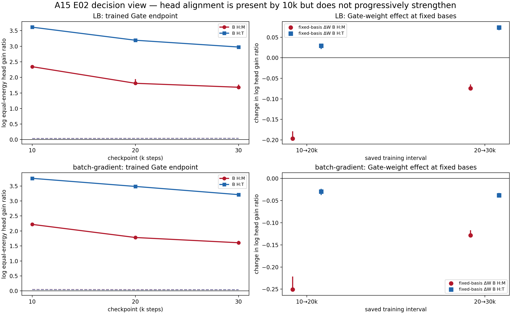

# 结果摘要：线性 Gate 的 head 偏置在何时形成

主 anchor：[A15_00](../../../../problem_anchors/15_linear_gate_spectral_training_bias/15_00_covariance_head_gate_alignment/15_00_covariance_head_gate_alignment_anchor_cn.md)  
Protocol：[已批准中文 Protocol](protocol_cn.md)  
完整证据账本：[detailed.md](detailed.md)

## 结论

**最早可用的 10k checkpoint 已经极强地偏向 head。** 我们用“给每个方向相同
输入能量后，Gate 能制造多少专家相对 logit 差异”来去掉大奇异值/大方差的
机械放大。此时 LB 的 head 增益是 middle 的 10.42 倍、tail 的 37.11 倍；
batch-gradient 分别是 9.19 倍和 42.73 倍。四个对比的 paired basis bootstrap
下界都高于零，并远超保持 Gate 奇异值不变、只随机旋转方向所得的 q95
（0.034--0.048）。错误层基底和专家输入基底也不能复现这种强对齐。因此
10k 的结果不是“head 输入能量大，所以 raw logit 大”或任意 Gate 方向造成的。

**“10k 到 30k 还在把 Gate 持续训得更偏 head”的强命题失败。** 到 30k，
LB 的 head:middle/head:tail 等能增益倍数降为 5.38/19.60；batch-gradient 降为
4.99/24.80。固定表征基底后，两条谱系、两个区间的 Gate 权重变化都精确降低
head:middle 对比。对 head:tail，batch-gradient 两段也降低；LB 两段略增强，
但表征基底漂移的反向作用更大，所以 LB endpoint 的 head:tail 仍然下降。

我们对 Q1 的认识应更新为：

> **Router–表征系统在首个保存点之前就已经形成很强、非随机的 head 对齐；
> 10k--30k 仍然 head-dominant，但不是越来越只看 head，而是 middle/tail 在
> 追赶。Gate 权重层面的共同趋势是向 middle 扩展；是否向 tail 扩展依赖训练
> 谱系。**

这不与“净更新本身仍偏 head”矛盾。$B^{update}$ 问的是“若把净更新单独当作
一个 Gate，它朝哪里”；$\Delta_WB$ 问的是“把更新加到一个已经更偏 head 的
Gate 后，相对 head 比值是否继续上升”。回答训练是否持续强化时只能用后者。

10k 按原训练配置名义上已约等于 7.86B tokens。因此本实验只能把形成时间压缩
到 **10k / 约 7.86B tokens 之前**，不能定位具体 step，也不能证明是 Gate
gradient 单独造成，而不是 10k 前 Router 权重与表征共同适配。

## 决定性图

左列是训练后 Gate 的 endpoint：虚线是保持奇异值的随机方向 q95。右列固定
表征基底，只看 Gate 权重变化；大于零才表示继续增强相对 head 偏好，小于零
表示稀释。

| 谱系 | 10k $G_H/G_M$ | 10k $G_H/G_T$ | 30k $G_H/G_M$ | 30k $G_H/G_T$ | $\Delta_WB_{H:M}$，10→20 / 20→30 | $\Delta_WB_{H:T}$，10→20 / 20→30 | 分型 |
| --- | ---: | ---: | ---: | ---: | ---: | ---: | --- |
| LB | 10.42 | 37.11 | 5.38 | 19.60 | -0.197 / -0.075 | +0.029 / +0.074 | 10k 前形成；向 middle 扩展；tail 效应混合 |
| batch-gradient | 9.19 | 42.73 | 4.99 | 24.80 | -0.251 / -0.129 | -0.030 / -0.038 | 10k 前形成；两个相对对比都稀释 |

表中所有固定基底效应的 95% 区间都完整位于所示方向。完整区间见
[trajectory table](tables/trajectory_decomposition.csv)，endpoint 与 null 见
[endpoint table](tables/endpoint_contrasts.csv)。

## Router 是否能看见 middle/tail

能，但当前使用远弱于 head，而且 10k--30k 在相对增加：

| 谱系 | step | 去除 H / M / T 后的逐层 route-flip 中位数 |
| --- | ---: | ---: |
| LB | 10k | 0.797 / 0.079 / 0.009 |
| LB | 30k | 0.745 / 0.115 / 0.014 |
| batch-gradient | 10k | 0.743 / 0.056 / 0.008 |
| batch-gradient | 30k | 0.674 / 0.086 / 0.011 |

所以不能说“线性 Router 只看 head”或“表达上看不见 middle/tail”。更准确的
话是：“10k 已高度 head-dominant；middle/tail 非零，并在 30k 前获得更多相对
访问和当前路由影响。”route flip 仍是冻结静态诊断，不能说明用 middle/tail
分发会改善 loss。

细粒度也不是简单 head/rest：F1 始终最强，F2 在全部 endpoint 超过 simultaneous
方向 null；到 30k，两个谱系的 F3 也越过该 envelope。更深频带保持较弱但非零。
见[完整十二带表](tables/fine_profile_summary.csv)和
[完整频带图](figures/figure1_endpoint_full_band_access_use.png)。

## 护栏与边界

- 六个 checkpoint 的 provenance、坐标、12 个 `8×768` Gate 和 expert 顺序
  全部通过。
- 与 E01 使用完全相同 hash 的 32×256 calibration tokens 和 64×256 held-out
  tokens。
- 六个 endpoint、12 层的实际 Gate 输入关系误差和 native logit replay 误差
  均为 0，top-1 agreement 为 1.0。
- coarse half-split basis stability、基底/能量重建全部通过。
- 保持 Gate 奇异值的 null 最大相对奇异值误差为 $2.33\times10^{-6}$。
- 完整计算了 $3\times3$ Gate 权重 × 表征基底 crossing，表征漂移没有被误写
  成 Gate 训练。
- batch-gradient 不是只改变梯度的纯因果对照：训练时可微 batch center 也进入
  forward center。因此两谱系差异不能单独归因于 center 是否接收梯度。

E02 能证明 10k 时的实际输入等能 head alignment，以及 10k--30k 保存区间内
相对偏好的变化；不能证明 10k 前精确形成点、逐步 gradient dynamics、covariance
因果机制、middle/tail 功能效用或 loss/FLOP 收益。

## 唯一下一决策

**是否批准 Q1-E03：从初始化到最多 2B tokens 的密集在线动力学训练？** 完成
标准是：时间分辨地把 endpoint $B_t$ 分解到 raw Gate gradient、optimizer 实际
update、固定 probe 上的 $U_t$、有符号 $W_t$--$\Delta W_t$ 频带交叉项，并同步
记录 margin、flip 和 load，从而判断 head alignment 是在 warmup 内形成还是更晚。

