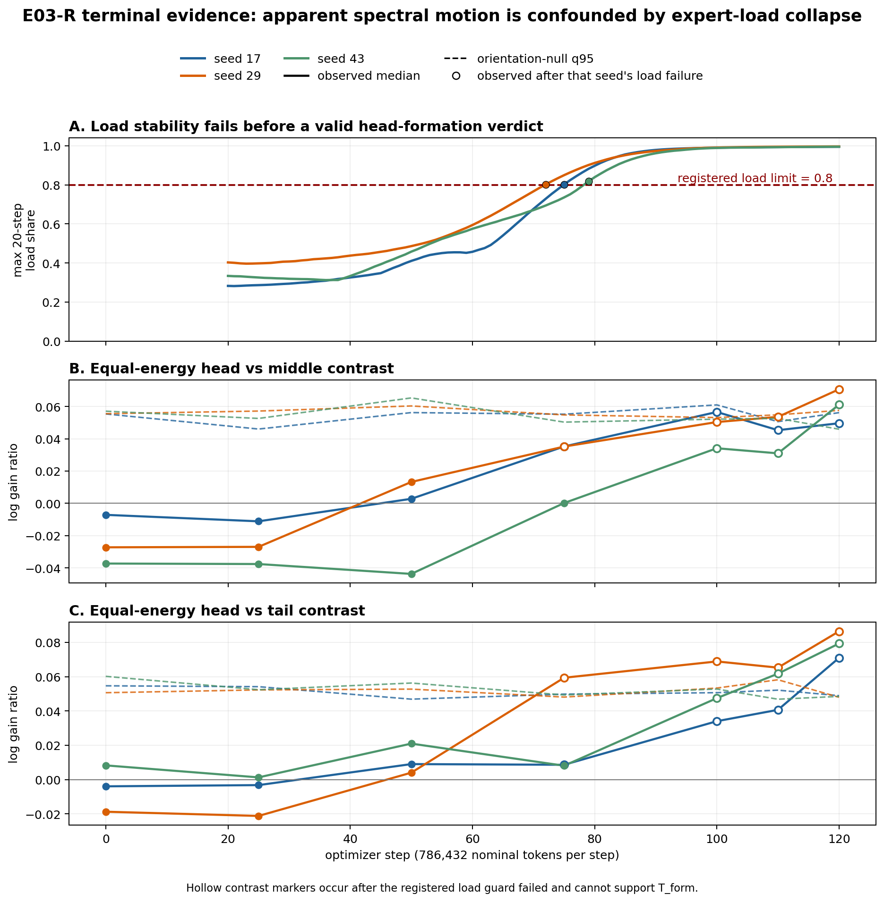

# Summary: A15_00_E03_R Real Early Spectral Learning Dynamics

Primary anchor: [A15_00_01 spectral learning dynamics](../../../../problem_anchors/15_linear_gate_spectral_training_bias/15_00_covariance_head_gate_alignment/subanchors/15_00_01_spectral_learning_dynamics_anchor.md)  
Protocol: [approved E03-R protocol](protocol.md)  
Detailed record: [detailed.md](detailed.md)

## Result Snapshot

**Verdict:** scientific **INSUFFICIENT — `insufficient_load_guard`**.

**What we established:** the registered auxiliary-loss-free score bias did not
keep real top-1 DCLM routing stable. In all three seeds, a single expert's share
of one layer's 20-step routing load crossed the pre-registered 0.8 limit by
steps 72--79 and approached 0.99 by step 100. This occurred before a valid
persistent head-formation time could be established.

**What the experiment shows:** the actual-input spectral and optimizer
diagnostics worked, but the training condition failed its load prerequisite.
Some head contrasts rose after the collapse; those observations are confounded
by near-single-expert routing and cannot be called head formation. This result
does not contradict E03-S's controlled covariance-speed result.

**What we do next:** decide whether to approve a new E03-R Protocol with a
separately validated load-stability mechanism. The current runs remain stopped
and cannot be resumed as valid evidence under a changed rule.

## Purpose

E03-R asks whether a real six-layer DCLM MoE develops an early equal-energy
covariance-head alignment signature, and whether Gate-weight motion can be
separated from representation-basis motion. It is a real-workload transfer
test of the E03-S mechanism, not a new Router or training-efficiency test.

## Terminology / Definitions

| Term | Plain meaning | Concrete object / computation | Unit or formula | Why it matters | Cannot prove |
| --- | --- | --- | --- | --- | --- |
| Actual Router input | Tensor truly seen by the Gate | post-attention RMS-normalized activation passed directly to `mlp.gate` | activation vector | Avoids substituting expert input for Gate input | Functional usefulness |
| Equal-energy head contrast | Gate preference after removing input-energy scale | median across six layers of $\log(G_H/G_M)$ or $\log(G_H/G_T)$, where $G_B=\|C_EWU_B\|_F^2/d_B$ | dimensionless log ratio | Tests directional selectivity rather than raw variance amplification | Causal covariance effect by itself |
| Orientation null q95 | Contrast expected from the same Gate singular values with a random right subspace | 256 Haar-Stiefel rotations per seed and step | 95th percentile of log ratio | Controls random direction alignment | Stable training or expert function |
| 20-step maximum load share | Largest fraction of routed tokens received by one expert in any layer over 20 consecutive updates | aggregate expert counts, normalize within layer, then take the maximum | fraction in $[0,1]$ | Validity guard against routing collapse | Expert quality |
| Load collapse | Registered invalid routing state | maximum share $>0.8$ or at least four dead experts in one 20-step layer window | Boolean guard | Prevents interpreting a near-single-expert trajectory as normal MoE dynamics | Why collapse occurred |
| $T_{form}$ | First persistent valid head-formation time | both contrasts above null q95, both paired-bootstrap lower bounds positive, at least four positive layers, persistent for three heavy snapshots | nominal training tokens | Primary real-run timing metric | Unique cause of formation |
| Spectral-state snapshot | Analysis state at a heavy step | Gate weights, bases, calibration inputs, routing replays, hashes | saved artifact | Supports crossing and null analysis | Resume of training |

## Exact Setup

- **Data/model:** DCLM; six decoder layers; hidden size 768; eight sparse plus
  one shared expert per layer; top-1 routing; actual post-attention RMSNorm Gate
  input.
- **Objective:** LM cross entropy only, `lambda_lb=0`; non-gradient shared
  expert-score bias updated once per optimizer step.
- **Training:** sequence length 1024, global batch 768, 786,432 nominal tokens
  per optimizer step, AdamW, 1,000-step warmup, registered endpoint step 2,544.
- **Seeds:** 17, 29, and 43, each in an independent one-node 8×RTX-5090 SPOT
  ACP job.
- **Frozen source:** all seeds used SHA
  `02400ef6d5ba30d89d736ba0e1c23b18fb3228e46d5822d7ee9a7be3b330fe13`,
  verified before submission and inside every worker.
- **Held fixed:** model, data-order rule, splits and token hashes, optimizer,
  bias rule, heavy-step grid, null, bootstrap, crossing, and analyzer.
- **Termination:** fail-closed stop after the load violation was audited;
  complete heavy artifacts through step 120 and step records through 130--132
  remain.
- **Known limitation:** no model/optimizer checkpoint exists because the first
  registered checkpoint was step 250. The retained spectral states are analysis
  snapshots, not resumable training checkpoints.

Worker execution record: [full_run_record.md](../../../../../XingyuD/MoE_Routing_Experiments/active/a15_e03_r_real_dynamics/full_run_record.md).

## Primary Metric And Decision

$T_{form}$ was eligible only while every engineering guard remained valid. The
load guard required every 20-step layer window to have maximum expert share at
most 0.8 and fewer than four dead experts. A historical violating window makes
the run scientifically insufficient even if later spectral contrasts rise,
because the approved condition is no longer the intended multi-expert learning
trajectory.

The false-positive cost is high: calling post-collapse alignment “formation”
would confuse a near-single-expert routing state with normal Router--Expert
co-learning. Therefore load validity takes precedence over contrast crossing.

## Key Evidence

| Seed | First failing 20-step window | Share at first failure | Window 81--100 maximum | Step-100 snapshot maximum | Last step / heavy | Verdict |
| ---: | --- | ---: | ---: | ---: | --- | --- |
| 17 | 56--75 | 0.80208 | 0.99045 | 0.97565 | 131 / 120 | insufficient |
| 29 | 53--72 | 0.80246 | 0.99110 | 0.98730 | 130 / 120 | insufficient |
| 43 | 60--79 | 0.81781 | 0.98916 | 0.97913 | 132 / 120 | insufficient |

No dead-expert threshold was crossed; the failure was concentration rather
than four experts receiving exactly zero tokens. By step 120, the rolling
maximum shares were 0.99526, 0.99699, and 0.99562.

Before failure, none of the selected step-0/25/50 observations exceeded both
orientation-null q95 values. At step 120, seeds 29 and 43 became preliminary
orientation candidates, but only after their load guards had failed. They were
not eligible for paired-basis bootstrap or $T_{form}$.

Full selected-point table:
[e03_r_terminal_selected_points.csv](tables/e03_r_terminal_selected_points.csv).

## Key Figure

### Load collapse precedes any interpretable head-formation verdict

**Anchor question:** does the real DCLM run show a valid early equal-energy
head-alignment signature homologous to E03-S?

**Protocol question:** do both head contrasts exceed their matched orientation
null while routing remains load-stable and the crossing persists?

**Metric shown:** the top panel is the maximum expert share in each trailing
20-step layer window. The lower panels show median log head/middle and
head/tail equal-energy gain ratios against the corresponding orientation-null
q95.

**Unit and aggregation:** load is a fraction; contrast is a dimensionless log
ratio. Solid colored lines are observed six-layer medians, dashed lines are
the seed/step-matched q95, and hollow observations occur after that seed's
first load failure.

**Data source:** per-step counts and heavy spectral states from the three
frozen full runs; selected nulls use 256 float64 Haar-Stiefel samples while
preserving centered-Gate singular values.

**How to read:** a valid formation candidate must remain below the red 0.8
load limit and place both observed contrast curves above their dashed null
curves. Hollow contrast markers are descriptive only.

**Expected if supported:** stable load and a persistent two-contrast crossing.
**Expected if weakened or incomplete:** load failure before crossing, or a
crossing that appears only after the trajectory becomes invalid.

**Observed result:** every seed crossed the load limit by step 79. No selected
pre-failure point was a two-contrast candidate; the step-120 candidates in
seeds 29 and 43 occurred after near-total load concentration.

**Allowed claim:** the approved E03-R condition is insufficient because its
load-stability prerequisite failed before a valid $T_{form}$.

**Does not prove:** absence of real head formation under a stable load rule,
failure of the controlled covariance-speed mechanism, middle/tail uselessness,
or any training-efficiency effect.

**Anchor implication:** keep E03-S's controlled result; leave real DCLM
transfer unresolved and require a new load-stability decision before rerun.

## Claim Boundary

**Can claim:** the registered no-load-balance, score-bias condition collapsed
in all three seeds and cannot answer the real-trajectory question. The
diagnostic chain itself passed its replay, basis, source, update-identity,
capacity, and analysis-closure checks.

**Cannot claim:** that covariance does or does not cause head alignment in a
stable real MoE; that the rising post-collapse contrasts are formation; that
E03-S is falsified; that middle/tail lack function; or that any Router variant
improves loss per FLOP.

## Next Decision

Decide whether to approve a new E03-R Protocol with a separately validated
load-stability mechanism. Its load rule, bias intervention, and attribution
boundary must be fixed before any new full run.
