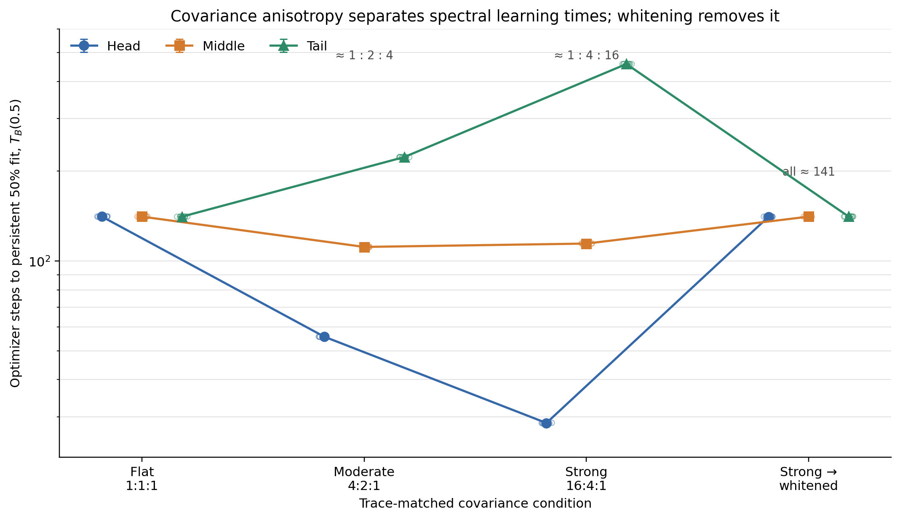

# Summary: A15_00_E03_S Controlled Spectral Learning Dynamics

Primary anchor: [A15_00_01 spectral learning dynamics](../../../../problem_anchors/15_linear_gate_spectral_training_bias/15_00_covariance_head_gate_alignment/subanchors/15_00_01_spectral_learning_dynamics_anchor.md)  
Protocol: [approved E03-S protocol](protocol.md)  
Detailed record: [detailed.md](detailed.md)

## Result Snapshot

**Verdict:** scientific **PASS** for the registered controlled S0/S1 question.
S2 is eligible under the Protocol but was not launched.

**What we established:** when expert-score targets are matched across spectral
directions, changing only the trace-normalized covariance spectrum causes a
corresponding change in how quickly a linear Gate learns each direction. A
4:2:1 spectrum produced approximately 1:2:4 head/middle/tail learning times;
a 16:4:1 spectrum produced approximately 1:4:16 times. Whitening the strong
spectrum returned all three times to the flat-spectrum range.

**What the experiment shows:** under the registered fixed-basis Gaussian
construction and pure SGD, covariance eigenvalues are a causal finite-time
learning-speed multiplier, not merely a source of larger raw logits. Tail-only
targets were learnable, so the slower tail was not an expressibility failure.

**What we do next:** decide whether to authorize the already registered S2
frozen-versus-trainable expert comparison. That stage would test additional
expert feedback; it is not implied by the S1 result and remains unexecuted.

## Purpose

E03-S asks one root-cause question: with direction-matched expert advantage,
does covariance anisotropy itself make high-variance linear-Gate modes learn
faster? It is not a Router-method or training-efficiency experiment.

## Terminology / Definitions

| Term | Plain meaning | Concrete object / computation | Unit or formula | Why it matters | Cannot prove |
| --- | --- | --- | --- | --- | --- |
| $A_{raw}$ | Direction-matched expert-score coefficient | expert-centered matrix with equal spectral-column norms | score / activation | Holds target signal constant across directions | Real expert utility |
| $A_{gate}$ | Reachable linear-Gate target | $A_{gate}=0.25A_{raw}$ | logit / activation | Makes the fit metric match the softmax target | DCLM mechanism |
| Fit fraction $F_B(t)$ | Fraction of initial target error removed in band $B$ | $1-\| (W_t-A_{gate})U_B\|_F^2/\|(W_0-A_{gate})U_B\|_F^2$ | fraction | Compares equal target progress across bands | Held-out task benefit |
| Learning time $T_B(0.5)$ | First interpolated step reaching 50% fit and staying there for two evaluations | optimizer step | Primary speed quantity | Final performance |
| Log-time contrast $D_{M:H}$ | Relative middle versus head learning time | $\log T_M-\log T_H$ | dimensionless | Positive means middle learns more slowly | Functional importance |
| Rotation null | Directional differences expected under a flat spectrum | 256 Haar partitions per seed; 2,048 total | distribution of $D$ | Controls finite-sample directional asymmetry | Real-workload transfer |
| Whitening | Removes covariance anisotropy before the Gate | map learned weight back to the original spectral coordinates before computing fit | transformation | Tests whether the timing order is caused by covariance | General optimizer invariance |

## Exact Setup

- **Data:** $x=U\Lambda^{1/2}s$, $s\sim\mathcal N(0,I)$, one fixed Haar basis
  per seed; independent training, trajectory-evaluation, and final-held-out
  streams.
- **Gate and objective:** `Linear(768, 8, bias=False)` learns
  $q(x)=\operatorname{softmax}(A_{gate}x)$ by soft-label cross entropy.
- **Optimizer:** pure SGD, learning rate 0.02, batch size 4096, no momentum and
  no weight decay.
- **Bands:** head ranks 1--64, middle 65--320, tail 321--768; twelve additional
  64-direction fine bands were logged.
- **Conditions:** flat 1:1:1, moderate 4:2:1, strong 16:4:1,
  strong-whitened, and strong-tail-only.
- **Budget:** eight registered seeds `20260730`--`20260737`; 8,000 steps and
  193 evaluation points per condition; 256 flat rotations per seed.
- **Execution:** ACP job `om-zn7r7i23`, single idle 8×RTX-5090 node,
  `SUCCEEDED`, zero retries.
- **Held fixed:** $A_{raw}$, $A_{gate}$, basis, initialization, latent streams,
  trace, optimizer, batch, evaluation schedule, and analysis.
- **Known limitation:** fixed synthetic representations and pure SGD omit
  representation drift, AdamW, sparse top-1 feedback, and real expert formation.

## Primary Metric And Decision

The primary metrics are

$$
D_{M:H}=\log T_M(0.5)-\log T_H(0.5),\qquad
D_{T:H}=\log T_T(0.5)-\log T_H(0.5).
$$

Moderate and strong medians must exceed the matched flat-rotation q95;
strong-minus-moderate must have a positive exact paired sign interval;
strong-whitened must return inside the flat 95% envelope; and tail-only must
reduce independent held-out KL by at least 50% for every seed. These rules
jointly separate covariance speed, finite-sample asymmetry, target direction,
and tail inexpressibility.

## Key Evidence

| Condition / gate | Median $T_H$ | Median $T_M$ | Median $T_T$ | Median $D_{M:H}$ | Median $D_{T:H}$ | Verdict |
| --- | ---: | ---: | ---: | ---: | ---: | --- |
| Flat 1:1:1 | 140.82 | 140.83 | 140.80 | near 0 | near 0 | equal-time control |
| Moderate 4:2:1 | 55.76 | 111.46 | 223.01 | 0.69268 | 1.38588 | both above null q95 |
| Strong 16:4:1 | 28.63 | 114.38 | 457.39 | 1.38477 | 2.77145 | both above null q95 |
| Strong-whitened | 140.78 | 140.82 | 140.88 | 0.000053 | 0.000637 | inside flat envelope |
| Strong tail-only | -- | -- | 451.66 | -- | -- | capability passed |

Supporting gates:

- pooled rotation-null q95: 0.003277 for middle/head and 0.003019 for tail/head;
- strong-minus-moderate exact paired interval lower bounds: 0.69058 and 1.38299;
- minimum tail-only held-out KL reduction: 0.9999939 against the 0.5 gate;
- all implementation, crossing, source-hash, and artifact guards passed.

Machine-readable table: [full_primary_results.csv](tables/full_primary_results.csv).

## Key Figure

### Covariance anisotropy separates learning times; whitening removes it

**Anchor question:** does covariance anisotropy causally shorten high-variance
linear-Gate mode learning time when target signal is matched?

**Protocol question:** do moderate and strong spectra separate
$T_H,T_M,T_T$, with a stronger dose response, while whitening returns them to
the flat control?

**Metric shown:** $T_B(0.5)$, the first interpolated optimizer step reaching
and maintaining 50% target fit for two further registered evaluations.

**Unit and aggregation:** optimizer steps on a log axis; open points are eight
seeds, filled symbols are medians, and bars show the observed seed range.

**Data source:** the five full S1 condition records under
[the full result directory](../../../../../XingyuD/MoE_Routing_Experiments/active/a15_e03_s_controlled_dynamics/runs/a15-e03s-5090x8-full-20260730T175200Z/).

**How to read:** vertical separation within one condition means different
spectral bands need different update counts to fit the same fraction of their
own matched target.

**Expected if supported:** flat times overlap; anisotropic times separate in
the inverse eigenvalue order; a larger spectral gap yields larger separation;
whitening removes it. **Expected if weakened:** persistent separation under
flat/whitened inputs or no dose response.

**Observed result:** all four registered patterns occurred. Moderate was about
1:2:4, strong about 1:4:16, and whitening returned all bands to about 141
steps.

**Allowed claim:** covariance anisotropy causally changes finite-time
mode-learning speed in this registered controlled Gate system.

**Does not prove:** real DCLM head alignment, AdamW equivalence, expert
positive feedback, functional value of any band, or validation loss per FLOP.

**Anchor implication:** the controlled covariance-speed clause passes; the
real-workload signature and joint-expert feedback remain separate questions.

## Claim Boundary

**Can claim:** for a fixed linear Gate, matched Gate-space target, Gaussian
fixed representation, pure SGD, and registered spectra, higher covariance
eigenvalues shorten the finite time needed to learn the corresponding modes.
The flat, whitening, rotation-null, dose, and tail-capability controls all
support that causal reading.

**Cannot claim:** every trained Router must align with covariance head; this
mechanism caused the existing DCLM checkpoints; middle/tail are functionally
useless; trainable experts reinforce the bias; or spectral routing improves
training efficiency. S2 and E03-R are required for the two closest extensions.

## Next Decision

Decide whether to authorize the registered S2 frozen-versus-trainable expert
stage. Its sole role is to test additional expert feedback; `s2_eligible=true`
and `s2_launched=false` are both independently audited.

