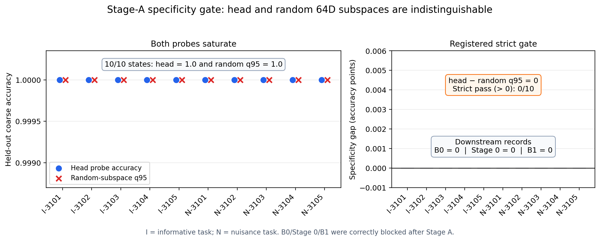

# Detailed: A15_01_01_E01 Controlled Four-Layer Shallow-Head Pilot

Primary anchor: [A15_01_01 controlled four-layer shallow-head pilot](../../../../problem_anchors/15_linear_gate_spectral_training_bias/15_01_shallow_head_guided_deep_routing/subanchors/15_01_01_controlled_four_layer_shallow_head_pilot_anchor.md)  
Protocol: [protocol.md](protocol.md)  
Summary: [summary.md](summary.md)

## 0. Quick Recap

**Question:** can the registered Stage-A probe establish that the intended
shallow coarse signal is specifically concentrated in the layer-2 covariance
head, rather than merely recoverable from any sufficiently wide linear view?

**Direct result:** no. Across five seeds and two tasks, head-probe accuracy was
1.0 and the 256-random-subspace q95 was also 1.0 in every task-seed state. The
strict registered specificity gap was zero in 10/10 states, so the formal run
terminated with `insufficient_stage_a_capability`.

**Updated interpretation:** the Stage-A target/probe combination is saturated
and cannot identify head-specific capture. This is an operationalization
failure, not a negative result for shallow-head compatibility or training.

**Downstream evidence:** none. B0, Stage 0 compatibility, and B1 each have zero
records because the fail-closed gate correctly blocked them.

**Evidence chain:** invalid smoke `om-7c8jvl98`; repaired valid smoke
`om-9xae345b`; formal full `om-demeqowk`.

## 1. Terminology And Definitions

| Term | Plain meaning | Concrete computation | Unit | Decision role | Cannot prove |
| --- | --- | --- | --- | --- | --- |
| Stage A | Two-layer proxy pretraining and basis calibration before the four-layer comparison | Learn coarse identity and preserve content; fit layer-2 covariance basis on independent actual Gate inputs | stage | Validates the proposed side feature before treatment | Compatibility or training benefit |
| Head | Highest-variance covariance directions | Ranks 1--64 of the calibrated layer-2 Gate-input covariance basis | 64D subspace | Proposed shallow side information | Unique function |
| Head probe | Linear coarse decoder fitted on head coefficients | Held-out fraction of correct coarse predictions | accuracy in [0,1] | Tests accessibility from head | Concentration without a control |
| Random q95 | High random-control baseline | 95th percentile of test accuracy across 256 frozen Haar-random 64D probes | accuracy in [0,1] | Controls dimension and generic access | Functional compatibility |
| Specificity gap | Head advantage over random q95 | $D_s=\operatorname{Acc}_{H,s}-Q_{0.95}(\operatorname{Acc}_{R64,s})$ | accuracy points | Registered strict Stage-A gate, $D_s>0$ | Causality or downstream utility |
| Content explained variance | How much content variation the Stage-A representation preserves | $1-\mathrm{SSE}/\mathrm{SST}$ on held-out content | fraction | Guards against a trivial coarse-only representation | Head specificity |
| Split-half overlap | Stability of two independently estimated head projectors | Normalized projector overlap for two 2,048-sample calibration halves | fraction | Guards basis instability | Semantic correctness |
| B0 | Shared native four-layer starting state | 300 registered native-only steps per seed/task | stage | Common start for four arms | Never reached here |
| Stage 0 | Independent-group one-step compatibility admission | Incremental held-out $R^2$ beyond native and nuisance controls | $R^2$ increment | Decides whether B1 may launch | Never reached here |
| B1 | Matched-FLOP four-arm training comparison | N4/H2/R2/SH2 held-out NLL trajectories | nat/token versus FLOPs | Tests training efficiency after admission | Never reached here |
| Insufficient | Required evidence is invalid or unavailable | A validity/capability/precision guard fails before the scientific comparison | verdict | Prevents interpreting missing stages as a null effect | H2 failure |

## 2. Anchor Link And Decision Point

The anchor proposes that an already formed shallow covariance head might guide
deeper routing. The Protocol requires two independent scientific links:

1. layer-2 head features predict co-training compatibility beyond native and
   matched controls;
2. after that admission, H2 improves held-out NLL per matched FLOP over N4,
   R2, and SH2 on the informative task without the same ordering on nuisance.

Stage A precedes both. It was intended to show that the proposed shallow feature
actually has head-specific access to the controlled coarse variable. The run
failed at this proxy distinction, so neither scientific link was tested. The
anchor is updated only with this operationalization boundary; H2 remains
unadjudicated.

## 3. Protocol Compliance Audit

| Audit item | Frozen requirement | Observed evidence | Verdict |
| --- | --- | --- | --- |
| Authorization | `full_run_authorized: true` before submission | Canonical Protocol approved 2026-07-30 | pass |
| Seeds and tasks | seeds 3101--3105; informative and nuisance | 10/10 Stage-A manifests complete | pass |
| Model geometry | 4 layers, width 256, 8 experts, expert width 512, side width 64 | Frozen contract matches | pass |
| Stage-A schedule | 500 steps, batch 512, AdamW LR $3\times10^{-4}$ constant | All manifests record exact values | pass |
| Held-out/calibration sizes | 4096 validation; 2048 per calibration half; 2048 probe fit; 4096 test | Frozen contract and manifests match | pass |
| Random control | 256 Haar-random 64D probes | q95 and min/max recorded per state | pass |
| Thresholds | 0.90 coarse; 0.80 content; 0.85 head; 0.80 overlap; head strictly above random q95 | Applied without post-result change | pass |
| Fail-closed rule | Any Stage-A guard failure blocks B0/Stage 0/B1 | `b1_launched=false`; zero downstream records | pass |
| Full-run artifact completeness | terminal audit, gate, 10 manifests, trajectories, checkpoints | complete; no missing manifests | pass |
| Scientific compatibility/effect metrics | only after Stage-A and later admission | not computed | unavailable by design |

Frozen contract SHA-256:
`84478ead8bfffd6b3b25710ad25ea3145cb8d1b00aeb54822fad840b98ae2a4a`.
Full runner SHA-256:
`218b9538e58eeba247333a3e6c153f6067c0eb3efd9349b7c09fb7bf68862e8f`.
No threshold, generator term, subspace dimension, arm, or stage budget was
changed after observing the result.

## 4. Setup

### 4.1 Controlled data

Each synthetic token contains coarse identity $c\in\{0,\ldots,7\}$,
transformation family $r\in\{0,\ldots,7\}$, content
$v\sim\mathcal N(0,I_{32})$, and position $p\in\{0,\ldots,31\}$. A fixed
orthogonal encoder maps these factors into a 256-dimensional input with a
64-dimensional high-variance coarse code, 128-dimensional content code, and
64-dimensional low-variance family/position code.

In the informative task, $r=c$. In the nuisance task, $r$ is sampled
independently while input marginals are retained. Training, Stage-A validation,
projector calibration, probe fit, and probe test use independent deterministic
streams.

### 4.2 Model and routing

The registered model has four residual top-1 MoE blocks, width 256, eight
experts per layer, and expert MLP width 512 with GELU. The actual normalized
residual state is the Gate input. The later H2/R2/SH2 arms add zero-initialized
$64\to8$ score adapters at layers 3--4; N4 has no adapter. All later arms use
the same non-gradient centered/clipped expert-score bias and
`lambda_lb=0`. None of those arms was instantiated for B1 in this full run.

### 4.3 Frozen schedule

| Stage | Frozen schedule | Status in full run |
| --- | --- | --- |
| Stage A | 500 steps; batch 512; AdamW; LR $3\times10^{-4}$ constant; betas (0.9,0.95); weight decay 0.01 | completed for 10/10 states |
| B0 | 300 steps; batch 512; AdamW; LR $10^{-4}$ constant; 4,096 held-out examples | not launched |
| Stage 0 | 256 disjoint pairs/state; group size 4; pool 32,768; split 60/20/20; 2,000 bootstraps; 1,000 resamples | not launched |
| B1 | 2,000 steps; batch 512; AdamW; LR $3\times10^{-4}$ cosine-to-zero; evaluate every 50 steps | not launched |

### 4.4 Resource and execution

- ACP job: `om-demeqowk`
- Run: `a15-01-shallow-head-full-20260730T175304Z`
- Terminal platform state: `SUCCEEDED`
- Start: `2026-07-30T17:53:28Z`
- Complete: `2026-07-30T17:54:11Z`
- Workspace: `share-space`
- Cluster: `computing-cluster-5090-01g`
- Worker spec: `n12lp.nn.i10a.8`
- Nodes/processes: one node, eight GPU processes
- Quota: SPOT
- Terminal experiment status: `insufficient_stage_a_capability`

## 5. Metrics And Decision Rules

### 5.1 Stage-A learning guards

The coarse decoder must reach at least 0.90 accuracy. Content explained
variance must be at least 0.80. These check that Stage A learned the proxy task
without discarding its content variable. They do not establish that the signal
occupies the covariance head.

### 5.2 Head accessibility and specificity

For task-seed state $s$, let $U_{H,s}\in\mathbb R^{256\times64}$ contain the
top covariance eigenvectors estimated from the actual layer-2 Gate input. A
linear probe is fitted on $U_{H,s}^{\top}(g_2-\mu_2)$ and evaluated on 4,096
held-out samples. The same fit/test procedure is applied to 256 frozen
Haar-random 64-dimensional subspaces.

The registered specificity metric is

$$
D_s=\operatorname{Acc}_{\mathrm{head},s}
-Q_{0.95}\!\left(\operatorname{Acc}_{\mathrm{random64},s}\right).
$$

Its unit is accuracy points. The strict guard requires $D_s>0$. This metric is
supposed to decide whether head access exceeds generic same-dimensional
access. It cannot establish co-training compatibility, causal routing utility,
or training efficiency.

### 5.3 Basis stability

The head projector is independently fitted on two 2,048-sample calibration
halves. Their normalized projector overlap must be at least 0.80. This guards
finite-sample basis instability but cannot make a saturated target specific.

### 5.4 Downstream registered metrics

Stage 0 would measure the held-out incremental compatibility prediction
$\Delta R_X^2=R^2(\text{base}+X)-R^2(\text{base})$. B1 would measure held-out
NLL differences in nat/token at a common cumulative FLOP budget. Because B0,
Stage 0, and B1 were not launched, those metrics have no values in this record.

## 6. Main Results

### 6.1 Complete Stage-A table

| Task | Seed | Coarse acc. | Content EV | Head acc. | Random q95 | Specificity gap | Split overlap | Verdict |
| --- | ---: | ---: | ---: | ---: | ---: | ---: | ---: | --- |
| informative | 3101 | 1.000000 | 0.994957 | 1.000000 | 1.000000 | 0.000000 | 0.874118 | fail |
| informative | 3102 | 1.000000 | 0.996569 | 1.000000 | 1.000000 | 0.000000 | 0.845114 | fail |
| informative | 3103 | 1.000000 | 0.996625 | 1.000000 | 1.000000 | 0.000000 | 0.862333 | fail |
| informative | 3104 | 1.000000 | 0.996542 | 1.000000 | 1.000000 | 0.000000 | 0.872101 | fail |
| informative | 3105 | 1.000000 | 0.996855 | 1.000000 | 1.000000 | 0.000000 | 0.867356 | fail |
| nuisance | 3101 | 1.000000 | 0.996477 | 1.000000 | 1.000000 | 0.000000 | 0.869679 | fail |
| nuisance | 3102 | 1.000000 | 0.996644 | 1.000000 | 1.000000 | 0.000000 | 0.858929 | fail |
| nuisance | 3103 | 1.000000 | 0.996508 | 1.000000 | 1.000000 | 0.000000 | 0.899591 | fail |
| nuisance | 3104 | 1.000000 | 0.996495 | 1.000000 | 1.000000 | 0.000000 | 0.879081 | fail |
| nuisance | 3105 | 1.000000 | 0.996728 | 1.000000 | 1.000000 | 0.000000 | 0.859878 | fail |

### 6.2 Guard totals

| Guard | Result | Pass count |
| --- | --- | ---: |
| Coarse accuracy $\ge0.90$ | 1.0 in every state | 10/10 |
| Content explained variance $\ge0.80$ | 0.994957--0.996855 | 10/10 |
| Head probe accuracy $\ge0.85$ | 1.0 in every state | 10/10 |
| Split-half overlap $\ge0.80$ | 0.845114--0.899591 | 10/10 |
| Head strictly above random q95 | 0.0-point gap in every state | **0/10** |

The random-probe minimum equaled 1.0 in nine states and 0.999756 in nuisance
seed 3103. The random q95 and maximum were 1.0 in all states. The head-energy
fraction ranged from 0.951196 to 0.961806; this energy diagnostic is not a
specificity or function test and is not used for the verdict.

### 6.3 Stage blocking

| Stage | Manifest/record count | Status | Reason |
| --- | ---: | --- | --- |
| Stage A | 10 | complete, guard failed | head tied random q95 in 10/10 states |
| B0 | 0 | not launched | blocked by Stage-A rule |
| Stage 0 compatibility | 0 | not launched | no valid B0 states |
| B1 four-arm training | 0 | not launched | no valid capability/admission chain |
| Matched-FLOP curves | 0 | unavailable | no B1 trajectories |

The absence of downstream files is positive evidence that the registered gate
was enforced. It is not an artifact-loss failure.

## 7. Central Visualization And Audit

### Figure contract

- **Question:** does the layer-2 covariance head provide more held-out access
  to the coarse variable than a same-dimensional random subspace?
- **Protocol link:** Stage-A head-specific capture guard.
- **Metric:** head probe accuracy, random-subspace q95, and
  $D_s=\operatorname{Acc}_{H,s}-Q_{0.95}(\operatorname{Acc}_{R64,s})$.
- **Unit:** accuracy fraction on the left; accuracy points on the right.
- **Data source:** [stage_a_gate.json](../../../../../XingyuD/MoE_Routing_Experiments/active/a15_01_shallow_head_pilot/runs/a15-01-shallow-head-full-20260730T175304Z/stage_a_gate.json).
- **Aggregation:** none across states; all five seeds for both tasks are shown.
  Random q95 is computed within each state over 256 probes.
- **Axes and legend:** x-axis is task-seed state (`I` informative, `N`
  nuisance); left y-axis is held-out accuracy; right y-axis is the specificity
  gap. Blue circles are head; red crosses are random q95.
- **Expected under a supported proxy:** head points exceed random q95 and the
  right-panel gaps are positive.
- **Observed:** all head and q95 points equal 1.0; every gap is zero; strict pass
  count is 0/10; B0/Stage 0/B1 each have zero records.
- **Allowed conclusion:** the current Stage-A target/probe operationalization
  cannot distinguish head-specific capture from generic 64D access.
- **Limitation:** this figure contains no compatibility or training-effect data
  and cannot rank H2, N4, R2, or SH2.
- **Artifact audit:** rendered PNG inspected at original resolution; both
  panels, labels, legend, strict-gate annotation, and downstream record counts
  are legible and not cropped.

No NLL-versus-FLOPs or compatibility plot is generated because the source
records do not exist. Producing such a plot from smoke diagnostics would cross
the claim boundary.

## 8. Stage Evidence And Failure Decomposition

| Layer of claim | Evidence | Verdict | Meaning |
| --- | --- | --- | --- |
| Physical prior | High-variance shallow directions may carry a common coarse signal | not adjudicated | Perfect head decoding is consistent but non-specific |
| Mathematical mechanism | Shallow head guidance improves deeper Router/expert learning | not tested | No compatibility or B1 trajectory exists |
| Stage-A operationalization | Head decoding must strictly exceed same-dimensional random q95 | **failed / non-specific** | Both controls saturated, so the proxy cannot identify the proposed treatment |
| Implementation | Repaired runner has a downstream Gate-gradient path and fail-closed staging | pass | Validates execution and blocking behavior |
| Specificity metric in this setup | Full-accuracy decoder comparison should retain head/random resolution | inadequate here | Ceiling saturation makes all strict gaps zero |
| H2 scientific hypothesis | Head features predict compatibility and improve matched-FLOP NLL | insufficient | It was never reached; do not label it fail |

The strongest rival explanation for perfect head decoding is generic
high-dimensional accessibility: coarse information is sufficiently redundant
that nearly any 64-dimensional projection preserves it. The 256-random control
directly supports this rival. A future operationalization must retain held-out
resolution between head-concentrated and generic access, for example through a
registered concentration/sample-efficiency criterion or a less saturated
target. These are repair directions, not conclusions of this run.

## 9. Complete Execution History

### 9.1 Attempt 1 — invalid smoke retained

- Job: `om-7c8jvl98`
- Run: `a15-01-shallow-head-smoke-20260730T173012Z`
- Platform state: `SUCCEEDED`
- Start/complete: `2026-07-30T17:30:20Z` / `2026-07-30T17:30:42Z`
- Intended resource: one ACP `5090-8-spot` SPOT node, eight processes
- Root cause: hard top-1 dispatch omitted multiplication by the selected
  softmax probability, so downstream loss had no gradient path into native or
  side Gate weights.
- Disposition: invalid engineering evidence, retained without overwrite.
- Record: [invalidated_engineering_attempt.json](../../../../../XingyuD/MoE_Routing_Experiments/active/a15_01_shallow_head_pilot/runs/a15-01-shallow-head-smoke-20260730T173012Z/invalidated_engineering_attempt.json).

### 9.2 Attempt 2 — repaired valid smoke

- Job: `om-9xae345b`
- Run: `a15-01-shallow-head-smoke-20260730T173229Z`
- Platform state: `SUCCEEDED`
- Start/complete: `2026-07-30T17:32:38Z` / `2026-07-30T17:32:56Z`
- Repair: selected expert output is multiplied by its selected softmax
  probability; mandatory native/side Gate-gradient guards were added.
- Result: 11/11 engineering guards passed; eight task-arm branches complete;
  step-0 logits/routes/outputs equal; no load-balance loss; finite cross-update
  path; matched hashes and compute accounting.
- Scientific role: validates implementation only; its reduced one-seed stages
  are not effect evidence.
- Record: [smoke_audit.json](../../../../../XingyuD/MoE_Routing_Experiments/active/a15_01_shallow_head_pilot/runs/a15-01-shallow-head-smoke-20260730T173229Z/smoke_audit.json).

### 9.3 Attempt 3 — authorized formal full

- Job: `om-demeqowk`
- Run: `a15-01-shallow-head-full-20260730T175304Z`
- Platform state: `SUCCEEDED`
- Terminal status: `insufficient_stage_a_capability`
- Stage-A states: 10/10 complete
- Strict specificity passes: 0/10
- `b1_launched`: false
- B0/Stage 0/B1 records: 0/0/0
- Record: [full_audit.json](../../../../../XingyuD/MoE_Routing_Experiments/active/a15_01_shallow_head_pilot/runs/a15-01-shallow-head-full-20260730T175304Z/full_audit.json).

These three runs form one auditable chain. Platform success alone did not make
Attempt 1 valid; engineering readiness alone did not make Attempt 2 scientific
evidence; and the valid full run did not bypass its failed Stage-A gate.

## 10. Interpretation

The result separates **readability** from **specificity**. Readability asks
whether the coarse variable can be decoded from head coefficients; it can,
perfectly. Specificity asks whether those coefficients make it more accessible
than a dimension-matched generic view; they do not under this test, because
both are at the ceiling.

Therefore the direct update is about measurement: the current controlled
generator plus 64-dimensional full-accuracy probe does not resolve
head-concentrated information. It remains possible that the head carries the
signal more compactly, with fewer samples, with greater robustness, or in a
form more useful for expert co-training. None of those alternatives is measured
here.

Because B0 was not formed and Stage 0 was not run, the result contains no
one-step cross-update compatibility target. Because B1 was not run, it contains
no Router margins, route flips, loads, expert update norms, expert conflicts,
functional redundancy, validation-loss trajectories, or matched-FLOP effect.
Checkpoint or smoke diagnostics cannot substitute for those missing causal
training trajectories.

## 11. Claim Boundary

**Established:**

- the approved formal job executed the frozen Stage-A contract on five seeds
  and two tasks;
- all ordinary Stage-A learning and stability guards passed;
- head accuracy and random q95 both equaled 1.0 in all ten states;
- the strict registered head-over-random criterion passed in zero states;
- the full runner correctly blocked all downstream stages;
- the present Stage-A operationalization is non-specific in this setup.

**Cannot claim:**

- shallow-head information is absent;
- the covariance head is no better than random for compatibility;
- H2 fails, equals R2, or harms training;
- compatibility admission would fail;
- shallow guidance cannot change Router/expert learning paths;
- any matched-FLOP training benefit or harm;
- from-scratch, online-basis, DCLM, or natural-language transfer.

This record updates the subanchor and parent boundary only to mark the current
Stage-A criterion as non-discriminating. It does not promote or reject H2 and
does not update the research graph.

## 12. Next Decision

Exactly one human decision remains: **approve or decline a new Protocol that
replaces the saturated Stage-A gate with a non-saturated head-specificity
criterion before authorizing any B1 training.** The completion criterion is a
pre-registered held-out test that separates head-concentrated access from
generic same-dimensional access. The current run must not be continued past
its failed gate.

## 13. Artifact Map

### Canonical research record

- Anchor: [A15_01_01](../../../../problem_anchors/15_linear_gate_spectral_training_bias/15_01_shallow_head_guided_deep_routing/subanchors/15_01_01_controlled_four_layer_shallow_head_pilot_anchor.md)
- Protocol: [protocol.md](protocol.md)
- Summary: [summary.md](summary.md)
- Central figure: [stage_a_specificity_gate.png](figures/stage_a_specificity_gate.png)

### Worker package

- Worker README: [README.md](../../../../../XingyuD/MoE_Routing_Experiments/active/a15_01_shallow_head_pilot/README.md)
- Full record: [full_run_record.md](../../../../../XingyuD/MoE_Routing_Experiments/active/a15_01_shallow_head_pilot/full_run_record.md)
- Frozen contract: [full_contract.json](../../../../../XingyuD/MoE_Routing_Experiments/active/a15_01_shallow_head_pilot/contracts/full_contract.json)
- Full runner: [full_run.py](../../../../../XingyuD/MoE_Routing_Experiments/active/a15_01_shallow_head_pilot/full_run.py)
- Full shell runner: [run_full.sh](../../../../../XingyuD/MoE_Routing_Experiments/active/a15_01_shallow_head_pilot/scripts/run_full.sh)
- Full submitter: [submit_full_acp.sh](../../../../../XingyuD/MoE_Routing_Experiments/active/a15_01_shallow_head_pilot/scripts/submit_full_acp.sh)
- Contract validator: [validate_full_contract.py](../../../../../XingyuD/MoE_Routing_Experiments/active/a15_01_shallow_head_pilot/scripts/validate_full_contract.py)

### Formal full evidence

- Full run directory: [a15-01-shallow-head-full-20260730T175304Z](../../../../../XingyuD/MoE_Routing_Experiments/active/a15_01_shallow_head_pilot/runs/a15-01-shallow-head-full-20260730T175304Z/)
- Terminal audit: [full_audit.json](../../../../../XingyuD/MoE_Routing_Experiments/active/a15_01_shallow_head_pilot/runs/a15-01-shallow-head-full-20260730T175304Z/full_audit.json)
- Stage-A gate: [stage_a_gate.json](../../../../../XingyuD/MoE_Routing_Experiments/active/a15_01_shallow_head_pilot/runs/a15-01-shallow-head-full-20260730T175304Z/stage_a_gate.json)
- Per-state evidence: `full run/shared/<task>/seed_<seed>/stage_a_manifest.json`
- Per-state trajectories: `full run/shared/<task>/seed_<seed>/stage_a_trajectory.jsonl`
- Per-state checkpoints: `full run/shared/<task>/seed_<seed>/stage_a.pt`

### Retained smoke evidence

- Invalid smoke directory: [a15-01-shallow-head-smoke-20260730T173012Z](../../../../../XingyuD/MoE_Routing_Experiments/active/a15_01_shallow_head_pilot/runs/a15-01-shallow-head-smoke-20260730T173012Z/)
- Invalid-attempt record: [invalidated_engineering_attempt.json](../../../../../XingyuD/MoE_Routing_Experiments/active/a15_01_shallow_head_pilot/runs/a15-01-shallow-head-smoke-20260730T173012Z/invalidated_engineering_attempt.json)
- Valid smoke directory: [a15-01-shallow-head-smoke-20260730T173229Z](../../../../../XingyuD/MoE_Routing_Experiments/active/a15_01_shallow_head_pilot/runs/a15-01-shallow-head-smoke-20260730T173229Z/)
- Valid smoke audit: [smoke_audit.json](../../../../../XingyuD/MoE_Routing_Experiments/active/a15_01_shallow_head_pilot/runs/a15-01-shallow-head-smoke-20260730T173229Z/smoke_audit.json)

## 14. Two-Hour Monitoring Closure

The operator monitoring window ran from 2026-07-30 17:39:55 UTC through
19:40:19 UTC. The final live ACP read kept `om-demeqowk` in `SUCCEEDED` with
zero retries. No downstream record appeared after the Stage-A guard; B0,
Stage 0, and B1 therefore remained correctly unlaunched.
