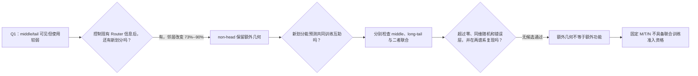

# A15_02_01_E01 认识更新：non-head 的额外分法有功能价值吗？

状态：实验已完成；运行有效，功能准入 Fail；等待研究者确认认识表述。

## 1. 本实验唯一回答的问题

**问题：** 在排除 Router 已有分数、专家负载、token 难度、范数、文档和 batch 等已知差异后，middle、long-tail 或二者联合提供的新划分，能否稳定识别哪些 token 放入同一专家训练时更兼容，并超过同维随机方向和错误层方向？

**为什么重要：** Q1 已知 Router 主要使用 head，但 middle/tail 仍可见；只有证明这些较弱方向保留了有用的共同训练关系，才值得用 8 卡重新设计路由。

## 2. 认识更新

**一句话回答：** middle/tail 确实能把 token 分得与现有 Router 不一样，但目前没有证据表明这种新分法更适合专家共同训练，因此它们没有获得联合训练资格。

“额外分辨率”指频带能找出 native Router 分数无法解释的新邻居。真实 non-head 改变了 73%--90% 的邻居，但同维随机方向也改变了 71%--88%；所以换一种高维坐标本来就容易，分得不同不等于分得有用。

“功能分辨率”要求更强：让 A 组 token 把一个冻结专家更新一小步，再看独立 B 组的预测误差是改善还是恶化，并反向重复。频带必须在未见文档上额外预测这个双向结果，超过 256 个同维随机方向和错误层，并在 LB/decommon 同时成立。

Middle 与完整 non-head 在两条谱系都没有正增量；long-tail 只在 LB 有局部正结果，在 decommon 为负。认识因此更新为：**Router 未保留的频谱几何真实存在，但当前固定 covariance-rank 频带没有显示稳定的额外功能分辨率。**

## 3. 决定性证据表

“兼容性增量”表示加入频带后，对 A/B 共同训练关系多出的 held-out 预测量；正值还必须超过随机和错误层才有准入意义。下表单位为 $10^{-4}$，每格是预注册层 1/6/12 的中位数。

| 候选 | LB | decommon | 为什么未通过 |
| --- | ---: | ---: | --- |
| Middle | -0.735 | -0.430 | 两条谱系均无正增量 |
| Long-tail | +2.237 | -0.520 | 只在 LB 成立，decommon 为负且不过随机 |
| Middle + long-tail | -0.590 | -0.429 | 两条谱系均无正增量 |

**读表结论：** 没有一个固定频带在两条谱系中都稳定提高对“谁适合共同训练”的预测。完整图与控制见 [中文摘要](summary_cn.md) 和 [证据账本](detailed.md)。

## 4. 解释流程图

## 5. 边界与下一步

- **成立范围：** 两个 12 层 H768 DCLM 模型的 80k 状态、层 1/6/12、实际 Gate 输入、固定 native routes、32-token groups、一步局部专家更新和低容量线性预测。
- **仍不能说：** middle/tail 没有非线性或长期价值；一步兼容性等于真实联合训练动力学；所有模型、层和数据都会失败；head alignment 有益或有害。
- **为什么没有提交 8×5090：** Protocol 只允许通过准入的单一候选进入训练；本次候选集为空，条件授权没有生效。
- **唯一下一决策：** 是否关闭“固定 covariance M/T/N 直接作为 dispatch 坐标”的路线，转而从专家梯度或交叉更新残差中定义功能对齐子空间？
- **完成判据：** 新对象须在独立文档上提供正的兼容性增量，并超过同维随机、错误层和 nuisance controls，之后才重新审核匹配联合训练。
- **恢复时第一动作：** 若选择新路线，先写功能子空间 研究者判断记录；不恢复当前 E02。
