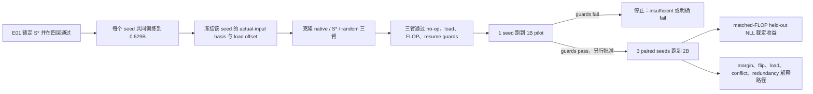

# 条件性 Protocol 审核稿：8×5090 匹配频谱分发训练

## 0. Approval Snapshot

**依赖结果（2026-07-30）：** E01 已完成但没有合格候选，条件性授权没有生效；
本实验没有实现或提交，继续阻塞。见
[E01 结果](../A15_02_01_E01_cross_update_compatibility_gate/summary_cn.md)。

**当前状态：** 研究者已批准此条件性执行合同，但仍被 E01 硬阻塞。必须先取得
[A15_02_01_E01](../A15_02_01_E01_cross_update_compatibility_gate/protocol_cn.md)
的正式 Pass；Pass 后可实现并提交 1B pilot，pilot guards 通过后可继续注册的
3-seed 2B full run。E01 Fail/Insufficient 时不得提交。

**所属父 anchor：** [A15_02](../../../../problem_anchors/15_linear_gate_spectral_training_bias/15_02_middle_tail_functional_resolution/15_02_middle_tail_functional_resolution_anchor_cn.md)。

**唯一决策问题：** E01 锁定的频带 $S^*$ 用作四层 DCLM MoE 的 **band-only
Gate input** 后，是否在相同累计 FLOPs 下比 native Router 和同维随机子空间
得到更低的 held-out next-token NLL？

**实验角色：** 匹配联合训练；这是第一层能够回答“训练收益”的证据。

**主指标：** 2B total-token 附近、matched cumulative FLOPs 下，$S^*$ 相对
native 和 random 的 paired held-out NLL 差，单位 nat/token；负值表示更好。

**必要而不充分的前置：** E01 的 compatibility $\Delta R^2$ Pass。它只说明
值得训练，不预言 E02 必然成功。

**强证伪：** 局部兼容性通过，但 $S^*$ 在 matched FLOPs 下不优于 native 或
random；这说明一步兼容性不足以选择该长期训练 treatment。

## 1. 训练对象与 Claim 边界

E02 测的是一个非常具体的 intervention：

> 在共同 0.629B-token branch checkpoint 上冻结频谱基底，把每层 Gate 输入
> 限制到 E01 选出的 $M$、$T$ 或 $N$ 子空间；Router、experts 和上游网络继续
> 联合训练。

它不是 additive side channel，也不是 online PCA，更不是复杂 Router。

| 术语 | 普通含义 | 目的 | 能回答多少 | 不能回答 |
| --- | --- | --- | --- | --- |
| band-only Gate input | Gate 只收到冻结频带内的变化，同时保留 branch 均值 | 直接测试“只看该频带”能否训练 | 该固定投影 treatment 的收益 | 把频带加到 native Router 是否更好 |
| Native arm | Gate 继续看完整实际输入 | 当前训练基线 | treatment 是否优于原设计 | 频谱本身的随机方向特异性 |
| Random arm | Gate 只看同维 Haar 随机子空间 | 方向对照 | 真频带是否优于同样信息维数 | 所有可能随机方向 |
| Matched FLOPs | 比较点前各 arm 实际累计计算量相同 | 防止多算获得低 loss | 训练效率 | 真实集群费用或墙钟效率的全部差异 |
| Held-out NLL | 未训练文档上的平均 next-token 负对数似然 | 直接裁定模型质量 | 当前 DCLM 配置的泛化 loss | 专家为何变好 |

## 2. 前置依赖与解锁条件

E02 只有在以下全部冻结后才能进入实现审批：

1. E01 在 12-layer final test 选出唯一 $S^*\in\{M,T,N\}$；
2. 同一 $S^*$ 在 4-layer checkpoint-800 全四层 pooled/median gate 通过；
3. band rank、维数、pair features、step-size 结论和 E01 evidence record 已锁定；
4. E02 不允许因看到训练 pilot 后换到 runner-up band；
5. 若 E01 只有静态 novelty 而无 compatibility Pass，E02 自动取消。

这些条件的目的，是防止用昂贵训练搜索频带并在结果后挑 treatment。它只能减少
选择偏差，不能保证 compatibility 会迁移到长期训练。

## 3. H1 与竞争解释

**H1：** $S^*$ 保留了 native Gate 压缩掉的共同训练关系；band-only 分发因此
降低专家内更新冲突，并在 matched FLOPs 下比 native 与 random 更快降低
held-out NLL。

| Rival | 预测 | 区分指标 | 指标能回答多少 |
| --- | --- | --- | --- |
| R0：局部代理不迁移 | E01 通过，E02 NLL 无优势 | matched-FLOP final NLL | 直接否定该 treatment 的长期收益，不否定所有频谱 Router |
| R1：只是降维/正则化 | $S^*$ 与同维 random 都改善 | $S^*$ vs random | 区分 covariance 频带与通用降维 |
| R2：只是负载变化 | loss 差伴随 overflow/drop 或 load 不匹配 | load、capacity、drop guards | 排除明显负载混杂，不证明功能机制 |
| R3：多算或系统差异 | treatment 实际 FLOPs/有效 token 更高 | profiler FLOPs、tokens、params、kernel hash | 保证计算路径可比 |
| R4：固定频带失去谱身份 | 训练后当前 covariance 与 frozen projector overlap 降到随机 | band-overlap audit | 只能决定可否继续称“频谱 treatment” |
| R5：compatibility 机制错误 | NLL 可能改善但专家内冲突不降 | dynamic conflict audit | 若发生，只保留收益 claim，放弃兼容性机制解释 |

## 4. 频带 Intervention

对 seed $s$、layer $\ell$ 的 branch checkpoint，在独立 calibration token IDs
上估计 actual Gate input 的 $\mu_{\ell,s}$ 与 $U_{\ell,s}$，然后冻结：

$$
P_{\ell,S^*,s}=U_{\ell,S^*,s}U_{\ell,S^*,s}^{\top}.
$$

训练期间每步使用

$$
r'_{\ell,a}
=\mu_{\ell,s}+P_{\ell,a}(r_\ell-\mu_{\ell,s}),
\qquad
z_{\ell,a}=W_\ell r'_{\ell,a}+b_{\ell,a},
$$

其中 $a\in\{native,S^*,R^*\}$，$P_{native}=I$，$P_{R^*}$ 是同维 Haar
projector。$P$、$\mu$ 和 $b$ 全程冻结；$W$、上游表示和 experts 正常训练。

同一 rank treatment $S^*$ 应用于四个 sparse Gate 的 actual inputs，各层使用
自己的 branch-time $U_{\ell,S^*}$；本 Protocol 不按层挑选。如果 E01 只在
少数四层上通过而 pooled/median gate 不通过，则 E02 保持阻塞，应另写
layer-selective Protocol，不能在此处临时只开“好层”。

### 为什么保留均值

投影只改变 token 间变化方向，不额外删除 branch checkpoint 的 DC 均值。这样
可避免把“去频带”与“删去固定专家偏置”混为一谈。它不能保证后续均值不漂移。

### 冻结 load-matching offset

对 $S^*$ 和 $R^*$，只在 calibration set 上求和为零的专家 bias：

$$
b_{ell,a}
=\arg\min_{mathbf 1^\top b=0}
\|p_{ell,a}(b)-p_{ell,native}\|_2^2
+10^{-4}\|b\|_2^2,
$$

$p$ 是 branch 时的 top-1 expert fraction。目的：让三个 arm 从相近负载起步，
不让第一次 route collapse 决定结果。它只能匹配 branch 时的聚合负载，不能
强迫后续训练负载相同，也不能匹配 token 级路由。

### 计算路径匹配

三个 arms 都调用同一 frozen dense $768\times768$ projector kernel、同形状
Gate 和同一 offset slot；native 只把 projector buffer 设为 identity、offset
设为零。目的：使 kernel、参数槽和额外 FLOPs 一致。它不能保证集群 wall time
完全相同，因此仍单列系统指标。

## 5. 三个主条件

| Arm | Gate 接收什么 | 回答的问题 | 必须匹配 | 不能单独证明 |
| --- | --- | --- | --- | --- |
| Native | 完整 $r_\ell$ | 频带限制是否优于现有 Router | init、optimizer、data、kernel、tokens、FLOPs | 方向特异性 |
| $S^*$ | E01 锁定的 $M$、$T$ 或 $N$ | 真频带 treatment 是否有效 | 与 random 同维、同 offset procedure | 通用频谱机制 |
| $R^*$ | 同维 Haar random | 收益是否只是降维/正则化 | 与 $S^*$ 同维和同计算 | 256 个随机方向的完整训练分布 |

$R^*$ 不按 E01 或 training loss 挑选。每个 paired training seed 使用一个由
seed 预先映射的 Haar draw；三个 full-run seeds 因而覆盖三个方向，但不把
random orientation 当作可调超参。

## 6. 8×5090 资源与训练配置

复用已通过 fast-warmup fresh/resume smoke 的执行面：

- worker package：
  `/data/250010109/MoE_Router/experiments/20260730_h768_4layer_switch_5090_tuning`；
- workspace `share-space`；
- AEC2 `computing-cluster-5090-01g`；
- worker spec `n12lp.nn.i10a.8`；
- 每个 job 一个 node、8×RTX 5090、spot、normal priority；
- image：
  `registry.cn-sh-01.sensecore.cn/lepton-trainingjob/ngc-pytorch:25.06-cu12.9-py3.12-ubuntu24.04`。

模型与优化配置冻结为：

| 项 | 值 | 为什么冻结 | 能回答多少 |
| --- | --- | --- | --- |
| 模型 | H768、4 layers、8 sparse experts + 1 shared、top-1 switch | 与已验证执行面一致 | 该小模型配置 |
| Router | linear、running center、$\lambda_{LB}=0.01$ | 保持 branch 血缘 | 当前 Router 条件 |
| Sequence / batch | 1024；local 12/GPU；accumulation 8；global 768 | 已通过 5090 smoke | 固定 token/FLOP 轴 |
| Optimizer schedule | LR $10^{-4}$、weight decay 0.01、warmup 636 steps | warmup 在约 0.500B tokens 结束 | 1--2B 轨迹不被旧 1000-step warmup 吞没 |
| Activation checkpoint | off | 已验证峰值内存低于 guard | 当前系统路径 |
| Tokens/step | 786,432 nominal | 把 step 转成共同 token 轴 | nominal，不替代有效 token 统计 |

8 卡是 **每个 arm 的数据并行资源**，不是 8 个独立种子。三个 arms 若并行需要
三个 8-GPU nodes；若资源不足可顺序运行，但每个 paired seed 的数据顺序和
branch snapshot 必须相同。

## 7. Branch、Seeds 与 Token 预算

### 7.1 共同 branch

每个 training seed 先用完全相同的 native 配置从初始化训练到 step 800
（629,145,600 nominal tokens），保存 model、optimizer、scheduler、dataloader
cursor、RNG 与 running center。随后估计该 seed 的频谱并克隆三臂。

已有 checkpoint-800 可作为 pilot seed，但 full evidence 的另外两个 seeds 仍需
各自共同 burn-in；不得让三个 arms 各自重新训练 burn-in。

### 7.2 注册观察点

| 总 optimizer step | Nominal total tokens | 用途 | 能回答多少 |
| ---: | ---: | --- | --- |
| 800 | 629,145,600 | branch / no-op 起点 | 三臂初始等价 |
| 954 | 750,256,128 | 极早分叉响应 | 路由与负载首先如何改变 |
| 1272 | 1,000,341,504 | pilot 终点 | 系统与方向性可行性；无最终 claim |
| 1908 | 1,500,512,256 | 中期轨迹 | 效果是否持续或反转 |
| 2544 | 2,000,683,008 | full 主终点 | 预注册 2B 范围内的初步训练收益 |

### 7.3 Pilot 与 full evidence

- **Pilot：** 1 paired seed × 3 arms，从 step 800 到 1272。只检查实现、load、
  memory、loss 方向和指标可测性；不能 Pass 父 anchor。
- **Full：** 3 paired seeds × 3 arms，到 step 2544；共 9 个 branch jobs，另有
  seed-specific burn-ins。
- Pilot seed 只有在代码/config/data/basis hashes 未改变、未根据 pilot 改 band
  或指标时，才可在后续明确批准后继续到 2B 并计作一个 full seed。

## 8. 主指标：Matched-FLOP Held-out NLL

在完全独立于训练、basis calibration 和 E01 的 1024 个 DCLM held-out
documents 上计算平均 next-token NLL；每篇取 1024 个有效 token。1024 文档数
是待审核 AI 提案，执行前冻结 token hash。

对 baseline $B\in\{native,R^*\}$：

$$
\Delta L_{S^*:B}(F^*)
=L_{S^*}^{heldout}(F^*)-L_B^{heldout}(F^*),
$$

其中 $F^*$ 为三个 arms 都达到的最大共同累计实际 FLOPs；若 step-2544 FLOPs
差小于 1%，直接使用共同终点，否则在 1908--2544 的注册曲线上插值到共同
$F^*$。

| 为什么测 | 能回答多少 | 不能回答 |
| --- | --- | --- |
| 它直接比较同等计算下未见文档的语言建模质量 | $S^*$ 是否比 native 和 random 更有效率 | 原因、专家语义、跨尺度普遍性 |

统计以 paired seed × document hierarchical bootstrap 2000 次估计。由于只有
3 seeds，即使通过也只称“初步匹配训练证据”，不称稳定 scaling law。

## 9. 训练过程指标：每个指标为什么测

所有过程指标在固定 audit documents 和注册 checkpoints 上计算，不用于替代
主 NLL，也不用于中途改变 treatment。

| 指标 | 具体计算 / 单位 | 测量目的 | 能回答多少 | 不能证明 |
| --- | --- | --- | --- | --- |
| Loss--FLOP AUC | branch 到 $F^*$ 的 held-out NLL 对实际 FLOPs 积分 | 区分“更早学会”与只在终点偶然领先 | 整段训练速度，次指标 | 终点必然更好 |
| Router margin | top-1 minus top-2 logit，logit/token | 看路由是否更确定或更早锁定 | 决策置信度与饱和 | 路由正确或有益 |
| Route flip | 固定 probe token 相对 step-800 expert 身份变化率 | 看 treatment 是否改变学习路径 | 路由路径差异 | 路由变化是改进 |
| Load / overflow / drop | 各专家 token share、capacity overflow 和 dropped-token rate | 检查收益是否由负载/有效 token 混杂 | 计算与数据公平性 | 专家功能质量 |
| Expert update norm | 每步实际 expert optimizer update Frobenius norm / routed token | 看学习压力如何分配到专家 | 专家更新强度和不均衡 | 更新有用 |
| Within-expert conflict | 固定 probe 上，按当前 route 分组后的 median gradient cosine 与 symmetric $C$ | 检查 E01 机制是否在训练中实现 | 专家内局部更新是否少冲突 | 最终 loss 必然下降 |
| Functional redundancy | 对固定 token 强制各 expert 后的 token-loss-change profile，两两相关均值 | 看专家功能是否更重复或更分化 | 功能轮廓的相似度 | 分化一定有益或语义可解释 |
| Frozen/current band overlap | $\|U_{*,S}^{\top}U_{t,S}\|_F^2/d_S$，$[0,1]$ | 检查冻结 projector 是否仍对应当前 rank band | 可否继续称 middle/tail treatment | overlap 高就有功能 |
| System metrics | 实测 FLOPs、有效 tokens、wall time、GPU memory、kernel/config hashes | 保证 compute matching 与可复现 | 系统公平和可执行性 | 算法机制 |

若主 NLL Pass 而 conflict 不下降，应报告“训练收益成立，但一步兼容性机制未被
支持”；不得用 margin、flip 或 specialization 图补写机制。

## 10. 匹配与有效性护栏

| 护栏 | 冻结要求 | 目的 | 失败后结论 |
| --- | --- | --- | --- |
| 初始状态 | paired seed 三臂的 model/optimizer/data cursor/RNG/center hashes 一致 | 只让 projector treatment 不同 | insufficient |
| 参数 | trainable parameter names/counts 完全一致；$P,\mu,b$ 为 frozen buffers | 排除容量差 | insufficient |
| 数据 | 同 paired seed 的 document/token 顺序一致；有效 non-padding tokens 差 <0.1% | 排除数据量差 | insufficient |
| 计算 | 同 kernel；累计实测 FLOPs 差 <1% | 排除多算 | 超出则只可 matched-FLOP 插值；无法插值则 insufficient |
| Branch load | load-matching 后每层 expert-share total variation $\le0.02$ | 防止起点 collapse | 不能匹配则不启动 |
| Capacity | capacity 相同；drop rate 差 $\le0.05$ percentage point，且绝对 drop $<0.1\%$ | 防止有效 token 混杂 | 超界则 insufficient |
| Native no-op | identity projector 的 logits/loss/winner 与未改代码一致 | 验证 intervention kernel | 失败则停止 |
| Spectral identity | frozen/current overlap 必须持续高于同维 Haar null | 保留“频谱”解释 | 低于 null 时只称 fixed-subspace treatment |
| Resume | 800→802 与任一中间 checkpoint resume 必须重放相同下一 batch/loss | 防止断点改变轨迹 | 失败则停止 |

这些护栏保证比较有效，但不会让三臂路由或负载在训练中完全相同；后者本来就是
treatment 可能改变的学习路径，必须记录而不是强行锁死。

## 11. 执行流程与停止规则

### 阶段

1. **S0 contract freeze：** 冻结 E01 result、训练代码、资源、数据、seed、basis
   与 projector hashes。目的：避免跨实验漂移。
2. **S1 CPU/unit smoke：** 验证 $P^2=P$、rank、均值保留、offset 和 dense-kernel
   identity no-op。目的：验证数学实现；不能说明训练可行。
3. **S2 8-GPU short smoke：** 每臂从同一 snapshot 运行 2 optimizer steps，并
   验证 SM120/NCCL、memory、gradients、load、checkpoint/resume。目的：系统准入。
4. **S3 1B pilot：** 一组 paired seed 到 step 1272。目的：发现 route collapse、
   load mismatch 或明显劣化；不能形成最终收益 claim。
5. **S4 full run：** 只有再次明确批准后，3 paired seeds 到 step 2544。
6. **S5 evidence record：** 先裁定主 NLL，再用过程指标解释；不得反向以过程图
   覆盖主指标。

### 停止规则

- 复用已验证的 memory guard：任一 GPU peak allocated memory $>29.5$ GiB 停止；
- burn-in 复用 50-step loss window；连续两次相邻窗口上升超过 2% 判失败；
- 任一 arm 出现 non-finite loss/gradient、checkpoint 不可恢复、route replay
  不一致或 capacity guard 超界，停止对应 paired seed；
- pilot 到 1B 时若 $S^*$ 相对 native 与 random 均明确更差，记录 pilot fail，
  不申请 2B；若区间仍宽，只能称 pilot insufficient；
- full run 一旦开始，不因中间 NLL 顺序普通波动而提前选择性停止，除非触发
  上述安全/有效性 guard。

## 12. Pass、Fail、Insufficient

### Pass

在所有匹配护栏通过后：

1. step-2544 / common $F^*$ 上，三个 paired seeds 的
   $\Delta L_{S^*:native}$ 与 $\Delta L_{S^*:R^*}$ 点估计均为负；
2. 两个 paired hierarchical-bootstrap 95% 区间的上界均小于零；
3. 结果不由 token drop、FLOP、参数或 branch load 失配解释。

这只支持：在注册 4-layer H768、DCLM、1--2B token 区间，band-only $S^*$
treatment 有初步 matched-compute 收益。

### Fail

- 护栏通过且精度充分，但 $S^*$ 对 native 或 random 任一主比较不优；
- 或 $S^*$ 与 random 同样改善而二者无法区分，则“方向特异”Fail，可保留
  “降维可能有益”的观察；
- 或 E01 兼容性通过但 dynamic conflict 与 NLL 均无改善，局部代理迁移假设 Fail。

### Insufficient

- 三 seed 区间过宽；
- projector、load、capacity、FLOPs、resume、数据或 spectral-identity guard 失败；
- pilot 崩溃但无法区分方法与实现；
- 只有 1B pilot 而未运行正式 2B paired seeds。

不设置人为最小 NLL 效应阈值；连续报告 nat/token 差、相对 perplexity 变化和
loss--FLOP AUC。是否“值得扩大规模”是 E02 结果后的新决策，不在本 Protocol
预设。

## 13. 图表与证据记录合同

1. **主图：held-out NLL vs cumulative actual FLOPs。** 三臂、三 seeds，
   branch 点和 0.75/1/1.5/2B markers；主读数是 2B common-$F^*$ paired 差。
2. **机制图：within-expert conflict 与 route/load 轨迹。** 目的：判断 E01
   兼容性机制是否真正出现；不能替代主图。
3. **专家图：update norm 与 functional redundancy。** 目的：观察专家形成路径；
   不能单独声称 specialization 有益。
4. **有效性表：params、tokens、FLOPs、drop、memory、resume、band overlap。**
   任一主 guard 必须一眼可见。

`summary.md` 只写结论、主比较、边界与下一决策；完整 seed、job ID、commands、
logs、failure、tables 和 artifacts 写入 `detailed.md`。任何大日志或 checkpoint
保留在 worker surface，不复制进 Research_System。

## 14. 审核重点与最终边界

### 14.1 请研究者重点审核

- [ ] **E02-C1：** 只允许 E01 锁定的一个 $S^*$ 进入训练；
- [ ] **E02-C2：** treatment 是四层全部 Gate 的 band-only input，不是 additive
  hybrid，也不按层挑选；
- [ ] **E02-C3：** branch 在 step 800 / 0.629B tokens，basis 与均值随后冻结；
- [ ] **E02-C4：** native / $S^*$ / 同维 random 三臂，所有臂使用同一 dense
  projector kernel；
- [ ] **E02-C5：** calibration-only frozen load offset 和 TV $\le0.02$ 起点门；
- [ ] **E02-C6：** 每 arm 一个 8×5090 node；pilot 1 seed 到 1B，full 3 seeds
  到 2B；
- [ ] **E02-C7：** 主指标是 matched actual FLOPs 的 held-out NLL，不是 margin、
  route flip、load 或 expert diversity；
- [ ] **E02-C8：** 1024 个独立 held-out documents 与 hierarchical bootstrap；
- [ ] **E02-C9：** process metrics 只解释路径，各自不能替代训练收益；
- [ ] **E02-C10：** fixed/current band overlap 失效时，只能称 fixed-subspace；
- [x] **E02-C11：** 研究者已给出条件性授权：E01 Pass 后可提交 pilot，
  pilot guards 通过后可继续 full run；E01 不通过时授权不生效。

### 14.2 不能声称

即使 Pass，也不能声称：所有 MoE、所有尺度或自然语言域都有效；middle/tail
信息具有唯一语义；频谱因果地产生更好 experts；Q1 的 head alignment 有害；
online / adaptive spectral Router 已被验证；或 2B 结果等同大规模训练定律。

**当前唯一决策是 E01 的证据裁定。** E02 的条件性授权不会绕过 E01 准入门。
