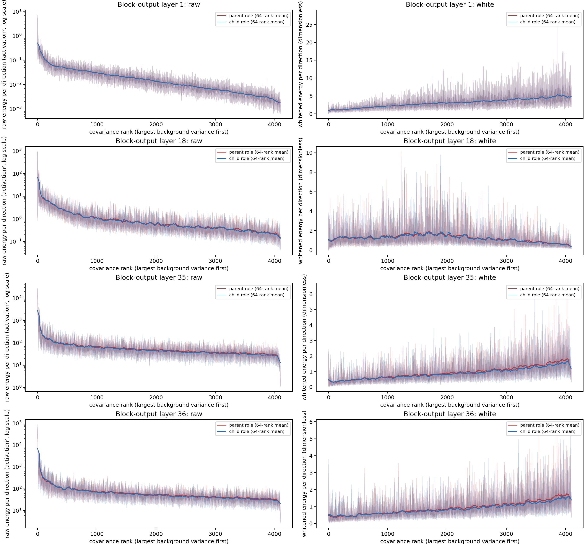
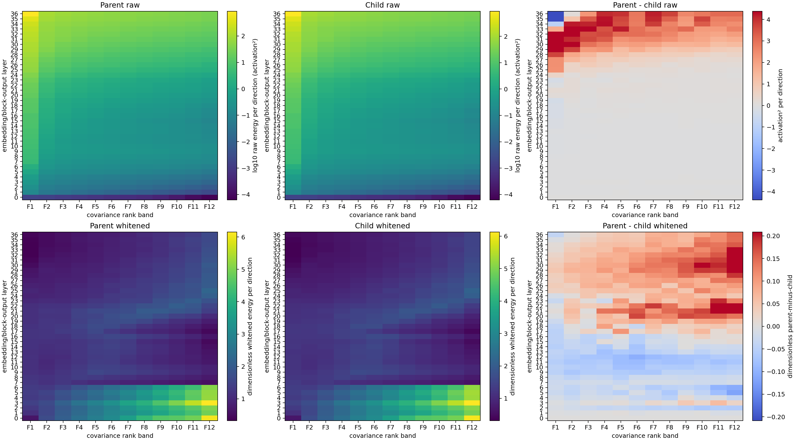
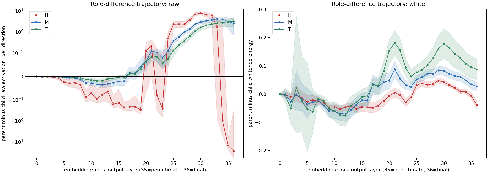

# 实验一：Qwen3-8B 同词父/子语义角色的层 × 频谱投影画像

状态：最终版；冻结模型静态审计；只整理 A15_01_03_E02 的旧投影分析，不包含线性探针、粗细分类或 Router 训练。

## 摘要

本实验研究一个严格配对的表征问题：在同一条三层语义链中，固定同一个中间概念、同一个 token 序列和同一个绝对位置，仅改变它在已完整呈现的关系中充当父级还是子级，目标 token 在 Qwen3-8B 各层的 covariance 谱投影是否系统变化？

例如，在

$$
\text{mathematics}\rightarrow\text{algebra}\rightarrow\text{linear algebra}
$$

中，目标词始终是 algebra：

- 在 mathematics contains algebra 中，它是子级；
- 在 algebra contains linear algebra 中，它是父级。

Covariance 基底由独立自然语料拟合。实验同时测量实际投影能量和除去每个方向背景方差后的白化能量。

结果表明：

1. 父、子两种角色的实际能量都强烈集中在谱头。
2. 白化后仍存在稳定的角色差异，但差异方向随网络层改变。
3. blocks 5--19 中有 10 层表现为子级相对更偏 head；blocks 25--32 全部表现为父级相对更偏 head。
4. block 36 的 head 为子级更强，而 middle/tail 为父级更强；它不是只有最后一层才发生的独立反转。

因此，本实验建立的是：

> 同一个概念的父/子关系角色与谱位置之间存在层特异关联，但不存在统一的“父级=head、子级=tail”映射。

该结论只涉及投影能量和方向选择性。实验没有使用线性探针，不能证明某个频带包含更多可解码语义信息，也不能证明该频带适合 Router。

## 1. 研究问题与可证伪假设

### 1.1 唯一问题

在冻结的 Qwen3-8B 中，每层 covariance 基底由独立自然文本拟合时，同一个中间概念作为父级或子级，是否在某些“层 × 频带”中具有稳定不同的投影能量？

### 1.2 主假设

若关系角色与表征方向确有稳定关联，则父减子差异在逐方向去除背景方差后仍应存在，并同时通过：

- 32 条语义链的配对重采样；
- 链内父/子标签交换；
- 四种等价模板；
- 相邻层复现；
- 独立 calibration 半分；
- 极小特征值阈值敏感性。

### 1.3 最强竞争解释

最强解释不是语义角色选择性，而是：

1. head 本来方差较大，所以 raw 投影机械更大；
2. 父/子句式、目标位置或 token 身份不同；
3. covariance 基底采样不稳定；
4. tail 中极小特征值被白化放大；
5. 少数语义链或孤立网络层制造了趋势。

因此，只有白化后且通过全部配对与稳定性护栏的差异，才进入结论。

## 2. 语义数据与配对构造

### 2.1 三层语义链

数据固定为 32 条三层学科或领域链，例如：

- mathematics → algebra → linear algebra；
- physics → mechanics → classical mechanics；
- computer science → algorithms → graph algorithms。

每条链使用四种关系等价模板，形成：

$$
32\ \text{chains}\times4\ \text{templates}
=128\ \text{parent/child pairs}
=256\ \text{actual sequences}.
$$

统计单位是 32 条语义链，不把四种模板或同一目标的 subtokens 当作独立样本。

### 2.2 同词、同位置的最小对

以 mathematics → algebra → linear algebra 的 template 0 为例：

> **子级条件：** Taxonomy evidence states that mathematics contains algebra as a recognized field. The relation is fully stated. clearly The target concept is algebra. This target is evaluated only after the relation above.

> **父级条件：** Taxonomy evidence states that algebra contains linear algebra as a recognized field. The relation is fully stated. The target concept is algebra. This target is evaluated only after the relation above.

两条序列中的目标词都为 algebra，token ids 均为 [46876]，目标 span 均为 [24,25)，序列长度均为 36。在读取目标 token 前，关系已经完整可见。中性的单 token filler 只用于匹配前缀和总长度。

128/128 个最小对全部满足：

- 目标字符串与 token ids 相同；
- 目标绝对 span 相同；
- 序列总长度相同；
- 关系在目标前完整出现；
- 每条链有四种模板。

### 2.3 数据构造示意图

~~~mermaid
flowchart LR
    R["上位概念 mathematics"] --> M["固定中间目标 algebra"]
    M --> L["下位概念 linear algebra"]
    R --> C["子级文本 mathematics contains algebra"]
    M --> P["父级文本 algebra contains linear algebra"]
    C --> G["同一目标词、token、位置和句长"]
    P --> G
    G --> Q["冻结 Qwen3-8B embedding + blocks 1--36"]
    Q --> A["每层目标 token 表征"]
    A --> S["投影到独立自然语料 covariance 谱方向"]
    S --> D["父减子 raw / white 层 × 频带画像"]
~~~

全部文本、token ids、目标 span、角色、链和模板见 [actual_semantic_text_sequences.json](data/01_parent_child_actual_semantic_text_sequences.json)。语义数据 manifest SHA-256 为 b1b5545fff3893fad5d673c03ef5db6893b8e6cfaae1fd0d55d9624355cc8df5。

## 3. 模型、表征与独立 covariance

| 项目 | 固定设置 |
| --- | --- |
| 模型 | /data/share/Qwen3-8B，Qwen3ForCausalLM |
| 深度与宽度 | 36 decoder blocks，hidden size 4096 |
| tokenizer | Qwen2TokenizerFast，词表 151,669 |
| 推理精度 | bfloat16；模型全程冻结 |
| 表征位置 | embedding 输出和每个 block 在 final model norm 前的 raw residual output，共 37 sites |
| 模型 manifest | 3e33117aebc01710cf1011093bbf4c2700336fce4600788f15d80d69f165dc25 |

每层 covariance 来自独立 DCLM held-out 自然文本：

- 128 篇独立文档；
- 每篇 512 个 Qwen tokens；
- 共 65,536 个有效 tokens；
- 测试模板完全匹配泄漏数为 0；
- calibration token SHA-256 为 5c2e9f6b7d307436eda018b7719bc38cddab6387881d77f89bc74fb717b2f792。

每层分别计算：

$$
\Sigma_\ell
=
\mathbb E[(h_\ell-\mu_\ell)(h_\ell-\mu_\ell)^\top]
=
U_\ell\Lambda_\ell U_\ell^\top.
$$

$U_\ell$ 的方向按背景方差 $\lambda_{\ell,i}$ 从大到小排序。4096 个方向切成 12 个等相对秩带：

- head：F1，即前 $1/12$；
- middle：F2--F5，即随后 $4/12$；
- tail：F6--F12，即剩余 $7/12$。

所有频带统计都使用每方向平均值，避免 tail 仅因维度更多而获得更大总量。不同层的 F1 只是各自层内的高方差区，不表示跨层相同语义子空间。

## 4. 投影指标及其物理含义

对第 $\ell$ 层的目标 token 表征 $h$，先减去独立 calibration 均值：

$$
x=h-\mu_\ell.
$$

在第 $i$ 个 covariance 方向上的投影系数为：

$$
a_i=u_i^\top x.
$$

### 4.1 Raw：实际投影能量

$$
\operatorname{raw}_i=a_i^2.
$$

单位为 activation²。它回答：

> 目标 token 在真实表征中向这个方向贡献了多少实际能量？

Raw 保留背景方差尺度，所以 head 天然可能更大。Raw 的 head 集中不能单独证明父级或子级对 head 有特殊偏好。

### 4.2 White：相对背景方差的方向选择性

$$
\operatorname{white}_i
=
\frac{a_i^2}
{\max(\lambda_{\ell,i},\lambda_{\ell,1}\rho)},
\qquad
\rho=10^{-6}.
$$

它是无量纲量，相当于先把投影除以该方向的背景标准差再平方。它回答：

> 相对于这个方向在普通自然文本中的日常波动，目标 token 是否异常偏好该方向？

同时检查 $\rho=10^{-5},10^{-4}$ 和有效秩遮罩，防止 tail 中极小特征值被过度放大。

### 4.3 父减子配对差

频带 $B$ 的主比较为：

$$
\Delta_{\ell,B}^{m}
=
\mathbb E_{\text{chain}}
\left[
E_{\mathrm{parent}}^{m}(\ell,B)
-
E_{\mathrm{child}}^{m}(\ell,B)
\right],
\qquad
m\in\{\mathrm{raw},\mathrm{white}\}.
$$

- $\Delta>0$：同一个概念作父级时更强；
- $\Delta<0$：同一个概念作子级时更强；
- $\Delta=0$：两种角色没有平均差异。

配对对数比的指数表示父/子能量倍数。它方便比较比例，但仍只是表征投影，不是分类准确率、互信息或专家效用。

### 4.4 本实验没有测什么

本实验没有训练线性 probe，也没有定义类别间/类内可分性。它测的是同一个目标词在两种关系角色中的投影差异。因此：

- 白化差异支持“角色与方向相关”；
- 白化差异不等于“该频带包含更多语义信息”；
- 任何投影结果都不能直接升级为 Router 价值。

## 5. 比较结构

| 比较 | 固定因素 | 改变因素 | 回答的问题 |
| --- | --- | --- | --- |
| 同层 raw 父/子 | 模型、层、目标词、token、位置、长度、基底 | 父/子关系角色 | 谁贡献更多实际能量？ |
| 同层 white 父/子 | 上述因素及背景方差尺度 | 父/子关系角色 | 是否存在超出背景尺度的方向偏好？ |
| 层 × 角色 × 频带 | 同一批 128 个最小对 | embedding 至 block 36、F1--F12 | 角色差异是否随深度和谱位置变化？ |
| block 35 × 36 | 目标、频带、统计规则 | 倒数第二层与最后一层 | 最后一层是否单独反转？ |
| 稳定性对照 | 32 条链为统计单位 | 模板、calibration 半分、标签交换、白化 floor | 差异是否由句式、少数链或数值噪声造成？ |

主推断使用 2,000 次链级配对 bootstrap、5,000 次链内父/子标签交换、BH-FDR、至少 3/4 模板同号、至少 18/32 链同号、相邻层复现和白化阈值稳健性。

## 6. Figure 1：逐方向投影曲线

### 图的组成

- 每行对应一个代表层：block 1、18、35、36。
- 横坐标是 4096 个 covariance 方向，按背景方差从大到小排列；越靠左越接近谱头。
- 左列纵坐标是 raw activation²，每方向能量，采用对数轴。
- 右列纵坐标是 white 每方向能量，无量纲。
- 红线表示父级角色，蓝线表示子级角色。
- 半透明细迹和区间表示链级变化；粗线是 64-rank 滚动显示均值，不参与正式推断。

### 直接观察

Raw 曲线在所有展示层都明显左高右低，说明父、子两种角色的实际激活能量都主要由自然文本的高方差方向承担。越深层 raw 数值整体越大，主要反映 residual 表征尺度增长，不能解释为“语义更强”。

白化后，曲线不再必然从左向右下降，说明背景奇异值尺度已被移除。父/子绝对曲线仍高度重合，局部差异远小于共同谱形状，因此不能仅凭肉眼观察两条曲线判定角色差异；正式证据来自链级配对差。

### Figure 1 的允许结论

该图支持“实际能量 head-heavy”和“白化改变谱形状”。它不能单独证明某个角色更偏某个频带，更不能证明语义可分或 Router 有用。

## 7. Figure 2：层 × 频带 × 角色热图

### 坐标与 colorbar

- 横坐标是 F1--F12，从高背景方差到低背景方差。
- 纵坐标是 embedding（0）和 blocks 1--36。
- 上排前两图是父级/子级 raw 每方向能量的 $\log_{10}$。
- 右上图是父减子 raw，单位为 activation²；红色父级更强，蓝色子级更强。
- 下排前两图是父级/子级 white 每方向能量，无量纲。
- 右下图是父减子 white；红色父级相对背景更强，蓝色子级相对背景更强。
- 不同面板使用不同 colorbar，颜色深浅不能跨面板直接比较。

### 直接观察

父、子 raw 面板随深度整体变亮，主要反映 hidden-state 尺度增长。决定性面板是右下角白化父减子图：

- 早中层的 head 区域多为蓝色，即子级相对更偏 head；
- blocks 25--32 的 head 区域转为红色，即父级相对更偏 head；
- block 36 的 F1/head 为蓝色，而后续 middle/tail 为红色。

这是一张层特异的角色—频带画像，而不是一条“网络越深，父级越靠 head”或“子级越靠 tail”的单调轨迹。

## 8. Figure 3：H/M/T 父减子逐层轨迹

### 坐标与曲线

- 横坐标是 embedding（0）和 blocks 1--36；虚线标出倒数第二层 35。
- 纵坐标是父减子每方向平均能量。
- 左图为 raw，使用对称对数轴以同时显示早层小差异和晚层大幅值。
- 右图为 white，使用无量纲线性轴。
- 红、蓝、绿分别表示 head、middle、tail。
- 阴影是链级配对 95% 区间；区间跨零的点不能单独解释为稳定差异。

### 逐层模式

白化 head 轨迹经历三个阶段：

1. blocks 5--19 中有 10 个稳定层为负，即子级相对更偏 head；
2. blocks 25--32 全部稳定为正，即父级相对更偏 head；
3. 随后接近零，并在 block 36 再次为负。

Middle 在 blocks 28--36 稳定为父级更强；tail 在 blocks 33--36 稳定为父级更强。因此 block 36 同时出现“head 子级更强、middle/tail 父级更强”的跨带重分配。

### 代表性数值

| 层与频带 | 父级 white | 子级 white | 父/子倍数 | 直接解释 |
| --- | ---: | ---: | ---: | --- |
| block 10，H | 1.135 | 1.180 | 0.961 | 子级相对更偏 head |
| block 29，H | 0.625 | 0.578 | 1.080 | 父级相对更偏 head |
| block 35，H | 0.369 | 0.376 | 0.982 | 区间跨零，没有稳定 head 差异 |
| block 36，H | 0.413 | 0.452 | 0.915 | 子级相对更偏 head |
| block 36，M | 0.632 | 0.606 | 1.046 | 父级相对更偏 middle |
| block 36，T | 1.144 | 1.057 | 1.082 | 父级相对更偏 tail |

完整策展表见 [01_qwen3_role_atlas_key_results.csv](tables/01_qwen3_role_atlas_key_results.csv)。

## 9. 最后一层是否单独反转

预注册的“末层反转”要求 block 36 的差异显著，并且同时与 block 35 和 blocks 1--35 的中位方向相反，同时通过模板和语义链护栏。

Raw 与 white 的 H/M/T 六组比较均未通过该规则。以 white head 为例：

- block 36 为负；
- block 35 已经略为负且不显著；
- blocks 1--35 的中位差也为负。

所以 block 36 加强了局部的“子级更 head”关系，但不是只有最后一层才发生的独立反转。完整检查见 [02_qwen3_final_layer_reversal.csv](tables/02_qwen3_final_layer_reversal.csv)。

## 10. 有效性审计

- 256 条实际序列全部通过目标词、token span、绝对位置、等长度和关系先行门。
- 37 个表征位置均成功捕获；同批 hidden-state replay 最大误差为 0。
- FP64 covariance 重构最大相对误差为 $8.80\times10^{-15}$。
- 投影能量守恒最大相对误差为 $1.69\times10^{-6}$。
- Calibration 半分的 H/M/T 在 37/37 sites 全部通过谱带稳定性门。
- 94 个稳定白化细单元全部通过 $10^{-6},10^{-5},10^{-4}$ floor/effective-rank 敏感性。
- 统计以 32 条链为单位，并同时要求 bootstrap、permutation、FDR、模板、链多数和相邻层复现。

因此，稳定单元不是由单一模板、少数链、基底采样噪声或极小 tail 特征值解释。

## 11. 综合裁定

### Pass

在该冻结 Qwen3-8B 中，同一概念作为父级或子级时，存在层特异、白化后仍成立的角色—谱位置关联。

### Fail

- 统一的“父级=head、子级=tail”映射失败。
- “只有最后一层才发生趋势反转”失败。

### Insufficient

该画像是否跨模型、跨语言、跨自然 calibration 语料和跨概念体系复现，证据不足。

## 12. Claim Boundary

本实验能够说：

> 同一概念的关系角色会伴随层特异的谱投影重分配；实际能量始终受 head 支配，而去除背景方差后，父/子相对偏好会跨层换号。

本实验不能说：

- 某个频带含有更多可解码的父级或子级语义；
- 网络越深就编码越细的语义；
- covariance rank 因果产生语义层级；
- 深层执行了组合计算；
- 某个层 × 频带应被 Router 使用；
- 任何专家分工或训练收益会随之出现。

尤其需要强调：本实验没有线性 probe，raw/white 都是投影能量指标。White 只去除了背景方差尺度，并没有把“方向偏好”升级成“信息含量”。

## 13. 唯一下一决策

使用独立模型或独立自然语料 covariance 基底，复核以下两段画像：

- blocks 5--19 的子级 head 选择性；
- blocks 25--32 的父级 head 选择性。

只有外部复现后，特定层 × 频带坐标才有资格进入另行批准的可读性或功能效用测试。

## 14. 包内证据入口

- [全部实际文本](data/01_parent_child_actual_semantic_text_sequences.json)
- [关键结果表](tables/01_qwen3_role_atlas_key_results.csv)
- [末层反转表](tables/02_qwen3_final_layer_reversal.csv)
