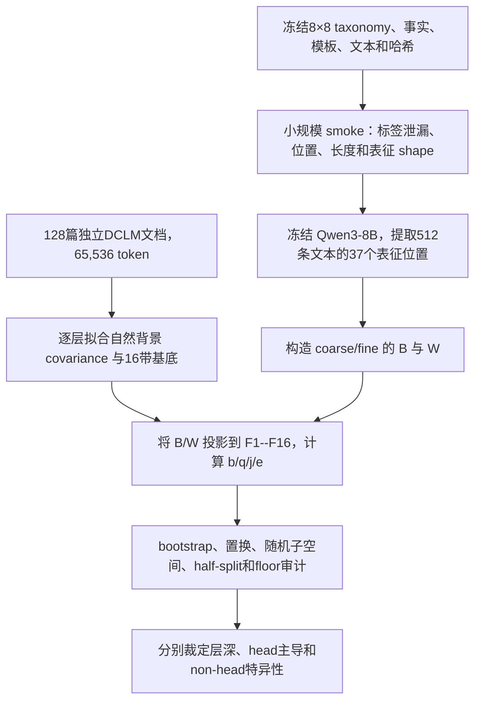
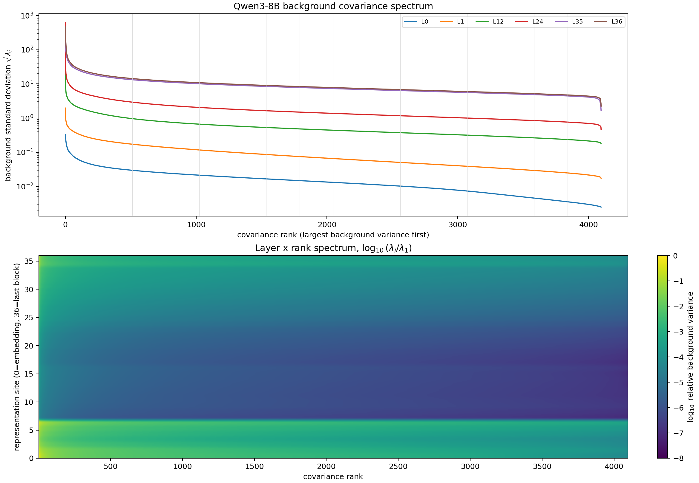
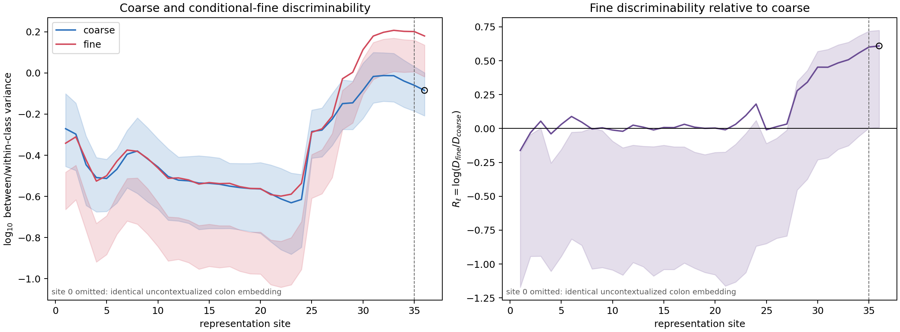
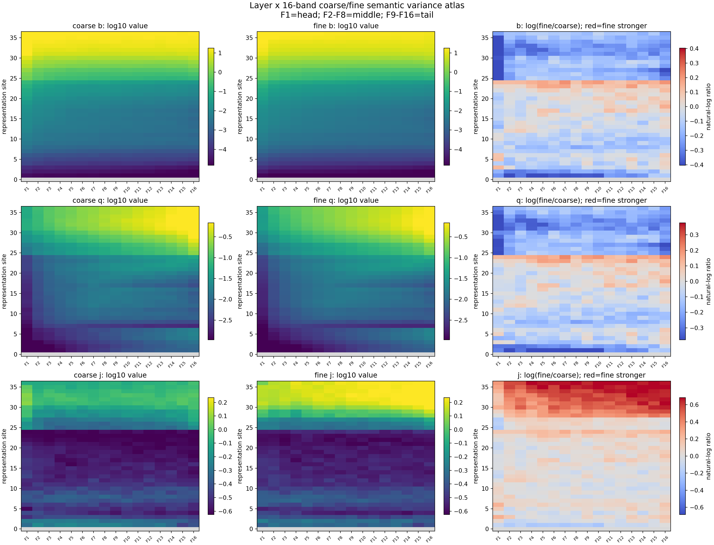
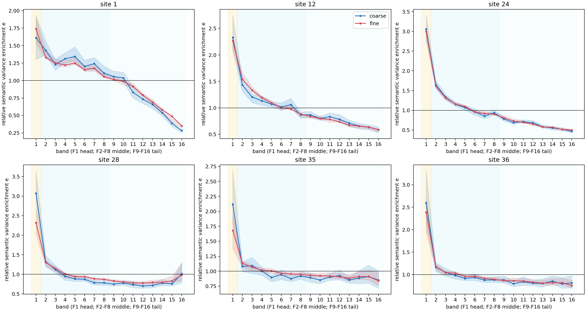
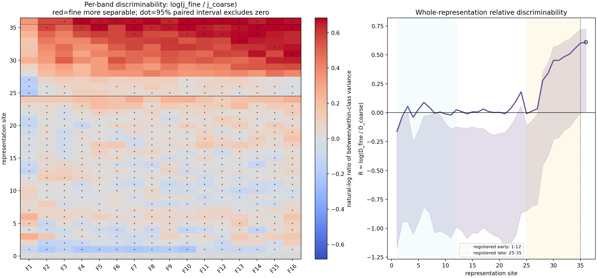

# Qwen3-8B 粗细语义的层深区分度与 16 带频谱画像

状态：完整实验链；冻结模型静态审计；实验编号 A15_01_05_E01。

## 摘要

本实验只回答一个问题：在冻结的 Qwen3-8B 中，同一粗类别内部的细粒度语义是否随网络层加深而变得相对更容易区分；这种变化在独立自然语料拟合的 covariance 谱中位于哪些方向？

我们构造了一个平衡的两级学术语义树：8 个粗类别，每个粗类包含 8 个细类别。每个细类用 4 种句式和 2 组互不重叠的事实描述，共得到 512 条不出现正确类别名称的英文文本。所有文本都在相同的 `Classification:` 冒号位置读取表征。模型为本地冻结的 Qwen3-8B；读取 embedding 输出和全部 36 个 Transformer block 的 residual output。每层 covariance 由独立的 128 篇 DCLM 自然文档、65,536 个 token 拟合。

实验得到三个分条结果：

1. **层深区分度 Pass。** 早层 blocks 1--12 的细/粗区分度比约为 1.00，晚层 blocks 25--35 为 1.57；block 35 为 1.82，最后一个 block 36 为 1.84。
2. **实际方差 head 主导 Pass。** 粗、细语义的每方向实际类别间方差都在 F1，即背景方差最大的前 256 个方向上最大。
3. **细语义 middle/tail 特异富集 Fail。** 深层细语义的区分优势横跨多数频带，没有稳定、超过随机同维方向地集中在 F2--F8 或 F9--F16。

因此，完整裁定为 `depth_pass_spectral_fail`：Qwen3-8B 深层确实更清楚地区分同一粗类内部的细分类，但这种改善不是固定 covariance middle/tail 通道，也不是因为细类产生了更大的实际激活方差。

---

## 1. 实验问题

### 1.1 唯一问题

在一个冻结的预训练大模型中：

1. 粗类别是否在浅层已经具有较强区分度？
2. 条件于同一粗类别的细类别，是否在深层获得更高的相对区分度？
3. 粗、细语义的实际类别间方差是否都主要位于 covariance head？
4. 细语义是否相对特异地富集在 middle 或 tail？

前三问与第四问必须分别裁定。深层细类更可分，不自动表示细类位于低方差频带。

### 1.2 本实验不回答什么

本实验没有训练或修改模型，不回答：

- 深层是否执行了更多组合计算；
- covariance rank 是否因果产生语义；
- 某个频带是否适合 Router；
- 专家分工、训练效率或语言模型 loss 是否改善。

---

## 2. 为什么需要重新构造数据

直接比较“mathematics”和“algebra”等概念词，会混入词形、tokenizer、词频和 embedding 差异。只比较同一个词的父/子关系角色，又只能回答关系角色的投影变化，不能回答粗类别与条件内细类别能否被区分。

因此，本实验把语义对象改成一棵平衡的两级 taxonomy，并要求模型从不含标签名称的描述中同时形成：

1. 粗类别信息，例如属于 mathematics 还是 physics；
2. 在粗类别已知的条件下，细类别信息，例如属于 algebra 还是 analysis。

读取对象不是概念词 token，而是模型读完整段描述后共同的 `Classification:` 冒号状态。

---

## 3. 粗细粒度数据的选择与构造

### 3.1 两级平衡 taxonomy

| 粗类别 | 8 个条件内细类别 |
| --- | --- |
| mathematics | algebra; analysis; geometry; topology; number theory; combinatorics; probability; statistics |
| physics | mechanics; electromagnetism; thermodynamics; optics; quantum physics; relativity; condensed matter physics; particle physics |
| chemistry | organic; inorganic; physical; analytical; electrochemistry; nuclear; polymer; theoretical chemistry |
| biology | genetics; ecology; evolutionary biology; cell biology; molecular biology; microbiology; developmental biology; physiology |
| computer science | algorithms; operating systems; networks; databases; artificial intelligence; programming languages; graphics; cybersecurity |
| economics | microeconomics; macroeconomics; econometrics; international; labor; public; development; financial economics |
| medicine | cardiology; neurology; oncology; immunology; endocrinology; gastroenterology; pulmonology; nephrology |
| linguistics | phonetics; phonology; morphology; syntax; semantics; pragmatics; sociolinguistics; psycholinguistics |

类别数严格平衡：8 个父类，每个父类正好 8 个子类。

### 3.2 每个细类的事实与模板

每个细类准备至少 6 条人工审核的事实原子，并拆成两个互不重叠的三事实 bundle。例如 mathematics → algebra 的两组事实分别描述：

- 符号表达式、未知量方程、抽象运算、保结构映射；
- 多项式、群环域、公理系统、符号关系求解。

每组事实进入 4 种等价句式，得到每个细类 8 条文本：

$$
8\ \text{父类}
\times 8\ \text{子类}
\times 4\ \text{模板}
\times 2\ \text{事实组}
=512\ \text{条文本}.
$$

模板 0/1 构成 design split，共 256 条；模板 2/3 构成 sealed confirmation split，共 256 条。Confirmation 在指标、统计和作图合同冻结后才开启。

### 3.3 实际文本形式

公共模板为：

```text
Topic description: <definition without parent or child label names>
Identify the broad academic field and the specific subfield.
Classification:
```

mathematics → algebra 的一条实际文本为：

```text
Topic description: This topic studies symbolic expressions and equations with unknown quantities;
it also uses abstract operations satisfying closure and inverse properties;
a central concern is structure-preserving maps between formal systems.
Identify the broad academic field and the specific subfield.
Classification:
```

正确的 `mathematics` 和 `algebra` 均未出现在文本中。全部 512 条文本、token ids、padding、标签、模板、事实原子、来源和哈希见[完整数据 manifest](data/02_coarse_fine_actual_semantic_text_sequences.json)。数据集 SHA-256 为：

```text
cb440b98d81bac3f9813344f85e6efdbd994b7b988d8009ba64e207e64a11859
```

### 3.4 位置与长度控制

自然文本长度为 41--58 token，中位数 49。实验使用被 attention mask 屏蔽的左 padding，将所有序列补到 58 token；同时显式设置 position ids，使自然文本内部相对位置保持不变。

所有读取位置均为绝对位置 57 的最后一个冒号 token。正文没有加入模型可见的 filler。长度、模板和事实 bundle 作为干扰变量记录；长度单变量分类准确率为粗类 0.191、细类 0.184，机会水平为 0.125。

### 3.5 数据中固定与未固定的因素

固定因素：

- 粗类和细类样本数；
- 每个细类的模板数与事实组数；
- 正确标签不出现在文本中；
- 读出 token、绝对位置和 padded 长度；
- design/confirmation 划分；
- 文本顺序、token ids 和 SHA-256。

未完全固定因素：

- 不同领域在 Qwen3 预训练语料中的频率；
- 事实本身的熟悉度和语言难度；
- 自然文本未经 padding 前的长度；
- 不同领域固有的语义相似度。

这些因素不阻止对当前模型和当前平衡 taxonomy 的配对审计，但限制跨模型、跨语言和普遍语义规律的外推。

---

## 4. 模型、表征与独立自然 covariance

### 4.1 冻结模型

| 项目 | 固定设置 |
| --- | --- |
| 模型路径 | `/data/share/Qwen3-8B` |
| 架构 | `Qwen3ForCausalLM` |
| 深度 | 36 个 decoder blocks |
| 隐藏维度 | 4096 |
| tokenizer | `Qwen2TokenizerFast`，词表 151,669 |
| 前向精度 | bfloat16 |
| 统计精度 | FP64 moments、特征分解与统计 |
| revision | 本地文件系统快照 |

模型 manifest 见 [02_model_manifest.json](data/02_model_manifest.json)，组合 SHA-256 为：

```text
3e33117aebc01710cf1011093bbf4c2700336fce4600788f15d80d69f165dc25
```

模型全程冻结，没有微调、优化器或 checkpoint selection。

### 4.2 读取的表征

捕获以下 37 个位置：

1. embedding 输出；
2. blocks 1--36 在 final model norm 之前的 raw residual output。

读取对象始终是共同 `Classification:` 冒号 token。site 0 的冒号 embedding 对所有文本完全相同、尚未接收上下文，因此 site 0 的语义区分度正式记为 N/A；主深度分析从 block 1 开始。

### 4.3 独立自然语料 covariance

语义测试集不参与 covariance 拟合。每层基底来自独立 DCLM held-out 自然语料：

- 128 篇独立文档；
- 每篇固定读取 512 个 Qwen token；
- 共 65,536 个有效 token；
- 新语义定义与模板的完全句子泄漏数为 0；
- 固定 token SHA-256 为 `5c2e9f6b7d307436eda018b7719bc38cddab6387881d77f89bc74fb717b2f792`。

完整来源见 [02_calibration_manifest.json](data/02_calibration_manifest.json) 和[独立性审计](data/02_dataset_calibration_independence.json)。

每层计算：

$$
\Sigma_\ell
=\mathbb E[(h_\ell-\mu_\ell)(h_\ell-\mu_\ell)^\top]
=U_\ell\Lambda_\ell U_\ell^\top.
$$

$U_\ell$ 的方向按背景特征值 $\lambda_{\ell,i}$ 从大到小排序。它们描述自然文本表征通常在哪些方向变化大，不直接表示语义重要性。

### 4.4 16 个等秩频带

每层 4096 个方向切成 16 个等维频带，每带 256 个方向：

- F1：ranks 1--256，定义为 head；
- F2--F8：ranks 257--2048，合称 middle；
- F9--F16：ranks 2049--4096，合称 tail。

H/M/T 聚合均使用每方向平均值，避免 tail 因维度更多而机械取得更大总量。

---

## 5. 语义方差与区分度公式

### 5.1 记号

令 $h_{\ell,p,c,t}$ 表示第 $\ell$ 层的读取表征，其中：

- $p\in\{1,\ldots,8\}$ 是粗类别；
- $c\in\{1,\ldots,8\}$ 是父类 $p$ 内的细类别；
- $t$ 是模板与事实 bundle。

细类中心和粗类中心为：

$$
\mu_{\ell,p,c}=\mathbb E_t[h_{\ell,p,c,t}],
\qquad
\mu_{\ell,p}=\mathbb E_{c,t}[h_{\ell,p,c,t}].
$$

### 5.2 粗类别间方差

$$
B_\ell^{\mathrm{coarse}}
=\operatorname{Cov}_{p}(\mu_{\ell,p}).
$$

它测量 8 个粗类别中心彼此离得多远。

粗类内部方差为：

$$
W_\ell^{\mathrm{coarse}}
=\mathbb E_p\operatorname{Cov}_{c,t}
(h_{\ell,p,c,t}\mid p).
$$

它包含同一粗类内部的细类差异、模板和事实变化。

### 5.3 条件内细类别间方差

$$
B_\ell^{\mathrm{fine}}
=\mathbb E_p\operatorname{Cov}_{c\mid p}
(\mu_{\ell,p,c}).
$$

它先固定父类，再测量该父类内部 8 个细类中心彼此离得多远。

细类内部方差为：

$$
W_\ell^{\mathrm{fine}}
=\mathbb E_{p,c}\operatorname{Cov}_{t}
(h_{\ell,p,c,t}\mid p,c).
$$

它测量描述同一细类的不同模板和事实组合有多分散。

### 5.4 全状态区分度

$$
D_{\ell,g}
=\frac{\operatorname{tr}(B_\ell^g)}
{\operatorname{tr}(W_\ell^g)+\epsilon},
\qquad
g\in\{\mathrm{coarse},\mathrm{fine}\}.
$$

$D$ 是无量纲的 between/within 比：类别中心越分开、同类样本越紧凑，$D$ 越大。它不是准确率，也不是语言模型 loss。

细类相对粗类的区分优势为：

$$
R_\ell
=\log\frac{D_{\ell,\mathrm{fine}}}
{D_{\ell,\mathrm{coarse}}}.
$$

- $R_\ell=0$：粗细区分度相同；
- $R_\ell>0$：细类相对更可分；
- $e^{R_\ell}$：细/粗区分度倍数。

主层深指标为：

$$
T_{\mathrm{depth}}
=\operatorname{median}_{\ell=25:35}R_\ell
-\operatorname{median}_{\ell=1:12}R_\ell.
$$

它比较预注册晚层窗口与早层窗口，避免事后挑选单层。

### 5.5 每频带实际语义方差 $b$

对第 $k$ 个 256 维频带：

$$
b_{\ell,g,k}
=\frac{1}{256}
\operatorname{tr}
\left(U_{\ell,k}^{\top}B_\ell^gU_{\ell,k}\right).
$$

单位为 activation$^2$/direction。它回答：该语义层级实际在这个频带贡献了多少类别间方差。

### 5.6 相对自然背景的强度 $q$

$$
q_{\ell,g,k}
\approx\frac{1}{256}
\sum_{i\in k}
\frac{u_{\ell,i}^{\top}B_\ell^g u_{\ell,i}}
{\lambda_{\ell,i}+\epsilon}.
$$

$q$ 去除了某方向本来就有的大背景方差，回答语义变化相对自然背景是否异常。它不控制同类模板噪声，所以不等于可区分性。

### 5.7 频带区分度 $j$

$$
j_{\ell,g,k}
=\frac{
\operatorname{tr}(U_{\ell,k}^{\top}B_\ell^gU_{\ell,k})}
{
\operatorname{tr}(U_{\ell,k}^{\top}W_\ell^gU_{\ell,k})+epsilon}.
$$

$j$ 直接测量该频带的类别间信号相对于类内扰动有多强。

### 5.8 相对全谱富集 $e$

$e$ 将某带的 $b$ 除以该层全谱每方向平均语义方差。$e=1$ 表示该带处于全谱平均水平，$e>1$ 表示相对富集。

### 5.9 三种量不能互换

| 指标 | 测量对象 | 数值大表示 | 不能推出 |
| --- | --- | --- | --- |
| $b$ | 实际类别间方差 | 类别中心沿该带变化大 | 同类是否紧凑 |
| $q$ | 相对背景异常程度 | 相对自然文本通常波动更突出 | 类别可分性 |
| $j$ | 类别间/类内比 | 该带能更稳定地区分类别 | 因果计算或 Router 价值 |

---

## 6. 统计与有效性门

### 6.1 统计单位

统计按 parent → child → template 的层级结构处理，不把 512 条文本当作相互独立的 512 个语义样本。

### 6.2 主统计

- 2,000 次 parent→child→template nested bootstrap；
- 5,000 次层级标签置换；
- 37×16 单元 family 的 BH-FDR；
- 四种模板分别检查方向；
- 八次 leave-one-parent-out；
- 256 个同维 Haar 随机子空间。

### 6.3 频谱有效性检查

- 独立 calibration 半分；
- 16 个频带的 projector overlap；
- wrong-layer basis；
- eigenvalue floors $10^{-6},10^{-5},10^{-4}\lambda_1$；
- covariance 重构与投影能量守恒。

若细带在近简并谱中旋转，该频带只允许描述，不允许成为稳定的语义坐标。

---

## 7. 执行步骤



执行清单见 [02_extraction_manifest.json](data/02_extraction_manifest.json)。

---

## 8. Figure 1：自然背景 covariance 谱



### 图的含义

上半图：

- 横轴为每层内部按 $\lambda$ 从大到小排列的 4096 个方向；
- 纵轴为 $\sqrt{\lambda_i}$，即自然背景标准差，使用对数轴；
- 不同颜色表示 embedding 和代表性的早、中、晚层。

所有曲线都呈现强烈左高右低，说明自然文本 residual state 高度各向异性。跨层曲线的整体升高包含 residual scale 的累积，不能直接解释成语义更强。

下半图：

- 横轴仍是 covariance rank；
- 纵轴为 representation site 0--36；
- colorbar 为 $\log_{10}(\lambda_i/\lambda_1)$。

色条 0 表示该层最大背景方差，-4 表示最大值的 $10^{-4}$。它展示每层内部相对谱形，不用于比较跨层绝对能量。

---

## 9. Figure 2：粗细区分度的深度轨迹



左图：

- 横轴为 blocks 1--36；
- 纵轴为 $\log_{10}D$；
- 蓝线为粗类别，红线为细类别；
- 阴影为层级 bootstrap 95% 区间。

约从 block 28 开始，细类区分度稳定超过粗类。

右图：

- 纵轴为 $R_\ell=\log(D_{fine}/D_{coarse})$；
- 水平 0 表示粗细相同；
- 正值表示细类相对更可分；
- 虚线与空心点单列 block 35/36。

关键数值：

| 区间或层 | $D_{coarse}$ | $D_{fine}$ | $R$ | 细/粗倍数 |
| --- | ---: | ---: | ---: | ---: |
| blocks 1--12 中位 | 0.354 | 0.375 | 0.0009 | 1.00 |
| blocks 25--35 中位 | 0.825 | 1.298 | 0.4523 | 1.57 |
| block 28 | 0.710 | 0.938 | 0.2785 | 1.32 |
| block 35 | 0.871 | 1.590 | 0.6012 | 1.82 |
| block 36 | 0.823 | 1.513 | 0.6095 | 1.84 |

预注册早晚差分为：

$$
T_{\mathrm{depth}}=0.4514,
\qquad 95\%\ \mathrm{CI}=[0.3327,1.1891].
$$

四种模板差分均为正：0.5294、0.0089、0.2551、0.6843。八次 leave-one-parent-out 也全部为正，范围 0.225--0.583。

完整表见[深度摘要](tables/02_decisive_depth_summary.csv)、[逐层区分度](tables/02_depth_discriminability.csv)、[模板结果](tables/02_template_depth_metrics.csv)和[父类留一结果](tables/02_leave_one_parent_out.csv)。

### 最后一层是否反转

没有。block 36 的粗、细 $D$ 都比 block 35 略低，但细/粗比从 1.82 增至 1.84。末层没有单独改变主结论。

---

## 10. Figure 3：层 × 16 带语义画像



### 坐标与 colorbar

- 横轴：F1--F16；
- 纵轴：embedding 和 blocks 1--36；
- 左列：粗语义；中列：细语义；右列：$\log(\mathrm{fine}/\mathrm{coarse})$；
- 第一行：$b$，实际类别间方差；
- 第二行：$q$，相对自然背景的强度；
- 第三行：$j$，类别间/类内区分度。

左、中两列使用各指标的 $\log_{10}$ 色条。右列使用细/粗自然对数比：红色为细类更强，蓝色为粗类更强，白色附近为相近。不同指标面板的色条不能互相比较绝对颜色。

### 实际类别间方差 $b$

粗、细语义在 blocks 1--35 的最大 $b$ 都位于 F1。block 35 的宽频带每方向值为：

| 粒度 | head | middle | tail |
| --- | ---: | ---: | ---: |
| 粗类别 $b$ | 38.08 | 17.49 | 15.91 |
| 细类别 $b$ | 24.97 | 15.04 | 13.42 |

单位为 activation$^2$/direction。细类的实际类别间方差没有超过粗类；在三个宽频带中都更低。

### 频带区分度 $j$

同一 block 35 的 $j$ 为：

| 粒度 | head | middle | tail |
| --- | ---: | ---: | ---: |
| 粗类别 $j$ | 1.05 | 0.82 | 0.88 |
| 细类别 $j$ | 1.43 | 1.53 | 1.72 |

细类的 $j$ 更高，但 $b$ 更低。这意味着深层细类更可分主要来自类内模板与事实变体更紧凑，即 $W_{fine}$ 更小，而不是细类中心产生了更大的绝对变化。

完整值见[16 带指标](tables/02_band_metrics.csv)和[代表层宽频带摘要](tables/02_selected_layer_broad_band_summary.csv)。

---

## 11. Figure 4：代表层的相对频带富集



- 横轴：F1--F16；
- 纵轴：相对全谱每方向平均语义方差的富集 $e$；
- $e=1$：处于全谱平均；
- 蓝线：粗语义；红线：细语义；
- 阴影：配对区间。

site 1、12、24 中，粗细曲线都从 F1 向 tail 下降。site 28 后曲线开始重组；site 35/36 的 non-head 更平，但 F1 仍然最大。粗细曲线没有形成“粗类固定在 head、细类固定在 tail”的分离。

---

## 12. Figure 5：决定性深度 × 频带区分度



左图：

- 横轴：F1--F16；
- 纵轴：representation site；
- 颜色：$\log(j_{fine}/j_{coarse})$；
- 红色：细类更可分；蓝色：粗类更可分；
- 黑点：配对 95% 区间不跨 0。

约从 block 28 开始，红色同时覆盖 head、middle 和 tail，多数晚层单元稳定为细类更可分。

右图是全状态 $R_\ell$，不依赖 covariance 基底。它与左侧跨谱变红同步，说明层深结果不是某个单独频带或基底旋转制造的。

### 为什么 middle/tail 特异性仍判 Fail

晚层细语义在 middle/tail 的相对方差份额点估计只高约 3.5%/3.7%。95% 区间约为：

- middle：$[-0.4\%,5.8\%]$；
- tail：$[-1.2\%,10.8\%]$。

两者均跨 0，并且没有超过同维随机方向的晚层 q95。完整对照见[配对频带 bootstrap](tables/02_band_comparisons_bootstrap.csv)、[随机子空间](tables/02_random_subspace_null.csv)和[敏感性检查](tables/02_sensitivity_controls.csv)。

所以允许的结论是“细类区分优势延伸到 middle/tail”，不允许说“细类特异地位于 middle/tail”。

---

## 13. 有效性门

以下护栏全部通过：

- 512 条文本 hidden-state replay 最大误差为 0；
- covariance 重构与能量守恒最大误差低于 $1.77\times10^{-6}$；
- 测试文本与 calibration 的完全句子泄漏数为 0；
- 所有有上下文的站点都能从完整状态读出粗、细变量；
- 四种模板早晚差分全部同号；
- 八次 leave-one-parent-out 全部同号；
- F1 在两个独立 calibration half 中稳定；
- eigenvalue floor、wrong-layer basis 和随机同维方向对照完成。

详细表见[能量守恒](tables/02_energy_conservation.csv)、[表征能力](tables/02_probe_capability.csv)、[基底稳定性](tables/02_basis_stability.csv)和[正式裁定条款](tables/02_verdict_clauses.csv)。

若干 middle/tail 单带处于近简并谱，其 projector 会在 calibration half 之间旋转。因此单个 F2--F16 只允许作为该次基底下的描述，不具备稳定普遍坐标身份。

---

## 14. 最终结果

### 14.1 Pass：细类相对区分度随深度增加

深层 residual state 对同一粗类内部的细分类更清晰。早层细/粗区分度基本相同；晚层细类约为粗类的 1.57 倍；block 35/36 达到约 1.82/1.84 倍。

### 14.2 Pass：粗细实际方差都由 head 主导

无论粗类别还是细类别，实际类别间语义方差 $b$ 的最大频带都是 F1。Raw 语义变化首先落在自然背景的高方差方向。

### 14.3 Fail：细语义没有固定 middle/tail 特异通道

细类的深层区分优势横跨多数频带；middle/tail 的相对富集区间跨 0，且没有超过同维随机方向。因此固定 non-head rank 不能由本实验获得语义专属性证书。

### 14.4 Decisive 认识

> Qwen3-8B 深层确实更善于区分同一粗类别内部的细分类，但这不是因为细类产生了更大的实际 variance，而是因为同一细类的不同描述在深层更紧凑；这种区分优势是跨谱重组，不是固定 middle/tail 通道。

---

## 15. 结论边界

本实验能够回答：

- 当前 Qwen3-8B 中粗细语义区分度如何随层变化；
- 粗细语义的实际类别间方差落在哪些背景谱带；
- 细类相对优势是否特异集中在 middle/tail；
- 最后一层是否单独反转。

本实验不能回答：

- 深层是否执行了组合推理；
- covariance 谱是否因果产生语义；
- 其他模型、语言或 taxonomy 是否具有同样规律；
- 单个 middle/tail 频带是否是稳定语义坐标；
- 某个频带是否应被 Router 使用；
- 专家训练、负载、效率或 held-out loss 是否改善。

正式 typed verdict 为：

$$
\boxed{\texttt{depth\_pass\_spectral\_fail}}
$$

当前直接下一步是用独立的平衡 taxonomy 复现不依赖频谱基底的 $T_{depth}$。在该层深效应外部复现前，不将固定 F2--F16 频带升级为通用语义坐标。
